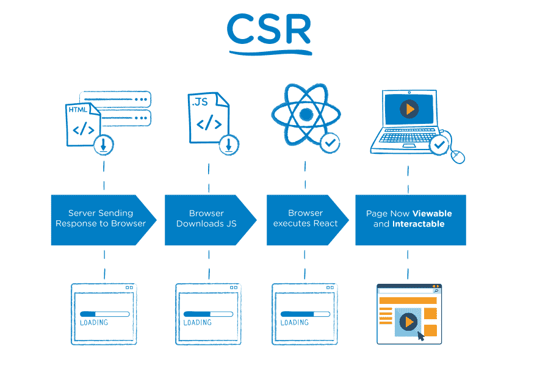
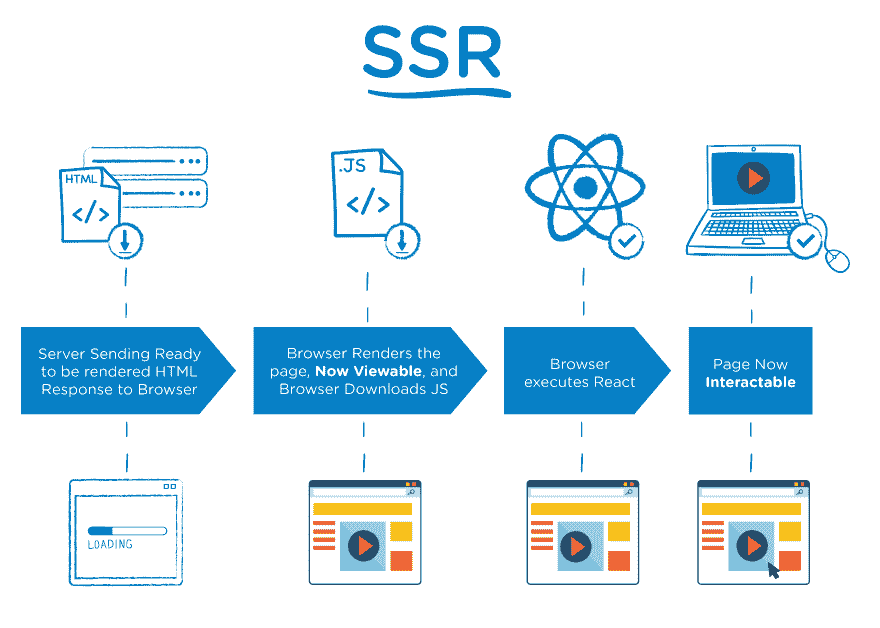

# Nuxt，下一个，Nest？！我头疼。

> 原文：<https://dev.to/laurieontech/nuxt-next-nest-my-head-hurts-5h98>

目前在 JavaScript 生态系统中有三种类似命名的技术。我无法跟踪他们，所以我打算写一个帖子供我将来参考。希望你也是！

### 客户端与服务器端渲染

为了看到这些平台的价值，理解开箱即用的 Vue 和 React 是客户端渲染(CSR)框架是很重要的。在这种情况下，服务器会发送一个响应，浏览器下载 JS 并执行框架来呈现页面，以便它是可查看和可交互的。  
*图片信用沃尔玛实验室工程博客*

使用这些平台作为服务器端呈现(SSR)意味着服务器将 HTML 的响应直接发送给浏览器进行呈现。此时，页面是可见的。同时，浏览器下载 JS 并执行框架以使页面可交互。  *图片信用沃尔玛实验室工程博客*

衡量网站表现的方法有很多，但其中之一就是“首次刷漆时间”。这是在看页面上有什么东西可以看得多快。在这个指标和其他指标中，SSR 通常更具性能。这是 SSR 和 CSR 的具体考虑因素，静态站点不在此计算范围内(它们通常是性能最好的)。

现在，在两种情况下(Next 和 Nuxt ),应用程序的初始加载都是在服务器端呈现的。接下来，使用客户端渲染。这就是所谓的“通用渲染”。理论上是两全其美。

所以，现在我们理解了这个概念，解释这两种技术就容易多了。

### 什么是通用 JavaScript 框架？

Nuxt 和 Next 被描述为“通用 JavaScript 框架”。那是什么意思？嗯，它真正的意思是他们支持通用渲染。

### Nuxt

Nuxt 是一个基于 Vue 的通用应用框架。它处理所有的配置，以建立服务器端呈现的 Vue 应用程序。这也包括 webpack、babel 和 node 的设置。

> Nuxt 还支持静态呈现的应用程序。

### 接下来

这就是为什么这些名字如此相似的原因。 [Next](https://nextjs.org/) 做 Nuxt 做的事情，但是对于 React 应用。它是构建利用 React 的通用应用程序的框架。

### 那么窝呢？

事实证明，Nest 是我们看到背离的地方。 [Nest](https://nestjs.com/) 根本不是 Next 和 Nuxt 的模拟。正如我们上面提到的，这两种技术都集中在前端服务器端。而且分别支持特定的前端框架，Vue 和 React。相比之下，Nest 是一个完全不关心前端代码的服务器端框架。

Nest 的目标是帮助您快速开发后端。它同时支持 JavaScript 和 TypeScript。即使 Nest 与前端无关，但它在结构上被描述为与 Angular 相似。

也许跟踪这三种技术的最好方法是把它们想象成 Vue、React 和 Angular！

Nest 引入了注释、最佳实践文件夹结构和相关概念，而不是开箱即用的节点应用程序。如果您使用过像 Spring for Java 这样的技术，您可能会对所有这些新增功能很熟悉。

### 现在能看出区别吗？

让我们来看看我们是否搞清楚了。

Nuxt - Framework 创建支持通用渲染的 Vue 应用程序

下一步——创建支持通用呈现的 React 应用程序的框架

使用附加结构和支持开发节点应用程序的嵌套框架

就是这样！希望我自己的小抄也能帮到你。