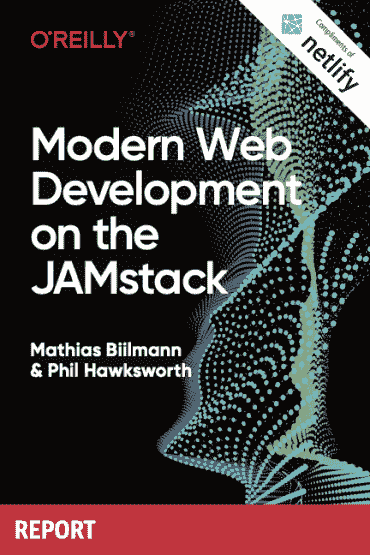
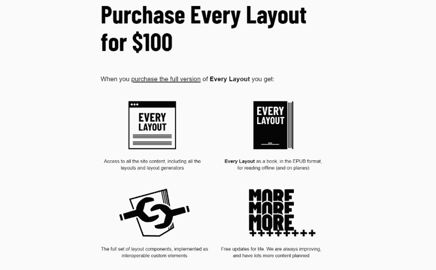

# O'Reilly 出版了 JAMstack 电子书，每个版面的最终版本都已发布|前端新闻#12

> 原文：<https://dev.to/adriansandu/o-reilly-publishes-jamstack-ebook-and-every-layout-final-version-is-released-front-end-news-12-4nfe>

<figure> 

<figcaption>在 YouTube 上查看[https://youtu.be/fSPQjNN3lQU](https://youtu.be/fSPQjNN3lQU)</figcaption>

</figure>

大家好，欢迎收看新一轮的前端新闻。今天我有以下几个主要话题:

*   奥莱利和 Netlify 出版了一本新的电子书
*   每个布局的完整版本都可以购买
*   电子版达到 6.0
*   Chrome 现在可以升级到 76 版

我还要提到一些软件更新和一个全新的# DeveloperOfTheWeek。所以请陪我到最后，找出所有的细节。

一如既往，我也为那些喜欢听而不是读的人准备了视频版本。如果你喜欢这种格式，如果你也能订阅 YouTube 频道，我将不胜感激。

[https://www.youtube.com/embed/fSPQjNN3lQU](https://www.youtube.com/embed/fSPQjNN3lQU)

### jam stack 上的现代 Web 开发

当 JAMstack 和 Netlify 推出他们的分析服务时，我曾经谈论过他们。今天，他们带着又一次发射回来了。这一次是与著名出版商 O'Reilly 的合作，结果是一本名为“JAMstack 上的现代 Web 开发”的电子书。这本书是由 Netlify 的首席执行官兼联合创始人之一 Mathias Biilman 和同一公司的首席开发人员体验工程师 Phil Hawksworth 撰写的。

这份实用报告涵盖了使用 JAMstack 开发、运行和维护您的 web 项目所需的所有基本信息。除此之外，还有一个关于 Smashing Magazine 如何使用类似原则构建其在线平台最新版本的实际案例研究。

最重要的是，这本奥莱利报告电子书可以从 Netlify 网站上获得。只需去[https://www.netlify.com/oreilly-jamstack/](https://www.netlify.com/oreilly-jamstack/)或使用下面的链接获得你自己的免费拷贝。

*   [https://www.netlify.com/oreilly-jamstack/](https://www.netlify.com/oreilly-jamstack/)
*   [https://www . netlify . com/blog/2019/07/31/oreilly-publishes-modern-web-development-on-the-jam stack/](https://www.netlify.com/blog/2019/07/31/oreilly-publishes-modern-web-development-on-the-jamstack/)

### 每个版面都发布

今天的第二个话题是我之前讲过的另一个项目——每一个布局。回到第六集，我宣布了这项计划的启动。快进 6 个多星期，项目现在已经完成。

该项目推出时包含的所有内容仍然免费提供给所有人。这包括所有的基础知识和三种布局:堆栈、侧边栏和封面。其余的信息只有完整版，可以花 100 美元购买。

如果你没有足够的钱，但你仍然想学所有的东西，不要担心。完整的内容也可以通过“荣誉系统”免费获得。如果你失业了，是一个学生，正在寻找你的第一份开发工作，或者是一个未被充分代表的类别的成员，你可以联系作者并获得你自己的完整版本。

关于荣誉系统的更多细节，以及关于该项目及其作者的其他鲜为人知的事实，你可以查看下面链接的两篇博文。

*   [http://www . heydonworks . com/article/every-layout-is-released-some-facts](http://www.heydonworks.com/article/every-layout-is-released-some-facts)
*   [https://every-layout.dev/blog/you-pay/](https://every-layout.dev/blog/you-pay/)

### 电子 6.0

Electron 是一个使用 Chromium、Node.js 和基本 web 技术(即 JavaScript、HTML 和 CSS)构建桌面应用程序的框架。它最初是为了创建 Atom 代码编辑器而构建的，但现在它为 Discord、Slack 的最新版本以及许多其他应用程序提供支持。

该框架最近更新到版本 6.0.0，包括 Chromium 76、Node 12.4 和 V8 7.6。这也是第一次稳定电子释放与相应的铬稳定释放发生在同一天。

有关更新的更多细节，您可以查看 GitHub 上的官方博客帖子和版本发布说明。下面有这两个地方的链接。

*   [http://electronjs.org/blog/electron-6-0](http://electronjs.org/blog/electron-6-0)
*   [https://github.com/electron/electron/releases/tag/v6.0.0](https://github.com/electron/electron/releases/tag/v6.0.0)

### Chrome 76 的新功能

正如我刚才提到的，Chrome 也获得了重大更新，版本 76 现在可供所有用户使用。它通过`prefers-color-scheme`媒体查询支持黑暗模式，并对渐进式网络应用程序进行了大量改进，如桌面平台上的安装按钮，移动设备上对 PWA 迷你信息栏的更多控制，以及安装在 Android 设备上的 PWA 的更快更新速度。完整的细节可以在谷歌开发者门户网站的官方博客上找到。

*   [https://developers.google.com/web/updates/2019/07/nic76](https://developers.google.com/web/updates/2019/07/nic76)

### 软件更新和发布

又是一周，又是一个软件更新和发布列表。这是我今天为你准备的。

**灯塔 5.2.0**

用于审计网页的自动化工具 Lighthouse 已经收到了 5.2.0 版本的更新。最重要的变化是对第三方使用和总阻塞时间的新审计，这将包括在即将到来的 Chrome 77 更新中。GitHub 的发行说明中提供了完整的变更列表。

*   [https://github . com/Google chrome/light house/releases/tag/v 5 . 2 . 0](https://github.com/GoogleChrome/lighthouse/releases/tag/v5.2.0)

**预测 10.0.0-rc.1**

Preact 是 react 的一个更快、更小的替代方案，使用相同的现代 API。我们刚刚获得了 10.0 版本的第一个候选版本，开发者强烈鼓励用户升级他们的代码库。下面链接的发行说明中提供了完整的变更列表。

*   [https://github.com/preactjs/preact/releases/tag/10.0.0-rc.1](https://github.com/preactjs/preact/releases/tag/10.0.0-rc.1)

**htm 2.2.0**

htm 是一个使用普通 JavaScript 提供类似 JSX 语法的库，它刚刚更新到 2.2.0 版本。您可以使用下面的链接访问发行说明。

*   [https://github.com/developit/htm/releases/tag/2.2.0](https://github.com/developit/htm/releases/tag/2.2.0)

### 本周开发者

本周的新开发者是 CSSWizardry.com 的哈里·罗伯特。他是来自英国利兹的独立顾问网络性能工程师。他帮助一些世界上最大和最受尊敬的组织向他们的客户提供更快和更可靠的体验。

<figure> 

<figcaption>在[的舞台上超越 tell legand](http://2013.beyondtellerrand.com/)。斯蒂芬·尼采拍摄的照片。</figcaption>

T12】</figure>

Harry 还是受邀的 Google 开发专家、获奖的开发人员、国际演讲人以及 SHIFT Commerce 的性能大使。他创造了自己的 CSS 方法——倒三角形 CSS 或 ITCSS，并出版了 CSS {Guide:Lines},这是一套关于编写合理、可管理、可伸缩的 CSS 的综合建议。

哈利喜欢在空闲时间骑着自行车在小路上飞驰，他最大的遗憾是被自己 17 岁时创造的域名卡住了。

> 哈利罗伯茨@ CSS wizardy这是我(重金定制)的 Norco 瞄准镜。我爱它胜过一切。2018 年 7 月 26 日下午 15:33014

谢谢你，哈利，你太棒了，继续努力吧！

### 今日问题

在我们的“本周开发人员”部分，您希望看到的下一个人是谁？请在评论区或在[https://twitter.com/frontendnexus.](https://twitter.com/frontendnexus.)上留下你的建议

这一版就这么多了。在 https://twitter.com/frontendnexus[的 Twitter 上关注 Front End Nexus](https://twitter.com/frontendnexus)，一旦有新的更新，我们将立即通知您。我还想鼓励你在 https://www.youtube.com/channel/UCgACtqiDmnSaskDIBsK54ww[的](https://www.youtube.com/channel/UCgACtqiDmnSaskDIBsK54ww)订阅 YouTube 频道。一旦该频道达到 100 名订户，我可以解锁更多的选项，因此非常感谢您的支持。

祝您度过愉快而富有成效的一周，我们下次再见！

* * *