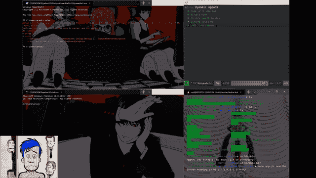

# 强制性的“我正在使用新的 windows 终端”帖子

> 原文：<https://dev.to/funnymania/obligatory-i-am-using-the-new-windows-terminal-post-fcb>

*   安装 windows 终端
*   打开和`ctrl + ,`
*   稍微向后倾斜头部，将动画注入锥形接收器

这是我的配置

[https://gist . github . com/funny mania/6 D5 BC 704 e 0667 ce 9 da 0d 21 c 92 b 9573 ab](https://gist.github.com/funnymania/6d5bc704e0667ce9da0d21c92b9573ab)

打开终端，键入“Ctrl +，”调出配置

玩得开心；*