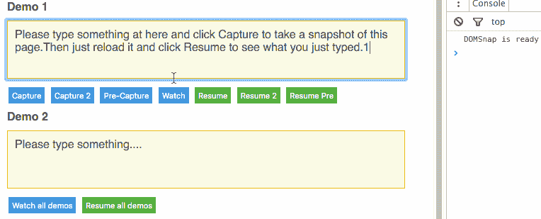

# 通过将 DOM 持久化到 IndexedDB/WebSQL 来离线网页。

> 原文：<https://dev.to/unbug/offline-web-pages-by-persisting-dom-to-indexeddb-websql-35n5>

GitHub:[https://github.com/unbug/DOMSnap](https://github.com/unbug/DOMSnap)

* * *

# DOMSnap

通过将 DOM 持久化到 IndexedDB/WebSQL 来离线网页。
请尝试一下[演示](http://unbug.github.io/DOMSnap/)。

# 工作原理

HTML5 提供了 LocalStorage、IndexedDB 和[window . cache](https://googlechrome.github.io/samples/service-worker/window-caches/)来构建离线 web 应用。
但是所有的[这些技术](http://www.html5rocks.com/en/features/offline)，我们不能错过本地数据库。
DOMSnap 充分利用[离线技术](http://www.html5rocks.com/en/features/offline)。
将 HTML 存储到本地 IndexedDB/WebSQL 并在离线时恢复。
有了 DOMSnap，网页可以恢复到上一次的状态，对服务器的请求更少，模板渲染也更少。
觉得线下很远，为什么不干脆给 DOMSnap 一个尝试？

# 用法

1.在你的 HTML 中包含 [`dist/DOMSnap.min.js`](https://github.com/unbug/DOMSnap/tree/master/dist) 文件

```
<script src="DOMSnap.min.js"></script> 
```

2.或者安装软件包

```
npm install --save domsnap 
```

并在您的文件中要求它

```
var DOMSnap = require('domsnap'); 
```

**例题**

```
//init DOMSnap
var DS = DOMSnap({
  onReady: function(){
    console.log('DOMSnap is ready');
  }
});

//capture snapshot html of #main
DS.capture('#main');
//capture with specified capture id
DS.capture('#main', {id: 'my_id'});

//set the html of #main by it's captured snapshot html
DS.resume('#main');
//set by specified capture id
DS.resume('#main',{id: 'my_id'}); 
```

[](https://res.cloudinary.com/practicaldev/image/fetch/s--m8Llkmki--/c_limit%2Cf_auto%2Cfl_progressive%2Cq_66%2Cw_880/https://cloud.githubusercontent.com/assets/799578/14100241/a6c6174e-f5be-11e5-94a5-409fcba78bc3.gif)

# 原料药

### DOMSnap(配置)

初始化 DOMSnap

**参数**

*   `config` **对象**【可选】
    *   当 DOMSnap 就绪时，将调用`config.onReady` **函数**
    *   `config.version` **号**版本控制，非零。如果 web 应用程序已更新，则需要更新。默认值为 1
    *   `config.scope` **字符串**“主机|路径|或任意字符串值”。“主机”:location.host“路径”:location . host+location . pathname；默认为“路径”
    *   `config.storeType` **字符串**数据存储使用。“IndexedDB”或“WebSQL”，如果没有定义，iOS 使用“WebSQL”，其他使用“IndexedDB”。
    *   `config.expires` **数字**每个快照将过期的毫秒数，默认为 1 周。请注意，在页面重新加载之前，新快照永远不会过期。

返回**对象** `{{capture: capture, resume: resume, get: get, getAll: getAll, remove: remove, clear: clear}|*}`

### [T1。捕获(选择器，选项)](#captureselector-options)

元素的捕获快照 html 匹配选择器，并使用捕获 id 存储结果

**参数**

*   `selector` **字符串**元素的选择器
*   `options` **对象**【可选】
    *   `options.id` **字符串或函数**捕获 id，如果 html 不为空则将 id 设置为空以将 html 存储为默认快照
    *   `options.html` **字符串或函数**快照 html，设置 id 为 null 将 html 存储为默认快照
    *   `options.expires` **快照过期的**毫秒数。如果未指定，则与 initialize DOMSnap 的值相同。

返回 **DOMSnap**

### [T1。简历(选择器，选项)](#resumeselector-options)

将元素的 html 设置为通过其捕获的快照 html 来匹配选择器[和捕获 id]

**参数**

*   `selector` **字符串**元素的选择器
*   `options` **对象**【可选】
    *   `options.id` **字符串或函数**捕获 id，如果 html 不为空则将 id 设置为空以将 html 存储为默认快照
    *   `options.fallback` **函数**一个回调函数，如果没有匹配的快照将被调用

返回 **DOMSnap**

### [T1。手表(选择器，选项)](#watchselector-options)

观察并自动捕获与选择器匹配的元素

**参数**

*   `selector` **字符串或数组**元素的选择器
*   `options` **对象**【可选】
    *   `options.id` **字符串或函数**捕获 id
    *   `options.html` **字符串或函数**快照 html

**例题**

```
//e.g.1
DS.watch('#main');

//e.g.2
DS.watch('#main',{
  id: 'my_capture_id',//capture id
  html: 'my_snapshot_html'//snapshot html
});

//e.g.3
DS.watch('#main',{
  id: function(selector){ return 'generated_capture_id_for_'+selector;}, //return capture id
  html: function(selector){ return 'generated_snapshot_html_for_'+selector;} //return snapshot html
});

//e.g.4
DS.watch(['#main', '#another']);//watch multi elements 
```

返回 **DOMSnap**

### [T1。get(选择器，id)](#getselector-id)

retrun 元素的捕获快照 html 匹配选择器和捕获 id

**参数**

*   `selector` **字符串**元素的选择器
*   `id` **字符串**【可选】捕获 id，如果未指定，则结果为默认快照

返回字符串 html

### .getAll(selector)

retrun 元素的所有捕获的快照 html 匹配选择器

**参数**

*   `selector` **字符串**元素的选择器

将所有快照作为对象返回，例如{ DEFAULT _ CAPTURE _ ID:' html of DEFAULT _ CAPTURE '，my_id: 'html of my_id'}

### [T1。移除(选择器，id)](#removeselector-id)

删除与选择器[和捕获 id]匹配的元素的捕获快照 html

**参数**

*   `selector` **字符串**元素的选择器
*   `id` **字符串**【可选】捕获 id，如果未指定，将清空所有快照

返回 **DOMSnap**

### [T1。清除(版本)](#clearversion)

清除所有捕获的快照

**参数**

*   `version` **编号**【可选】如果没有指定，与初始化 DOMSnap 的值相同。

返回 **DOMSnap**

# 路线图&建功立业

*   **正在进行的**自动观察和自动恢复。
*   捕获和恢复脚本和 css 链接。
*   用 DOM diff 恢复。
*   **正在进行的**事件(就绪、恢复前、恢复后、捕获前、捕获后)

# 打造

1.  安装需求运行

    `npm install`

2.  构建和观察运行

# 找我

*   推特 [@unbug](https://twitter.com/unbug)
*   Weibo [@ Listening and Playing](http://weibo.com/unbug)

# 执照

麻省理工学院许可证(MIT)

版权所有(c) <2016>

麻省理工学院