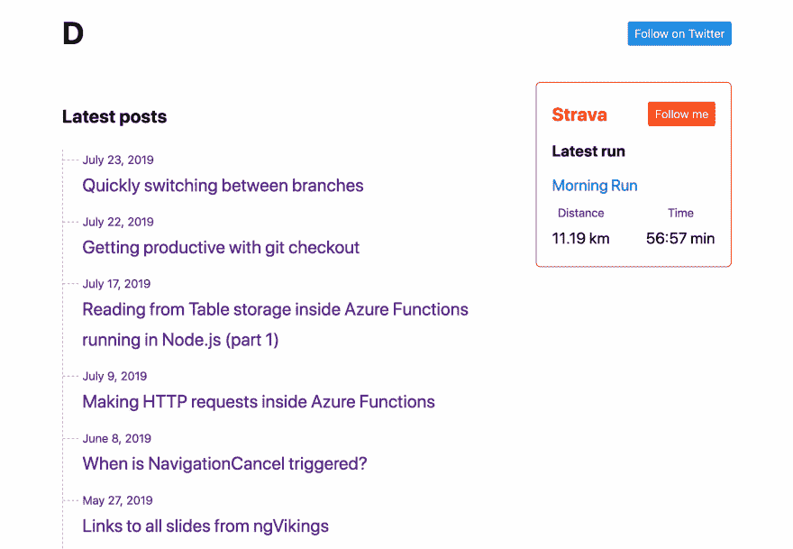

# 不仅仅是一个开发者

> 原文：<https://dev.to/dzhavat/on-being-more-than-just-a-developer-3co5>

这篇文章最初发表在我的博客上。

* * *

我是一名开发人员。我有副业，贡献开源和维护网站，我是一名开发人员。我已经做了好几年了，喜欢它的每一部分。你几乎可以说**我是开发者**。

但是尽管开发人员是我生活中的一大部分，我一天中的大部分时间都是作为一名开发人员度过的，我已经意识到我不仅仅是一名开发人员！

不久前，我意识到了这一点。当然，我已经意识到这是一个事实，但从未深入思考过。我太专注于细节，不知何故忽略了大局。

换句话说，**成为一名开发者只是我的一部分**。

我的其他一些身份是，但不限于，一个跑步者，一个自然爱好者，一个旅行者，一个父亲，一个丈夫，一个朋友...那么，为什么我总是只通过一套镜片观察世界，或者只扮演一个角色呢？好像我有所有这些其他的角色和责任，但我匆匆忙忙地完成它们，只是为了我能回到“真实”的自己。

我不太清楚为什么我花了这么长时间才得出这个结论。一种解释可能是，有些事情需要时间才能在头脑中具体化。有时候时间是最好的老师。

你可能也经历过这种情况。你对很多事情/概念有所了解，但还不明白其中一些之间的联系。然后有一天，你醒来，对自己说“哦，我现在明白了！”。

但是这种认识是如何影响我的？

实际上，在很多方面。

我觉得更满足了。无论我在做什么，我都努力把全部注意力集中在上面。我对此并不感到内疚！我不希望我把那段时间花在了开发上。

* * *

不久前，我决定开这个博客，希望有一个地方可以分享我的想法。还是小技巧。或者探索新的想法。一个我可以随心所欲的地方。

我开始写作。我当然不是最好的作家，但没花多少时间我就注意到我所有的帖子仍然与我是一名开发人员这一事实有关。好像我只是因为碰巧在某个领域工作，才无意识地把自己限制在某些话题上。这是公式的样子(因为数学是最好的):

"*我是一名开发人员+我有一个个人博客=我只写技术方面的东西*"

我想挑战这一点。

三年前我开始跑步。这是我决定尝试的事情，这样我就可以离开办公桌休息一下了。去跑步确实帮助我塑造了体形，理清了思绪，探索了周围的环境，可能还解决了一些讨厌的问题。大多数星期我只出去一次。虽然不多，但我尽量保持一致。到目前为止，我已经跑了四次半程马拉松，目前我正在准备第五次。

我想在博客上突出我的这一部分。我戴上思考帽。那会是什么，看起来会是什么样子？

我用 Strava 追踪我的跑步记录。他们也希望有一个好的 API。所以我用它来构建一个显示我最近跑步的小部件。它并不多，在未来我想增加更多的东西。也许展示一张地图、跑步时拍摄的照片，或者想出一个巧妙的主意，将帖子与跑步相结合。不是因为我是一个伟大的跑步者，而是因为**我不仅仅是一个开发者**！

 

<figure>

<figcaption>我最近一次跑步，就在那里。</figcaption>

</figure>

现在让我告诉你一些事情，你也不仅仅是一个开发者！

我打赌你已经知道了，但是你意识到了吗？你是否匆忙完成其他角色，以便回到“真实”的自己？除了提高开发人员的技能之外，你觉得做其他事情是在浪费时间吗？

你不需要！

你是谁？除了开发人员/设计师之外，你还喜欢做什么...？也许你喜欢阅读，骑自行车，跑步，跳跃，钩针编织，烹饪，与朋友和家人共度时光？

你有没有一个个人网站/博客来强调这一点？

我希望在下面的评论中听到你的意见。