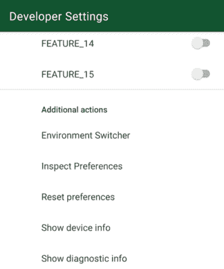
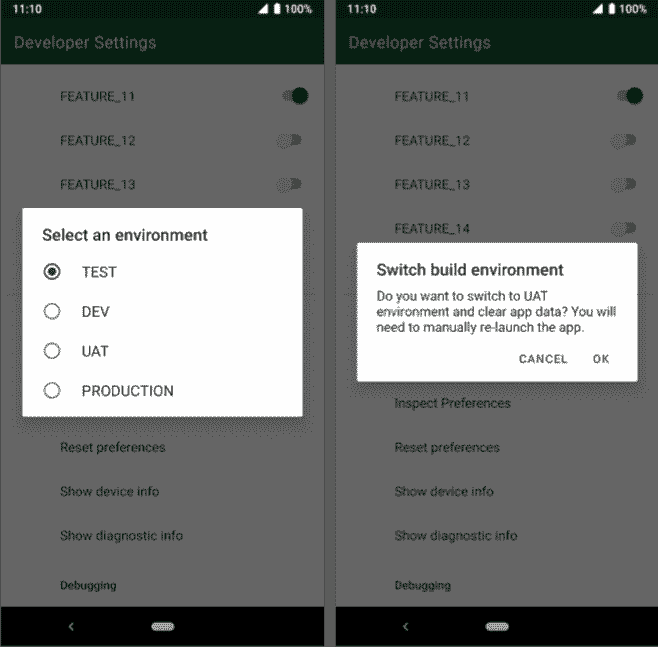
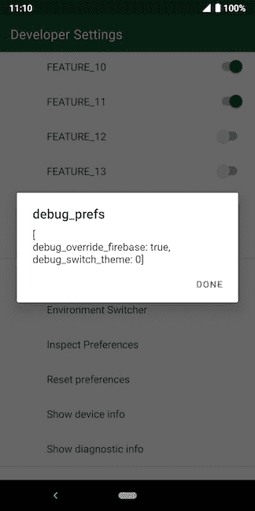

# 设备上调试第三部分:检查、重置、重复

> 原文：<https://dev.to/zmdominguez/on-device-debugging-part-iii-inspect-reset-repeat-ocj>

在过去的一年里，我的团队一直在为我们的应用程序构建一个开发者选项屏幕。它是一个简单的 [`PreferenceScreen`](https://developer.android.com/reference/androidx/preference/PreferenceScreen.html) ，可以在调试构建中帮助我们:

*   不需要连接到电脑就能知道发生了什么
*   无需重新安装即可测试各种配置
*   主持我们正在尝试探索的各种实验

在这一系列的帖子中，我将分享这些不同的选项是什么，以及我们是如何做出它们的。

阅读本系列的其他文章:

*   第一部分:现在开了，现在关了
*   第二部分:Timbeeeeeeer！

(如果你不熟悉 [`PreferenceFragmentCompat`](https://developer.android.com/reference/kotlin/androidx/preference/PreferenceFragmentCompat.html) ，我强烈建议在继续之前先阅读一下。你可以从这个 [AndroidX 指南](https://developer.android.com/guide/topics/ui/settings.html)开始设置。)

* * *

很多事情都会影响 Woolworths 应用程序的行为。有时数据库在生产和开发环境之间不同步，存在一次性屏幕和工具提示，UI 可能根据设备质量而看起来不同，甚至根据用户拥有的帐户类型而改变用户可用的选项。

为了管理和跟踪所有这些事情，我们在开发人员选项中包含了一组操作。

<small>Additional actions</small>

### 环境切换器

我们有一些不同的应用程序可以使用的环境。将切换器内置到应用程序中意味着我们可以在任何可用的环境中轻松测试我们的应用程序的行为。

<small>Switcher confirmation</small>

对我们来说，切换环境意味着撤销访问令牌以及随之而来的一切。由于这是一个破坏性的操作(他们需要重新登录)，我们选择在继续之前显示一个确认对话框。

你的测试人员也是用户，所以 UX 很重要。😉

### 检查并重置首选项

去年，Woolworths 已经完全从全国所有商店移除了一次性塑料袋。为了帮助过渡到可重复使用的袋子，我们在应用程序中内置了一个功能，允许用户为他们选择的商店启用袋子提醒。我们还包括一个“轻推”功能来帮助发现——应用程序会轻推你三次来设置提醒，之后它会假设你不想设置它。

这是我们利用`SharedPreference` s 的众多使用案例之一。整个功能基于商店周围的地理围栏，这可能有点挑剔。我们决定包含一个`SharedPreference`检查器，这样我们可以很容易地回答测试人员的问题，比如“我没有收到任何设置通知，我很确定我只收到了两个？”。

能够看到应用程序中保存了哪些当前值使我们能够在野外快速分类问题。

<small>Remember that override Firebase kill switch?</small>

我已经在这里写了关于重置`SharedPreferences` [的内容，“inspect”位也遵循同样的原理。主要是:](https://zarah.dev/2018/11/16/reset-prefs.html)

> 此函数假设您的应用程序拥有的 SharedPreferences 文件遵循以下命名约定:MY。我的首选项文件。

但是我们确实需要对那篇文章中引用的要点做一些修改。首先，我们可以提取读取文件的位: