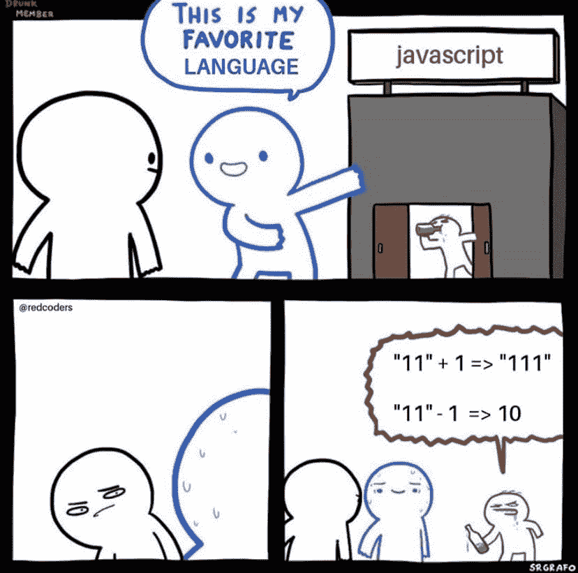

# 论可读性

> 原文：<https://dev.to/hdennen/on-readability-4j75>

这些都不是新的，我不知道是否有可能 100%地遵循这些。但是如果这些是你的目标，那么你的代码将会是一种享受。

### 功能不靠隐藏的小聪明

围绕类型强制解释顺序的语言特性令人困惑。是的，探索它们很有趣，但是在生产中利用它们实际上是为下一个接触代码的开发人员埋下了地雷。

[](https://res.cloudinary.com/practicaldev/image/fetch/s--U0qQsrt5--/c_limit%2Cf_auto%2Cfl_progressive%2Cq_auto%2Cw_880/https://cdn-images-1.medium.com/max/828/1%2AR7aLiky3T7mArMRCxwQ3zw.png) 

<figcaption>Javascript 最爱的语言漫画</figcaption>

### 该功能在孤立的情况下才有意义

构造函数的原因从函数的标题和内容来看是显而易见的，不需要调用方的额外上下文或任何内部调用的函数。

如果开发人员需要阅读函数之外的任何东西来理解它在做什么，那么它就是不可读的。最终的一等奖是仅用函数名来传达精确的意思。

### 该功能假定了解该语言

是的，承诺和方法的语义。reduce 很麻烦。是的，结束和背景需要努力让你的头脑清醒。是的，你仍然需要适应所有这些。

这里的一个警告是小心不要陷入利用隐藏的聪明。

### 一致性胜过舒适

如此多的 bug 减少归结为消除意外。如果你加入一个由前后端开发人员组成的前端团队，他们都是这样写函数的:

```
function makeThingsHappen()
{
  // things happening
} 
```

或者他们正在使用/没有使用分号，或者他们正在使用空格/制表符，或者[在此插入您最讨厌的]，只要咬紧牙关加入进来。获得一些自动格式，放弃你的琐碎偏好，它们真的不重要。你在违背你个人喜好的环境中变得舒适的能力是一种职业素质——培养它。