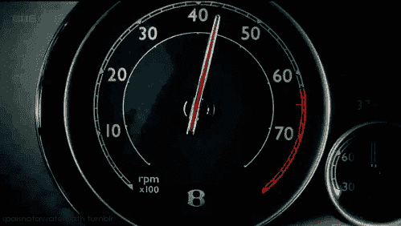
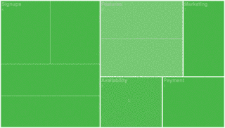
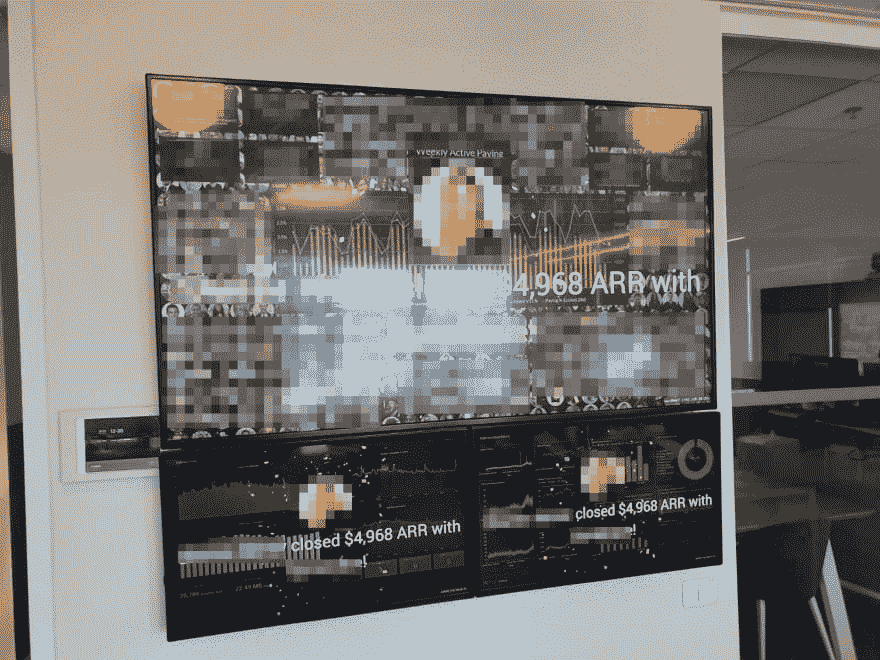

# "一台上面有数字的电视可能比最好的经理还要好."

> 原文：<https://dev.to/oryanmoshe/one-tv-with-a-number-on-it-can-be-better-than-the-best-of-managers-2mg3>

在[monday.com](https://monday.com)这里，我们总是兴奋地向参观者展示我们的仪表板。
不，说真的，这好像是任何人来到我们办公室看到的第一样东西。

我们的电视比员工还多，我们还在为给每个人装什么而争吵。

## 一个仪表盘？你是说我车里的那个东西吗？

 
所以我想我们应该从什么是仪表板开始

### 仪表板

#### /仪表板/

*   各种重要信息的图形摘要，通常用于概述业务。

没有什么比枯燥的字典定义更能引发一篇好的技术文章了，但是从这个定义中重要的一点是它是错误的。

我的意思是，如果你查字典，它可能是对的，但它没有传达仪表板的真正含义。

让我自己试试:

*   **重要的**信息以**正确的**和**引人入胜的**方式显示出来，以促使人们行动起来。

好多了。

如果数据不重要，那么没有理由显示它，如果显示不正确，最好根本不要显示它，因为不正确的数据甚至比没有数据更糟糕，如果数据是重要和正确的，但没有吸引人们或促使他们采取行动，那么仪表板的目的是什么？

* * *

## 我所有的数据都很重要！

那么我们如何定义重要信息呢？我们如何决定什么属于仪表板，什么可以留在数据库中？

我们有一个术语叫做 KPI - **K** ey **P** 绩效 **I** 指标。
这通常是公司中每个人都能理解的一个数字(或一组数字),能够解释随着时间的推移而发生的变化(是改善了还是恶化了，以及总体上有什么影响)

我们对每个团队和用例都有不同的 KPI。有时很容易定义，有时很难，我们必须使用代理 KPI(我们知道以间接的方式影响我们的主要 KPI 的数字),有时只是“不可能”找到(稍后将详细介绍)

### KPI 工程

寻找关键绩效指标是一门真正的艺术，需要时间来磨练这项技能。好的 KPI 的一些经验法则是:

1.  它应该是可测量的
2.  它应该经常改变(“频繁”是一个相对的术语，因企业而异)
3.  有明确的指示表明哪个方向更好(我们应该把它开上去还是开下去)
4.  公司的人应该可以移动它

### 定性 VS 定量

 
有时候衡量你的 KPI 很简单(定量)，例如我们的客户成功团队主要 KPI 是他们的响应时间，他们的目标是在 10 分钟内回答一个问题。很简单，只需从 Zendesk 收集数据并计算平均响应时间。

但有时并不那么简单，有时你的 KPI 是定性的，意味着你必须从人们对你工作的反应中推断出来。这可能来自与他们的高接触对话、评论或他们回答的调查。这种 KPI 不容易衡量，因此更难在屏幕上显示。例如，我的 KPI 是让我们的营销团队尽可能高效地工作(官方说法是，我们希望帮助他们做的事情是没有我们时的 10 倍)，但这不是我们可以衡量或计算的事情，我们所能做的就是与他们坐在一起，倾听他们的问题，看看我们是否能够解决它们。

### 代理 KPI

一些 KPI 需要时间来“成熟”——也就是说，如果我们改变系统中的某些东西，我们只能在一个成熟期过去之后才能度量它们。
例如，我们的主要 KPI 之一是“付费转化率”,它基本上是付费账户占账户总数的百分比。

乍一看，这似乎很简单，但事实是，monday.com 有 14 天的试用期，通常帐户不会支付，直到他们的试用期结束。

所以，如果我们改变了一些东西，并且损害了我们的转化率，我们只会在 **14 天后才知道！**

为了解决这个问题，我们必须找到一个“代理 KPI”，一个比我们的主要 KPI 成熟得更快，但与之高度相关的指标。在我们的具体案例中，其中一个指标是系统中创建的内容量。仅仅过了 3 天，我们就可以知道(相对来说比较确定)一个账户是否会变成付费用户。

敬请关注另一篇专门针对 KPI 工程的帖子！

* * *

## 正确吗？我的数据当然是正确的！

 
现在，我相信你的数据和我们的一样是正确的！但是你显示数据的方式和它的准确性一样重要。

我可以花几个小时谈论如何“入侵”数据，并以一种非常令人信服的方式显示完全错误的东西，但现在我将满足于两个数据入侵的例子。

在开始之前，重要的是要重申，如果你不正确地显示你的数据，你就是在对你自己和你的公司撒谎，这会让你认为你在一个你不在的地方。如果你没有正确地显示你的数据，你还不如不显示它。

### 隐藏数据

 
第一种，也是最天真的“黑掉”你的数据的方法只是为了隐藏正确的东西。你有一群行为不端的客户吗？从图表中删除它！
显示多个指标图，你的流失图在上升？把那块移开！

这样做会通过隐藏数据中最糟糕的东西让你看起来更好。问题是它也会对你隐藏这些事情，如果你把它们埋在地下，你就无法从过去的错误中吸取教训。

### 坐标轴缩放

另一种不太明显的错误显示数据的方式是不锁定轴，其副产品是增加了您甚至不会意识到的对图形操作的脆弱性。

如果你使你的图表更窄，而不是更短，你会把更多的重量放在你的 Y 轴上，使你的图表中更小的变化看起来更有戏剧性。

以防我不清楚，这里有两个例子，一个是不正确的图形，带有可缩放的轴，另一个是仪表板中的正确图形，轴被锁定。

下面是如何不去做
[https://www.youtube.com/embed/Rq4Uu6Q8sQY](https://www.youtube.com/embed/Rq4Uu6Q8sQY)

下面是如何做到的
[https://www.youtube.com/embed/0s29pia74Gw](https://www.youtube.com/embed/0s29pia74Gw)

### 挑选正确的可视化

正确显示数据的另一部分是选择正确的可视化方式来显示数据。

不是所有的可视化都适用于所有类型的数据！
例如，时间序列(连续数据，其中 X 轴是基于时间的)通常应该显示在折线图中。
堆积时间序列(其中多个序列的 Y 值可以相加得到一个有意义的数字)应该显示在面积图中(就像折线图一样，但是线下的区域也是有颜色的)

分类数据通常使用条形图最直观，但如果所有类别都是一个更大数字的一部分，那么您可能应该使用饼图。

如果你有不止一个维度要显示(例如，显示一个页面的访问量，以及它们花费了你多少钱)，你应该使用气泡图。或者热图！说到热图，它们也擅长显示每周时间序列和相关矩阵。

底线是，有如此多的可视化，每一个都适合一个特定的用例，如果人们不能一眼就理解你的数据，这是一个很好的信号，你应该重新考虑你的图表类型。

* * *

## 翩翩？数字是如何吸引人的？

 
这是创建仪表板的最大好处。你得让人们关心它！
创建一个重要的、具有正确可视化的仪表板是不够的。我创造了无数的*仪表盘，它们没有被使用，只是因为它们没有吸引力。*

### 视觉提示

有时，仪表板要以引人入胜的方式显示数据所要做的只是找到正确的方式来推动人们前进。

例如，我们客户成功团队的一个主要 KPI 的响应时间不到 10 分钟，所以每当有一张票在队列中超过 10 分钟，他们就会在仪表板上看到它在燃烧。
[T3】](https://res.cloudinary.com/practicaldev/image/fetch/s--AFCmcyKB--/c_limit%2Cf_auto%2Cfl_progressive%2Cq_auto%2Cw_880/https://thepracticaldev.s3.amazonaws.com/i/6ttfkhuno783a8b2800i.png)

或者“网格”，显示产品和技术警报，供全公司使用，通常是完全绿色的，但当某些东西变红时，它立即可见，并可以使用我们的触摸电视轻松检查。这让人们想让电网一直保持绿色。

或者我们的“庆祝”覆盖，它允许我们在任何时候用员工照片、纸屑和短消息显示庆祝(例如，当我们的顾问与客户达成一笔大交易时。每个人都想庆祝自己的成功，这是激励人们成功的好方法。

### 移动响应能力

不要低估移动仪表盘的重要性！许多人想知道他们在电梯上或会议间隙的当前状态。

有些人连坐在电脑旁的时间都没有！如果你的仪表板显示一个人们想要经常使用的重要指标(比如“网格”)，它在移动设备上看起来应该和在桌面上一样好。它也助长了仪表板的“上瘾”性质，这对你来说太棒了！

### 声音

您的电视可能有内置扬声器，您可以使用它们！每当有重要事情发生时，我们的许多仪表板都会发出声音。当咨询团队完成一笔交易时，会有“锣”声；当客户开始付款时，会有音乐；当有人开始部署到生产环境时，会有通知；当部署到生产环境失败时，会有警报。

不过，重要的是不要越过边缘，因为在我们开始每分钟都有许多付费客户，每个人都发出声音后，许多人开始将电视静音。我们不得不降低这些声音的频率。

# 总结

总之，仪表板是推动我们公司前进的东西，如果没有仪表板以正确和吸引人的方式显示*重要信息*，我们就不可能达到现在的位置，我认为任何想要成功的公司都应该是数据驱动的，并确保它拥有适合工作的正确仪表板！

