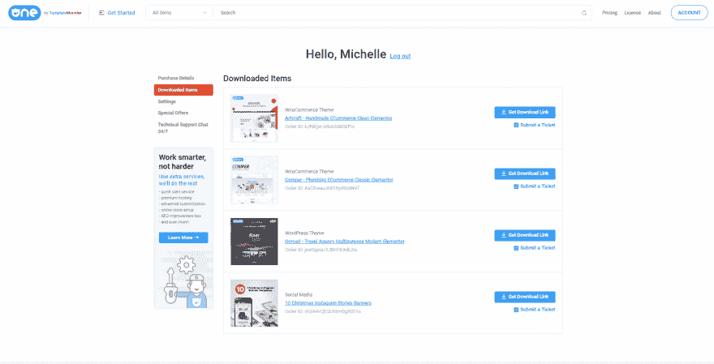

# 一个 Web 开发包，值得你关注吗？

> 原文：<https://dev.to/lana_miro/one-web-development-kit-does-it-worth-your-attention-o4l>

一种是独特的会员服务,为您提供成功网站建设所需的资源。我认为网页设计新手和经验丰富的网页设计师都会很高兴。如果你是网页设计的新手，这个订阅为你提供所有你需要的网页设计工具来轻松地创建一个网站。对于设计师来说，每月 19 美元就可以获得前所未有的大量主题和资源。

# 1。产品特性

*   CMS & WordPress 主题；

*   电子商务模板；

*   强大的插件；

*   演示模板；

*   图形的集合；

*   无限安装；

*   免费托管一年；

*   全天候支持。

# 2。产品说明

一个是新的独特的订阅，让您可以访问大量的主题、附加组件和图形。事实上，一个是你在 TemplateMonster marketplace 中提供的通用逃离物品，template monster market place 是全球顶级主题市场之一。

在 ONE 下，你可以自由访问超过 1K 个当今的 WordPress 主题。在做出选择之前，先试穿你喜欢的设计。然后，使用提供的额外插件和图形在最短的时间内建立一个强大的网站。

# 3。突出

一个里面有什么？

有了它，您可以访问超过 8，500 个 web 主题、模板、加载项和资源的特殊集合。让我们为您详细介绍这一新套餐的条款:

*   1050 个高级 WordPress 主题；

*   41 个插件；

*   电子商务主题和附加组件(2K 项目)；

*   登陆页面主题(190 项)；

*   图形(3198 项)；

*   HTML 模板(1065 项)；

*   内容管理系统模板(1，468 项)；

*   14 个 PowerPoint 模板。

# 4。灵活的许可

想要将您的模板用于多个网站？厌倦了购买扩展许可证？当您订阅限制性单站点许可证时，您应该不会再担心它了。

一个为您提供多站点许可下的所有模板和资产。你可以自由地在任何服务上安装任何模板，次数不限。这给了你想要的创作自由，让你从多年来只局限于一个模板中解放出来。

# 5。最适合您的第一次网络展示

一种是订阅，为你提供启动高转化率网站所需的全套工具。有了这个订阅，你将不必关心购买第三方插件或令人印象深刻的图形。所有这些资产已经唾手可得。

# 6。广泛的支持

TemplateMonster marketplace 因其最高支持而闻名。没有任何一个市场如此关心它的客户，并提供如此多的网站建设指导。

有了它，你可以获得大量的操作指南和视频教程。此外，您可以获得无限制的 24/7 实时聊天、电话和电子邮件支持。这确保你在建立网站时不会遇到任何困难。

# 7。节省时间的服务

有时候，建立一个网站，外包更复杂的定制是明智的。或者您可能只是想以某种方式安装或优化您的模板。有了它，你可以从一些顶尖的网站开发者那里订购定制服务。您将在最短的时间内获得最优质的服务。

# 8。网络开发者的超级经济

你是一个需要新的网站主题的网站开发者吗？停止为你购买的每个模板付费。进行一次订阅，节省一大部分预算。对于你来说，这是一个惊人的机会，以每年 229 美元的价格获得一个巨大的现代网页设计工具集。

# 9。持续更新

其中一个为你提供了快速增长的网页设计项目集合。每天都有新的主题和资产提供。一个会员资格可以确保你全年都能接触到最新的网页设计项目。

# 10。让订户满意的价格

毫无疑问，独家一个订阅有一个有竞争力的价格。订阅按年计费，价值 229 美元。这意味着，你每月只需花费 19 美元就可以访问所有华丽的 WordPress、Joomla 和电子商务主题、插件和图形。因此，订购一个包含多种产品的产品，而不是分别购买每种产品，是非常明智的。

# 11。附加功能

1) [友好的脸书社区](https://www.facebook.com/groups/ONE.by.TemplateMonster/)；
2)会员之外的专属商品五折优惠；
3)无限安装；
4)广泛的客户关怀和支持。

你想看一看吗？