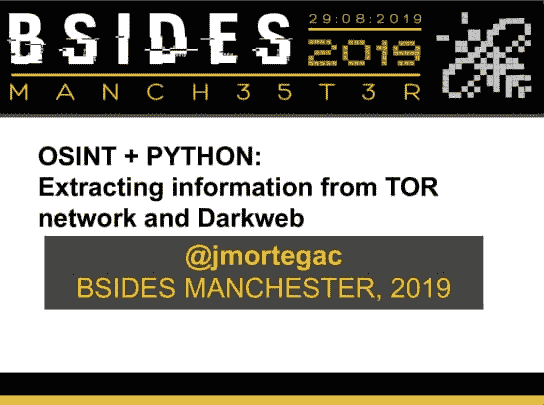

# osint + python:从 tor 网络和 darkweb 中提取信息

> 原文：<https://dev.to/jmortega/osint-python-extracting-information-from-tor-network-and-darkweb-140f>

[https://speaker deck . com/jmortega/osint-plus-python-extracting-information-from-tor-network-and-dark web](https://speakerdeck.com/jmortega/osint-plus-python-extracting-information-from-tor-network-and-darkweb)

讲座将开始解释 Tor 项目如何通过在组成 Tor 网络的不同节点之间建立虚拟电路，来帮助我们研究和开发在线匿名工具以及用户在网上冲浪时的隐私。稍后，我们将回顾使用 osint 工具发现 tor 网络中隐藏服务的主要工具。最后，我们将使用 python 从 tor 网络中提取信息，使用特定的模块，如 stem[https://stem.torproject.org/](https://stem.torproject.org/)

这些可能是演讲的要点:

*   Tor 项目和隐藏服务介绍
*   用 osint 工具发现隐藏服务
*   用 python 从 tor 网络中提取信息

