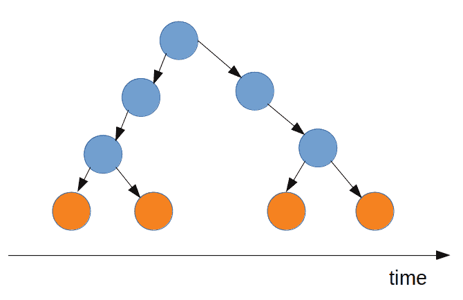
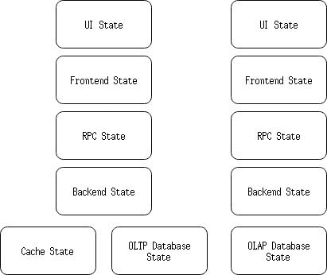
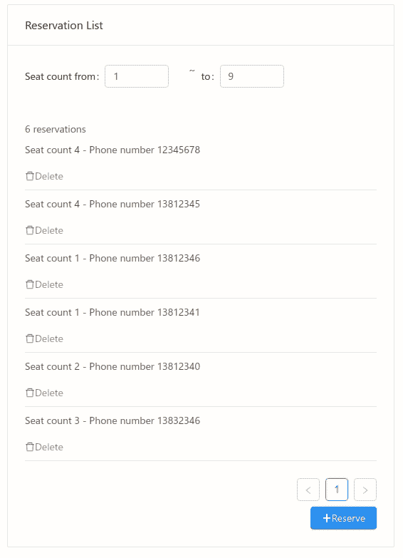

# 走出焦油坑，另一种方法

> 原文：<https://dev.to/taowen/out-of-the-tar-pit-another-approach-4km4>

### 解决什么问题？

说得好的问题已经解决了一半

挑战由[“没有银弹——软件工程中的本质和意外”](https://raw.githubusercontent.com/taowen/lonely-road/master/Brooks-NoSilverBullet.pdf)提出

而[《走出焦油坑》](https://raw.githubusercontent.com/taowen/lonely-road/master/MoseleyMarks06a.pdf)阐述了问题陈述，贡献了一个可能的解决方案。

我不认为争论什么是本质状态，什么是偶然状态是有帮助的。但很明显，问题在于国家

要解决的问题总是一样的。它一直是房间里的庞然大物。管理状态的命令式编程太难了。

### 命令式编程有什么问题？

我们可以很容易地更新这些状态。命令式编程很简单，它把事情做完。只需要把一堆 CPU 指令组合起来更新状态，CPU 就会去做。软件执行可以被绘制成这个简单的图

[](https://res.cloudinary.com/practicaldev/image/fetch/s--biWDYxUp--/c_limit%2Cf_auto%2Cfl_progressive%2Cq_auto%2Cw_880/https://cdn-images-1.medium.com/max/670/1%2ABkT_0dH4sNhHuMANwz5eEw.png)

软件的外部行为本质上是一系列有序的状态更新(图中的黄色圆圈)。然而，问题是:

用一对一映射来描述这种状态更新顺序，会导致代码“冗长”、“乏味”、“支离破碎”。

最直接的方式，最简单的方式，并不是最好的方式。即使我们提取了许多好的函数(那些蓝色的圆圈)，代码可能看起来更整洁，但仍然“冗长”、“乏味”、“支离破碎”。可读性是主观的。[简单易行](https://link.zhihu.com/?target=https%3A//www.infoq.com/presentations/Simple-Made-Easy/)暗示“简单”是客观的。我将简单定义为以下可测量的属性:

*   **状态越少**:状态的数量越少越好
*   **顺序**:如果我们必须处理时序状态更新，就让它是顺序的
*   **连续**:这一行和下一行，放得这么近，是因为有因果关系。另一方面，如果两个状态更新是因果相关的，那么它们应该尽可能接近。
*   **孤立的**:状态更新已经很难推理了。如果它们不是孤立的，我们必须把它们都拉到我的工作记忆中，以便一次性考虑它们。

目标不是零状态，而是越少越好。然后，我们保持代码顺序/连续/隔离，以控制状态更新代码的复杂性。这四个属性的对立面是:

*   **过度** **有状态**:很多很多状态，甚至是不必要的(或者是《出焦油坑纸》里描述的偶然状态)
*   **并发或并行**:线程或协程，它们很复杂。
*   **长期因果关系**:应用程序逻辑是分散的，通过一个称为数据库的全局状态连接起来
*   纠缠不清:我们不得不忽略它们是组件的事实，去思考它们，或者把它们优化成一大堆纠缠不清的东西。

目标不是消除所有的状态，而是保持尽可能少的状态。总会有一些基本的状态，我们必须用逻辑来管理和更新，这毕竟是业务流程的全部。甚至 TLA+进化成的 [PlusCal](https://en.wikipedia.org/wiki/PlusCal) 看起来也很像一个命令式程序。命令式仍然是表达人类理解的时态逻辑的最佳形式。但是我们必须保持它的简单，保持它的连续、连续和孤立。

### OOP/DDD 呢？

使用对象来封装状态是 OOP 的一大部分，尤其是 DDD。DDD 在实践中归结为三个步骤:

1.  应用服务从数据库中加载域模型
2.  使用聚合根来封装所有的更改
3.  副作用的形式是修改域模型或发布新的域事件。应用服务保存模型并发布事件

核心思想是“聚合根”可以是一个黑盒，没有什么可以绕过它，这将使我们的状态更新代码封装在一个地方。但是有两个问题:

*   聚合根上的方法与将聚合根作为第一个参数的自由函数没有太大的不同。OOP 只是序数命令式编程。
*   对象之间的交互，特别是对于涉及多个领域概念的业务流程。很难确定哪个聚合根是真正的聚合根，这需要处理好这个过程。或者换句话说，业务流程本质上作为一个功能，本身应该是聚合根。

我们可以重新检查上面的四个属性

*   **更少的状态**:只要状态必须以临时方式手动更新，它们就仍然存在
*   **顺序**:仍然需要线程或协程来开发新硬件。
*   **连续**:业务逻辑是分散的。与原始的命令式编程相比，它往往不太连续，而不是更连续。
*   **隔离**:领域模型隔离状态，但是为了优化数据加载，我们必须更大批量地加载它们，以避免 1+N 太多 SQL 问题。

### 纯泛函呢？

在[《走出焦油坑》中，](https://raw.githubusercontent.com/taowen/lonely-road/master/MoseleyMarks06a.pdf)作者提出了一种叫做函数关系编程的编程风格。这在 DDD 社区被称为事件采购。我同意，事件(用户输入)是唯一真正的本质状态，其他的一切都可以从中推导出来，所以是偶然的。但是从事件中投射每个状态并不像命令式编程所表达的时态逻辑那样“容易”。正如里奇·希基所说，“容易”是主观的。但我们不能忽视这样一个事实，即大多数人并不熟悉这种风格，因为它脱离了我们熟悉的主要来源，物理现实世界。

物质世界不会将状态存储为事件的分类账。上帝不会从你出生以来所吃的食物推导出你的身高和体重。我们根据情况做出决定。这仅仅是我们从一个可变的状态加载情况，或者我们根据需要从记忆中的历史导出情况。基于当前状态对未来进行推理，再加上计算当前状态，会使逻辑变得复杂。

这么多年过去了，这种方法仍然不受欢迎。我们提出了一种管理状态的替代方法，这种方法可能更加熟悉和实用。

### 更简单的状态管理

目标是让它变得简单

*   更少的状态:如果一个状态是不必要的，就消除它。如果一个状态可以从另一个状态派生出来，那么就让它成为声明性的。
*   使命令式编程顺序/隔离/连续

代码是用 TypeScript 编写的，但是需要一个特殊的运行时来运行。你可以认为它是一种新的语言，具有与 TypeScript 相同的语法。

#### 通过 UI 绑定更少状态

UI 绑定现在是主流。这个演示看起来像这样:

[](https://res.cloudinary.com/practicaldev/image/fetch/s--88W0ABSo--/c_limit%2Cf_auto%2Cfl_progressive%2Cq_66%2Cw_880/https://cdn-images-1.medium.com/max/180/1%2A5cZd8sOhTxlQhKkCh6E93w.gif)

UI 由 Web DOM 提供支持，它是一个独立的状态。像这样使用绑定，我们可以使它成为一个派生状态:

```
<Button @onClick="onMinusClick">-</Button>
<span margin="8px">{{ value }}</span>
<Button @onClick="onPlusClick">+</Button> 
```

数据绑定到:

```
export class CounterDemo extends RootSectionModel {
 value = 0;
 onMinusClick() {
 this.value -= 1;
 }
 onPlusClick() {
 this.value += 1;
 }
} 
```

但是为什么绑定会消除状态呢？比较用这两种风格编写的代码。首先，我们按顺序更新这两个状态

```
// update state in temporal order
this.value -= 1;
this.updateView({msg: this.value}) 
```

其次，我们绑定两个状态，然后更新模型

```
// setup the binding in advance
<span margin="8px">{{ value }}</span>

// then update the state
this.value -= 1 
```

不同的是，绑定或任何声明式编程，设置的关系是真实的，脱离了上下文。这可以从时间推理和描述中删除派生状态。时间箭头内需要手动维护的状态越少越好。

#### 更少的状态受到更多的约束

如果绑定可以从时态逻辑中移除状态，我们需要更多。让我们规划系统中的所有状态:

[](https://res.cloudinary.com/practicaldev/image/fetch/s--_VHRabMA--/c_limit%2Cf_auto%2Cfl_progressive%2Cq_auto%2Cw_880/https://cdn-images-1.medium.com/max/411/1%2AAUrnE5Z2lXkVAQLVcuU5xA.jpeg)

将 UI 状态绑定到前端状态只解决了一小部分问题。那么谁来管理前端状态呢？我们需要询问每一个州，我们能消除它吗？或者，我们可以从另一个状态中导出它吗？这里有明显的速赢。当显示 UI 时，它从数据库加载数据，一直到 UI。可能会有一些转换，但也可以方便地描述为数据绑定。给定这个简单的应用程序:

[](https://res.cloudinary.com/practicaldev/image/fetch/s--A6hCzRhp--/c_limit%2Cf_auto%2Cfl_progressive%2Cq_66%2Cw_880/https://cdn-images-1.medium.com/max/566/1%2AvIp-oT0QzIjVd6Di3L7MwA.gif)

这只是一个简单的列表视图，显示一些从数据库加载的数据。我们可以将 UI 直接绑定到一些数据库查询: