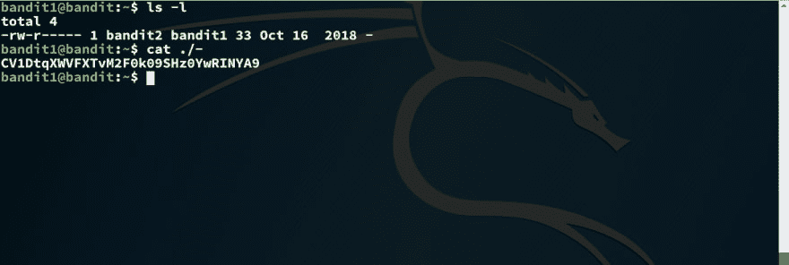

# 越线强盗 1 级 2 级演练

> 原文：<https://dev.to/kkaosninja/overthewire-bandit-level-1-level-2-walk-through-1pae>

挑战页面= >[https://overthewire.org/wargames/bandit/bandit2.html](https://overthewire.org/wargames/bandit/bandit2.html)

这个挑战还包括读取一个文件来获取密码，但是它有一个复杂的文件名。

* * *

**提示 1** :你的`cat`命令没有起作用，是吗？:D 没关系。这就是这个挑战的意义所在。

从技术上讲，cat 命令工作正常。至于为什么它没有读取文件"-"，再次提示已经由设计师以链接的形式提供了进一步的阅读。

> [谷歌搜索“虚线文件名”](https://www.google.com/search?q=dashed+filename)
> [高级 Bash-脚本指南-第三章-特殊字符](http://tldp.org/LDP/abs/html/special-chars.html)

* * *

**提示 2** :谷歌搜索的第一个结果，导致一个 Unix 堆栈交换帖子，解释了这个问题，也给了你答案。

* * *

### 解

没有更多提示，因为您已经有了答案:)

到目前为止，您已经知道 cat 将“-”视为 stdin 的同义词。

至于 cat 到底在做什么，[转到第二个链接](http://tldp.org/LDP/abs/html/special-chars.html)，Ctrl+F 为“*重定向自/到 stdin 或 stdout【破折号】*”。它将引导你进入解释`cat`行为的章节，以及其他命令使用“-”的场景

我还建议浏览同一篇文章，了解文中提到的其他特殊角色的信息。

如 Unix Stack Exchange post 中所示，解决方案是简单地使用文件的完整路径，如下所示，这样可以确保 cat 不会将其视为 stdin

