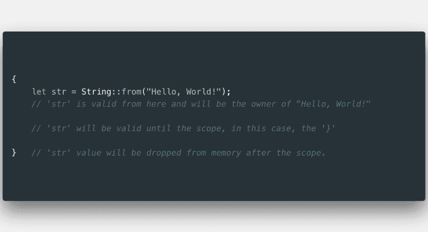
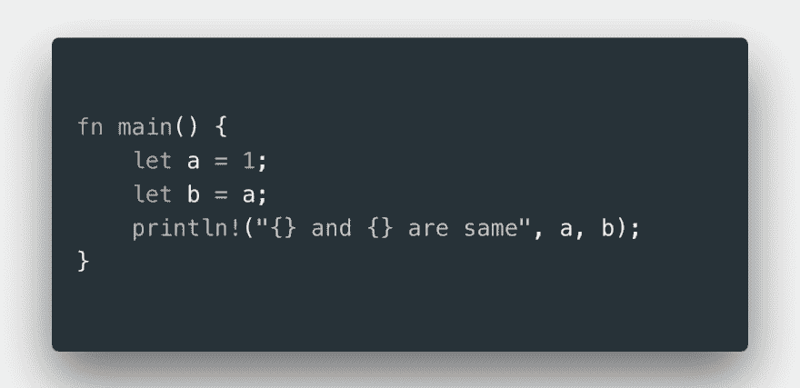
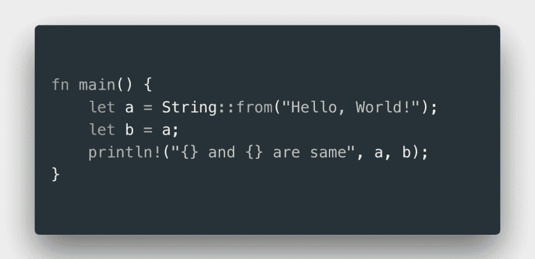
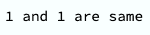
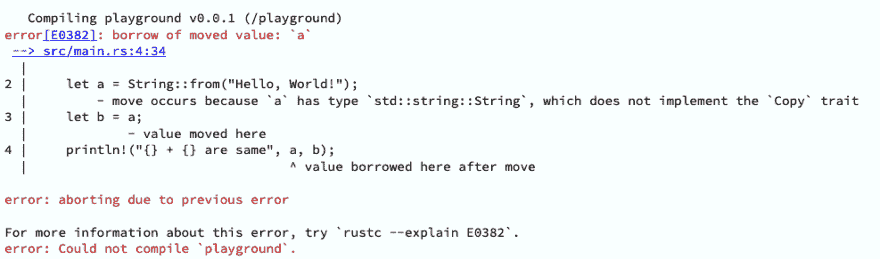
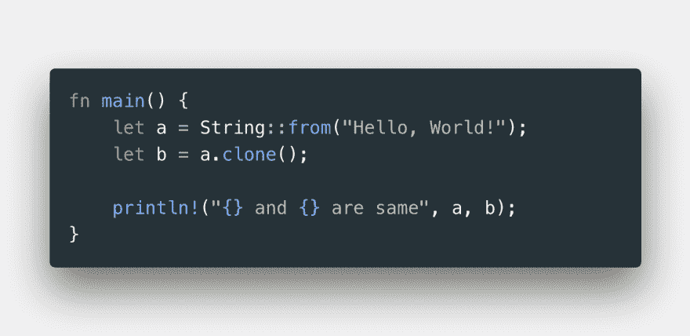

# Rust #RustWorthy 的所有权第 2 部分

> 原文：<https://dev.to/sathish/ownership-in-rust-rustworthy-part-2-4o5e>

嘿人们！这是我在 Rust 系列的第二篇[帖子](https://dev.to/sathish/01-rust-is-simply-awesome-386j)。看看我上一篇关于为什么 Rust 如此棒，为什么它让我着迷的文章。这篇文章是关于 Rust 的一个重要特征，叫做所有权，它使得 Rust 如此独特和强大。所有权很容易解释，但它对语言的其他部分有着深刻的含义。

### 什么是所有权？

所有权是 Rust 处理内存分配的方式。通常，编程语言使用垃圾收集器来释放未使用的内存，或者程序员应该显式地分配或释放内存，但 Rust 两者都不做。内存是通过运行时检查的一组规则来管理的。

### 栈&堆

在深入讨论所有权之前，我们都已经了解了用于内存分配的堆栈和堆。在其他常见的编程语言中，你可能不太关心堆栈和堆，但在 Rust 中，它起着至关重要的作用。这将决定您的代码如何运行，从长远来看，这对于确保您的代码是内存安全和高效的，同时避免垃圾收集非常重要。

栈和堆是你的代码在运行时使用的内存。固定大小的数据将利用在编译时已知大小的堆栈。

考虑以下情况，该变量存储了字符串文字“Hello，world！”其中大小在编译时是已知的，所以它将进入堆栈。

`let str = "Hello, world!";`

那么，动态长度的数据会怎么样呢？首先，什么数据是动态长度的？以用户输入为例。你永远不会知道编译时数据的大小。这就是 ***堆*** 出现的原因。内存将在运行时被请求并存储在堆中。

### 所有权规则

你听说过作用域，它是一个非常常见的编程概念。范围是项有效并且可以在需要时访问的地方。跟铁锈有什么关系？嗯，我们已经讨论了所有权，一旦物品超出范围，Rust 就会从内存中删除该值。

我们有一个字符串类型的值。字符串总是不同于字符串文字:字符串将存储在堆中，字符串文字存储在堆栈中，因为字符串文字的大小在编译时是已知的。从上面的例子中，当我们调用`String::from("Hello, World!");`时，字符串文字被转换为字符串类型，因此在运行时请求内存。在这里，内存将在作用域之后被丢弃，这个作用域有一个特殊的函数叫做 drop。

### 动&克隆人在生锈

和...相对

我们给***a*T3】赋值，给**a*b***赋值。然后我们打印这两个值。带有垃圾收集器的编程语言在上述两种情况下都会打印出 ***a & b*** 的值。好，让我们编译第一个，我们得到了什么？**

好了，我们得到了我们所期望的。现在我们来编译第二个。我们期待结果会是 ***“你好，世界！你好，世界！同样的"*** 就像其他语言用 GC 会给我们带来什么但是不，那不会发生。在 Rust 中会发生这种情况，因为 Rust**T5 只将指针存储在 a&bT7】中，而实际值存储在堆中。如果两个变量都有效，那么在删除内存时， ***Rust 将尝试两次删除相同的值*** ，这将导致内存损坏。因此，Rust 使第一个变量无效，并且 ***将*** 的值移动到 ***b*** 。**

那么，如果你既想要 a 又想要 b 呢？这就是 ***克隆*** 出现的原因。您可以将该值复制到第二个变量，这样两个值就存储在堆中，并将分别失效。

如果你在想，当一个变量被传递给一个函数时，值会从内存中被丢弃，obv。或者…如果调用函数后需要数据怎么办？？？！！！

请等一下…我马上回来…

(下周)

