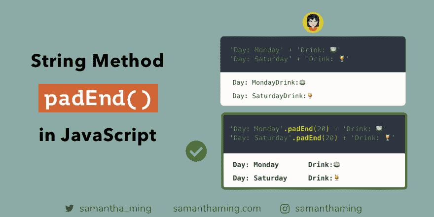
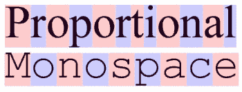

# JavaScript 中的 padEnd 字符串方法

> 原文：<https://dev.to/samanthaming/padend-string-method-in-javascript-3d24>

[](https://res.cloudinary.com/practicaldev/image/fetch/s--LX4zjn78--/c_limit%2Cf_auto%2Cfl_progressive%2Cq_auto%2Cw_880/https://thepracticaldev.s3.amazonaws.com/i/a54dhpu49c42kyb5g76u.png)

使用`padEnd`，它将字符添加到字符串的末尾，使其达到指定的长度。这对于我们添加一些填充来以表格格式显示我们的字符串非常有用。是不是更容易阅读，耶🍹

```
// Display String in Tabular Format with padEnd

// ❌
'Day: Monday' + 'Drink: 🍵'
'Day: Saturday' + 'Drink: 🍹'

// ✅
'Day: Monday'.padEnd(20) + 'Drink: 🍵'
'Day: Saturday'.padEnd(20) + 'Drink: 🍹' 
```

## padEnd 参数

`padEnd`接受两个参数:

```
string.padEnd( <length>, <character>) 
```

### 第一个参数:长度

这是结果字符串的最终长度。这是必须的。

假设你从一个有 3 个字符的字符串开始。您将长度设置为 5 个字符。这意味着，`padEnd`将使用 2 个字符填充它，因此总长度符合您的 5 个字符的目标长度。

这里有一个例子。我用`·`表示空格字符，向您显示填充的空格。

```
'abc'.padEnd(5);

// abc·· 
```

### 第二参数:字符

这是一个可选参数。正如您从上面看到的，默认填充字符是一个空格。但是，您可能希望用不同的字符填充它。没问题！把它传过来。

```
'hi'.padEnd(10, '!');

// 'hi!!!!!!!!' 
```

### 表格格式仅适用于等宽字体

所以在我使用`padEnd`创建表格格式字符串的例子中。有一点要注意的是，它只适用于等宽字体。

> 等宽字体也称为固定间距、固定宽度或非比例字体，是一种字母和字符各自占据相同水平空间的字体。

*[维基百科](https://en.wikipedia.org/wiki/Monospaced_font)*

[](https://commons.wikimedia.org/wiki/File:Proportional-vs-monospace-v4.jpg#/media/File:Proportional-vs-monospace-v4.jpg) 
由 [Garethlwalt](//commons.wikimedia.org/w/index.php?title=User:Garethlwalt&action=edit&redlink=1 "User:Garethlwalt (page does not exist)") - 自带工作， [CC 由 3.0](https://creativecommons.org/licenses/by/3.0 "Creative Commons Attribution 3.0") ，[链接](https://commons.wikimedia.org/w/index.php?curid=9110833)

“Roboto”或“Monaco”等字体是等宽字体。这意味着每个字符将具有相同的宽度。而诸如“Times New Roman”的字体不是等宽字体。它们是成比例的，所以每个字符会有不同的宽度。由于每个字符都有不同的宽度，使用`padEnd`很难创建**表格**格式。

## [路径 vs 路径启动](#padend-vs-padstart)

字符串填充的目的是向字符串中添加字符，因此结果具有特定的长度。

`padEnd`在字符串末尾添加字符。而`padStart`在字符串的开头添加字符

**`padEnd`**T3】

```
'hello '.padEnd(10, '👋');

// 'hello 👋👋' 
```

**`padStart`**T3】

```
' hello'.padStart(10, '👋');

// '👋👋 hello ' 
```

### 小心！带表情符号的 padEnd

如果你正在填充表情符号，你可能会遇到这个问题。

```
'hello '.padEnd(11, '👋');

// 'hello 👋👋�' 
```

注意最后一个“👋“不显示。而是显示“∠”。这是因为表情符号通常由两个字符组成。

```
'👋'.length === 2 // true 
```

所以，如果你用表情符号填充，只要注意如果你没有提供足够的长度，表情符号可能会被剪掉。

## 社区输入

*   *[@2alin](https://twitter.com/2alin/status/1150120894758621185) :* 补充一下:要使用表格样式，字体应该是单空格的，HTML 渲染会去掉多余的空格；这使得这种应用主要在终端显示的信息中很重要。

*   *[@ Cilly _ Boloe](https://twitter.com/Cilly_Boloe/status/1150208542923579392):*padEnd 和 padStart 示例→ [链接](https://twitter.com/Cilly_Boloe/status/1150208542923579392)

## 资源

*   [MDN Web Docs:string . prototype . padend()](https://developer.mozilla.org/en-US/docs/Web/JavaScript/Reference/Global_Objects/String/padEnd)
*   [学习 JavaScript ES 2017:字符串填充— padStart & padEnd](https://codeburst.io/learn-javascript-es-2017-string-padding-padstart-padend-88e90783e7de)
*   [探索 JS:字符串填充](https://exploringjs.com/es2016-es2017/ch_string-padding.html)
*   [Flaviocopes:字符串 padEnd 方法](https://flaviocopes.com/javascript-string-padend/)
*   [用 padStart 和 padEnd 进行字符串填充](https://node.university/blog/7297/es7-es8-post)
*   [JavaScript 中的鳄鱼:padStart 和 padEnd 字符串方法](https://alligator.io/js/padstart-padend-string-methods/)
*   [tc39:string . prototype . { pad start，padEnd}](https://github.com/tc39/proposal-string-pad-start-end) 的 ECMAScript 规范提案

* * *

**感谢阅读❤**
问好！[insta gram](https://www.instagram.com/samanthaming/)|[Twitter](https://twitter.com/samantha_ming)|[脸书](https://www.facebook.com/hisamanthaming) | [博客](https://www.samanthaming.com/blog)|[SamanthaMing.com](https://www.samanthaming.com/)