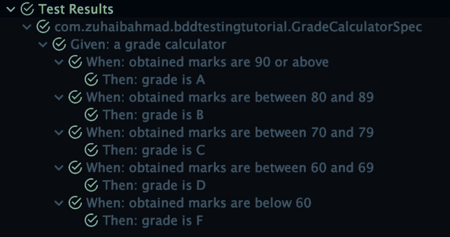

# 用 Kotlintest & Mockk 进行无痛单元测试

> 原文：<https://dev.to/xuhaibahmad/painless-unit-testing-with-kotlintest-mockk-1n82>

测试是困难的，不是每个人都喜欢在他们可以构建闪亮的新功能的时候花时间写单元测试。

虽然几乎每个开发人员都理解测试他们的代码的价值，但面对临近的截止日期和更令人兴奋的工作前景，我们大多数人都成了懒惰的牺牲品。

在这篇文章中，让我们了解为什么单元测试是成功产品的支柱，并学习一种更简单、直观和吸引人的编写测试的新方法。

* * *

## 为什么测试很重要

因为我主要使用 Android 应用程序。我告诉你一个小秘密。您将遇到的超过一半的代码库很少或者根本没有测试。不仅仅是那些蹩脚的，有时候是有成千上万用户的产品。

这通常是由于传统的基于 JUnit 的测试的复杂和枯燥的本质。这个过程不仅非常无聊，而且需要为最简单的场景编写大量重复的样板代码，使得测试成为一个非常耗时的过程。

显然，当您急于尽快将产品推出时，测试就成了最不可取的做法。

通常，最终结果是项目在一年内变得不可维护。我看到过一些组织重写已经发布的产品，仅仅是因为代码库已经变得不可维护，这是由于意大利面条式的代码被错误腐蚀了。

显然这不是一个理想的情况。从一开始就测试你的代码中的错误和架构缺陷，可以巩固你的产品，使其在长期内易于管理。

> "如果你不能衡量它，你就不能改进它."-开尔文勋爵

## 随走随测

通过广泛的测试为您的项目奠定基础并不是一个新想法。[行为驱动开发](https://en.wikipedia.org/wiki/Behavior-driven_development)已经存在几十年了。

实践是将功能规范(或用户故事)转化为一组单元测试，然后通过测试编写满足这些规范的代码。

这导致了您的特性和它们的测试的共同开发。再加上持续集成解决方案，这种设置几乎可以保证您永远不会有任何回归错误。

* * *

## 规范基础测试实践

黄瓜是目前使用最广泛的 BDD 测试框架。它提供了一个称为 Gherkin 的简单语言解析器，可以用简单的英语编写非程序员也能理解的测试。该框架将这些规范转化为验收测试，验收测试也作为每个特性的文档。下面是一个用小黄瓜写的测试的样子:

```
Feature: Calculator
  As a user
  I want to use a calculator to add numbers
  So that I don't need to add myself

  Scenario: Add two numbers -2 & 3
    Given I have a calculator
    When I add -2 and 3
    Then the result should be 1

  Scenario: Add two numbers 10 & 15
    Given I have a calculator
    When I add 10 and 15
    Then the result should be 25 
```

整洁！不是吗？这个规范导致了用 Cucumber 运行的单元测试。因为这篇文章不是关于黄瓜的，所以我不会深入讨论实现细节。你可以访问这个[教程](https://www.baeldung.com/cucumber-scenario-outline)来获得关于用 Cucumber 进行 BDD 风格测试的完整教程。我用同一篇文章借用了上面的例子。

其他一些流行的 BDD 框架包括[莴苣](http://lettuce.it/)、[茉莉](http://jasmine.github.io)、 [SpecFlow](http://www.specflow.org/) 、 [Spek](https://spekframework.org/) 、 [Behat](http://behat.org) 、 [Jdave](https://github.com/jdave/Jdave) 和 [Jbehave](http://jbehave.org/)

* * *

## JUnit 的问题

在这一点上，JUnit 是所有 Java 事物的行业标准。它已经统治了 Java 开发几十年了，而且很有效。但由于它是为 Java 而构建的，它带来了基于 Java 的技术的大多数常见缺陷，感觉很落后，特别是在 Kotlin、JavaScript 和 Python 等现代编程语言的世界中。

话虽如此，用 JUnit 编写所有风格的测试是完全可能的。 [Mockito](https://site.mockito.org) 在其核心库中提供了一个 BDD 风格的扩展，允许你在 JUnit 测试用例中进行类似的`Give, When, Then`风格测试。

让我们来看看与它相关的一些问题，以及为什么我认为 vanilla JUnit 不适合像 Kotlin 这样强大的语言:

### 代码重复

像 Java 中的所有东西一样，JUnit 也相当冗长。这导致了太多的相似内容的重复，而逻辑上的微小变化是为了测试不同的场景。

有多少次你测试了一个有和没有条件，所有的内容都一样，除了一个布尔值？比如一个`testUserAccessWhenHasToken`，然后是`testUserAccessWhenNotHasToken`。

当然，您可以牺牲可读性，在一次测试中填入所有的断言。然而，一个好的测试应该是细粒度的，即每个测试针对一个案例。

此外，随着项目越来越大，测试代码肯定会增长，在某个时候，测试代码会超过应用程序代码。如果你想看看这样的例子，试着看看任何流行的开源项目的源代码，比如 [RxJava](https://github.com/ReactiveX/RxJava) 、[翻新](https://square.github.io/retrofit/)、 [OkHttp](https://square.github.io/okhttp/) 、 [Picasso](https://square.github.io/picasso/) 等等。几乎所有的测试代码都比他们的业务逻辑多 1.5 到 2 倍。

### 缺乏上下文信息

如果您和我一样，那么在切换到 Kotlin 时，您可能做的第一件事就是用反勾符号更改您的长 JUnit 测试名称，如`fun onTouchOutside_shouldDismissDialogAndResumeStreaming()`。虽然这是一个很大的改进，但是它给了我们一个许可证，让我们可以在尝试提供更多关于每个测试用例的上下文信息时尽情发挥。所以现在我们的测试用例已经演变成这样:`fun `on touch outside, dismiss the dialog and resume streaming the paused song` ()`

这里真正的问题是，这些名称不足以提供关于测试的完整上下文。除非你愿意写一整段来定义场景的前提和条件。

这里的另一个问题是测试用例的组织。大多数测试用例都有一些共享的代码，这些代码可以逻辑地组织成一个层次结构。但是，因为 JUnit 只允许以类方法的形式编写测试。因此，您最终会编写更多的测试、更多的代码，但对当前测试组的总体主题却知之甚少。

* * *

## 编写测试的更好方法

让您体验黄瓜 BDD 背后的原因是为了展示拥有这样的习惯性测试会是什么样子。

让我们定义一组我们想要构建和测试的规范。我们将使用两个库来帮助我们编写测试。

### 特征

让我们建立一个分数计算器，根据你获得的分数告诉你你的分数。以下是评分规则:

*   当获得的分数在 90 分或以上时，则成绩为 a。
*   当获得的分数在 80 和 89 之间时，则等级为 B
*   当获得的分数在 70 和 79 之间时，则成绩为 C
*   当获得的分数在 60 到 69 分之间时，成绩为 D
*   当获得的分数低于 60 分，则成绩为 F

### 安装

首先，创建一个空的 Kotlin 或 Android 项目，并添加以下两个依赖项:

```
testImplementation 'io.kotlintest:kotlintest-runner-junit5:3.3.2'
testImplementation 'io.mockk:mockk:1.9.3.kotlin12' 
```

第一个依赖项是 Kotlintest，它是一个构建在 JUnit 之上的测试库。它利用 Kotlin 的 DSL 能力来支持各种类型的测试风格。

Mockk 是一个基于 Kotlin 的模仿库，语法非常简洁，与 Kotlintest 的规范结合得非常好。与 Mockito 或 Powermock 相比，它还提供了更灵活的 API 和更广泛的功能。

### 实现

让我们首先创建一个空的`GradeCalculator`类，并将我们的规范转换成一个 Spec。

```
class GradeCalculatorSpec : BehaviorSpec({

    Given("a grade calculator") {
        val calculator = spyk(GradeCalculator())

        every { calculator.totalMarks } returns 100
        val total = calculator.totalMarks

        When("obtained marks are 90 or above") {
            Then("grade is A") {}
        }
        When("obtained marks are between 80 and 89") {
            Then("grade is B") {}
        }
        When("obtained marks are between 70 and 79") {
            Then("grade is C") {}
        }
        When("obtained marks are between 60 and 69") {
            Then("grade is D") {}
        }
        When("obtained marks are below 60") {
            Then("grade is F") {}
        }
    }
}) 
```

这看起来不太像我们传统的 JUnit 测试。所以我们来分解一下，一点一点了解:

*   我们正在扩展一个叫做*的行为规范*，它基本上是以 BDD 风格编写的规范(还记得 Cucumber 的 Give，When，Then 吗？).Kotlintest 中有许多不同的其他规格样式。
*   **世爵**——你可能注意到我用`spyk`方法包装了`GradeCalculator`对象。如果你以前用过 Mockito，概念是一样的。基本上，spy 是一个包装器，它允许您模仿对象的一些方法和变量，同时使用其余的实际值。我这样做是为了在这里演示 Mockk 的用法。
*   **Every/Returns**——类似于 Mockito 的`when/then`风格，这个构造被 mock 用来准备模拟值。我们要说的是，只要代码块中的任何人请求这个值，就返回一个模拟值。我们嘲笑的值是总分，这将有助于计算分数。
*   **When/Then**——最后，有一堆`Then`块嵌套在`When`块里面，带有一些描述。`When`块只不过是一种以逻辑方式组织测试的方式，而每个`Then`作为断言发生的实际测试。所以你可以用一个`Then`语句进行测试，但是没有必要使用它。

接下来，让我们给`GradeCalculator`类添加一些功能。

```
class GradeCalculator {

    var totalMarks = 0

    fun getGrade(obtainedMarks: Int, totalMarks: Int): String {
        val percentage = getPercentage(obtainedMarks, totalMarks)
        return when {
            percentage >= 90 -> "A"
            percentage in 80..89 -> "B"
            percentage in 70..79 -> "C"
            percentage in 60..69 -> "D"
            else -> "F"
        }
    }

    private fun getPercentage(obtainedMarks: Int, totalMarks: Int): Int {
        return (obtainedMarks / totalMarks.toFloat() * 100).roundToInt()
    }
} 
```

在这里，我添加了一个我们在测试中模拟的`totalMarks`字段。该值在`getPercentage`方法中用于计算总分和获得分数之间的百分比。

最后，`getGrade`通过比较不同范围的计算百分比来计算等级。

您可以用 TDD 的方式构建这个类，首先运行测试，然后添加功能使失败的测试一个接一个地通过。我相信最终的结果还是有些相似的。

最后，让我们添加一些断言来测试我们刚刚编写的规范。最终的实现应该是这样的:

```
package com.zuhaibahmad.bddtestingtutorial

import io.kotlintest.shouldBe
import io.kotlintest.specs.BehaviorSpec
import io.mockk.every
import io.mockk.spyk

class GradeCalculatorSpec : BehaviorSpec({

    Given("a grade calculator") {
        val calculator = spyk(GradeCalculator())

        every { calculator.totalMarks } returns 100
        val total = calculator.totalMarks

        When("obtained marks are 90 or above") {
            val grade = calculator.getGrade(93, total)

            Then("grade is A") {
                grade.shouldBe("A")
            }
        }
        When("obtained marks are between 80 and 89") {
            val grade = calculator.getGrade(88, total)

            Then("grade is B") {
                grade.shouldBe("B")
            }
        }
        When("obtained marks are between 70 and 79") {
            val grade = calculator.getGrade(78, total)

            Then("grade is C") {
                grade.shouldBe("C")
            }
        }
        When("obtained marks are between 60 and 69") {
            val grade = calculator.getGrade(68, total)

            Then("grade is D") {
                grade.shouldBe("D")
            }
        }
        When("obtained marks are below 60") {
            val grade = calculator.getGrade(59, total)
            Then("grade is F") {
                grade.shouldBe("F")
            }
        }
    }
}) 
```

### 胜负

我在上面讨论过 JUnit 测试缺乏上下文信息和相关测试的适当分组。您可以看到规范中的每一个测试都有一个层次结构，可以用来组成复杂的案例。

此外，对于这种特殊的测试风格，kotlintest 提供了一个额外的`And`块，允许您在不丢失上下文信息的情况下创建更复杂的测试。例如，您可能想要构建这样一个测试:

```
When("user list is fetched from API") {
    And("the internet is NOT available"){
        Then("Test something"){
            // Some assertions
        }
    }
    And("the internet is available"){
        Then("Test something"){
            // Some assertions
        }
    }
} 
```

最后，不仅测试组织得很好，Android Studio 中的测试结果也有这种嵌套风格。下面是我们在 IDE 中测试的结果:

[](https://res.cloudinary.com/practicaldev/image/fetch/s--si3ZJzuT--/c_limit%2Cf_auto%2Cfl_progressive%2Cq_auto%2Cw_880/https://www.zuhaibahmad.com/asseimg/posts/spec-test-results.png)

* * *

## 结论

*   从项目一开始就测试您的代码为将来的开发提供了坚实的基础。
*   TDD 和 BDD 的想法并不新鲜，它迫使你编写特定领域的代码，并且使架构本身可测试。然而，由于 JUnit 的冗长和紧迫的期限，测试经常落后。
*   除了代码重复之外，JUnit 的另一个大问题是缺乏上下文信息，这是由扁平的测试层次结构造成的。当每个案例都以类方法的形式表示时，对相关测试进行分组和组织就变得相当困难。
*   像 kotlintest 这样的现代测试框架利用了 Kotlin 提供的灵活性，允许编写更直观的单元测试。
*   结果是更少的样板代码和更有意义的测试。

* * *

你可以在这里找到这篇文章[的完整源代码](https://github.com/xuhaibahmad/Spec-Testing-Demo)

对于建议和疑问，只需[联系我](http://linkedin.com/in/xuhaibahmad)。