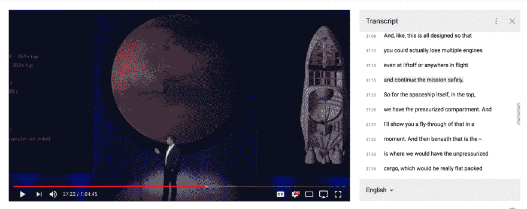
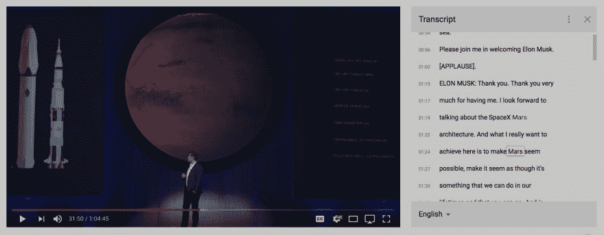

# YouTube 壁画:用自然语言处理 YouTube 视频中的绘画主题

> 原文：<https://dev.to/acupoftee/painting-topic-change-over-time-in-youtube-videos-with-natural-language-processing-2bb5>

*点击[此处](https://acupoftee.github.io/Youtube-Murals/)观看✨的演示*

在我的大学现代物理课上，我和我的小组研究了突破性的星照项目。我寻找关于这个项目的视频，谢天谢地，他们在 5 分钟内就明白了我的意思。这个视频是 autoplay 的下一个视频，作为一个埃隆·马斯克的超级粉丝，即使没有几天的课程也让我把它搁置在我无限展示的被遗忘的 Chrome 标签上。

我最终一口气看完了，但我只想看我需要的部分。在小组项目、*和*家庭作业、*和*一个小时的回家路上，能有一个小时的时间坐下来看这个将是一个奇迹。

<figure>

[https://www.youtube.com/embed/H7Uyfqi_TE8](https://www.youtube.com/embed/H7Uyfqi_TE8)

<figcaption>Cool video, but long right?</figcaption>

</figure>

我不可能有精力记住所有说过的话。如果我可以跳过视频的其他部分呢？

* * *

第二次我想看这个的时候，我看到 Youtube 上有时间编码的抄本，你可以在视频的右边看到完整的抄本。因为它们是用时间戳索引的，所以我可以搜索特定的单词或短语，并跳转到我需要的部分。

<figure>

<figcaption>Time encoded transcripts (not machine generated)</figcaption>

</figure>

<figure>

<figcaption>Time encoded search results for the desired topic</figcaption>

</figure>

## 可达性含义

最初的创意编码草图变成了一个新的艺术项目，对 YouTube 和人类认知产生了巨大的影响。如果我能在某个特定的时间听到别人说了什么，我就有了一个简单的解决方法。对许多其他人来说，情况并非如此。YouTube 用隐藏字幕展示了他们对可访问性的承诺，然而这仅仅是个开始。我相信有更多的方法可以为此做出贡献。

> “每个人都应该能够访问和享受网络。我们致力于实现这一目标。”—谷歌无障碍。

## 使话题可见

一袋单词的方法听起来直截了当，有效地将单词与给定时间点的某个主题相关联。每个组的大小取决于特定的持续时间或句子长度。谢天谢地，YouTube 的 API 使得检索字幕成为可能，而不仅仅是自动生成的嘈杂字幕。这些以定时文本标记语言的形式出现。我将用埃隆·马斯克演讲的文字记录来证明这一点。