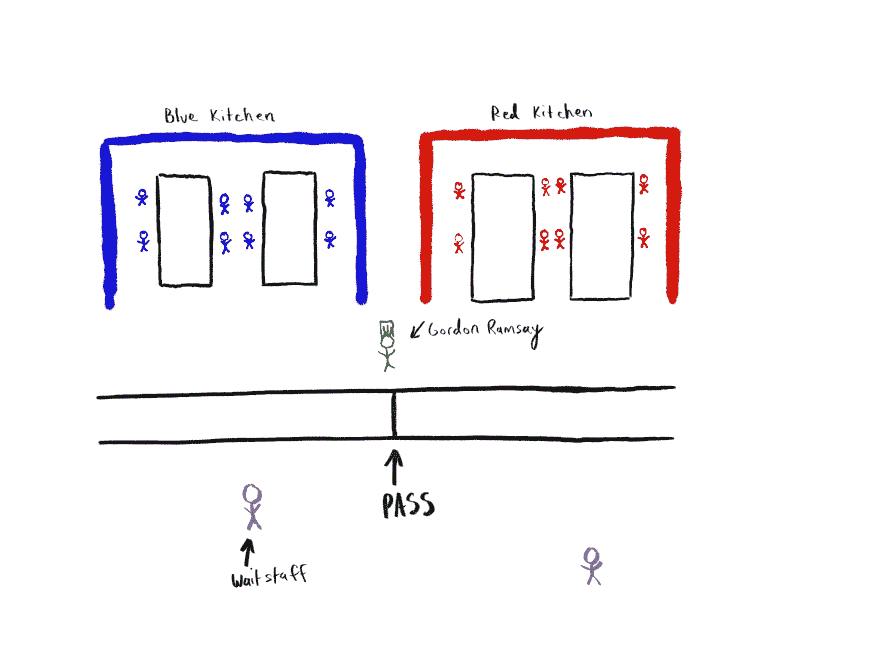
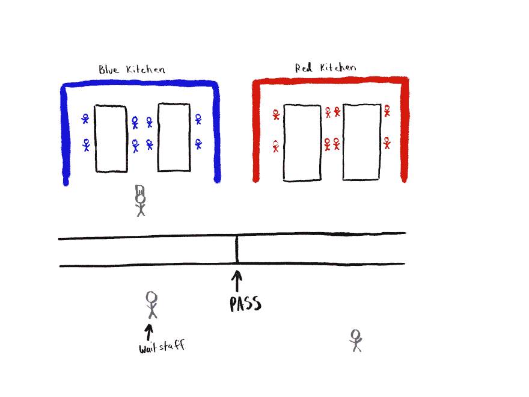
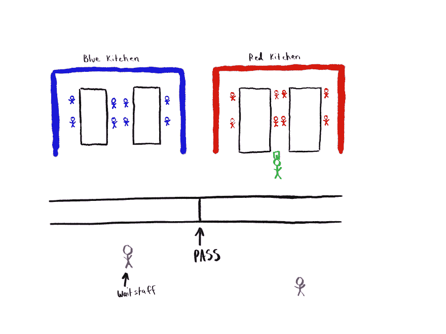

# 异步，并行，并发解释-主演戈登·拉姆齐

> 原文：<https://dev.to/taillogs/parallel-computing-simplified-starring-gordon-ramsay-1epi>

我的女朋友目前正在攻读计算机科学学位。我尽最大努力不去干涉，但有时当我看到概念和主题涵盖得很差时，我不得不介入。上个季度，她的课程涵盖了并行计算、任务调度和其他操作系统级概念等主题。众所周知，这些概念让程序员新手感到困惑，至少可以说，她的老师对这种情况没有帮助。我花了一些时间创造了一个可消化的叙事，并认为它值得分享

## 地狱厨房(我保证这是去某个地方)

地狱厨房(一个关于烹饪的可怕真人秀)在我家是一种罪恶的快感。对于那些不熟悉这个节目的人来说，每一季都有两支厨师队伍，一支红队和一支蓝队。每天晚上，他们在不同的厨房做饭，无论哪个队做得更差，都会永久失去一名成员(冷静点，他们不会杀了他们)。下面我粗略的画了一张图。

当你在地狱厨房做饭时，有几件事你应该知道。

*   “通行证”是服务员将订单带到厨房的柜台。在地狱厨房里，只有戈登·拉姆齐能向厨师大声发号施令。这意味着他的时间必须在红色厨房和蓝色厨房之间分配。

*   订单是基于每张桌子完成的。所有的菜都是按订单烹饪的，并且必须同时完成(否则食物会变冷)。

该过程如下所示:

1.  一名服务员将一张桌子的“票”(订单)带到通行证。
2.  戈登·拉姆齐验证票据(确保它是一个有效的订单)。然后，他向各自的厨房点餐。他并不针对个别厨师，当他们听到这个消息时，他们应该知道自己负责什么。
3.  厨师开始烹饪，同时相互协调，以确保他们同时完成他们的菜肴。
4.  所有的菜都端上来了。戈登·拉姆齐检查每一道菜的质量控制。
5.  假设每道菜都是正确的(记住，如果有一道菜退回去，所有的菜都退回去)，Gordon 现在按铃告诉服务员已经准备好了。

## 地狱的厨房管道

如果您理解了最后一节，您就已经理解了并行计算背后最难的概念。让我们快速定义一下我们要学习的概念。

**平行** -在同一时刻发生的多件事情

异步(Async)——你开始做一些事情，但不要坐以待毙

**并发**——多个任务被提交，而不等待前一个任务完成(没有一个文件行)。

#### 平行

最简单的就是平行。很多事情在地狱厨房里并行发生。蓝队的厨师都在同时烹饪他们的菜肴，这就是并行。两个厨房也同时在烹饪，这就是平行。服务员在厨师烹饪时接受订单，因此服务员与厨师同时工作。提出以下问题，以确定某件事是否平行:

> 我需要克隆我自己来完成任务吗？

如果答案是肯定的，那很可能是平行的

#### 并发

并发和并行是最容易让人混为一谈的。并发意味着在一段时间内，有多件事情正在进行。人类处理多项任务的能力是并发的，而不是平行的，因为你不能真正做到“同时做两件事”。

在《地狱厨房》中，戈登·拉姆齐在厨房间来回检查食物的同时也在工作。他没有平行工作，因为那是不可能的，只有一个戈登·拉姆齐。这是一个并行但不平行的例子，因为...

他可以在厨房的左边...

或者右边...

但永远不要两面！当以这种方式实现并发时，它被称为“交错并发”。

并行性和并发性密切相关，因为并行性是实现并发性的一种方法。如果戈登·拉姆齐决定雇佣一个新的主厨来管理蓝色厨房，而他管理红色厨房，这将是并行和平行的。

#### 异步

异步任务对人们来说有点棘手。异步仅仅意味着在你开始一件事之后，你不需要等待它完成。

在地狱厨房里，服务员会带着入场券去做饭。他们不会站着等饭菜做好再回到餐厅。相反，他们依靠铃声来知道订单何时准备好。

人们经常对并行/并发和异步任务之间的关系感到困惑。

考虑到这一点，戈登·拉姆齐可以决定不再让团队做饭和服务员点菜，而是自己做所有的事情。他还决定继续管理通行证和收集门票(毕竟他是戈登·拉姆齐)。由于戈登·拉姆齐只有一个人，这一变化立即消除了餐厅的所有平行。但是只要戈登·拉姆齐不下达命令，站着等着它被完成(他是唯一一个这样做的人，这样做是愚蠢的)，它就是异步的。

> 注意，如果戈登站着等着自己做饭，这将是同步的

总而言之，异步任务至少需要并发性，但不需要并行性，尽管并行性也是可行的。

## 结论

**平行**——需要克隆人吗？

**并发**——可以不等待前一个任务完成就提交多个任务吗？

**异步** -不是坐着等待事情完成

如果这篇文章是有帮助的，我有相当多的其他概念，我已经融入了类比，并不介意创建另一个帖子。

[我的博客](https://www.cdevn.com/parallel-computing-simplified-starring-gordon-ramsay)