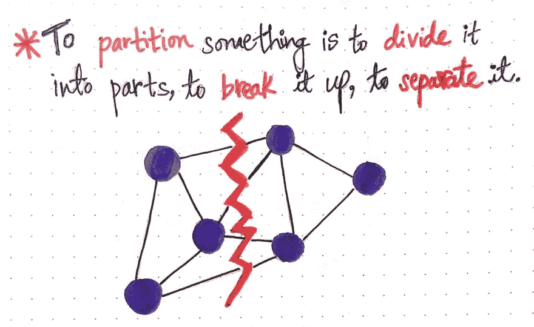
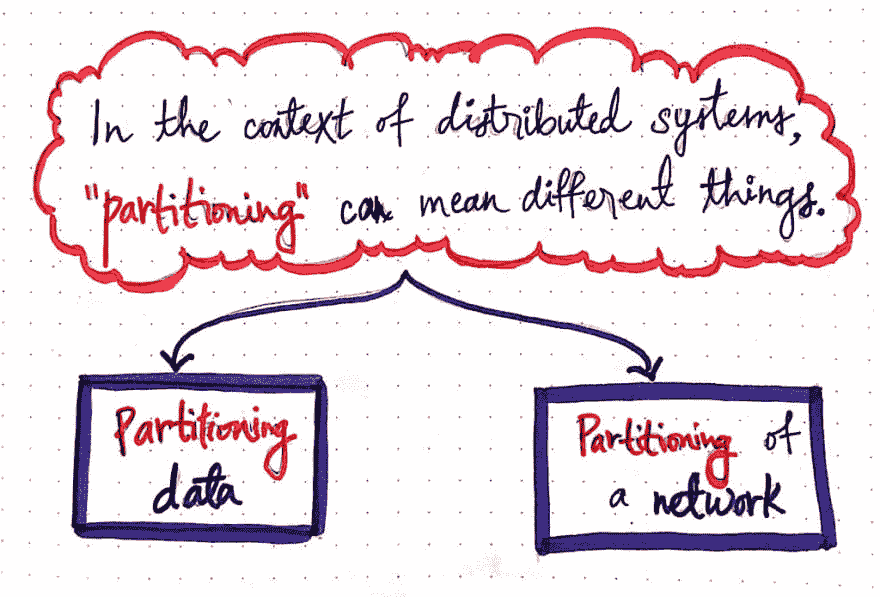
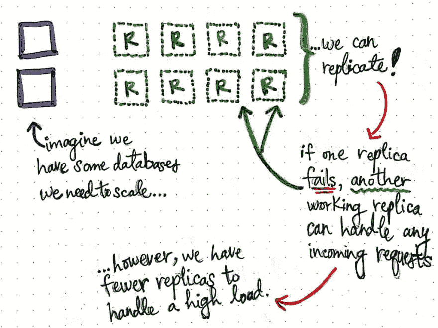
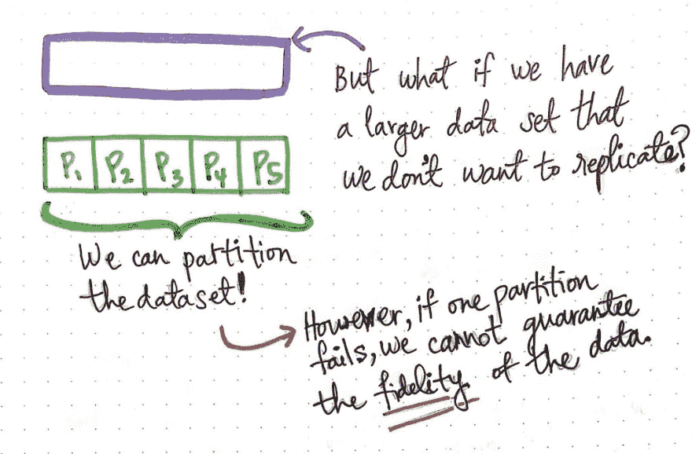
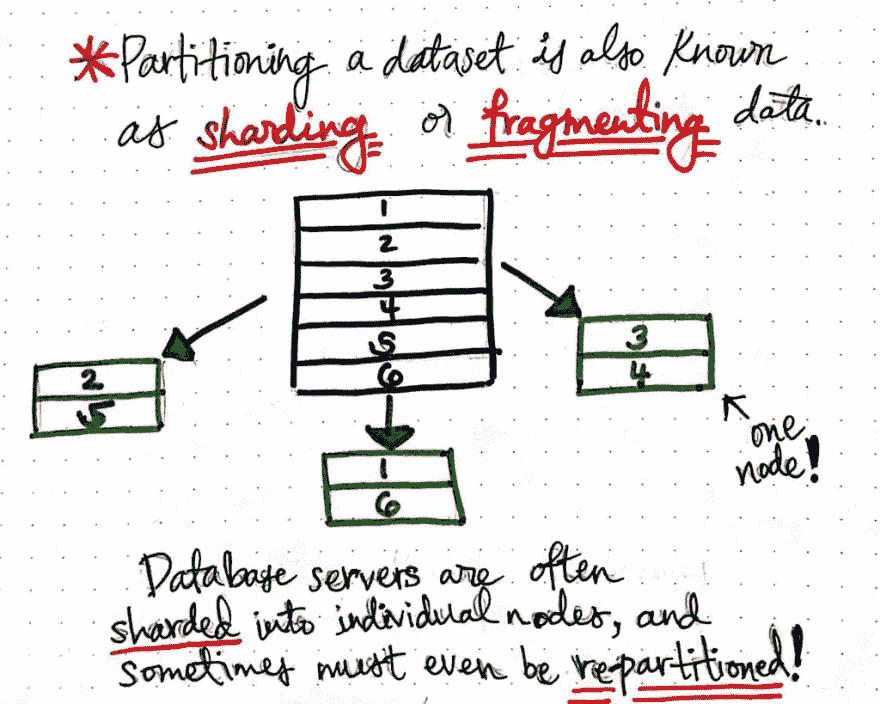
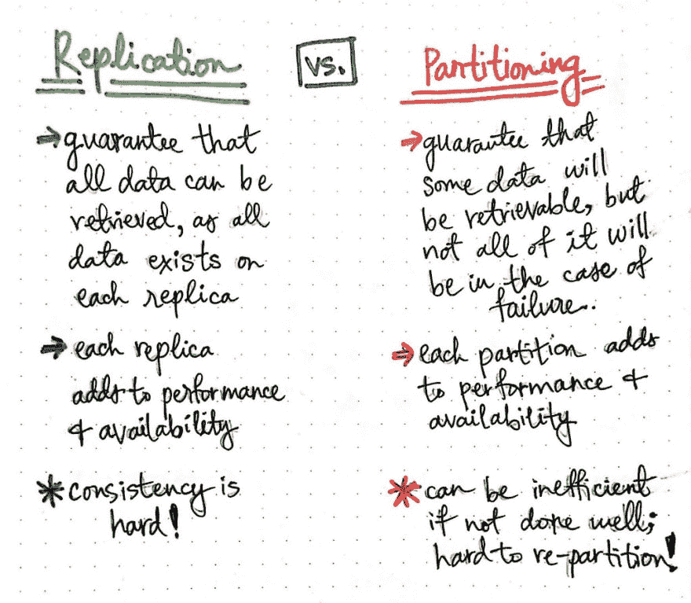
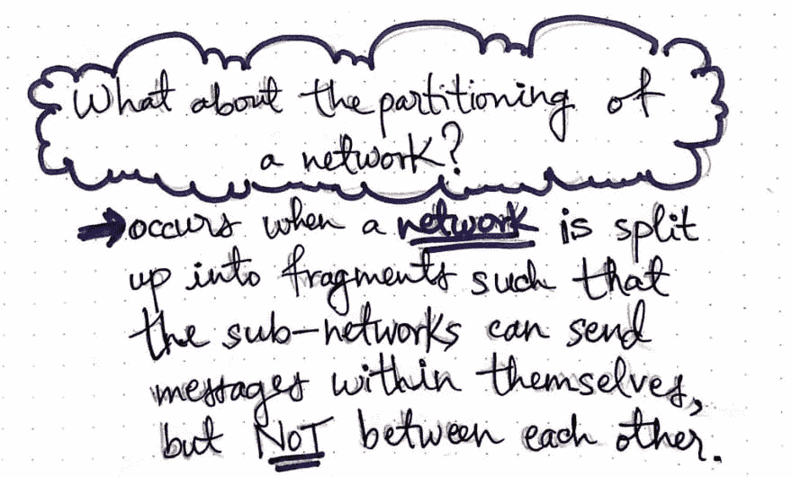
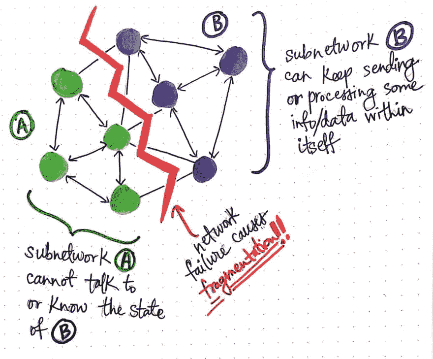
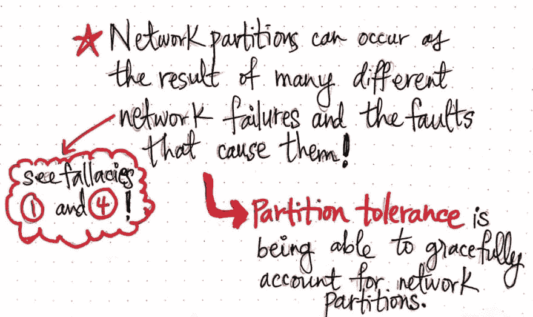

# 通过分布式系统中的分区进行解析

> 原文：<https://dev.to/vaidehijoshi/parsing-through-partitions-in-a-distributed-system-am0>

说到科技术语，有一点似乎永远适用:每个人对某些词的意思都有不同的看法。我偶尔会意识到这个事实；最近，我在试图学习一个新的分布式系统概念时偶然发现了它。

术语“分区”在分布式系统课程和书籍中经常使用，但也有许多其他术语被归入这一类别。直到最近，我还以为我知道这个术语在分布式系统的上下文中意味着什么，但是事实证明，这个故事和这个词比我意识到的要复杂得多！随着我做了更多的研究，我意识到这个术语是用来谈论两个非常不同的概念，这两个概念对于理解如何处理和构建分布式系统都是至关重要的。

正如理查德·费曼[曾经明智地说过](https://www.youtube.com/watch?v=ga_7j72CVlc)，“名字并不构成知识”。仅仅因为业内人士随便抛出一个术语，并不意味着他们都一定知道它的意思，或者它如何根据上下文而变化！所以让我们试着澄清一些困惑，获得一些关于这个话题的真正知识。

### 解析分区的意思

在我们深入了解系统中的分区之前，让我们首先确保我们对这个词的含义有相同的理解！当我们谈论 ***分割*** 某物时，我们是在分割它，把它分解成若干部分，并把它分开。

<figure> 

<figcaption>分割某物是什么意思？</figcaption>

</figure>

从本质上来说，这就是分区的真正含义:把一个整体变成更小的部分。到目前为止，还不算太复杂，对吧？但是这个术语在分布式系统的上下文中意味着什么呢？嗯，我们可以推断，分布式系统在某种程度上一定是我们正在分离、分割和分解成更小部分的“整体”。

但是这个简单的动作实际上可以有两种不同的形式，这取决于我们创建的分区的类型。正如[我们已经知道](https://dev.to/vaidehijoshi/many-nodes-one-distributed-system-kl9)，分布式系统是由节点组成的；所以，如果我们把系统分成几个部分，也许我们是在划分节点？但是“分割”在这里还有另一种解释。也许我们不是划分节点，而是将系统划分成更小的节点组，这样我们就可以将一个大系统分解成更小的子系统。仔细想想，这两种方法都是有效的分区形式。

<figure> 

<figcaption>在分布式系统的上下文中，“分区”可以有不同的含义。</figcaption>

</figure>

事实证明，这就是事情变得令人困惑的地方。在处理分布式系统时，“分区”可以有不同的含义。首先，它可能意味着系统中数据 的 ***分区，或者将节点分成更小的部分。但是，这也可能意味着通过 ***划分系统通信的网络*** 来划分系统本身。这将意味着打破系统中节点相互通信的方式，并将它们分成更小的子系统或子网。***

关于系统中这两种形式的分区，有趣的是，一种是有意的，而另一种更多的是我们需要处理的副作用。但很快会有更多。理解两者之间的区别很重要，因为同一个术语有时可以用来指任何一个！因此，让我们深入研究这两种形式的分区，并理解每种形式背后的原因。

### 分隔数据

在一个系统中划分节点的想法一开始可能看起来很奇怪，但是我们实际上以前见过类似的东西。还记得我们学习冗余和[节点](https://dev.to/vaidehijoshi/redundancy-and-replication-duplicating-in-a-distributed-system-p73)的复制吗？这个概念最初可能看起来很奇怪——为什么有人*想让*重演？！—但是当我们开始进一步分析它时，我们发现它有一些明显的好处。

<figure> 

<figcaption>概括复制的利弊。</figcaption>

</figure>

正如我们从[已经了解到的](https://dev.to/vaidehijoshi/redundancy-and-replication-duplicating-in-a-distributed-system-p73)，当我们需要使我们的一些节点更加可靠，或者当我们需要扩展我们系统的某个部分(比如数据库)时，我们可以复制我们的节点，以创建与原始节点同步的相同数据的更多副本。这样，如果一个副本失败，另一个工作的副本可以处理一些数据的传入请求。总的来说，复制使得系统更加[透明](https://dev.to/vaidehijoshi/transparency-illusions-of-a-single-system-part-2-lbb)，[可靠](https://dev.to/vaidehijoshi/ready-and-available-distributed-systems-bck)，并且更加[易于扩展](https://dev.to/vaidehijoshi/scalability-growing-a-system-in-different-directions-485j)。

然而，复制也有一些注意事项。我们已经知道保持副本的一致性是一项重大挑战。但是，如果我们的副本突然需要处理高负载的传入请求，会发生什么呢？一些副本可能会失败，依赖于该副本的任何用户都可能无法访问该副本上的任何数据(至少在另一个副本能够取代它之前)。

这给复制带来了新的挑战:虽然大多数用户可以通过工作副本访问我们所有的数据，但对于一部分*用户来说，如果这些用户正在访问的副本*发生*故障，我们所有的数据都可能*完全不可用*。*

 *但是如果我们有一个非常大的数据集呢？会让我们在复制它之前三思？这就是我们可能想要采用不同策略的地方…比如对我们的数据进行分区！

<figure> 

<figcaption>在复制不合适的地方，分区可以化险为夷！</figcaption>

</figure>

在某些情况下，数据集非常大，无法全部放在单个节点上，我们可以选择对数据进行分区。

> 跨节点划分数据意味着我们的数据分布在我们的节点上；没有一个节点可以包含我们所有的数据。相反，如果我们想要检索所有的数据，我们需要到每个节点去获取它。

根据数据集的外观以及哪些数据片段彼此相关，将某些类型的数据集中到单个节点上可能是有意义的。例如，在一个在页面上显示文章和相关评论的系统中，总是将一篇文章的数据和所有评论放在同一个节点上可能是合理的，这样我们的用户就不需要发出两个请求来获取两个不同节点上的两种数据。

有许多策略可以确定哪些数据应该驻留在哪个节点上。我们可能会遇到两个术语来描述这个想法，分别是*和 ***碎片化*** 。这两个术语可以互换使用，来描述跨许多不同节点划分数据集的想法(在本文中，我们不会详细讨论这些技术的实际实现)。*

 *<figure> 

<figcaption>分片/分片数据是一种分区！</figcaption>

</figure>

这里需要注意的重要一点是，每当我们看到术语“分片”或“碎片化”时，上下文通常是一个分区的数据库(因为数据库通常是我们的数据集所在的地方！).通常，数据库存在于多个服务器上，并且它们本身是分布式的(很简洁，对吧？).因此，当我们遇到数据库被分割成碎片的情况时，我们真正处理的是一个被分割成 ***碎片*** 或更小的集合/碎片的大数据集，它们分布在各个节点上。

> 单个数据库节点仅包含较大数据集的一部分。当添加更多数据或数据集发生重大变化时，可能需要在所有节点上将数据集重新分区为新的碎片。

<figure> 

<figcaption>复制与数据分区。</figcaption>

</figure>

那么，这如何符合我们关于*复制*的心理模型呢？

首先，这里有一个重要的相似之处需要注意:分区和复制都提高了系统的性能和可靠性。这仅仅是因为拥有更多节点——无论它们是包含所有相同数据的副本，还是包含某些数据的分区——都意味着单个节点上的负载减少了！当我们添加更多的副本或分区时，我们有效地分散了传入的数据请求，这有助于我们的系统扩展，并使其对我们的最终用户更具性能和可用性。

但是这两种策略的区别呢？复制保证了我们的终端用户总是能够读取整个数据集，因为所有的数据都存在于每个副本中。另一方面，分区保证了*一些*数据是可恢复的，但是不能保证如果其中一个分区发生故障，我们的最终用户总能恢复他们需要的数据！

复制和分区的另一个区别是使它们变得困难的事情！复制是困难的，因为维护副本之间的一致性很棘手。分区困难有两个原因:首先，如果我们的数据集发生变化，我们需要突然对它进行重新分区…这不是一件容易的事情。决定如何划分数据需要时间和精力，我们绝对不希望一直对数据进行重新划分！第二，取决于如何实施，它有时可能是无效的。例如，如果我们将一些频繁使用的数据分区到一个节点上，我们实际上会比分区前的情况更糟，比如 T2。这是为什么呢？

想象一下，我们所有的终端用户突然同时请求高使用率的数据，而节点无法处理高负载？或者，如果包含高使用率数据的一个数据库节点出现故障，该怎么办？现在我们的最终用户无法访问这个重要的分区！因此，在决定这两种策略的利弊时，我们应该考虑所有这些潜在的不利因素。为了避免与做出这些决定相关的一些痛苦，许多生产级分布式系统将尽可能使用复制，并且仅在必要时选择分区。

### 划分网络

既然我们知道了数据分区的来龙去脉，我们还有最后一件事要解释:网络分区背后的思想。不过，不要感到太害怕，这对我们来说并不是一个全新的话题。事实上，我要告诉你一个小秘密——我们已经看到了分区网络的影响！

在这个系列中，我们已经了解了[许多](https://dev.to/vaidehijoshi/modes-of-failure-part-1-4db1) [不同的](https://dev.to/vaidehijoshi/modes-of-failure-part-2-544h)故障模式，事实证明， ***网络分区*** 实际上只是分布式系统中故障的一种形式。当一个网络被分割成多个片段，并随后在其内部创建子网络时，就会发生这种情况。这里要指出的重要一点是，它是一个 ***网络故障*** (也称为 ***网络分裂*** )中断了网络中节点之间的正常通信。

<figure> 

<figcaption>划分一个网络意味着什么？</figcaption>

</figure>

然而，这并不意味着*网络中的所有*节点都不能通信；唯一不能互相交流的是那些围绕着裂缝的。这意味着，如果两个节点之间发生网络分裂，这两个节点无法相互通信，但它们可以继续与不受分裂影响的其他节点通信。

> 当节点连接因网络故障而中断时，它会创建子网络，这些子网络是更大网络的“分区”,也可以说是网络的无意分割。

<figure> 

<figcaption>网络故障可以将网络分割成更小的子网。</figcaption>

</figure>

例如，在这里显示的图中，一个 ***网络故障*** 导致了一个网络分区(也称为一个 ***碎片化*** )。碎片化迫使我们的网络分成两个 ***子网*** ，我们将其命名为 A 和 B。子网 A 的节点可以继续相互通信，子网 B 的节点可以继续处理数据并在它们之间发送信息。但是，子网 A 和子网 B 之间的任何节点都被分割了，这意味着它们无法相互通信！这意味着子网 A 不能与子网 B 的*状态对话，甚至不知道它的*状态(反之亦然)。

现在，如果这种情况听起来很糟糕，你是对的——的确如此！我们不希望我们的网络随机中断，导致我们系统的各个部分相互隔离。显然，分区网络是应该避免的。然而，你还记得我们学习分布式计算的 8 个谬误吗？如果我们回想谬误 1 ( *“网络是可靠的。”*)和谬误#4 ( *“网络是安全的。”)*那么我们就来直面一个铁一般的事实: ***网络分区是无法避免的*** 。

那么我们能做什么呢？好吧，我们可以设计我们的系统，当它们(不可避免地)发生时，设法优雅地处理它们！这类似于我们在学习[容错](https://dev.to/vaidehijoshi/fantastic-faults-and-what-to-call-them-2djb)时得出的结论，以及我们如何被迫考虑错误并试图设计我们的系统来处理它们。同样，当谈到网络分区时，我们需要计划 ***分区容差*** ，这是我们考虑可能出现的潜在网络故障以及它们可能导致的故障的方式！分区容忍系统是一个试图考虑网络分区的系统，因为我们最终都会遇到网络分区。

<figure> 

<figcaption>分区容忍度是考虑网络分区的能力。</figcaption>

</figure>

虽然数据分区可能是一个可以避免解决的问题，因为我们可能没有决定我们甚至需要对我们的数据进行分区，但是网络分区是我们无法避免的。事实上，当开始学习一些有趣的…定理时，它们会再次出现。但这是另一个帖子的故事！😉

#### 资源

在学习更高级的分布式系统主题时，分区和分区容忍度经常出现，所以对基础知识有一个很好的理解是很重要的。方便的是，有一些非常棒的资源可以帮助完成这项任务。我在下面列出了一些我最喜欢的，其中一些甚至深入到了分区的更高级的方面；如果您渴望了解更多信息，请查看它们！

1.  [分布式系统备忘单](http://dimafeng.com/2016/12/04/distributed-systems/)，德米特里·费多索夫
2.  分区:分布式系统的神奇配方
3.  [以娱乐和盈利为目的的分布式系统](http://book.mixu.net/distsys/intro.html)，Mikito Takada
4.  为什么分布式系统这么难？一个网络分区生存指南，丹妮丝·于
5.  [复制与分区](https://www.youtube.com/watch?v=W1NmbcuomVM)，佐治亚理工学院
6.  Jepsen:关于网络分区的危险

* * ***