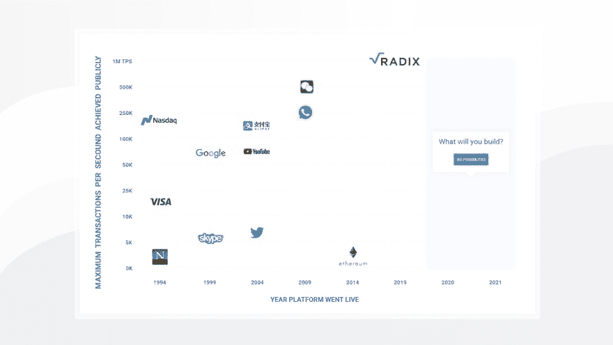

# 第 1 部分:可伸缩性测试和基数的基础知识

> 原文：<https://dev.to/radixdlt/part-1-a-primer-on-the-scalability-test-and-radix-4jjb>

这是关于我们如何构建和部署一个测试的两部分系列的第一部分，该测试在不到 15 分钟的时间内将比特币的整个交易历史推过 Radix ledger。

# 这是什么测试？

这些测试在 Radix ledger 上重放了整个 10 年的比特币交易历史，在一个均匀分布在世界各地的 1000 多个节点的网络上进行完整的交易和签名验证。

自从创建了公共的、不可信的网络以来，我们第一次展示了一种技术，它甚至可以真正支持世界上要求最苛刻的交易应用程序。

# 这些测试证明了什么？

没有中央权威的价值转移和所有权技术，可以以与互联网所基于的协议相同的规模存在。

Radix 的使命是[让任何人、任何地方都可以自由接触数字经济](https://youtu.be/Hw90aMyvLbM)。要做到这一点，它必须能够在没有高昂成本或技术瓶颈的情况下为世界服务。

这实质上意味着一个可以同时为超过 75 亿人和 5000 亿台设备工作的有状态协议。我们构建 Radix 正是为了做到这一点，为了证明这一点，我们从本周开始运行一系列吞吐量测试。这些测试是为了模拟真实世界的条件而构建的，具有完全的交易验证，没有任何偷工减料。

这与之前的情况相比如何？随着互联网的出现，数字商务也出现了。从那时起，世界就需要越来越大的交易吞吐量，以满足全球和联系日益紧密的公民的需求:

早期的区块链协议打破了这种向平台发展的趋势，这些平台可以为日益互联的世界服务。Radix 提供了一个平台，下一代数字优先公司可以在这个平台上建立，并且可以扩展到世界上的每一个人。

# 什么样的用例需要这种吞吐量？

很少有个别用例需要这样的吞吐量，但是由于公共分类帐的吞吐量是由构建在其上的每个应用程序共享的；[累积吞吐能力](https://www.bbc.co.uk/news/technology-42237162)是关键。

对于这种规模和范围的东西，最简单的单一用例是一个国家货币的发行和使用(国内+国际，消费者+企业+政府)。

这种系统将消除对 Paypal、Visa 和 Mastercard 等服务的需求，以及银行目前使用的许多后端系统。

虽然货币的用例只是可以建立在基数上的最简单的金融应用，但它也构成了经济和金融产品的基础，一旦货币本身可以编程，所有这些都可以更容易地建立起来。

要了解更多关于 Radix 上的菲亚特令牌/数字现金发行的信息，[请查看我们的知识库](https://docs.radixdlt.com/alpha/learn/use-cases/fiat-tokens)。

# 你用什么数据集来模拟这个？

对于第一次运行，我们正在使用一个可验证的数据源测试 Radix 网络的吞吐量，我们非常喜欢和尊重比特币分类账交易历史。

我们选择比特币数据集是因为它像基数一样，基于 [UTXO 交易模型](https://medium.com/vitelabs/understanding-the-utxo-transaction-model-of-bitcoin-part-1-1c0b9977632e)，我们可以将其转换为基数交易实体(原子)。在测试期间，任何人都可以搜索他们的账户，并确认他们的交易历史与真实的 BTC 分类账相匹配。

我们也喜欢它，因为有 4.6 亿个比特币地址；在数量上相当于一个大国的人口。

这是 TPS 基数能够达到的最大值吗？这绝不是我们平台的最大吞吐量，但这无疑比我们以前尝试过的要大得多。

因为我们的可伸缩性基于分片，所以分片越多，事务吞吐量可能越高。由于 Radix 有 18.4 万亿个碎片的固定碎片空间[([https://www.radixdlt.com/post/sharding-in-radix/](https://www.radixdlt.com/post/sharding-in-radix/)]，理论上的最大吞吐量远远超过了可能使用的数量；甚至是全世界。

这个博客涵盖了什么？本博客涵盖了我们为设置这些测试所做的工作；另外，我们如何让 Radix ledger 在不到 30 分钟的时间内对整个比特币交易历史进行全面签名和 UTXO 验证。

网络有多大？这些测试的第一轮关注的是速度，而不是容错能力。因此，该网络由大约 1000 个节点组成，重叠最少；每个节点服务总分类帐的大约 1/1000。

基数共识不依赖于主动全局共识(POW/POS ),而是一种基于逻辑时间的[进程的碎片级被动共识。没有重叠并不意味着事务没有被正确地验证，但是它确实阻止了网络能够处理这种配置中的显著节点丢失。](https://youtu.be/wfsZuN6NaJo)

如果有人希望通过增加我们测试网络的重叠来测试系统的容错能力，你可以从 Github 上的测试代码中创建你自己的分类帐。我们也将在未来测试这一点，但它需要我们不断请求谷歌给我们足够的节点来测试它！

基数吞吐量测试代码:[https://github.com/radixdlt/mtps](https://github.com/radixdlt/mtps)

在 Radix 上，一个具有 8GB RAM 和 4 个内核的节点每秒可以处理大约 2000 个事务，包括完全验证和闲聊。对于这个测试，我们需要一些额外的 RAM 来处理和缓存比特币数据集，这将 RAM 要求提高到 30GB 和 8 个内核，但这并不代表主网络的要求。

有哪些局限性？
该测试中的冗余是使用“碎片组”配置的——网络有一个 18.4 万亿个碎片的固定碎片空间，一个节点可以根据自己的喜好操作或多或少的碎片空间(假设它有足够的资源)。我们使用“分片组”将节点分散在分片空间中——分片组越小，节点覆盖的分片空间越大。例如，1 个碎片组= 18.4 万亿个碎片/100%的分类帐。2 个分片组=每组 50%的分类账等。每组节点越多，冗余就越大，例如，100 个节点+ 2 个碎片组意味着每组有 49 个节点冗余。

在这次测试中，我们以低冗余度运行网络，以在谷歌云上获得最大的回报。这意味着 1000 个节点大约有 1000 个碎片组。这些碎片组有一点重叠，但不会太多。每个事务平均涉及 4.2 个碎片，这意味着每个事务平均由 4.2 个节点验证和检查双重花费。

在未来的测试中，我们将重新配置网络以增加冗余，因此，对于相同的节点数，网络上的最大吞吐量会更低。基本的限制是我们愿意花多少钱来运行这些测试。

你发现坏块了吗？
基数上没有块或挖掘——所有原子(交易/分类帐操作)被单独提交和检查，并在每个交易的基础上被确定为有效或无效(UTXO 双重花费检查、签名验证等)。).

因为 Radix 状态分片与比特币的 UTXO 模型系统具有类似的属性(增加了类似智能合约的功能)，所以对我们来说，将比特币交易历史应用于交易验证和双重花费检查相对容易侵入 Radix——非标准的比特币脚本除外；我们需要更有创造性的地方——参见[million are-dataset-preparor 工具](https://github.com/radixdlt/mtps/tree/master/millionaire-dataset-preparator)了解更多细节。

你如何阻止双重消费？
事务被单独验证——这是通过基数[一致层](https://docs.radixdlt.com/alpha/learn/platform/tempo#how-does-it-work-simplified) (Tempo)和可编程约束系统的组合来完成的，我们可以使用[原子结构](https://docs.radixdlt.com/alpha/learn/architecture/atom-structure)和[约束机制](https://docs.radixdlt.com/alpha/learn/architecture/constraint-machine)来添加该可编程约束系统。这两者一起能够严格地排序相关的交易(例如，从同一个私钥)并减少双重花费。

为了更详细地理解这是如何工作的。请看我们的【解说者视频系列】这里[([https://www.youtube.com/watch?v=sW8nWeUnkK0&list = plbghv 3 uedrntbejnq 90 p-ph 3 yuc 7 imh-r](https://www.youtube.com/watch?v=sW8nWeUnkK0&list=PLBGHv3uedRNTBeJNq90p-Ph3Yuc7imH-r))。

基数分类帐的本机分片结构是必不可少的。因为碎片空间是固定的，永远不会改变，即使一旦有非常大量的人在使用网络，那么它也可以用来帮助划分事务，平衡网络负载。

实现这一点的主要方式是通过钱包的公钥。在 Radix 上，任何地址的公钥也会告诉您它位于哪个碎片上。这具有自动将相关事务分组在一起(来自同一个键的所有花费必须发生在同一个片上)和取消不相关事务分组(两个键有 1/(2^64 机会在同一个片上)的非常理想的特性。

这意味着节点不需要知道整个分类帐来检查特定花费的有效性；只有钥匙所在的碎片。这就是为什么我们可以在 Radix 上对从应用程序消息到比特币交易的一切进行大规模异步处理。

关于比特币数据集的一个说明
比特币收费模式鼓励将尽可能多的交易集中在同一个区块。基数费用模型将消除这种激励(我们没有块)。在这方面，尽管我们可以在该数据上实现每秒高交易吞吐量，但比特币数据集并未针对基数数据架构进行优化。

对于未来的测试，我们将使用来自金融机构和加密交易所的更传统的一对一交易数据集。这些数据将产生一个更加友好的数据集，更加符合 Radix 架构，并更好地代表我们将在 Radix 网络上看到的绝大多数交易。

# 加入 Radix 社区

[电报](https://t.me/radix_dlt)普通聊天
[不和](https://discord.gg/7Q7HSZZ)开发者聊天
[Reddit](https://reddit.com/r/radix) 普通讨论
[论坛](https://forum.radixdlt.com/)技术讨论
[推特](https://twitter.com/radixdlt)发布公告
[电子邮件](https://radixdlt.typeform.com/to/nyKvMV)简讯每周更新
邮件[hello@radixdlt.com](//hello@radixdlt.com)普通查询