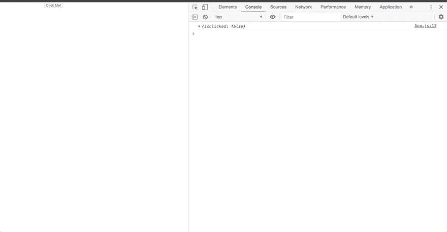

# 传承在 React 中起到道具的作用

> 原文：<https://dev.to/vadims4/passing-down-functions-in-react-4618>

[](https://res.cloudinary.com/practicaldev/image/fetch/s---NNlDSj_--/c_limit%2Cf_auto%2Cfl_progressive%2Cq_auto%2Cw_880/https://miro.medium.com/max/1120/1%2AdLaDL-lSN0iprzmOpmM7zQ.png)

当我在熨斗学校的旅程接近尾声时，更有趣也更难学的科目之一是反应。在学习了纯粹的普通 JavaScript 并能够用它编写应用程序之后，我们学习了 react 的功能以及它作为一个框架有多有用。随着向 react 的过渡，我们介绍了 JSX，它是 JavaScript 和 html 的一个实现。关于转换最困难的事情之一是框架的一般使用。在 javascript 中，我们有单独的 html 和 JavaScript 文件。而现在，它是一个应用程序的所有 JSX 和多个组件。我们将了解状态和道具，以及组件生命周期。创建函数并让它们与状态一起工作是学习曲线中具有挑战性的部分。在一个项目中，我遇到了一个问题，在子组件中，我有一个 onClick 函数，我需要这个 onClick 函数，state 在父组件中。我陷入了如何将我的功能从父组件传递到子组件的困境。当我在研究如何将功能作为道具传递给不同的组件时，我发现网上缺乏相关信息。所以我决定写这篇博客，以防其他人对 React 学习过程的这一部分感到困惑。

# 在状态级别组件上创建函数

当处理状态时，我们通常希望状态只存在于一个组件中。换句话说，我们想要尽可能少的有状态的组件。这意味着为了改变不同组件的状态，我们必须将我们的函数作为道具传递给需要改变状态的组件。这样，我们可以在子组件中拥有能够改变状态的函数。如果您的子组件具有 onClick 函数或 onChange 函数，并且需要更改状态以便用户在屏幕上看到正确的信息，这将非常有用。

# 传承功能作为道具

将功能作为道具传递下去的过程可能会非常混乱。它发生在渲染过程中，这时你调用一个新的组件。在组件调用过程中，您将函数作为一个道具传入。在我的演示中，我将道具作为“clickMe”传入。

```
import React from 'react';
import './App.css';
import NewComponent from './components/NewComponent';
// import NewFunctionalComponent from './components/NewFunctionalComponent';

class App extends React.Component {

  constructor(){
    super()
    this.state = {
      isClicked: false
    }
    console.log(this.state)
  }

  handleClick = () => {
    console.log('I have been clicked')
    this.setState({
      isClicked: true
    }, () => console.log(this.state.isClicked))

  }

  render() {
    return (
      <div className="App">
        <NewComponent clickMe={this.handleClick} />
        {/* <NewFunctionalComponent noClickMe={this.handleClick} /> */}
      </div>
    )
  }
}

export default App; 
```

通过这个简单的演示，我创建了一个 react 应用程序，通过单击一个按钮来改变状态。在渲染中，当我引用“NewComponent”组件时，我将“handleClick”函数向下传递到子组件中。这样，我可以在我的子组件中引用该函数。

```
import React from 'react';

class NewComponent extends React.Component {

    clickMe = () => {
        this.props.clickMe()
    }

    render() {
        return (
            <div>
                <button onClick={this.clickMe}>Click Me!</button>
            </div>
        )
    }
}

export default NewComponent; 
```

在这个子组件中，我有一个 onClick 事件处理程序。我还在 onClick 事件期间创建了一个助手函数。现在，我们的 onClick 事件可以运行了，因为它作为道具传递给了我们的“NewComponent”组件。如果我把它包含在我的函数中，我也可以把道具或者事件传递回父组件。这里有一个例子，

```
//You can pass in props back to the parent element like this.

clickMe = () => {
    this.props.clickMe(props)
} 
```

运筹学...

```
//You can also pass an event. I am passing in the value of the event as an example

clickMe = (event) => {
    this.props.clickMe(event.target.value)
} 
```

### 相同的场景，但是使用了一个功能组件

```
import React from 'react';

const NewFunctionalComponent = (props) => {
    return (
        <div>
            <button onClick={() => props.noClickMe()}>No, Click Me!</button>
        </div>
    )
}

export default NewFunctionalComponent; 
```

# 示范

[](https://res.cloudinary.com/practicaldev/image/fetch/s--gKQhBIa8--/c_limit%2Cf_auto%2Cfl_progressive%2Cq_66%2Cw_880/https://i.imgur.com/MrVXjsv.gif)

我包含了一些控制台日志来展示状态改变的过程。在任何动作完成之前，默认状态是“假”。在点击事件之后，状态变为“真”。这是为了说明将函数放入不同的组件实际上是可行的。

# 结论

React 基本上是魔法。在制作在线 web 应用程序时，它是一个非常强大的工具。状态和道具的使用对于向用户呈现事物是至关重要的。我创建了一个简单的演示，展示了能够将函数作为道具传递下去的能力。通过这种方式，您可以在不同的组件中进行操作，并且仍然只在一个组件中拥有状态。看到 React 有这么多有用的功能是很可怕的，你对 React 了解得越多，它就变得越令人兴奋。因为你可以创造无限的可能性。