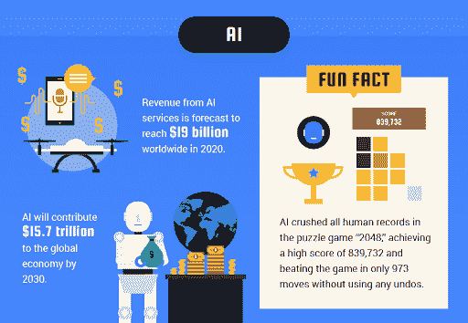
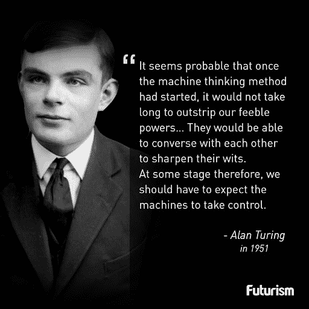
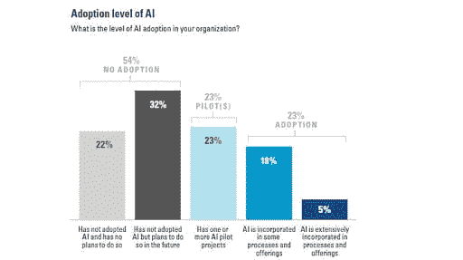
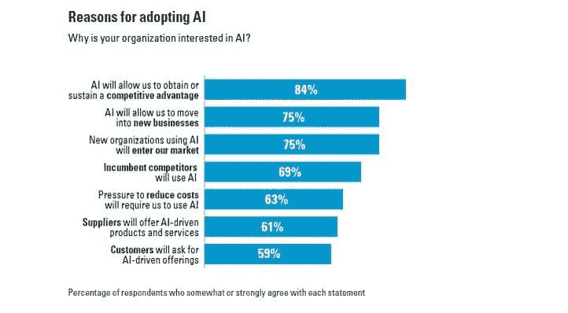
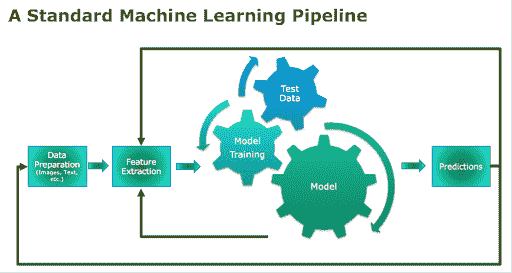
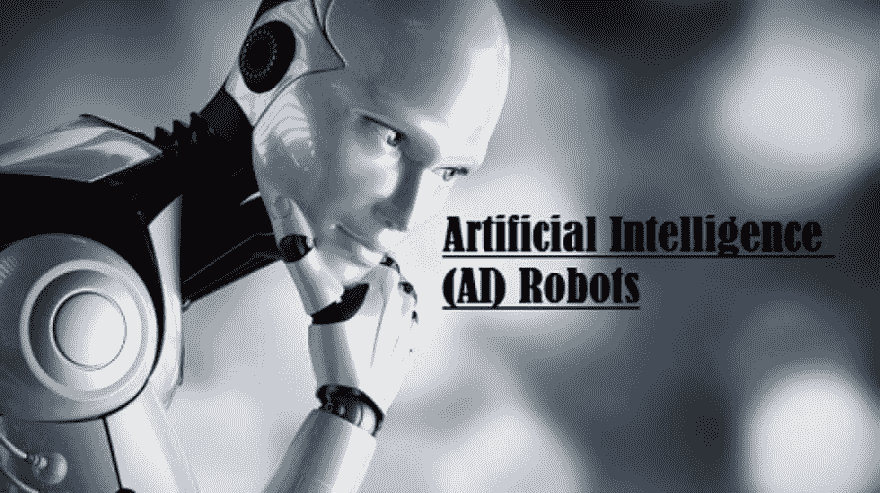
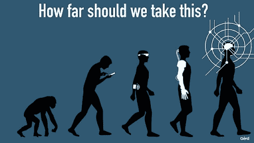
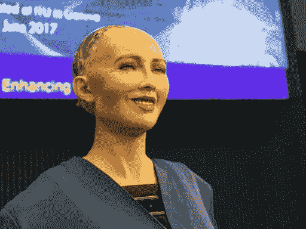

# 人工智能的过去、现在和未来:人工智能进化的案例研究

> 原文：<https://dev.to/patricia248/past-present-and-future-of-artificial-intelligence-a-case-study-of-ai-evolution-55bm>

人工智能是近几年的趋势技术。你一定在科技新闻和博客中听说过很多。关于人工智能的未来有各种各样的预测，但你曾经热衷于它的初始阶段吗？

在当代，人工智能及其子集机器学习和深度学习正在统治软件行业市场的创新。事实上，人工智能的魔力如此之大，以至于 41%的消费者期待未来他们的生活会因人工智能而改变。你有同样的看法吗？

**AI 是什么意思？**

在分析 AI 的过去、现在、未来之前，让我们先搞清楚它的核心含义。人工智能是将人脑的能力赋予基于计算机的软件。

基于人工智能的应用程序可以执行以前仅限于人类思维的功能。逻辑推理和认知思维现在由技术无缝地执行。

毫无疑问，人工智能及其子集机器学习和深度学习彻底改变了机器的概念。他们变得更加互动，支持和人性化的特点以及表现。

让我们回到人工智能诞生的年代

大约 60 年前，技术爱好者开始探索这项神奇的技术。尽管自 20 世纪 50 年代以来，其概念在过去几个世纪就已存在，但其发展没有受到阻碍。

[软件开发人员](https://www.pixelcrayons.com/hire-software-developers?utm_source=hackernoonsg&utm_medium=sg&utm_campaign=Past%2C%20present%2C%20and%20future%20of%20Artificial%20Intelligence%3A%20A%20case%20study%20of%20AI%20evolution)不断增长的能力在一个持续的过程中增强了这项技术。当我们谈论人工智能的历史时，我们脑海中弹出的第一个名字是[艾伦·图灵](https://www.bbc.com/news/technology-18475646)。

自从通用计算机发布以来，他就开始质疑给机器增加智能的概念。虽然在他去世两年后，“人工智能”这个术语实际上已经被创造出来了。

**人工智能时间轴**

以下是人工智能历史上的几个重要事实:

> 艾伦·图灵开发了一种测试来确定机器是否可以拥有人类的智能行为。
> 
> 来自美国的计算机科学家约翰·麦卡锡在 1955 年创造了人工智能这个术语。
> 
> 1961 年，通用汽车公司推出了第一台机器人。
> 
> 1965 年，麻省理工学院人工智能实验室创造了第一个关于自然语言处理(NLP)的聊天机器人 Eliza
> 
> 国际象棋世界冠军加里·卡斯帕罗夫在 1997 年被一台名为 IBM 的“深蓝”的国际象棋计算机击败。
> 
> 1999 年，麻省理工学院人工智能实验室开发了 Kismet，这是第一个情感人工智能演示。
> 
> 自动驾驶汽车的开发是由谷歌在 2009 年开始的。
> 
> 2011 年在人工智能方面看到了很多。Jeopardy 冠军被 IBM Watson 击败。Cortana、Google Now 和 Siri 开始流行。
> 
> 世界冠军李·塞多尔(Lee Sedol)在 2016 年的围棋(中国古代棋盘游戏)比赛中被谷歌 DeepMind 的 AlphaGo 击败。
> 
> 2017 年-通过人工智能的医学突破诊断皮肤癌和心律的一年。

人工智能在过去 70 年的发展是可观的。从 20 世纪 50 年代到 2019 年，在计算机科学家、公司和软件开发商的贡献下，人工智能及其子集、深度学习和机器学习已经渗透到每个行业。

**2019 年的人工智能:现在的**

在当代，人工智能是公司愿意投资的领域之一。所有利基市场的企业都雇佣或愿意雇佣软件开发人员来使他们的运营基于人工智能。

今天，忽视这项技术会给你的业务带来负面影响。你知道有多少公司没有使用 AI 的计划吗？只有 22%！这是麻省理工学院斯隆管理学院和波士顿咨询集团在一项回顾性研究中发现的。

以下是他们研究的一些其他发现:

根据上述陈述，84%的受访者认为采用或维持人工智能将使他们获得竞争优势。这项技术被视为一项具有重要战略意义的服务，必须添加到从旅游到医疗保健的各个领域的业务中。

有许多人工智能技术正在统治软件开发世界。你可以将它们纳入你的业务，以获得人工智能的好处。以下是 2019 年顶级人工智能技术的名单:

**生物特征:**

自人类文明建立以来，安全就一直是其首要关注的问题。几个世纪以来，提供安全的方式已经有了很大的发展，人工智能也在为此做出贡献。

你知道人工智能对世界增加安全性有什么帮助吗？你们都可以通过智能手机中的指纹和面部识别解锁选项进行连接。这是人工智能对人类生活方式影响的绝佳例子。

在这种基于人工智能的技术下，身体特征被用来识别人类。“生物识别是 2018 年最相关的识别和认证个人的手段。”据国际数字安全公司[金雅拓](https://www.gemalto.com/govt/inspired/biometrics)称。

它不局限于语音和图像的识别。今天，视觉生物识别设备可以识别手指、虹膜、视网膜和面部。这些设备用于在允许授权进入时验证人员身份。

**机器学习:**

机器学习作为实现人工智能的手段，其受欢迎程度正在上升。这种人工智能子集允许机器学习，但不需要软件程序员给它们填充代码！

ML 致力于基于统计计算和方法的算法。2019 年广泛使用的一些顶级机器学习包是 Apache Spark ML、IBM 的 SPSS、微软 Azure 和 Scikit learn。

基于机器学习概念开发的各种应用和产品有动态网页搜索、图像处理、自动驾驶汽车等。你用过谷歌地图导航一个地方吗？它的工作原理是机器学习的算法！

**机器人流程自动化:**

在全球范围内，机器人技术为人工智能的崛起带来了巨大的繁荣。在机器人过程自动化出现后，软件已经被人的交互所取代。它包括开发能够提供感官反馈和处理信息的机器人。

使用这种人工智能技术，你可以执行许多任务，解决一个查询，执行复杂的计算，登录和注销。这些任务可以以更快的速度以最高的精度和可靠性完成。

研究人员认为，这些服务有延伸到人力资源、财务和会计领域的可能性和能力。在机器人的帮助下，从医疗保健到酒店等各个行业的许多流程都实现了自动化。

**物联网:**

物联网普遍与人工智能结合使用。它们的应用正在定义软件行业的趋势。一个流行的例子是 2002 年出现的自动真空吸尘器。

虽然它没有像其他人工智能应用程序那样得到广泛认可。人工智能与物联网(IoT)融合的其他一些例子是智能恒温器解决方案和自动驾驶汽车。

预计在未来，它们将结合用于安全设备、情绪分析和人脸识别。这种结合可以简单地解释为计算机程序与设备的通信。你可以假设 AI 是身体的大脑(IoT)。

**神经网络:**

你有没有想过人类的大脑是如何工作的？它与广泛连接的神经元一起工作。以同样的方式，开发了一种使机器在神经网络上工作的程序。

这被称为人工神经网络(ANN)编程。它是在深度学习技术下发展起来的。深度学习的母体技术是机器学习，人工智能成功了。

人工神经网络首次应用于 1989 年。来自卡内基梅隆大学的代表率先开发了一种使用神经网络的自动驾驶汽车。

此外，随着科学多年来的发展，今天我们更关心大脑实际上是如何工作的，而不是专注于刺激大脑。它实际上是提高我们对自己的认识，并随着人工智能的发展带来神经科学的进步。

**人工智能的未来:**

关于人工智能将如何改变未来，有各种各样的猜测。在阅读了人工智能及其子集在过去几十年中的惊人发展和成就之后，可以肯定的是，人工智能的影响在未来几年将是深远的。

下面是一些保证人工智能有一个光明未来的统计数据:

> 到 2025 年，全球人工智能市场预计将达到 600 亿美元。
> 
> 使用人工智能，企业的生产率可以提高 40%。
> 
> 谷歌分析师认为，明年机器人将会模仿复杂的人类行为，如调情和开玩笑。

你想知道人工智能的未来会带给我们什么吗？让我们探索基于人工智能应用的技术的未来。这些人工智能领域的新兴技术肯定会统治未来！以下是人工智能未来将给予我们的某些东西:

人工智能将会制造出更多像索菲亚一样的机器人:科幻小说已经描绘出了类似人类的机器人以及它们完成复杂动作的能力。预计将来会有更多像索菲亚这样的机器人。它们将通过集成机器人技术与人工智能技术(如人脸识别和视觉数据处理)来开发。

**虚拟助手之间的竞争将会加剧:**亚马逊的 Alexa 和 Echo 正在主导虚拟助手的市场。但是你需要更多的选项来选择吗？它们的性能可能会提高，并且会增加新的功能。未来，每个人都将拥有自己的个人 AI 虚拟助理。

聊天机器人将更有同情心:聊天机器人以前被编程为具有一些特定的回复，但在未来，它们将更具互动性。每当你访问一个网站，你将能够与聊天机器人进行互动，这些机器人对你的需求和期望更加敏感和理解。

人工智能将改善医疗保健:已经有许多设备可以帮助医生对病人进行许多诊断，如呼吸和心率。尽管如此，仍有很大的改进空间。在未来，患者将在人工智能的帮助下获得更好、更快的援助。

**人脸识别将成为你的身份:**生物识别已经无处不在。但是，在未来，为了增强各种活动的安全性，人脸识别将变得普遍。很快，你的信用卡和驾驶执照将与你的面部识别联系在一起。

**结论:**

在这篇博客的最后，我们可以得出结论，人工智能一直是影响人类生活方式的强大力量。自上个世纪问世以来，人工智能已经从简单的影响思维的技术发展到可以实际执行人类思维功能的设备。

人工智能技术，如生物识别设备、基于人工智能的机器人、语音集成搜索、虚拟助理等。正在彻底改变今天人们的生活方式。人工智能技术正在呼吁创新，因为该行业已经在享受每隔一天就发生新变化的过山车。

如果你也有一个开箱即用的想法来最大限度地发挥人工智能的极限，那么不要让它浪费掉。你可以接受印度软件开发公司的指导，将你的愿景变为现实。

关于人工智能的旅程，你还有什么要分享的吗？我欢迎你在下面的评论区与我们分享你的知识。我会在今后的写作中考虑你的建议。