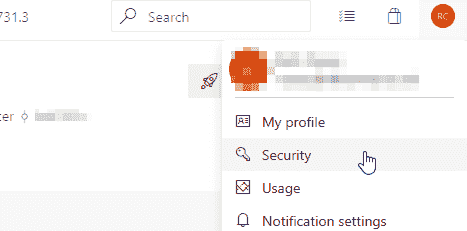
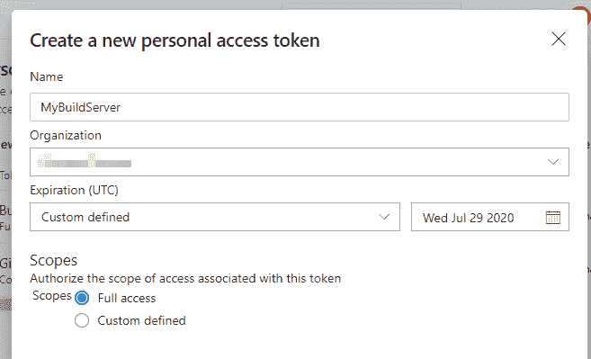
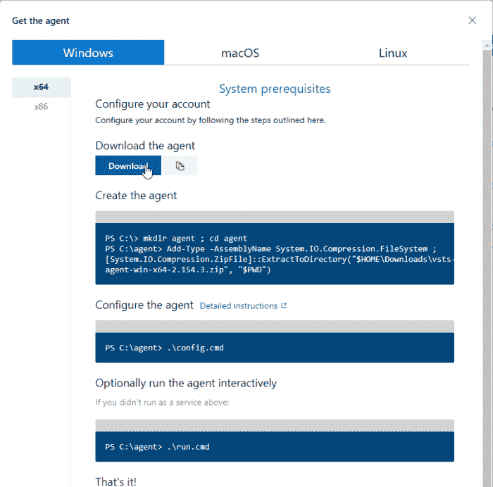
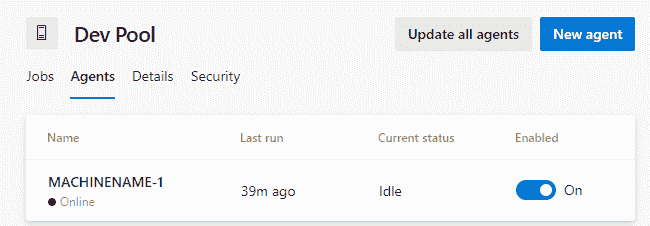

# 💰蔚蓝色的硬币捏💰:为 Azure DevOps 设置自托管构建代理以节省资金

> 原文：<https://dev.to/yerac/penny-pinching-in-azure-setting-up-a-self-hosted-build-agent-for-azure-devops-to-save-cash-2clp>

Azure DevOps 拥有出色的构建管道选项，尽管使用其托管的构建代理很容易设置，但很快就会变得非常昂贵。在这篇文章中，我将介绍如何为 Azure 设置一个自托管的构建代理。

这篇文章不会涉及构建框的设置，但是如果需要的话，可以在后面的指南中讨论。我实际上已经使用虫火谷命令编写了我的构建框，允许构建。NET 项目来简化这一步。

## 利弊

*   优点:完全控制构建
*   Pro:可以让您的构建构建项目或运行托管代理中没有的服务。
*   亲:成本低。如果你已经有了硬件，为什么还要购买 Azure 虚拟机呢？
*   缺点:维护和冗余。如果机器坏了，它会阻塞你的管道。
*   缺点:额外的设置步骤。

## 先决条件

开始之前，您需要确保:

*   您是收集/构建管理员
*   你有一个配置好的服务器来构建合适的软件(例如，正确的 SDK 等，本文不会涉及)

## 个人访问令牌

首先，你需要一个个人访问令牌。这用于允许您的构建代理访问 Azure，而无需将您的凭据硬编码到您的构建脚本中。您可以使用您自己的帐户，或专门创建的服务帐户-只需注意，它将需要权限来访问它将构建的集合。

为此，请登录您的 Azure Devops 门户，并导航到您的安全页面。

在这里，选择“个人访问令牌”，然后选择“新建”。将显示一个面板来配置该 PAT。指定一个友好且唯一的名称，选择使用此令牌的组织，然后设置其安全访问。

对于安全访问，我建议选择“Scopes”下的**完全访问**，这样您就可以将此 PAT 用于一般的开发运营活动。您可以微调控件，但必须确保它在构建范围内具有绝对最小值的读/执行。对于到期时间，我通常选择最长的期限，即 1 年。

## 代理下载和配置

接下来，您需要导航到项目设置>管道>代理池。

使用适当的名称创建一个新的代理池(您不必*这样做，如果您愿意，可以使用默认池，但是我喜欢这种分离)。创建池后，您将看到向其中添加新代理的选项。

<figure> 

<figcaption>
</figcaption>

</figure>

单击“新建代理”将为您提供所选操作系统的说明。按照说明，下载代理(一个大约 130 的 ZIP 文件),然后放在将作为构建服务器的机器上的某个合适的地方。提取后，在提升的命令窗口中运行 config.cmd

 **

运行 config.cmd 命令时，您将需要以下信息:

*   服务器 URL
    *   这将是[https://dev.azure.com/{organisation](https://dev.azure.com/%7Borganisation)的名字
*   您将使用什么类型的认证(只需按回车键，因为它将默认为 PAT)
*   您的 PAT 访问服务器，如第一步中设置的那样。
*   要连接的池。这将是上面创建的代理池的名称。
*   工作文件夹。用于存储正在构建的工作区的文件夹。
*   此代理的名称。随你怎么称呼它，但我个人总是会包括机器名，因为这样更容易找出哪个代理正在运行。

如果正确指定了上述所有设置，并且没有身份验证问题，它现在应该会尝试启动。

## 确认代理处于活动状态

返回到代理池配置屏幕，您现在应该会看到代理列在相应的代理池中。

如果几分钟后代理没有显示，说明安装过程中出现了问题。

如果代理显示脱机，请尝试在构建服务器上的提升命令窗口中运行“run.cmd”命令。

现在，您所要做的就是在创建下一个构建时选择新的代理池！

为 Azure DevOps 建立自托管构建代理的帖子最早出现在[yer . AC | Adventures of a developer 等网站上。](http://yer.ac/blog)。**