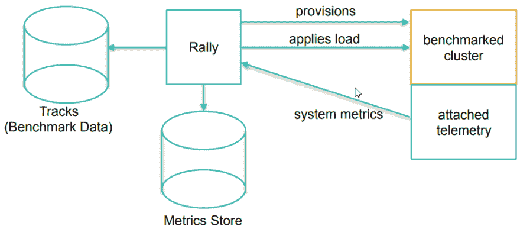

# 性能测试弹性搜索“拉力”

> 原文：<https://dev.to/peepeepopapapeepeepo/performance-testing-elasticsearch-with-rally-5f64>

来晚了。..但是来吧.

如果有人在过去的文章中读到 t0㎡t1㎡那应该已经足够熟悉我今天也做了一个性能测试了，所以我来分享一下工具。我的天啊！我的天啊！

工具就是..**[rally](https://dev.to/peepeepopapapeepeepo/workaround-kill-kibana-cause-elasticsearch-down-elk-7-2-4kd9)**【是】很多人可能会问。..

[](https://i.giphy.com/media/p3ZQjsaWFIF2xGb4fx/giphy.gif)

答案很简单。..**【我用的是 jmeter，不是“**的。

[](https://i.giphy.com/media/anB3cor0tgFX2/giphy.gif)

让我们从 Rally 的选择开始吧

[](https://i.giphy.com/media/vA4EnqvJxDv2g/giphy.gif)

* * *

### 选择 Rally 的原因

1.  属于弹性的
2.  不要坐在那里自己找一个资料集来加载
3.  安装简单
4.  收集 Elasticseach 结果，然后通过 Kibana 进行 plot graph。

* * *

### 莱利的作品如下

<figure>

[](https://res.cloudinary.com/practicaldev/image/fetch/s--5lPajaE1--/c_limit%2Cf_auto%2Cfl_progressive%2Cq_auto%2Cw_880/https://thepracticaldev.s3.amazonaws.com/i/26z0e5fg22en9tgn2e07.png)

<figcaption>Source: Daniel Mitterdorfer's Presentation</figcaption>

</figure>

1.  对 Elasticsearch 执行 provision，完成索引创建。
2.  执行下载轨道(性能测试中使用的数据集)
3.  向群集开火我们将进行测试
4.  当拍摄完成后，为我们做了一系列的回归测试和统计。
5.  如果我们选择保留结果，Rally 将会将获得的 result 和 statistics 放在我们需要的 elastic 集群上。

一旦掌握了它的功能我们就开始行动吧

* * *

### 环境

```
OS: CentOS7 x86_64
Requirements: Python 3.5+ including pip3, git 1.9+
Applications:
 - Elasticsearch 7.2.0
 - Rally 1.2.1 
```

* * *

### 设置

1.因为 Rally 需要 git v1。9 或以上，但在 CentOS 的 repo 中，只有 1 .8 只，所以我们要从另一个来源去取。在这里，我们要去万迪斯科 Git Repo
上取。

```
# cat > /etc/yum.repos.d/wandisco-git.repo <<EOF
[wandisco-git]
name=Wandisco GIT Repository
baseurl=http://opensource.wandisco.com/centos/7/git/\$basearch/
enabled=1
gpgcheck=1
gpgkey=http://opensource.wandisco.com/RPM-GPG-KEY-WANdisco
EOF
# rpm --import http://opensource.wandisco.com/RPM-GPG-KEY-WANdisco
# yum install gcc python36-pip python36-devel git
# git --version
git version 2.22.0 
```

2.将 pip 更新到最新版本
中。

```
# pip3 install --upgrade pip 
```

3.退出用户根，重新设置路径，然后用 pip
插入。

```
# exit
$ echo 'export PATH=/usr/local/bin:$PATH' >> ~/.bashrc
$ source ~/.bashrc
$ pip3 install esrally 
```

4.使用命令 t0⾹t1㎡执行整合式配置

```
$ esrally
    ____        ____
   / __ \____ _/ / /_  __
  / /_/ / __ `/ / / / / /
 / _, _/ /_/ / / / /_/ /
/_/ |_|\__,_/_/_/\__, /
                /____/

Running simple configuration. Run the advanced configuration with:

  esrally configure --advanced-config

* Setting up benchmark root directory in /home/sawitmee/.rally/benchmarks
* Setting up benchmark source directory in /home/sawitmee/.rally/benchmarks/src/elasticsearch

Configuration successfully written to /home/sawitmee/.rally/rally.ini. Happy benchmarking!

More info about Rally:

* Type esrally --help
* Read the documentation at https://esrally.readthedocs.io/en/1.2.1/
* Ask a question on the forum at https://discuss.elastic.co/c/elasticsearch/rally 
```

5.删除“nested”跟踪因为它使 error
被释放

```
$ rm -rf ${HOME}/.rally/benchmarks/tracks/default/nested 
```

6.执行追踪清单。看看这里有什么资料集可供我们玩。我选择 http_logs，因为我打算保留 web 服务器的日志访问。
。

```
$ esrally list tracks
    ____        ____
   / __ \____ _/ / /_  __
  / /_/ / __ `/ / / / / /
 / _, _/ /_/ / / / /_/ /
/_/ |_|\__,_/_/_/\__, /
                /____/

error: cannot rebase: You have unstaged changes.
error: Please commit or stash them.
[WARNING] Local changes in [/root/.rally/benchmarks/tracks/default] prevent tracks update from remote. Please commit your changes.
Available tracks:

Name           Description                                                                                                                                                                        Documents    Compressed Size    Uncompress
-------------  ---------------------------------------------------------------------------------------------------------------------------------------------------------------------------------  -----------  -----------------  ----------
eventdata      This benchmark indexes HTTP access logs generated based sample logs from the elastic.co website using the generator available in https://github.com/elastic/rally-eventdata-track  20,000,000   755.1 MB           15.3 GB   
geonames       POIs from Geonames                                                                                                                                                                 11,396,505   252.4 MB           3.3 GB    
geopoint       Point coordinates from PlanetOSM                                                                                                                                                   60,844,404   481.9 MB           2.3 GB    
geopointshape  Point coordinates from PlanetOSM indexed as geoshapes                                                                                                                              60,844,404   470.5 MB           2.6 GB    
geoshape       Shapes from PlanetOSM                                                                                                                                                              60,523,283   13.4 GB            45.4 GB   
http_logs      HTTP server log data                                                                                                                                                               247,249,096  1.2 GB             31.1 GB   
metricbeat     Metricbeat data                                                                                                                                                                    1,079,600    87.6 MB            1.2 GB    
noaa           Global daily weather measurements from NOAA                                                                                                                                        33,659,481   947.3 MB           9.0 GB    
nyc_taxis      Taxi rides in New York in 2015                                                                                                                                                     165,346,692  4.5 GB             74.3 GB   
percolator     Percolator benchmark based on AOL queries                                                                                                                                          2,000,000    102.7 kB           104.9 MB  
pmc            Full text benchmark with academic papers from PMC                                                                                                                                  574,199      5.5 GB             21.7 GB   
so             Indexing benchmark using up to questions and answers from StackOverflow                                                                                                            36,062,278   8.9 GB             33.1 GB   

-------------------------------
[INFO] SUCCESS (took 2 seconds)
------------------------------- 
```

* * *

### 让我们进行性能测试

1.运行性能测试

```
$ esrally --track=http_logs --target-hosts=192.168.1.100:9200 --pipeline=benchmark-only 
```

*注:*

*   为了方便起见，我不会让它存储数据，而是通过插入“t0 }选项来执行单独的负载测试。
*   在`--target-hosts=<IP>:<Port>`选项中指定我们群集的 coordinator 或 ingress 节点的 IP。
*   在第一次运行时，它需要很长的时间，因为 Rally 需要去加载数据集中存储，然后记住执行负载测试。

好的，等等......

[](https://i.giphy.com/media/xf20D8HzvTQzu/giphy.gif)

[](https://i.giphy.com/media/tXL4FHPSnVJ0A/giphy.gif)

[](https://i.giphy.com/media/5wWf7H0qoWaNnkZBucU/giphy.gif)

终于！我的天啊！我的天啊！我的天啊！结果出来了。让我们看看它的样子。

[](https://i.giphy.com/media/5Yl08OSg4AckeNHpDc/giphy.gif)T3】

```
------------------------------------------------------
    _______             __   _____
   / ____(_)___  ____ _/ /  / ___/_________  ________
  / /_  / / __ \/ __ `/ /   \__ \/ ___/ __ \/ ___/ _ \
 / __/ / / / / / /_/ / /   ___/ / /__/ /_/ / /  /  __/
/_/   /_/_/ /_/\__,_/_/   /____/\___/\____/_/   \___/
------------------------------------------------------

|   Lap |                                                         Metric |                Task |       Value |    Unit |
|------:|---------------------------------------------------------------:|--------------------:|------------:|--------:|
|   All |                     Cumulative indexing time of primary shards |                     |      208.92 |     min |
|   All |             Min cumulative indexing time across primary shards |                     |  0.00228333 |     min |
|   All |          Median cumulative indexing time across primary shards |                     |     1.74452 |     min |
|   All |             Max cumulative indexing time across primary shards |                     |     33.5324 |     min |
|   All |            Cumulative indexing throttle time of primary shards |                     |           0 |     min |
|   All |    Min cumulative indexing throttle time across primary shards |                     |           0 |     min |
|   All | Median cumulative indexing throttle time across primary shards |                     |           0 |     min |
|   All |    Max cumulative indexing throttle time across primary shards |                     |           0 |     min |
|   All |                        Cumulative merge time of primary shards |                     |     22.1641 |     min |
|   All |                       Cumulative merge count of primary shards |                     |          58 |         |
|   All |                Min cumulative merge time across primary shards |                     |           0 |     min |
|   All |             Median cumulative merge time across primary shards |                     |           0 |     min |
|   All |                Max cumulative merge time across primary shards |                     |     5.03668 |     min |
|   All |               Cumulative merge throttle time of primary shards |                     |       7.913 |     min |
|   All |       Min cumulative merge throttle time across primary shards |                     |           0 |     min |
|   All |    Median cumulative merge throttle time across primary shards |                     |           0 |     min |
|   All |       Max cumulative merge throttle time across primary shards |                     |       1.901 |     min |
|   All |                      Cumulative refresh time of primary shards |                     |     5.78282 |     min |
|   All |                     Cumulative refresh count of primary shards |                     |         548 |         |
|   All |              Min cumulative refresh time across primary shards |                     | 8.33333e-05 |     min |
|   All |           Median cumulative refresh time across primary shards |                     |    0.167417 |     min |
|   All |              Max cumulative refresh time across primary shards |                     |    0.353017 |     min |
|   All |                        Cumulative flush time of primary shards |                     |     13.9207 |     min |
|   All |                       Cumulative flush count of primary shards |                     |         131 |         |
|   All |                Min cumulative flush time across primary shards |                     | 0.000983333 |     min |
|   All |             Median cumulative flush time across primary shards |                     |   0.0626167 |     min |
|   All |                Max cumulative flush time across primary shards |                     |     2.21502 |     min |
|   All |                                             Total Young Gen GC |                     |     394.982 |       s |
|   All |                                               Total Old Gen GC |                     |       0.813 |       s |
|   All |                                                     Store size |                     |     20.7492 |      GB |
|   All |                                                  Translog size |                     |     14.6162 |      GB |
|   All |                                         Heap used for segments |                     |     88.7109 |      MB |
|   All |                                       Heap used for doc values |                     |   0.0732574 |      MB |
|   All |                                            Heap used for terms |                     |      75.681 |      MB |
|   All |                                            Heap used for norms |                     |   0.0206299 |      MB |
|   All |                                           Heap used for points |                     |     5.78467 |      MB |
|   All |                                    Heap used for stored fields |                     |     7.15138 |      MB |
|   All |                                                  Segment count |                     |         334 |         |
|   All |                                                 Min Throughput |        index-append |     90276.5 |  docs/s |
|   All |                                              Median Throughput |        index-append |      101049 |  docs/s |
|   All |                                                 Max Throughput |        index-append |      108923 |  docs/s |
|   All |                                        50th percentile latency |        index-append |     278.056 |      ms |
|   All |                                        90th percentile latency |        index-append |     747.217 |      ms |
|   All |                                        99th percentile latency |        index-append |     2807.96 |      ms |
|   All |                                      99.9th percentile latency |        index-append |     7787.64 |      ms |
|   All |                                     99.99th percentile latency |        index-append |     11270.2 |      ms |
|   All |                                       100th percentile latency |        index-append |     14497.8 |      ms |
|   All |                                   50th percentile service time |        index-append |     278.056 |      ms |
|   All |                                   90th percentile service time |        index-append |     747.217 |      ms |
|   All |                                   99th percentile service time |        index-append |     2807.96 |      ms |
|   All |                                 99.9th percentile service time |        index-append |     7787.64 |      ms |
|   All |                                99.99th percentile service time |        index-append |     11270.2 |      ms |
|   All |                                  100th percentile service time |        index-append |     14497.8 |      ms |
|   All |                                                     error rate |        index-append |           0 |       % |
|   All |                                                 Min Throughput |             default |        8.01 |   ops/s |
|   All |                                              Median Throughput |             default |        8.01 |   ops/s |
|   All |                                                 Max Throughput |             default |        8.02 |   ops/s |
|   All |                                        50th percentile latency |             default |     5.36076 |      ms |
|   All |                                        90th percentile latency |             default |      6.3142 |      ms |
|   All |                                        99th percentile latency |             default |      10.279 |      ms |
|   All |                                       100th percentile latency |             default |     36.7274 |      ms |
|   All |                                   50th percentile service time |             default |     5.15145 |      ms |
|   All |                                   90th percentile service time |             default |     6.13836 |      ms |
|   All |                                   99th percentile service time |             default |     10.0726 |      ms |
|   All |                                  100th percentile service time |             default |      36.509 |      ms |
|   All |                                                     error rate |             default |           0 |       % |
|   All |                                                 Min Throughput |                term |       50.06 |   ops/s |
|   All |                                              Median Throughput |                term |       50.07 |   ops/s |
|   All |                                                 Max Throughput |                term |       50.07 |   ops/s |
|   All |                                        50th percentile latency |                term |     5.81547 |      ms |
|   All |                                        90th percentile latency |                term |     6.81667 |      ms |
|   All |                                        99th percentile latency |                term |     14.4916 |      ms |
|   All |                                       100th percentile latency |                term |     28.0648 |      ms |
|   All |                                   50th percentile service time |                term |     5.68062 |      ms |
|   All |                                   90th percentile service time |                term |     6.65691 |      ms |
|   All |                                   99th percentile service time |                term |     11.7318 |      ms |
|   All |                                  100th percentile service time |                term |     27.8995 |      ms |
|   All |                                                     error rate |                term |           0 |       % |
|   All |                                                 Min Throughput |               range |           1 |   ops/s |
|   All |                                              Median Throughput |               range |           1 |   ops/s |
|   All |                                                 Max Throughput |               range |           1 |   ops/s |
|   All |                                        50th percentile latency |               range |     805.266 |      ms |
|   All |                                        90th percentile latency |               range |     866.193 |      ms |
|   All |                                        99th percentile latency |               range |     1131.61 |      ms |
|   All |                                       100th percentile latency |               range |     1313.74 |      ms |
|   All |                                   50th percentile service time |               range |     804.106 |      ms |
|   All |                                   90th percentile service time |               range |     856.583 |      ms |
|   All |                                   99th percentile service time |               range |      931.64 |      ms |
|   All |                                  100th percentile service time |               range |     1313.47 |      ms |
|   All |                                                     error rate |               range |           0 |       % |
|   All |                                                 Min Throughput |          hourly_agg |         0.2 |   ops/s |
|   All |                                              Median Throughput |          hourly_agg |         0.2 |   ops/s |
|   All |                                                 Max Throughput |          hourly_agg |         0.2 |   ops/s |
|   All |                                        50th percentile latency |          hourly_agg |     2494.07 |      ms |
|   All |                                        90th percentile latency |          hourly_agg |      2624.2 |      ms |
|   All |                                        99th percentile latency |          hourly_agg |     2819.63 |      ms |
|   All |                                       100th percentile latency |          hourly_agg |     2948.67 |      ms |
|   All |                                   50th percentile service time |          hourly_agg |     2491.42 |      ms |
|   All |                                   90th percentile service time |          hourly_agg |     2621.63 |      ms |
|   All |                                   99th percentile service time |          hourly_agg |      2817.1 |      ms |
|   All |                                  100th percentile service time |          hourly_agg |     2945.98 |      ms |
|   All |                                                     error rate |          hourly_agg |           0 |       % |
|   All |                                                 Min Throughput |              scroll |       25.02 | pages/s |
|   All |                                              Median Throughput |              scroll |       25.05 | pages/s |
|   All |                                                 Max Throughput |              scroll |       25.11 | pages/s |
|   All |                                        50th percentile latency |              scroll |     542.954 |      ms |
|   All |                                        90th percentile latency |              scroll |     650.621 |      ms |
|   All |                                        99th percentile latency |              scroll |     762.191 |      ms |
|   All |                                       100th percentile latency |              scroll |     795.128 |      ms |
|   All |                                   50th percentile service time |              scroll |     542.432 |      ms |
|   All |                                   90th percentile service time |              scroll |     650.222 |      ms |
|   All |                                   99th percentile service time |              scroll |     761.621 |      ms |
|   All |                                  100th percentile service time |              scroll |     794.628 |      ms |
|   All |                                                     error rate |              scroll |           0 |       % |
|   All |                                                 Min Throughput | desc_sort_timestamp |         0.8 |   ops/s |
|   All |                                              Median Throughput | desc_sort_timestamp |         0.8 |   ops/s |
|   All |                                                 Max Throughput | desc_sort_timestamp |         0.8 |   ops/s |
|   All |                                        50th percentile latency | desc_sort_timestamp |     1172.69 |      ms |
|   All |                                        90th percentile latency | desc_sort_timestamp |     1397.25 |      ms |
|   All |                                        99th percentile latency | desc_sort_timestamp |     1671.16 |      ms |
|   All |                                       100th percentile latency | desc_sort_timestamp |     1736.43 |      ms |
|   All |                                   50th percentile service time | desc_sort_timestamp |      1163.1 |      ms |
|   All |                                   90th percentile service time | desc_sort_timestamp |     1260.04 |      ms |
|   All |                                   99th percentile service time | desc_sort_timestamp |     1367.37 |      ms |
|   All |                                  100th percentile service time | desc_sort_timestamp |     1581.69 |      ms |
|   All |                                                     error rate | desc_sort_timestamp |           0 |       % |
|   All |                                                 Min Throughput |  asc_sort_timestamp |         0.8 |   ops/s |
|   All |                                              Median Throughput |  asc_sort_timestamp |         0.8 |   ops/s |
|   All |                                                 Max Throughput |  asc_sort_timestamp |         0.8 |   ops/s |
|   All |                                        50th percentile latency |  asc_sort_timestamp |     1122.85 |      ms |
|   All |                                        90th percentile latency |  asc_sort_timestamp |     1217.99 |      ms |
|   All |                                        99th percentile latency |  asc_sort_timestamp |     1339.78 |      ms |
|   All |                                       100th percentile latency |  asc_sort_timestamp |     1344.91 |      ms |
|   All |                                   50th percentile service time |  asc_sort_timestamp |     1118.84 |      ms |
|   All |                                   90th percentile service time |  asc_sort_timestamp |     1217.83 |      ms |
|   All |                                   99th percentile service time |  asc_sort_timestamp |     1335.92 |      ms |
|   All |                                  100th percentile service time |  asc_sort_timestamp |     1339.58 |      ms |
|   All |                                                     error rate |  asc_sort_timestamp |           0 |       % |

----------------------------------
[INFO] SUCCESS (took 6118 seconds)
---------------------------------- 
```

妈的！...我会在 Doc 里看到的

* * *

### 了解比赛结果

在我们选择的轨道上，总共有 247，249，096 个文献。

*   `Indexing Time`是将所有 247，249，096 个文档加载到 Elasticsearch 群集的时间。

| 搭接 | 公制的 | 工作 | 价值 | 单位 |
| --- | --- | --- | --- | --- |
| 全部 | 主碎片的累积索引时间 |  | Two hundred and eight point nine two | 部 |

*   `Indexing throttle time`是弹性搜索命令 Rally 延迟 load(很少)的总时间。

| 搭接 | 公制的 | 工作 | 价值 | 单位 |
| --- | --- | --- | --- | --- |
| 全部 | 主碎片的累积索引节流时间 |  | Zero | 部 |

*   `Throughput`是群集可以接收的二级事件(EPS)。

| 搭接 | 公制的 | 工作 | 价值 | 单位 |
| --- | --- | --- | --- | --- |
| 全部 | 最小吞吐量 | 索引-附加 | Ninety-six thousand five hundred and eighty-seven point six | 文档/s |
| 全部 | 中值吞吐量 | 索引-附加 | One hundred and three thousand two hundred and ninety-eight | 文档/s |
| 全部 | 最大吞吐量 | 索引-附加 | One hundred and fifteen thousand six hundred and fifty-six | 文档/s |

*   `Error rate`是 Elasticsearch 提供的 Errors response 代码或表达式(应该是 0%)。

| 搭接 | 公制的 | 工作 | 价值 | 单位 |
| --- | --- | --- | --- | --- |
| 全部 | 出错率 | 索引-附加 | Zero | % |
| 全部 | 出错率 | 系统默认值 | Zero | % |
| 全部 | 出错率 | 学期 | Zero | % |
| 全部 | 出错率 | 范围 | Zero | % |
| 全部 | 出错率 | 每小时 _ 聚集 | Zero | % |
| 全部 | 出错率 | 卷起 | Zero | % |
| 全部 | 出错率 | desc _ 排序 _ 时间戳 | Zero | % |
| 全部 | 出错率 | asc 排序时间戳 | Zero | % |

太好了！我的天啊！我的天啊！好了，你好吗？很简单，席勒工作很舒适，相信我

* * *

### 参考文献:

*   [拉力手册](https://esrally.readthedocs.io/en/stable/)
*   [弹性搜索基准测试集会简介](https://kelonsoftware.com/rally-elasticsearch/)
*   [拉力赛的 Github](https://github.com/elastic/rally)
*   [benchmark elastics Search with Rally 作者:Daniel Mitterdorfer | Search Meetup Munich](https://www.youtube.com/watch?v=HriBY2zoChw&t=8s)
*   [丹尼尔·米特多夫的演讲](http://daniel.mitterdorfer.name/talks/2016/SMM%20-%20Benchmarking%20Elasticsearch.pdf)