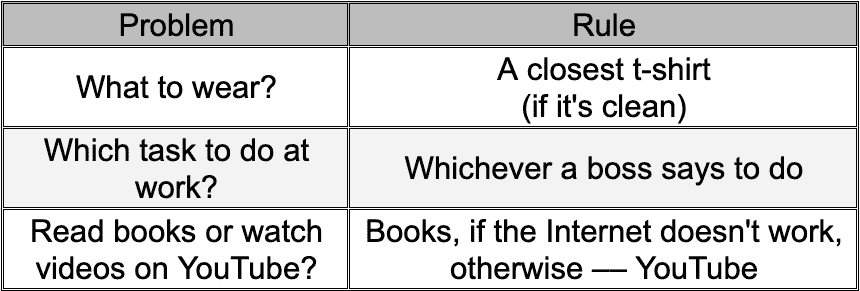
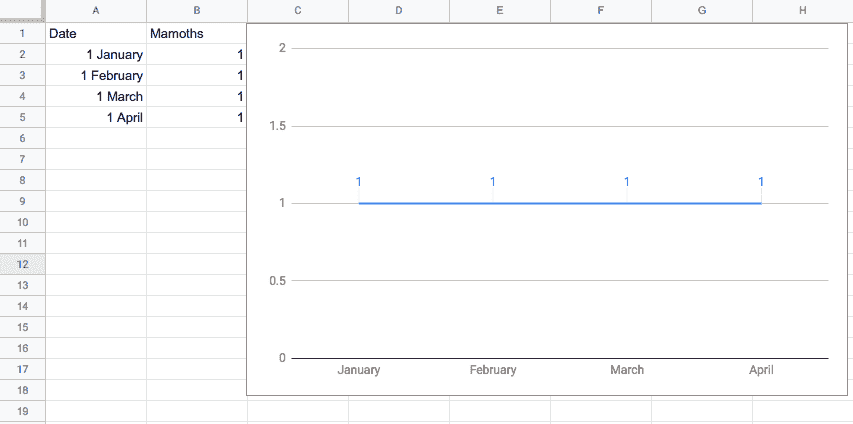
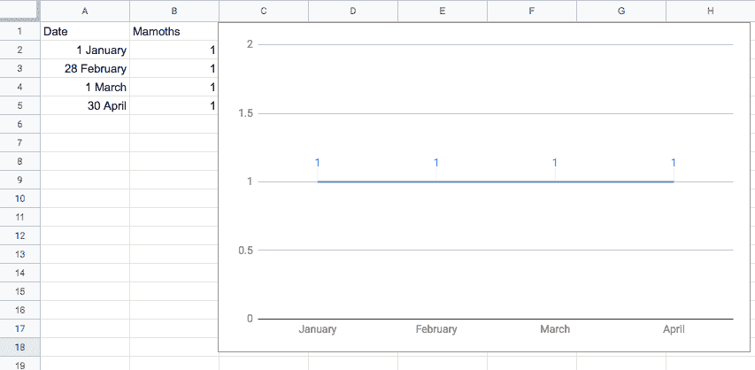
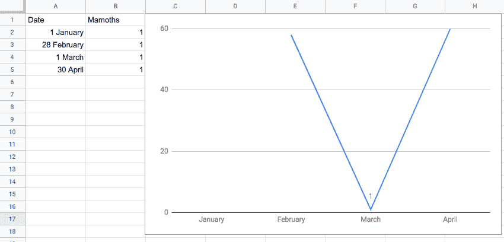
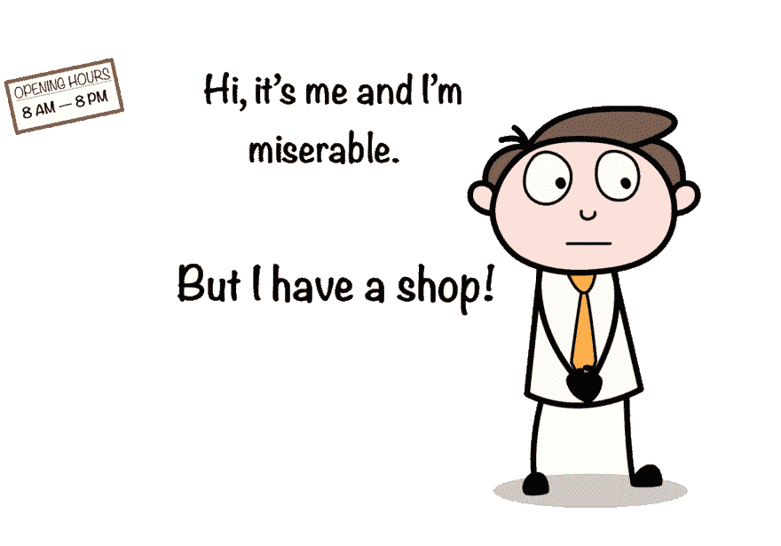
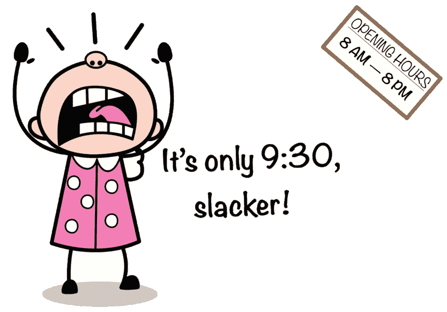

# 如何制定个人 SLA 在工作中找到平衡？(第一部分)

> 原文：<https://dev.to/_elergy_/personal-sla-balance-at-work-part-1-25mm>

11 个月前，我开始在我的电报频道上发布关于个人 SLA 的短信，但它是俄语的，你可能没有读过。

自从这个主题发表以来，我已经就它进行了几次非常有见地的讨论，所以我决定是时候写一篇文章并添加更多细节了，所以欢迎！

* * *

## 两条有用的原则

我的生活中有几个原则帮助我同时快乐和富有成效。其中之一就是“**要一致**”。
T3 是什么意思？

我们每天都需要做出决定:

1.  穿什么？
2.  上班做哪个任务？
3.  我应该读这本书还是多看 YouTube 上的视频？

做这些决定的过程是详尽的，人们通常不会在上面花太多时间。相反，我们建立规则和原则来遵循。每当类似的情况发生时，我们知道如何表现，所以它成为一个决定，然后删除数百个决定。

<figure> 

<figcaption>只是这种方法的一个例子。</figcaption>

没必要好虽然</figure>

这种方法有一个问题。我们无意识地发展了大部分原则，有时它们要么不可持续，要么不会导致预期的结果:

1.  简单地按照老板说的去做并不总是可持续的:如果我对做其他事情更感兴趣呢？–如果我有不同意见，想提出其他建议，该怎么办？–如果她要求太多，而我又没有时间做所有的工作怎么办？
2.  一直看 YouTube 很有吸引力，但从长远来看，如果我想完成我的博士学位，这可能不是最好的策略。
3.  如果我把所有的空闲时间都用来看书，我大概就没办法和妹妹聊新的迷因和猫视频了。

看起来即使我坚持做我想做的事，也不总是能把我带到我想去的地方。因此，我还有一个原则来解决这个问题:**找到正确的平衡**。

我甚至会重新排序:

——首先，**找到正确的平衡**

——然后，**保持一致**

现在我们可以进入主要部分了。

在其中，我们有一个与这两个原则密切相关的流行概念—**服务水平协议(SLA)。**

SLA 几乎可以适用于任何东西，包括移动应用、web 服务甚至硬件。但是它在科技行业之外有用吗？

是啊！此外，我认为 SLA 的某些方面可以帮助我们管理个人和职业生活，做出正确的决定，并与周围的人建立更好的关系。

如果您不熟悉术语 SLA，不要担心，稍后我会解释它。计划是这样的:

1.  这篇文章的其余部分将是关于个人 SLA 的一般概念和有用的方面。
2.  在下一篇文章中，我将讲述如何建立一个良好的个人 SLA，并将给出一些例子。

* * *

## SLA 的粗略解释

你们在日常生活中都遇到过 SLA，即使不知道。到处都是。

简而言之，这是提供服务的人和顾客之间的合同。服务提供商同意根据合同做一切事情。

<figure> 

<figcaption>【第一 SLA(大概)</figcaption>

</figure>

从这张图可以理解，它可能适用于任何领域。上图中的穴居人提供猛犸象狩猎服务——他是服务提供者。反过来，他的合伙人也是消费者。他们定义了一个简单的合同，只有一个条件——他应该每个月带一头猛犸象(假设他们已经有几个月了)。它还包括当要求没有得到满足时的制裁——他将不得不洗碗(让我们假设他们已经有盘子了)。一旦他们就这些条款达成一致，就定义了 SLA。

我们可以为电子邮件服务器、互联网提供商甚至当地商店制定 SLA。显然，线下商店的 SLA 会有不同于网站 SLA 的**指标**。

您可以在协议中包含您想要的任何内容，但是有些指标比其他指标更受欢迎。最常见的是**正常运行时间。**

正常运行时间——是某件事情工作的时间百分比。

> 示例:
> 
> 商店全年每天早上 8 点到晚上 8 点营业。
> 
> 一天 12 小时。
> 
> 这意味着这个特定商店的正常运行时间是 50%

是好是坏？

这要看这家店的客户和店主。这是可以的，如果每个人都开心，每个人的期望都很明确。

现在是时候告诉你关于 SLA 的三件事了:

1.  危险的
2.  违反直觉的
3.  最终，最糟糕的是

### SLA 的危险部分

乍一看，正常运行时间对于大多数情况应该是足够的。有时它甚至被用作 SLA 的同义词——你可能听说过“我们的 SLA 是 99.99%”这样的短语。

危险的是，一个度量标准永远不够。

让我们回到我们的穴居人，想想他们的 SLA。他承诺一个月带一头猛犸象来。我们可以称这个度量为**猛犸象:**

<figure> 

<figcaption>长毛象</figcaption>

</figure>

如果他每个月的第一天都带一头猛犸象来，那一切都没问题。但是如果他改变一点频率呢？

<figure> 

<figcaption>什么都没变，对吧？</figcaption>

</figure>

猛犸象比率是一样的——每个月一次。但是他的伴侣还像以前一样幸福吗？不确定。

为了更好地说明这一点，我们需要引入另一个度量: **DaysBetweenMammoths。**这是第一种情况下该指标的值:

<figure>

<figcaption>28–31 天之间长毛象</figcaption>

</figure>

这是第二个:

<figure> 

<figcaption>猛犸象之间 1–60 天</figcaption>

</figure>

人们总是擅长玩游戏和寻找解决方法。如果只有一个指标需要优化，即使整个世界都崩溃了，我们也总会找到方法去做。好的 SLA 不应该有这种倾向。

### SLA 中违反直觉的部分

大多数时候，人们认为 SLA 只是应该满足的最低要求。如果您的指标比 SLA 目标更好，那就没问题。

**这种认识可能会导致长期的巨大问题。**

> 在最好的情况下，指标应该尽可能接近 SLA。

有很多例子可以说明这个概念，我就从最简单的一个开始。

你还记得有一家商店有 50%的正常运行时间吗？是的，那家应该每天早上 8 点到晚上 8 点营业。

想象一下，店主除了在自己的店里工作，没有任何家人，朋友，爱好和其他事情可做。

大多数时间他只是工作到很晚。

这看起来是一个双赢的局面，因为客户很满意:

但是有一次，他在街上遇到了一只漂亮的小狗，并决定收养它。他不再熬夜工作了——新朋友在等着呢！因此，他像承诺的那样，正常工作时间是早上 8 点到晚上 8 点。符合 SLA 条款。

看起来是个快乐的结局，但并不是每个人在这个故事中都快乐:

### SLA 最糟糕的部分

现在是时候告诉你关于 SLA 最糟糕的事情了。

> 没有人关心它，而一切都很好。

商店的门上清楚地写着营业到晚上 8 点。

但比起那扇蠢门，我更相信自己的眼睛。

我知道它昨天晚上 10 点就开业了。上周也是。

我可以举一反三，我们都可以。所以我**知道**商店**一定**工作到很晚——这就是期望的工作方式。

> 都是体验的问题，不是合同里的文字问题。

不幸的是，不管是谁的错，现在店主的问题是如何处理失望的顾客。他设定了这些期望。

这只是一个假设的情况，但我有很多真实的例子，人们无意中设定了很高的期望，却无法实现。由于 SLA 是科技行业的术语，我的下一个例子就是关于它的。为了简单起见，我更改了一些细节和名称。

假设有两个程序员:**丹妮莉丝**和**肯德里克**。

丹妮莉丝建立了自己的服务，返回关于她拥有的龙的信息: