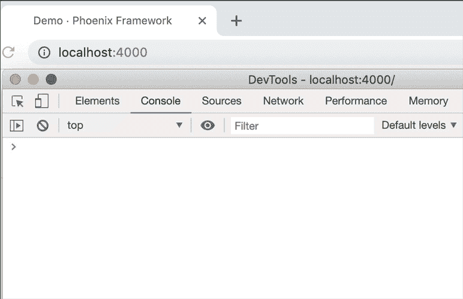
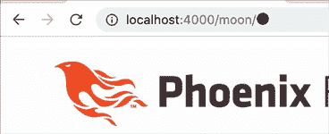
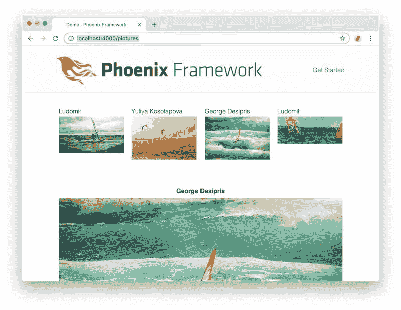

# Phoenix LiveView 推送状态支持–无需刷新页面即可更改 URL

> 原文：<https://dev.to/alvisesus/phoenix-liveview-pushstate-support-change-the-url-without-refreshing-the-page-og7>

[https://www.youtube.com/embed/Dad1mKexvu8](https://www.youtube.com/embed/Dad1mKexvu8)

**[通过邮件订阅获取免费教程](https://pages.convertkit.com/c021826e86/5ddcb20a27)** 。开始学习仙丹和凤凰建立功能和应用程序！

现在可以尝试 Phoenix LiveView 中的 *pushState* 支持(记住，它仍处于测试阶段)

[](https://res.cloudinary.com/practicaldev/image/fetch/s--aFCfPHcO--/c_limit%2Cf_auto%2Cfl_progressive%2Cq_auto%2Cw_880/https://www.poeticoding.com/wp-content/uploads/2019/06/liveview_pushstate_github_commit.png)

**什么是 *pushState* ，为什么会有用？**

使用 Phoenix LiveView，我们可以轻松地更新页面的各个部分，而无需更改位置、刷新页面或直接使用 JavaScript。

但是当页面内容改变时，URL 保持不变，使得用户很难标记或共享当前页面状态。

LiveView pushstate 支持正好解决了这个问题，在更改页面内容时，我们可以动态更新 URL，而无需刷新整个页面。

之所以叫`pushState`是因为它引用了 HTML5 History API 中的`history.pushState`函数，这个函数赋予了我们在浏览器的历史中改变 URL 和推送新页面的能力。

[](https://res.cloudinary.com/practicaldev/image/fetch/s--2JSRPC6M--/c_limit%2Cf_auto%2Cfl_progressive%2Cq_66%2Cw_880/https://www.poeticoding.com/wp-content/uploads/2019/06/history_javascript_pushState.gif)

在本文中，我们将使用两个不同的示例在 Phoenix LiveView 中测试这一功能:

第一个是实时视图，显示从 unsplash.com 拍摄的图片缩略图。当我们点击一个缩略图时，完整的图片显示在同一个页面上。我们将了解如何使用 LiveView pushState 支持来更新 URL，从而轻松共享一张特定的图片。

[](https://res.cloudinary.com/practicaldev/image/fetch/s--n8WgHKGW--/c_limit%2Cf_auto%2Cfl_progressive%2Cq_66%2Cw_880/https://www.poeticoding.com/wp-content/uploads/2019/06/liveview_pictures_pushstate-1.gif)

在第二个例子中，我们将看到一些不同的东西，一个带有表情符号的动画 URL。也许我们不会在真正的应用程序中使用它，但是构建它会很有趣。

[](https://res.cloudinary.com/practicaldev/image/fetch/s--MqVjr1C_--/c_limit%2Cf_auto%2Cfl_progressive%2Cq_66%2Cw_880/https://www.poeticoding.com/wp-content/uploads/2019/06/liveview_animated_url.gif)

你可以在[poeticoding/phoenix _ live _ view _ example](https://github.com/poeticoding/phoenix_live_view_example)GitHub repo 中找到这些例子，这是原[chrismccord/phoenix _ live _ view _ example](https://github.com/chrismccord/phoenix_live_view_example)的一个分支。

如果您还没有尝试过 LiveView，请订阅时事通讯，了解最新的 Elixir 和 Phoenix 内容。新的 LiveView 介绍性内容即将推出！

## LiveView 图片页面

在本例中，我们构建了一个简单的 LiveView 页面，其中显示了从 Unsplash 获取的图片缩略图列表。当我们点击缩略图时，完整的图片显示在页面中，并且 URL 被更新为唯一引用该特定图片的内容。

首先，我们在[lib/demo _ web/router . ex](https://github.com/poeticoding/phoenix_live_view_example/blob/6f1bc3ab4c96826e13aab538e032799a802df0a8/lib/demo_web/router.ex#L23)
中添加直播路由

```
defmodule DemoWeb.Router do

  scope "/", DemoWeb do

    live "/pictures", PicturesLive

  end
end 
```

然后我们创建文件[lib/demo _ web/live/pictures _ live . ex](https://github.com/poeticoding/phoenix_live_view_example/blob/6f1bc3ab4c96826e13aab538e032799a802df0a8/lib/demo_web/live/pictures_live.ex)文件，在这里我们定义了新的`DemoWeb.PicturesLive` LiveView 模块。

```
defmodule DemoWeb.PicturesLive do
  use Phoenix.LiveView
  alias DemoWeb.Router.Helpers, as: Routes

  @pictures %{
    "ySMOWp3oBZk" => %{
        author: "Ludomił", 
        img: "https://images.unsplash.com/photo-..."
      },
    ...
  }

  def render(assigns) do
    pictures = @pictures
    ~L"""
    <div class="row">
    <%= for {id, pic} <- pictures do %>
      <div class="column" 
       phx-click="show" phx-value="<%= id %>">
        <%= pic.author %>
        ">
      </div>
    <% end %>
    </div>

    <%= if @selected_picture do %>
      <hr>
      <center>
      <label><%= @selected_picture.author %></label>
      ">
      </center>
    <% end %>
    """
  end

  def mount(_session, socket) do
    socket = assign(socket, :selected_picture, nil)
    {:ok, socket}
  end

  def handle_event("show", id, socket) do
    picture = @pictures[id]
    {:noreply, assign(socket, :selected_picture, picture)}
  end

  defp picture_url(img, :thumb),
    do: "#{img}?w=250fit=crop"
  defp picture_url(img, :big),
    do: "#{img}?w=800&h=500fit=crop"

end 
```

为了简单起见，我们使用了一个映射`@pictures`，其中键是图片 id，值是一个带有`:img` URL 和`:author`名称的映射。

在底部，我们找到了一个多子句函数`picture_url/2`，通过将`w`、`h`和`fit`参数附加到`img` URL 字符串，我们使用它来获取缩略图和大图像 URL。

在`render/1`函数中，我们循环浏览`pictures`地图，显示缩略图并使其可点击。

```
def render(assigns) do
  pictures = @pictures
  ~L"""
  <div class="row">
  <%= for {id, pic} <- pictures do %>
    <div class="column" 
    phx-click="show" phx-value="<%= id %>">
     <%= pic.author %>
     ">
    </div>
  <% end %>
  ... 
```

因为`pictures`是一个映射，在*生成器*中，我们模式匹配键和值`{key, value} <- map`。

对于每张图片，我们使用`picture_url(pic.img, :thumb)`函数显示其缩略图，该函数返回缩略图的 URL。

使用`phx-click="show"`,我们可以点击带有作者姓名和图片的`div`。这意味着当用户点击元素时，一个“显示”事件被发送到 LiveView 进程，同时还有`phx-value`值。

该事件由`handle_event`函数处理。

```
def handle_event("show", id, socket) do
  picture = @pictures[id]
  {:noreply, assign(socket, :selected_picture, picture)}
end 
```

`id`参数是与`phx-value` HTML 属性一起传递的值。在这个函数中，我们使用`id`来获取图片地图，并通过`assign`将其发送给`:selected_picture`。

单击图片缩略图后，LiveView 会重新渲染视图。这一次，`@selected_picture`被绑定到一个图片地图(最初在`mount`函数中被设置为`nil`，所以 LiveView 使用`:big`图像呈现 HTML。

[](https://res.cloudinary.com/practicaldev/image/fetch/s--6MWk6vqj--/c_limit%2Cf_auto%2Cfl_progressive%2Cq_auto%2Cw_880/https://www.poeticoding.com/wp-content/uploads/2019/06/liveview_pictures_without_pushstate.jpg)

它可以工作，但是正如我们之前看到的，它不改变 URL，这使得很难共享页面状态。

## live_redirect 使用 pushState 更改 URL

现在让我们看看如何在不刷新页面的情况下更改 URL。
我们首先在[lib/demo _ web/router . ex](https://github.com/poeticoding/phoenix_live_view_example/blob/master/lib/demo_web/router.ex#L24)T3 中添加一条新路由

```
defmodule DemoWeb.Router do

  scope "/", DemoWeb do

    live "/pictures", PicturesLive
        live "/pictures/:id", PicturesLive

  end
end 
```

带有`:id`的新路由是通过在 URL 中传递图片 id 来触发的——在这种情况下，图片被选中。

回到我们的[图片直播](https://github.com/poeticoding/phoenix_live_view_example/blob/master/lib/demo_web/live/pictures_live.ex)模块，我们现在必须添加`handle_params/3`功能。

```
def handle_params(%{"id" => id}=_params, _uri, socket) do
  picture = @pictures[id]
  {:noreply, assign(socket, :selected_picture, picture)}
end 
```

在这个函数中，我们所做的正是我们在处理*秀*事件时所做的。当用户加载页面时，以及当用`live_link/2`和`live_redirect/2`改变 URL 时，在`mount/2`之后立即调用`handle_params`。

为了处理`/pictures`路由，我们在下面添加了另一个`handle_params`子句，在这里我们将`:selected_picture`设置为`nil`。

```
def handle_params(%{"id" => _uri, socket) do
 ...
end

# catchall
def handle_params(_, _uri, socket) do
  {:noreply, assign(socket, :selected_picture, nil)}
end 
```

我们现在更新`handle_event/3`函数

```
def handle_event("show", id, socket) do
{:noreply, 
  live_redirect(
    socket, 
      to: Routes.live_path(socket, DemoWeb.PicturesLive, id)
  )
}
end 
```

我们使用`live_redirect/2`将 URL 改为`/pictures/:id`(使用 *pushState* )，而不是分配图片(就像我们之前做的那样)。然后调用
`handle_params(%{"id" => id}, _uri, _socket)`，使用`id`来分配`selected_picture`。

[](https://res.cloudinary.com/practicaldev/image/fetch/s--n8WgHKGW--/c_limit%2Cf_auto%2Cfl_progressive%2Cq_66%2Cw_880/https://www.poeticoding.com/wp-content/uploads/2019/06/liveview_pictures_pushstate-1.gif)

## 动画网址🌝

现在让我们看看如何用 LiveView 和 emoji 在地址栏中创建一个动画。

正如我们对上一个示例所做的那样，我们添加了两条路由[lib/demo _ web/router . ex](https://github.com/poeticoding/phoenix_live_view_example/blob/master/lib/demo_web/router.ex#L26)

```
defmodule DemoWeb.Router do

  scope "/", DemoWeb do

    live "/moon", MoonLive
    live "/moon/:moon", MoonLive

  end
end 
```

并且我们在[lib/demo _ web/live/moon _ live . ex](//lib/demo_web/live/moon_live.ex)T3 中定义了`MoonLive`模块

```
defmodule DemoWeb.MoonLive do
  use Phoenix.LiveView
  alias DemoWeb.Router.Helpers, as: Routes

  @moons ["🌑", "🌒", "🌓", "🌔", "🌝", "🌖", "🌗", "🌘"]
  @moons_count Enum.count(@moons)

  def render(assigns) do
    ~L"""
    <button phx-click="start">start</button>
    <button phx-click="stop">stop</button>
    """
  end

  def mount(_session, socket) do
    {:ok, socket}
  end

  def handle_params(_, _uri, socket) do
    {:noreply, socket}
  end

  def handle_event("start", _, socket) do
    socket =
      socket
      |> assign(:moon_idx, 0)
      |> assign(:running, true)
    Process.send_after(self(), "next_moon", 100)
    {:noreply, socket}
  end

  def handle_event("stop", _, socket) do
    {:noreply, assign(socket, :running, false)}
  end

  def handle_info("next_moon", socket) do
    idx = rem(socket.assigns.moon_idx, @moons_count)
    moon = Enum.at(@moons, idx)

    socket = assign(socket, :moon_idx, idx + 1)

    if socket.assigns.running, 
    do: Process.send_after(self(), "next_moon", 100)

    {:noreply, 
    live_redirect(socket, 
    to: Routes.live_path(socket, DemoWeb.MoonLive, moon),
    replace: true)}
  end

end 
```

`@moons`是我们将在动画中使用的 8 帧列表`["🌑", "🌒", "🌓", "🌔", "🌝", "🌖", "🌗", "🌘"]`，每一帧都是表情符号。

[**render/1**](https://github.com/poeticoding/phoenix_live_view_example/blob/9df35e5b1eea9baa61dccd379b8a85364ab0d8d7/lib/demo_web/live/moon_live.ex#L8)
`render`非常简单:我们只有两个按钮，*开始*和*停止*。每个都向 LiveView 进程发送一个事件。

[**handle_event("start "，_，socket)**](https://github.com/poeticoding/phoenix_live_view_example/blob/9df35e5b1eea9baa61dccd379b8a85364ab0d8d7/lib/demo_web/live/moon_live.ex#L23)
点击*开始按钮*，我们向 LiveView 进程发送一个*开始*事件。该事件由`handle_event("start", _, socket)`处理，它将`:running`设置为`true`，并将`:moon_idx`初始化为`0`。我们将使用这个`:moon_idx`来知道我们在`@moons`列表的哪一帧。

使用`Process.send_after(self(), "next_moon", 100)`，我们向当前的 LiveView 进程(`self()`)发送一条延迟消息(100 毫秒)，开始动画。

[**handle_info("next_moon "，socket)**](https://github.com/poeticoding/phoenix_live_view_example/blob/9df35e5b1eea9baa61dccd379b8a85364ab0d8d7/lib/demo_web/live/moon_live.ex#L36)
*next _ moon*消息由`handle_info("next_moon", socket)`处理。

在这个函数中，我们得到了正确的帧

```
idx = rem(socket.assigns.moon_idx, @moons_count)
moon = Enum.at(@moons, idx) 
```

我们增加`:moon_idx`

```
socket = assign(socket, :moon_idx, idx + 1) 
```

我们检查`:running`是否仍然是`true`并且我们继续动画发送另一个延迟的`"next_moon"`消息，这将由相同的函数
处理

```
if socket.assigns.running, 
  do: Process.send_after(self(), "next_moon", 100) 
```

和前面的例子一样，我们使用`live_redirect/2`来更新 URL。我们传递`moon`，它是我们想要在地址栏
上显示的表情符号的字符串

```
{:noreply, 
 live_redirect(socket, 
   to: Routes.live_path(socket, DemoWeb.MoonLive, moon), 
   replace: true)
} 
```

使用`replace: true`选项，我们可以在不影响浏览器历史的情况下改变当前的 url。

[**handle_event("stop "，_，socket)**](https://github.com/poeticoding/phoenix_live_view_example/blob/9df35e5b1eea9baa61dccd379b8a85364ab0d8d7/lib/demo_web/live/moon_live.ex#L32)
点击 *Stop* 按钮，我们发送一个 *stop* 事件，`handle_event("stop", _, socket)`函数将`:running`设置为`false`，停止动画。

```
def handle_event("stop", _, socket) do
  {:noreply, assign(socket, :running, false)}
end 
```

[](https://res.cloudinary.com/practicaldev/image/fetch/s--MqVjr1C_--/c_limit%2Cf_auto%2Cfl_progressive%2Cq_66%2Cw_880/https://www.poeticoding.com/wp-content/uploads/2019/06/liveview_animated_url.gif)