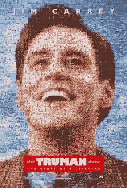
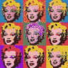
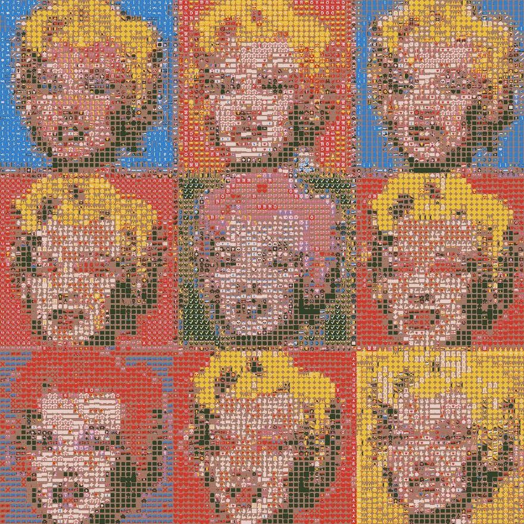

# 生锈的照片马赛克

> 原文：<https://dev.to/willdady/photo-mosaics-with-rust-546>

我记得小时候看过一张《星球大战》中尤达的海报，它是由电影中的各种截图组成的。我记得我被几个小图像如何排列成一个更大的图像，以及每个小图像的颜色如何有助于整个更大的图片所吸引。

自公元前 300 年以来，排列小彩色瓷砖来创造图像的想法就已经存在，以这种方式创造的艺术品被称为**马赛克**，T2 维基百科将其描述为:

> 由小块彩色玻璃、石头或其他材料组合而成的艺术品或图像。

虽然排列彩色瓷砖形成图像的技术已经存在了数百年，但照片马赛克是一种相对较新的艺术风格。

## 照片拼接

我记得第一次主流使用照片马赛克是在 1998 年电影《楚门的世界》的官方海报上。

<figure>

[](https://res.cloudinary.com/practicaldev/image/fetch/s--pgvFMeco--/c_limit%2Cf_auto%2Cfl_progressive%2Cq_auto%2Cw_880/https://s3-ap-southeast-2.amazonaws.com/media.willdady.com/2019/08/truman_poster.jpg)

<figcaption>A photo mosaic poster for The Truman Show (1998)</figcaption>

</figure>

你可以在下面的海报特写中看到，特别是金凯瑞的右眼，图像由电影中的各种场景组成。有趣的是，每块瓷砖都是着色的，而不是仅仅依赖于框架中的实际颜色。考虑到电影中可能没有那么多肉色米色的场景可供选择，这是一个可以原谅的变通办法。

<figure>

[](https://res.cloudinary.com/practicaldev/image/fetch/s--D9QR5fw3--/c_limit%2Cf_auto%2Cfl_progressive%2Cq_auto%2Cw_880/https://s3-ap-southeast-2.amazonaws.com/media.willdady.com/2019/08/truman_poster_eye.jpg)

<figcaption>A close-up of the poster for The Truman Show (1998)</figcaption>

</figure>

## 编写照片马赛克生成器

最近我一直在学习 Rust 编程语言，我认为创建一个照片马赛克生成器会是一个有趣的项目。Rust 是一种相对较新的系统编程语言，在性能方面类似于 C/C++。与其他低级语言相比，Rust 的独特之处在于它管理内存的方式。

我知道像这样的生成器需要大量的图像来进行采样。最初的计划是它只从表情符号中创建马赛克，这就是它的名字**表情符号** *(表情符号+马赛克=表情符号)*的由来，但随着我的进展，保持通用并让用户提供自己的瓷砖图像池变得更有意义。

与我之前的(也是第一个)Rust 项目[swirrer](https://github.com/willdady/swirlr)类似，我使用了来自 [crates.io](https://crates.io) 的依赖项，Rust 相当于 Node.js 的 NPM。我使用的主要库是 [image](https://crates.io/crates/image) ，用于加载操作图像和采样像素，以及 [clap](https://crates.io/crates/clap) 命令行参数解析器。

Emosaic 的工作原理是获取一个用作图块的图像目录和一个源图像。

```
emosaic /path/to/tiles/ source.png 
```

输出文件将作为`output.png`保存到当前目录，尽管可以通过`-o`选项提供自定义输出路径。输出总是 PNG 格式。

该应用程序首先读取 tiles 目录中的所有图像。每幅图像的像素被循环以找到每幅图像的平均颜色。我发现有必要排除超过 50%的像素完全透明的瓷砖，因为这些在最终输出中看起来不太好。然后图像的路径和平均颜色被添加到一个`Tile`结构中。然后，每个`Tile`结构被添加到一个`TileSet`结构中，该结构代表下一步要选择的所有可用图块。

接下来加载源图像，对于源图像中的每个像素，我们调用`TileSet`的`closest_tile(&self, rgba: Rgba<u8>) -> Tile`方法。这种方法的工作原理是简单地循环每个瓷砖，并比较颜色之间的距离。我们称之为*【距离】*，因为我们通过将每种颜色视为 3D 空间中的一个点来计算一种颜色与另一种颜色的接近程度。>【XYZ】(阿尔法被忽略)。然后将生成的图块添加到以像素颜色为关键字的地图中，这样后续查找可以简单地检查是否已经找到给定颜色的图块，这是一个特别有用的优化，因为 JPEG 等有损格式会经常重复颜色。

找到图块后，会将其复制到输出图像中的相同行/列坐标，并考虑所需的图块大小。平铺尺寸可以配置为可选的命令行选项`-t`，默认为 16。例如，100x100 的源图像会产生 1600x1600 (100 x 16 = 1600)的输出图像，因此源图像必须小。

## 进一步改进

我对这个结果非常满意，而且由于 Rust 的低级性质，它的速度非常快。例如，上面的玛丽莲·梦露图像是从 2625 个图块的目录中生成的，每个图块的尺寸为 64x64，源图像的尺寸为 100x100。在 2017 款 Macbook Pro 上，该命令大约在 **2.9** 秒内完成。

<figure>

[](https://res.cloudinary.com/practicaldev/image/fetch/s--yjup3hat--/c_limit%2Cf_auto%2Cfl_progressive%2Cq_auto%2Cw_880/https://s3-ap-southeast-2.amazonaws.com/media.willdady.com/2019/08/warhol.jpg)

<figcaption>100x100 source image</figcaption>

</figure>

可以进行一些进一步的优化，例如将 TileSet 缓存到磁盘，这样程序就不需要在每次运行应用程序时读取潜在的数千个 tile 图像。此外，在编写的时候，它没有像上面的楚门秀例子一样提供一个选项来“着色”输出图像。

总的来说，我真的很喜欢铁锈。它有一个非常陡峭的学习曲线，但一旦借款检查停止抱怨，这是值得的。很高兴能有信心，如果应用程序编译，它将安全运行。我发现像这样的小项目是熟悉一门新编程语言的好方法。

请随意在 github 上查看 emosaic 的完整源代码。

##  [威廉迪](https://github.com/willdady) / [埃莫萨奇](https://github.com/willdady/emosaic)

### 用 Rust 写的马赛克图像生成器！

<article class="markdown-body entry-content container-lg" itemprop="text">

# 马赛克

用[写的马赛克生成器生锈了！](https://www.rust-lang.org/)

[](https://raw.githubusercontent.com/willdady/emosaic/master/example/warhol.png?raw=true)

## 建筑物

要构建[，请确保您已经安装了 rust】。](https://www.rust-lang.org/tools/install)

```
cargo build --release 
```

编译后，可以在存储库根目录的`target/release/emosaic`处找到二进制文件。

## 使用

该命令需要一个包含方形“平铺”图像和源图像的目录路径。

```
emosaic /path/to/tiimg/ source.png 
```

### 模式

用于生成马赛克的策略由`-m, --mode`选项控制。

#### 1 对 1(默认)

对于源图像中的每个像素，将发出具有最接近匹配平均颜色的图块。

假设源图像的尺寸为 100x100，默认平铺尺寸为 16，则输出图像将为 1600x1600。

#### 4 对 1

对于每 2×2 像素，将发射一个图块。瓷砖被分成 2×2 的片段，并且存储每个片段的平均颜色。将选择在每个段中平均颜色最接近目标像素的图块。这种模式…

</article>

[View on GitHub](https://github.com/willdady/emosaic)