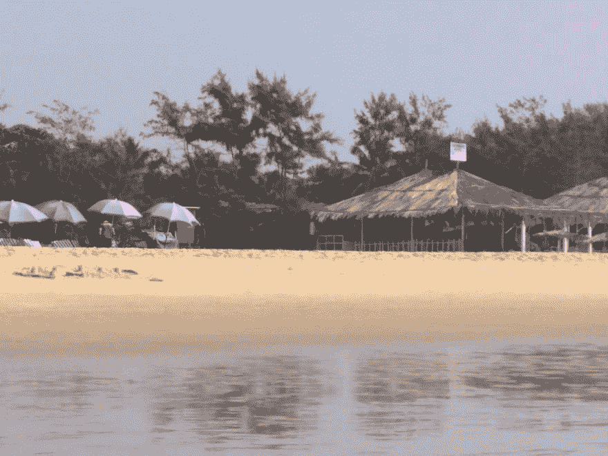
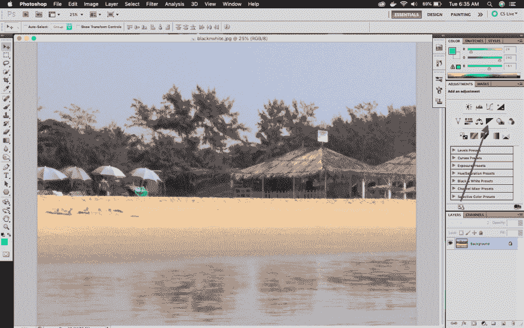
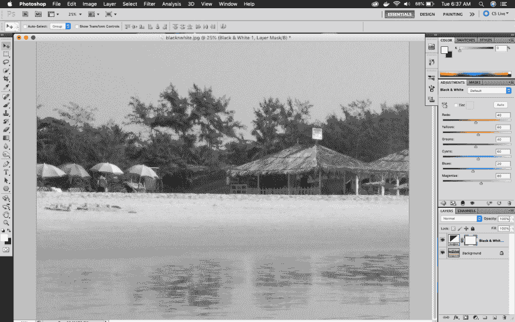
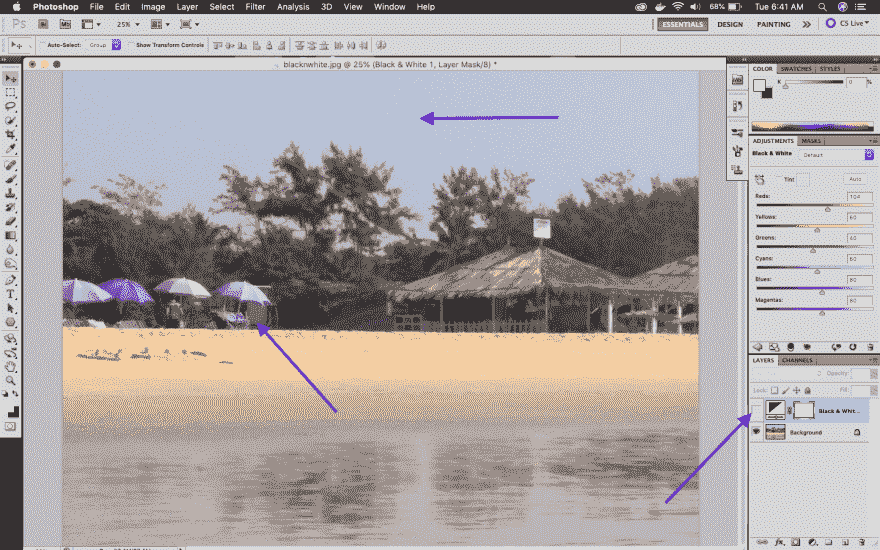
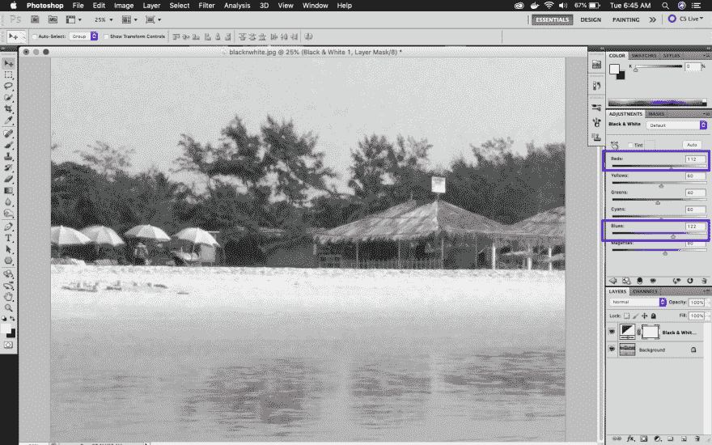
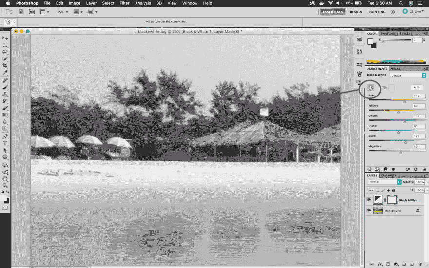
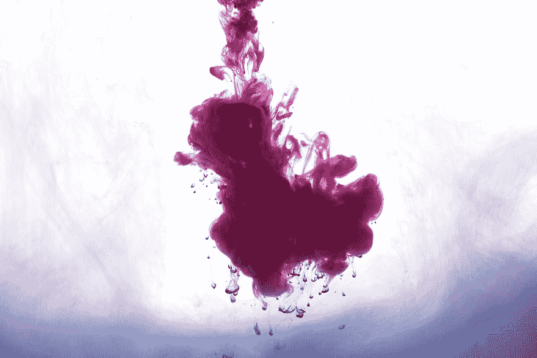
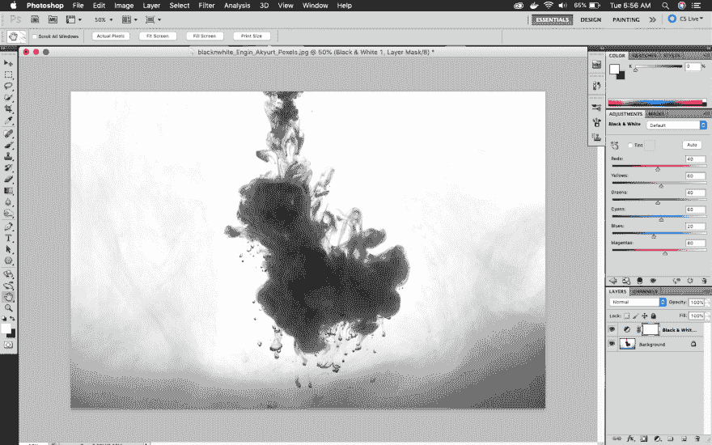
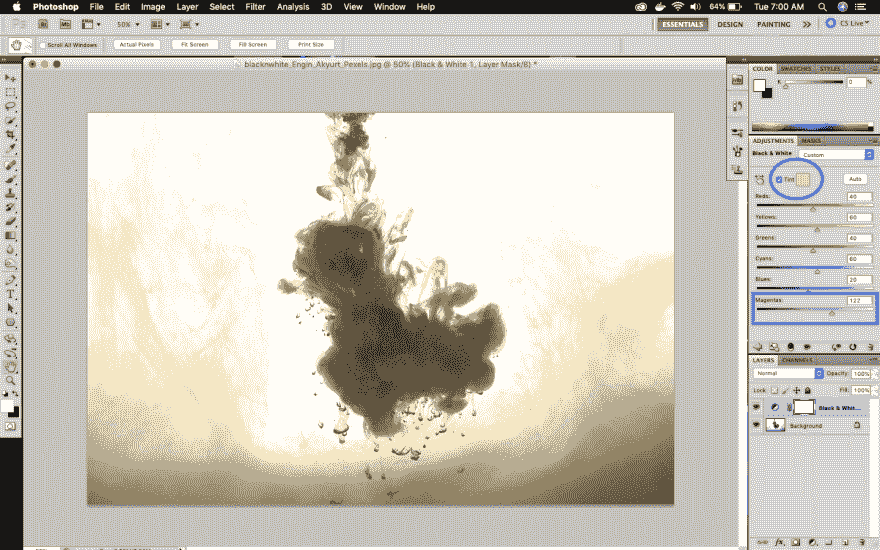
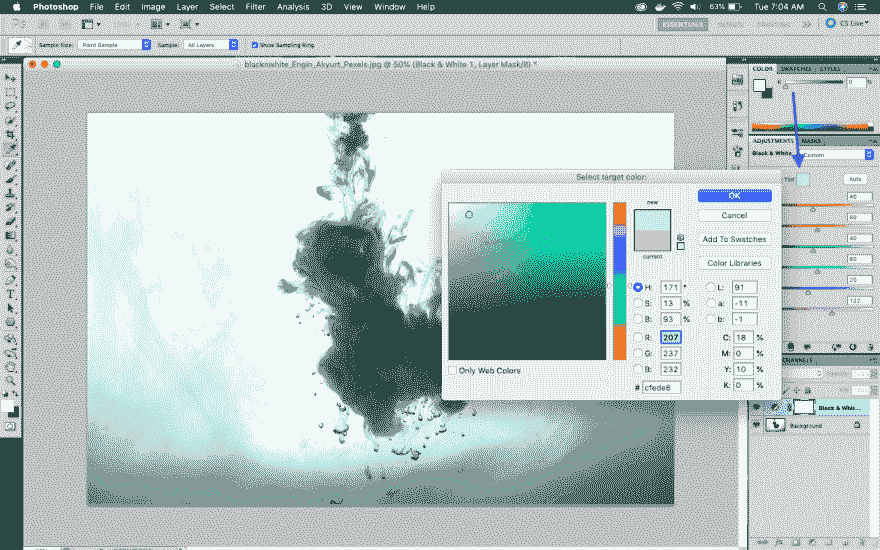

# 面向网络开发人员的 PhotoShop

> 原文：<https://dev.to/nabendu82/photoshop-for-web-developers-3-2kp2>

欢迎来到本系列的第 3 部分。这个系列中的大部分内容都来自丹的 Udemy 上的 Photoshop 课程。

### 使图像黑白化

这个是经典的，经常使用。很多时候，网站需要黑白大图来与网站融合。然后我们在谷歌上找到了这张漂亮的图片，但它是彩色的。我们可以用下面的方法把它变成黑白的。

我们将使用我的果阿之旅中的这张美丽的照片，并把它变成黑白的。

 *果阿海滩*

首先在 PhotoShop 中打开图像，在调整选项卡中点击**黑色&白色**图标。

 *黑色&白色*

当你点击它的时候，图像会变成黑白的。如果你对此满意，你可以跳过这一部分的其余部分。但如果你想让它更经典，那就跟着做吧。

 *黑色&白色*

在黑白选项卡中，您可以看到许多不同颜色的滑块。它们实际上是你照片上的颜色。关闭你的黑白层的眼睛来看原始图片。我们可以在图片中看到一个红色的小屋，天空也是蓝色的。

 *天蓝*

因此，我们再次打开眼睛，拖动红色和蓝色的滑块，直到我们发现它很好。

 *红色和蓝色*

还有一种方法可以使黑色变暗或变亮，那就是手指和箭头图标。点击它，并把它带到图像上，按住鼠标左键并拖动该部分，向右或向左。我们想改变图片中的绿树，所以我们拖动它们。

 *拖动修改*

我们接下来将工作下面的墨水飞溅，并使其成为经典的黑色和白色等。

照片由 [Pexels](https://www.pexels.com/photo/abstract-acrylic-arts-background-1667646/?utm_content=attributionCopyText&utm_medium=referral&utm_source=pexels) 的 [Engin Akyurt](https://www.pexels.com/@enginakyurt?utm_content=attributionCopyText&utm_medium=referral&utm_source=pexels) 拍摄

我们按照我们通常的黑白程序拍摄这张照片。

 *经典黑白*

我们可以像以前处理海滩照片一样，调整红色、黄色和青色。如果你想改变品红色，因为墨水主要是品红色。

但是我们将学习如何从这张黑白图片中创建一个淡色。点击手旁边的色调，它会变成美丽的黄色。我们将调整 Magentas 一点，因为你记得我们的图像最初是洋红色。

 *黄色效果*

我们也可以通过单击 Tint 旁边的颜色来更改此颜色。它会打开一个调色板来选择。

 *蓝色效果*

本系列的第 3 部分到此结束。回头见。