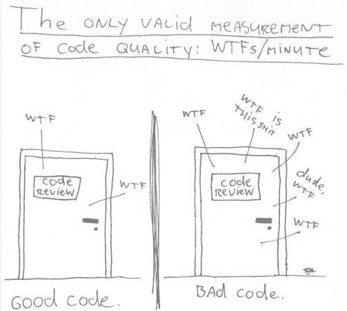
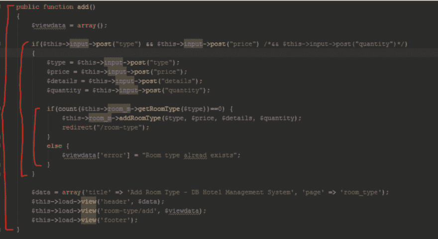
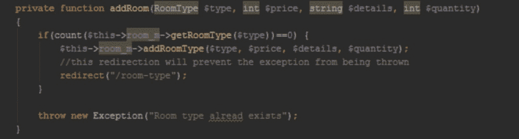
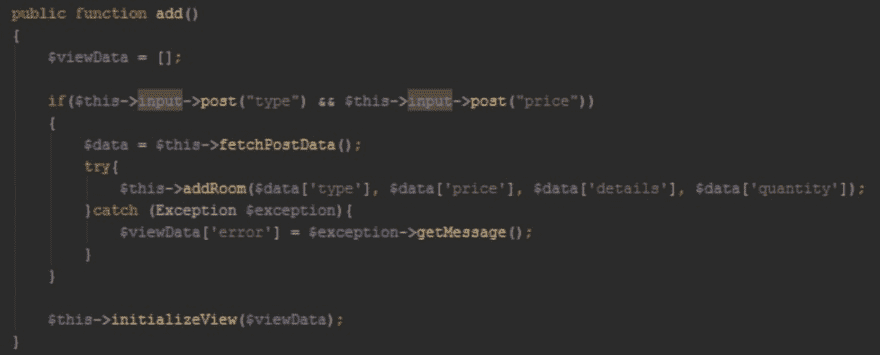
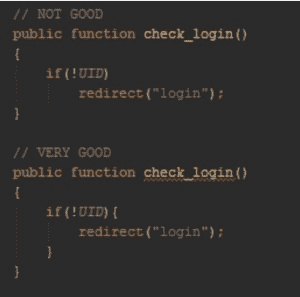
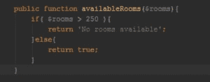
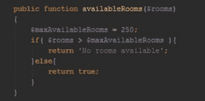
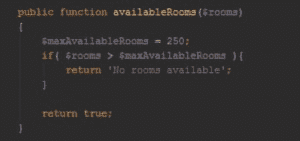
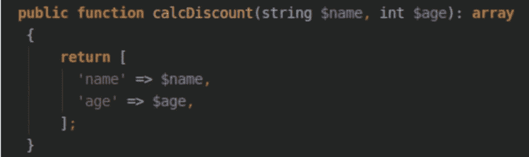
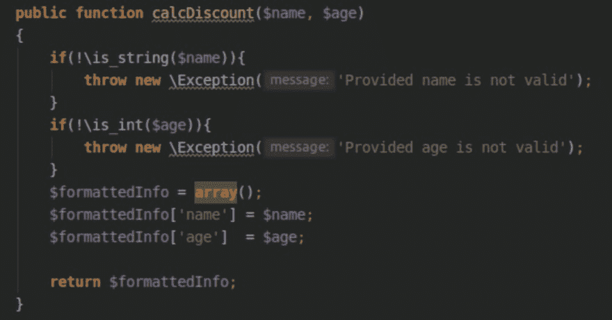

# 重构您的遗留 PHP 代码(来自实际项目的示例)

> 原文：<https://dev.to/petrovichevsergey/php-2b48>

穆罕默德·阿拉丁·穆罕默德·阿拉丁[培养基](%5Bhttps://medium.com/hackernoon/refactor-your-php-legacy-code-real-projects-examples-da9edf03ff4b%5D(https://medium.com/hackernoon/refactor-your-php-legacy-code-real-projects-examples-da9edf03ff4b))

> 图片来自 osnews.com

好的开发人员由其代码质量决定。在软件行业，写好代码意味着可以在测试、更新、扩展或纠错方面投入的成本节约。在本文中，我将向您展示一些技术人员和想法的真实例子，帮助您清理您的遗留代码，并对其进行重组，使其更加可靠和模块化。这些方法不仅能帮助你重组你的旧代码，还能为你提供现在如何编写纯代码的绝佳思路。

# t0t 1 什么是重构，为什么要重构？

重构是指帮助您编写纯代码的方法和步骤。这对其他开发人员来说很重要，他们可以阅读、扩展和重用代码，而不必对代码进行很多编辑。

下面，我将向您展示一些重构遗留代码的例子，并使之更好。

# t0t 1 从不重构没有 unit 测试的代码

我的第一个建议是永远不要开始重构没有适当 unit 测试的遗留代码。我假设原因很明显:你会留下很难修复的破碎功能，因为你无法理解什么是破碎的。因此，如果你需要重组它，首先从测试它开始。确保您要回收的部分被测试复盖。T0 检查 t1 phpunit 测试代码复盖率分析。

# t0t 1 从您代码的最深点开始重构

请看下面的图片。这是我在 Github 上找到的 t0t 1 酒店管理系统的真正设计。这是一个真正的开源项目，所以封闭源可能是最糟糕的。

> 示例:首先重构最深的点

如您在此方法中所见，有三个级别标为红色。最深的点必须是第一个 if 条件内的嵌套 if / else 语句。通常，最深的点集中在一个逻辑上，从而便于重构。

# t0t 1 将您的方法缩减为较小的方法或配置文件/数据库表。

也许在这种情况下，我们可以按如下方式将其提取到私人方法中:

> 让你的功能变短

下一个深点将是岗位数据采样和浏览下载。现在，看看其他部分重构后的 add()方法。它干净多了，读和测试更好。

> 示例:首先重构最深的点

# t0t 1 始终在 if 操作员中使用

大多数 t0t 1 编程语言都支持单行 if 语句，一些开发人员使用这些语句是因为它们很简单，但不太容易阅读，也很容易出现问题，因为只有一个空行可能会违反条件并开始失败。看看两个例子的区别:

> 示例:使用大括号

# t0t 1 不要使用魔法数字或魔法字符串:

在以下示例中，您将注意到，如果房间大于 250，将返回一条错误消息。在这种情况下，250 被视为神奇数字。如果你不是写这个的开发人员，你将很难理解这个数字是多少。

> 示例:神奇数字

要重组这种方法，我们可以找出 250 是最大房间数。因此，我们可以将其提取到$maxAvailableRooms 变量中，而不是硬编码。现在，代码对其他开发人员变得更容易理解。

> 范例:修正魔术数

# 除非您要求，否则不要使用 else 运算符:

在 availablerooms()的相同函数中，您注意到了 if 语句，在该语句中，我们可以轻松地消除其余部分，逻辑将保持不变。

> 示例:忽略 else 语句

# t0 t1 为您的方法、变量和测试使用有意义的名称

在以下示例中，您可以看到从酒店管理系统中有两种方法，称为 index()和 room_m()。就我个人而言，我无法确定他们的目标是什么。我想如果他们的名字是描述性的，会更容易理解。

> 示例:方法名称不正确

# t0t 1 最大限度地利用您的编程语言功能

许多开发人员没有充分利用他们所编写的编程语言的功能。其中许多功能可以为您节省大量的精力，并使您的代码更加可靠。看看下面的例子，注意仅仅使用类型提示，用较少的代码实现同样的结果是多么容易。

我想用一些更短的提示来结束，以便更好地编写代码:T1

*   使用新的数组形式[]而不是旧的(array)。
*   如果要检查数据类型，请使用==而不是==运算符。
*   给公共方法提供简短的描述性名称总是有用的。私有方法的名称可能更长，因为它们的范围有限。
*   仅与实现接口的方法(如 add())共享名称，并对单个 addUser()或 adddocument()类的方法使用描述性名称。
*   从您的类中删除未使用的方法。
*   使用 is / has 前缀，其中包含返回布尔值的函数，例如:isAdmin(\$user)、hasper mission($ user)。
*   在类的方法和属性中始终使用访问修饰符。
*   请小心，不要堵塞接口:只使用用户可以公开使用的方法。
*   组织类方法，使公共方法位于顶部。
*   始终将单一责任的概念应用于你的班级。