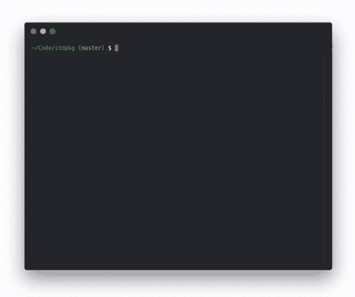

# @pika/pack -发布很棒的 npm 包。

> 原文：<https://dev.to/pika/pika-pack-publish-great-npm-packages-3dnh>

*注:这篇文章最初发表于 [pika.dev](https://www.pika.dev/blog/introducing-pika-pack/) 。*

如果您最近向 npm 发布了一个包，您就会知道现代构建过程中要做多少工作。Transpile JavaScript，编译 TypeScript，将 ES 模块语法(ESM)转换为 Common.js，配置您的 package.json 清单...这只是最基本的。

网络浏览器和捆绑器呢？你的[包是为他们](https://github.com/marmelab/react-admin/issues/2204)优化的吗？用户可以从 [UNPKG](https://unpkg.com/) 加载你的包吗？它包括给 VSCode & TypeScript 用户的[类型定义](https://codeburst.io/https-chidume-nnamdi-com-npm-module-in-typescript-12b3b22f0724)吗？是不是已经[剥离了所有不必要的文件](https://medium.com/@jdxcode/for-the-love-of-god-dont-use-npmignore-f93c08909d8d)尽可能的小？您的用户关心这些优化，但是它们都需要更多的知识、配置、工具、时间和精力来做好。

### @pika/pack 构建令人惊叹的软件包，无需麻烦:

*   简单的⚡️使用预先配置的插件来构建你的整个包。
*   **灵活**🏋️‍♀️选择符合你需求的插件和优化。
*   **整体性** ⚛️让我们处理您的代码、资产、 ***和*** package.json config。

## 包建立管道

[@pika/pack](https://github.com/pikapkg/pack) 连接预先配置好的插件，为你构建和优化你的包。插件将已经流行的工具如[巴别塔](https://babeljs.io/)和 [Rollup](https://rollupjs.org/) 包装成已经为 npm 优化的选项。这使得@pika/pack 无需太多(如果有的话)配置就可以构建您的包。

***@pika/pack 甚至自动为您的包创建并配置 package.json 清单。*T3】**

这是因为 [@pika/pack](https://github.com/pikapkg/pack) 构建了你的整个包:代码、资产，甚至 package.json 清单。通过构建整个包，您最终得到了一个完全构建好的`pkg/`目录，可以发布了。像“main”、“module”、“umd:main”、“types”、“unpkg”这样的入口点，甚至像“sideEffects”和“files”这样的高级选项都是由您的构建插件处理的。

入门很简单:

```
// 1\. Install @pika/pack!
$ npm install -g @pika/pack // 2\. Add this to your package.json manifest:
"@pika/pack": {"pipeline": []},
// 3\. Run @pika/pack!
$ pack build 
```

😎 🆒

那现在怎么办？如果您用空管道运行`pack build`，您将得到一个空的包。那不是很有用。

首先，这里是我们最喜欢和 [@pika/pack](https://github.com/pikapkg/pack) 一起做的五件事:

### 1。默认发布 Modern，ES2018 JavaScript 行)

```
"@pika/pack": {
    "pipeline": [
        ["@pika/plugin-standard-pkg", {"exclude": ["__tests__/**/*"]}]
    ]
} 
```

大多数包会使用的第一个插件是[@ pika/plugin-standard-pkg](https://github.com/pikapkg/builders/tree/master/packages/plugin-standard-pkg)。这是我们的标准[“源”构建器](https://github.com/pikapkg/builders#source-builders)，可以构建任何符合最新 ES2018 语言规范的 JavaScript &类型脚本源代码。默认支持 TypeScript，你本地`.babelrc`的任何自定义 Babel 插件都会自动使用(该插件由 Babel 内部提供动力)。

这为我们管道的其余部分提供了一个标准的 ES2018 构建目标。额外收获:您的一些用户可能支持现代 JavaScript，并且可以直接利用这个 ES2018 发行版来获得更小、更快、更精简的包。

### 2。发布 Node.js &网络优化版本(每一行一行)

```
"@pika/pack": {
    "pipeline": [
        ["@pika/plugin-standard-pkg"],
        ["@pika/plugin-build-node"],
        ["@pika/plugin-build-web"]
    ]
} 
```

创建您的现代 ES2018 版本后，向您的包添加 Node.js 和 web 优化的发行版变得很简单。 [@pika/plugin-build-node](https://github.com/pikapkg/builders/tree/master/packages/plugin-build-node) 将 transpile 一个 Node.js-ready 发行版运行在任何支持的 Node.js 版本上。 [@pika/plugin-build-web](https://github.com/pikapkg/builders/tree/master/packages/plugin-build-web) 将构建一个更现代的 ES module (ESM)发行版:针对 bundlers 进行了优化，并编译为在所有原生支持 ESM 语法的浏览器上运行。

两个插件都在内部使用 Rollup，但是你不需要自己配置任何 bundler 逻辑。只用三行 JSON 代码，您就可以得到一个针对两个最流行的 JS 平台进行了完全优化的包。因为 [@pika/pack](https://github.com/pikapkg/pack) 构建了您的整个包，所以您的 package.json 清单会自动为您配置“main”、“module”和“esnext”入口点。

### 3。自动生成类型脚本定义(1 行)

```
"@pika/pack": {
    "pipeline": [
        ["@pika/plugin-standard-pkg"],
        ["@pika/plugin-build-node"],
        ["@pika/plugin-build-web"],
        ["@pika/plugin-build-types"]
    ]
}, 
```

有了 [@pika/pack](https://github.com/pikapkg/pack) ，由于有了 [@pika/plugin-build-types](https://github.com/pikapkg/builders/tree/master/packages/plugin-build-types) 插件，每个包都会自动获得`.d.ts` TypeScript 定义文件。即使您正在编写 JavaScript，这个插件也会使用 TypeScript 从您的 JavaScript & JSDoc 中自动生成类型定义！

### 4。出版 WASM！或者理智，或者铁锈，或者 C++，或者...(1-2 行)

```
"@pika/pack": {
    "pipeline": [
        ["@pika/plugin-wasm-assemblyscript"],
        ["@pika/plugin-wasm-bindings"]
    ]
}, 
```

管道概念简单而灵活。如此灵活，以至于您的包源代码甚至不需要 JavaScript:

*   [@ pika/plugin-source-bucklescript](https://github.com/pikapkg/builders/tree/master/packages/plugin-source-bucklescript)-通过 BuckleScript 将 OCaml 编译成 ES2018 JavaScript 的原因
*   [@ pika/plugin-wasm-assemblyscript](https://github.com/pikapkg/builders/tree/master/packages/plugin-wasm-assemblyscript)-通过 assembly script 编译类型脚本到 wasm
*   [@ pika/plugin-wasm-emscripten](https://github.com/pikapkg/builders/issues/1)-通过 Emscripten 编译 C/C++到 wasm(即将推出！).
*   [@ pika/plugin-wasm-bindings](https://github.com/pikapkg/builders/tree/master/packages/plugin-wasm-bindings)-为任何生成的 wasm 添加简单的 JavaScript 绑定。

### 5。自动增强您的包(1 行)

```
"@pika/pack": {
    "pipeline": [
        ["@pika/plugin-standard-pkg"],
        ["@pika/plugin-build-node"],
        ["@pika/plugin-simple-bin", {"bin": "my-cli"}]
    ]
} 
```

构建插件也可以以一些真正令人兴奋的方式增强现有的构建。我们现在最喜欢的增强是 [@pika/plugin-simple-bin](https://github.com/pikapkg/builders/tree/master/packages/plugin-simple-bin) ，它将一个简单的 CLI 包装器注入到任何包中，并将 package.json 配置为自动指向它。

我们使用@pika/pack 来构建@pika/pack，并且我们专门使用这个插件来[添加一个命令行界面](https://unpkg.com/@pika/pack@0.3.0/dist-node/index.bin.js)，而没有 package.json 配置和设置的麻烦。

我们迫不及待地想看看这个包装概念的可能性，特别是对于 CLIs:失败时自动重启程序，运行后检查包更新，记录使用统计...可能性是无穷无尽的！

## 发布您的包

<video><source src="https://www.pika.dev/static/img/publish-demo.mp4" type="video/mp4">[](https://res.cloudinary.com/practicaldev/image/fetch/s--VKlR9MGc--/c_limit%2Cf_auto%2Cfl_progressive%2Cq_66%2Cw_880/https://www.pika.dev/static/img/publish-demo.gif)T6】</video>

发布您的包应该像构建它一样简单。所以我们把 [np](https://github.com/sindresorhus/np) (一个自称“更好的 npm 发布”)中自己喜欢的部分带到了 [@pika/pack](https://github.com/pikapkg/pack) 。有了`publish`命令，就不需要担心如何发布你构建的包。只需在您的顶层项目中运行`pack publish`，@pika/pack 将带您完成剪切新版本并发布您的包。

它甚至在末尾包含了一个方便的 unpkg.com，这样你可以立即查看你的新包。

## 今天试试@pika/pack！

```
npm install -g @pika/pack 
```

不要等待，在你的下一个包中尝试 [@pika/pack](https://github.com/pikapkg/pack) (或者任何可以在 2019 年升级的旧包)。当你这样做的时候，[请让我们知道进展如何！](https://twitter.com/pikapkg)

Pika 是一个推动 JavaScript 生态系统向前发展的项目。Pika 的使命是通过使在 npm 上查找、发布、安装和使用现代包变得更容易，使现代 JavaScript 变得更容易接近。希望@pika/pack 让我们向那个目标更近一步。

*   [了解更多关于 Pika 项目的信息→](https://dev.to/about)
*   [在 Twitter 上关注我们的更新→](https://twitter.com/pikapkg)

## 已经使用@pika/pack 的项目

*   [react-async](https://github.com/ghengeveld/react-async) -灵活的基于承诺的 react 数据加载器。
*   [钩子焦点](https://github.com/michael-klein/hookuspocus) -所有功能的钩子！
*   [foundationjs](https://github.com/jvdsande/foundationjs) -全功能 NodeJS 框架。
*   [graphql-rest-proxy](https://github.com/acro5piano/graphql-rest-proxy) -把你的 REST API 变成 graphql。
*   [custom-attributes](https://github.com/matthewp/custom-attributes) -用定义定制元素的方式定义定制属性。
*   [@pika/pack](https://github.com/pikapkg/pack)&[@ pika/web](https://github.com/pikapkg/web)——没错，我们甚至[用@pika/pack](https://github.com/pikapkg/pack/blob/1034a2f5a36ee8664ee139508f8726892534f65d/package.json#L6-L27) 来[打造@ pika/pack！](https://unpkg.com/@pika/pack/package.json)🤯
*   还有几百个！[查看我们的全套示例&启动项目→](https://github.com/pikapkg/examples)
*   你在一个包里用过@pika/pack 吗？[请告诉我们](https://twitter.com/pikapkg)，我们会将您的套餐添加到列表中！