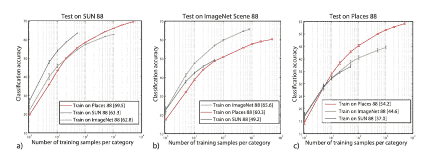

# 场所和空间:一个巨大的图像数据集

> 原文：<https://dev.to/zmbailey/places-and-spaces-a-giant-image-dataset-3n9o>

*对由周、Agata Lapedriza、肖、Antonio Torralba 和 Aude Oliva* 提出的论文[的解释](http://places.csail.mit.edu/places_NIPS14.pdf)

视觉分类器和对象检测变得越来越重要。我们都见过用边界框检测汽车、人或其他物体的图像的例子。但是创建这些程序需要由成千上万的图像组成的巨大数据集。这些数据库来自哪里？它们是如何组合在一起的，如何确定它们是否有用？地名数据库就是其中之一，本文阐述了周等人建立地名数据库的过程，并对其功效进行了判定。

然而，在我们到达目的地之前，让我们看一下一些现有的数据库。场景分类的第一个基准是一个名为 Scene15 的数据库。场景 15 只有 15 个类别，每个类别几百个。麻省理工学院的 Indoor67 数据库有 67 个类别，但仅限于室内场所。SUN 数据库有 397 个类别，每个类别有 100 多个图像。与 ImageNet 相比，所有这些都相对较小。ImageNet 是一个巨大的数据库，但它是以对象为中心的，只有比例很小的场景类别。

这就是地点的概念产生的地方。Places 是一个以场景为中心的数据库，包含 476 个地点类别的 700 多万张图片。这是迄今为止最大的场景和地点图像数据库，也是第一个大到足以用于需要大量数据的训练程序的场景数据库。

### 创建数据库

首先从 SUN 数据库中提取类别，给出一组基本的位置类型。这些类别然后与形容词结合，并通过三个不同的搜索引擎运行:Flickr、Google Images 和 Bing Images。这些图片必须足够大才有用，因此任何小于 200x200 像素的图像都会被丢弃。

此时，我们需要为取自几个数据库的样本指定名称，这些样本将在测试过程中使用。
**地点 205** 有 205 个类别，总共有 5000+张图片。
**第 88 位**，拥有与 ImageNet 相同的 88 个类别，以及至少 1000 张图片。

取自 SUN 和 ImageNet 的类似集合称为 **SUN 205** 和 **SUN 88** ，以及 **ImageNet 205** 和 **ImageNet 88** 。

### 测量数据库

数据库的质量可能取决于它被用来执行的任务。一般来说，一个好的数据库应该是密集和多样的。但是这些术语实际上是什么意思呢？在我们使用它们作为衡量标准之前，定义它们是很重要的。

对于一个图像集，高密度意味着任何给定的图像最有可能具有相似的邻居。但是你不能仅仅根据密度来衡量数据集的质量。那么什么是多样性呢？多样性由从数据库中随机选择的任意两幅图像将来自同一类别的概率来确定。

#### 密度和多样性

为了测量密度和多样性，工作人员会看到成对的图像，并被要求选出最相似的一对。实验之间的唯一区别是配对是如何产生的:
对于多样性配对是随机选择的随机抽样。对于密度对，选择更可能在视觉上相似的。

所有三个数据集被证明具有相似的密度，但在多样性上有较大的差异。Places 的多样性最高，相对多样性为 0.83，ImageNet 的多样性为 0.67，SUN 的多样性为 0.5。这三个类别中多样性变化最大的是操场、走廊和等候室。

#### 跨数据集泛化

在所有三个数据库上训练单独的模型，然后在每个数据库上测试所有三个模型。在每种情况下，当限制到相同数量的训练样本时，来自相同数据库的训练和测试提供了最好的结果。然而，Places 数据库很大，所以当使用了所有的训练数据时，它在三个数据库中的两个上获得了最好的分数。

###### *来源:[学习场景深度特征
识别使用地点数据库](http://places.csail.mit.edu/places_NIPS14.pdf)*

### 训练神经网络进行场景识别和深度特征

下一步是表明，与使用 ImageNet 数据库的网络(称为 ImageNet-CNN)相比，使用 Places 数据库训练的卷积神经网络可以实现对以前以场景为中心的基准的显著改进。

使用来自 205 类地点的 2，448，873 幅图像作为训练集来训练地点-CNN。这个训练集每个类别有 5，000 到 15，000 个图像。测试集每个类别有 200 个图像，验证集每个类别有 100 个图像。

#### 深层特征的可视化

为了更好地理解 ImageNet-CNN 和 Places-CNN 之间的区别，我们将研究网络各层的响应。我们使用来自 ImageNet LSVR2012(包含 100，000 张图像)和 SUN397(包含 108，754 张图像)的测试集组合来创建两个网络的输入。

在 Places-CNN 被训练之后，最终的层输出(Soft-max)可以用于分类图像。为此，我们使用地点 205 和太阳 205 的测试集。

**Places-CNN** 在 Places 205 上的准确率为 50.0%，在 SUN 205 上的准确率为 66.2%。 **ImageNet-CNN** 在 Places 205 上的准确率为 40.8%，在 SUN 205 上的准确率为 49.6%。
排名——CNN 在两组中都表现较好。

Places-CNN 的性能进一步按照前 5 名的错误率进行评估；这意味着，如果真实标签不在前 5 个预测标签中，则样本被视为已分类。Places-CNN 在 Places 205 上的前 5 名错误率是 18.9%，SUN 205 是 8.1%。

对于 ImageNet-CNN 和 Places-CNN，使用线性 SVM 作为具有相同默认参数的分类器，在 SUN397 和 SUN 属性数据集上确定精度。

Places-CNN 在所有场景分类基准上都优于 ImageNet-CNN，尽管 ImageNet-CNN 在以对象为中心的数据库上仍然表现更好。这表明，在场景和物体相关的工作方面，Places-CNN 和 ImageNet-CNN 具有互补的优势。

### 杂交-CNN

最后，使用来自训练集 Places-CNN 和 ImageNet-CNN 的两个图像的数据来训练混合 CNN。在移除所有重叠的类别之后，混合 CNN 的训练集具有来自 1，138 个类别的 3，500，000 个图像。训练过程使用超过 700，000 次迭代。通过组合数据集，在几个基准上有了额外的改进。

### 结论

大量数据对于深度 CNN 的性能非常重要。
为此，引入了地点数据库作为新的基准，它包含数百万张标记图像，代表真实世界中的地点和景观。引入密度和多样性的度量使得估计偏差更容易，并且有助于与其他数据集进行比较。通过针对当前基准的一系列测试，可以看到 Places 为类似大小的图像数据集提供了相同或更好的性能，但侧重点不同。

你可以在这里阅读原文[获得更多的技术概述。](http://places.csail.mit.edu/places_NIPS14.pdf)