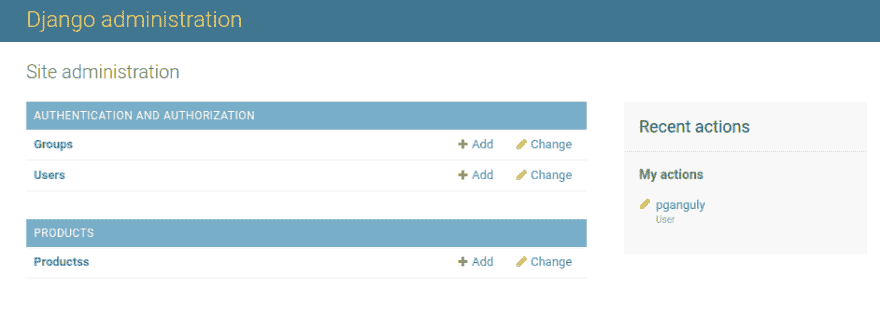
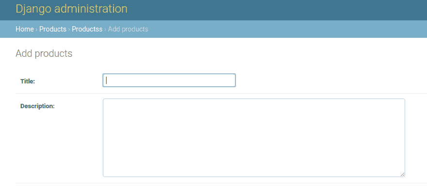
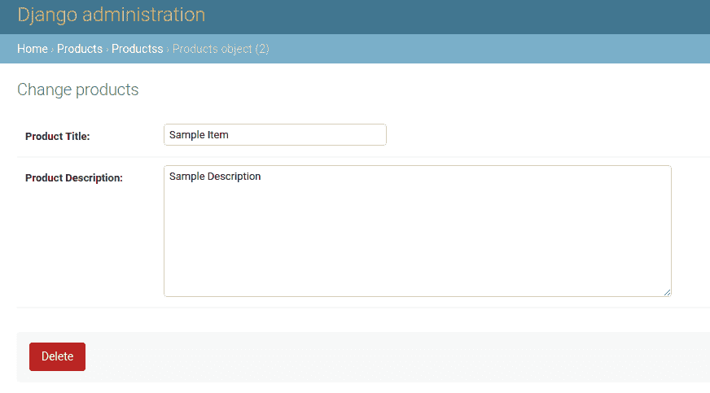
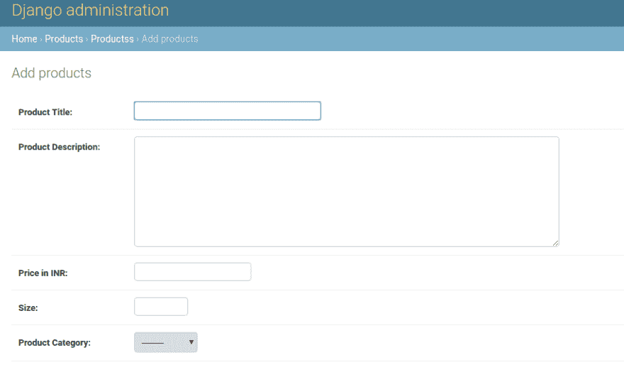
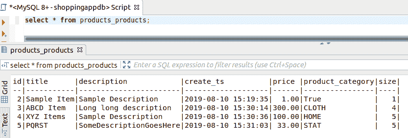
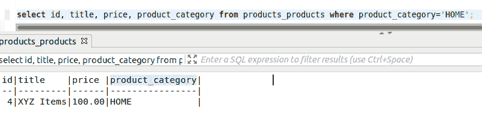

# 玩 Django 模型

> 原文：<https://dev.to/pallabganguly/playing-with-django-models-cjo>

嘿，伙计们，最近我在为我的一个朋友开发一个 webapp，帮助他做一些自由职业的事情，在那里我不得不挖掘大量的数据库和建模的东西，把旧的 DBMS 类和 django 提供的所有东西联系起来是非常酷的。所以我认为这将是一个与社区分享我所学到的东西的绝佳机会。当然，这假设您熟悉 python 和 django。如果没有，[这个](https://djangobook.com/)是一个开始的好地方。

在我们开始做任何事情之前，让我们先了解一下我们的要点。我在这篇文章中使用了 django 2.2 和 python 3.7。我强烈建议使用虚拟环境来设置所有依赖项。虽然 django 提供了默认的 SQLite 数据库引擎，但我需要更安全的东西，所以我使用了 MySQL。此外，我认为这将是一个很好的机会来学习使用 django 与一些不同类型的数据库。顺便说一下，这篇文章中的所有内容也可以使用 SQLite 来完成。不管怎样，我很快会发表一篇关于用 MySQL 设置 django 的文章。

首先，假设我们正在建立一个电子商务网站，现在我们有两个应用程序:产品和订单。在 django 中，一个应用程序是一个独立的模块，在那个应用程序中，我们将保留与之相关的所有内容。它可以被认为是一项独立的服务，而不是我们通常所说的“应用程序”。所以在设置好我们的项目之后，让我们创建一个这样的应用:

```
python manage.py startapp products
python manage.py startapp orders 
```

现在，我们将只关注产品应用程序。让我们在我们最喜欢的代码编辑器中打开这个应用程序(我喜欢使用 SublimeText)。在我们的产品应用程序中，应该有 python 文件`models.py`。在我们继续之前，让我们问一下什么是模型，这个`models.py`是关于什么的。这个问题的答案并不难。任何应用的核心都是数据。现在，关系数据库允许我们以一种安全、容错的方式组织和管理数据。不幸的是，仅仅这些数据还不足以构建一个应用程序。我们需要执行一些逻辑，一些应用程序最终会做的事情，比如说在我们的案例中，我们可以对所有的商品下订单并通知卖家，向客户发送邮件，我们可以应用促销、折扣等。所以我们需要一种方法来表示数据库中的数据。这就是模型的用武之地。一个模特就像一只 [ORM](https://en.wikipedia.org/wiki/Object-relational_mapping) 。用最简单的术语来说，这意味着数据库实体可以表示为 python 类，每一行都可以表示为一个对象。我们可以在这些物体上做各种各样的操作。我们一会儿就能看到这一切。所有这些我们都记录在我们的`models.py`文件中。

所以让我们进入`models.py`。我们在 RDBMS 中为实体创建自己的模型或 python 表示的方式是通过 python 类。所以我在这里定义了一个代表产品对象的类:

```
from django.db import models

# Create your models here. class Products(models.Model):
    title = models.CharField(max_length=120)
    description = models.TextField() 
```

那么我们在这里做了什么？对于我们的产品应用程序，我们已经定义了模型。所以所有的产品对象都有一个标题和一个描述。我们还需要注册我们的模型，以便在我们的应用程序中可见。为此，我们需要将其包含在`admin.py`中。

```
from django.contrib import admin

# Register your models here. from products.models import Products 
```

我们还需要在 INSTALLED_APPS 部分的 main `settings.py`中添加这个应用程序，告诉 django 我们想要使用这个应用程序。

因此，现在我们需要做的是使我们的数据库与我们定义的这个新实体同步。为此，我们需要运行数据库迁移。我们可以运行`python manage.py makemigrations`，我们应该会看到类似这样的东西:

```
Migrations for 'products':
  products/migrations/0001_initial.py
    - Create model Products 
```

然后让我们通过执行`python manage.py migrate`来应用这些迁移。我们得到这样的东西:

```
Operations to perform:
  Apply all migrations: admin, auth, contenttypes, products, sessions
Running migrations:
  Applying products.0001_initial... OK 
```

这里发生了什么？您可能已经注意到，当我们运行`makemigrations`时，在您的产品应用程序中创建了一个新文件，位于一个名为 migrations 的文件夹中。这个文件基本上告诉我们数据库中的当前配置和我们的模型中的配置之间的差异。在我们的例子中，我们在模型中添加了新的实体，但是它不在数据库中。然后，我们应用这些更改，并将数据库与我们的模型同步。请注意，这些更改直到我们点击`migrate`时才真正应用。让我们打开做`makemigrations`时创建的文件。

```
from django.db import migrations, models

class Migration(migrations.Migration):

    initial = True

    dependencies = [
    ]

    operations = [
        migrations.CreateModel(
            name='Products',
            fields=[
                ('id', models.AutoField(auto_created=True, primary_key=True, serialize=False, verbose_name='ID')),
                ('title', models.CharField(max_length=120)),
                ('description', models.TextField()),
            ],
        ),
    ] 
```

看到上面的操作列表了吗？这告诉 django 要做哪些迁移操作。在这种情况下，需要在数据库中创建一个模型。这个新模型有我在`models.py`中给出的字段，还有一个额外的叫做自动字段的东西。这是一种特殊的字段，由 django 自动添加，用作惟一标识符。如果我们想要更改它，我们只需在迁移文件中进行更改，然后重新运行迁移。但是我们会把它留到下一天:)

好吧，所有这些都没问题，但是这对我们的应用程序有什么影响呢？让我们来看看:
我的 appserver 正在运行，所以让我们快速检查一下管理应用程序。我们可以在`localhost:8000/admin`访问它。登录后，它应该是这样的:
[](https://res.cloudinary.com/practicaldev/image/fetch/s--UmbFO1hH--/c_limit%2Cf_auto%2Cfl_progressive%2Cq_auto%2Cw_880/https://thepracticaldev.s3.amazonaws.com/i/er29ttn3cersvph6irmr.png) 
让我们尝试从管理应用程序创建一个对象:
[](https://res.cloudinary.com/practicaldev/image/fetch/s--cDeF5LMz--/c_limit%2Cf_auto%2Cfl_progressive%2Cq_auto%2Cw_880/https://thepracticaldev.s3.amazonaws.com/i/uapb83imkzgn0vccmf0l.png) 
注意表单中的字段是如何基于我们在模型中定义的字段类型的。我们可以尝试其他类型的字段。我想在这里提到的是 [django 文档](https://docs.djangoproject.com/en/2.2/ref/models/fields/)非常棒，你构建一个生产就绪的应用所需要的任何东西都可以在文档中找到。我会非常频繁地引用文档，并在我们的模型中添加一些字段。同时，这是我从控制台创建的一个对象。(也有其他的方法，稍后会详细介绍)
[](https://res.cloudinary.com/practicaldev/image/fetch/s--vK2BGwh2--/c_limit%2Cf_auto%2Cfl_progressive%2Cq_auto%2Cw_880/https://thepracticaldev.s3.amazonaws.com/i/zogvzxkj82vhpn8g2dwm.png) 
所以在添加了更多的字段之后，我的模型看起来是这样的:

```
from django.db import models

# Create your models here. class Products(models.Model):
    PRODUCT_CATEGORIES=[
        ('CLOTH', 'Clothing'),
        ('HOME', 'Home'),
        ('STAT', 'Stationery'),
    ]
    title = models.CharField(max_length=120, verbose_name='Product Title')
    description = models.TextField(blank=False, verbose_name='Product Description')
    price = models.DecimalField(max_digits=9, decimal_places=2, verbose_name='Price in INR')
    size = models.PositiveIntegerField(verbose_name='Size')
    product_category = models.CharField(max_length=40, verbose_name='Product Category', choices=PRODUCT_CATEGORIES)
    create_ts = models.DateTimeField(auto_now_add=False) 
```

让我们来看看这些新的字段:
第一个是我们普通的旧标题，只是现在我们在字段中添加了一些参数或选项。我们已经有了一个`max_length`，没有必要去猜测它是做什么的。`verbose_name`是我们想要给出的字段的名称。这是可选的，如果我们不指定，django 将自动获取字段名本身(参见迁移文件)。看看之前的两张截图:第一张我没有使用`verbose_name`，第二张我使用了。此外，我们指定标题字段将是一个容量有限的`CharField`，而不是我们在描述中使用的`TextField`。在描述中，注意我们使用了`blank=False`。这意味着该字段将是必填的。相反，`blank=True`意味着我们将允许该字段为空。
下一个是价格，一个明显的选择是`DecimalField`。我又放了一些选项，`max_digits`和`decimal_places`。第一个指定双十进制本身的位数，第二个指定小数点后的位数。在我的例子中，我们可以在小数点前有 7 个数字，在小数点后有 2 个数字，所以 9999999.99 是我们可以在价格字段中存储的最大值。(我们卖的是什么，钻石？！).我还使用了一个`PostitiveIntegerField`来存储一个项目的大小。
现在假设对于一个字段，我们希望从一组值中限定值，并且我们只能从这些值中进行选择。当然，我们可以在前端或者在表单本身中这样做，但是我们也可以在模型中这样做。为此，我们只需将允许值的列表作为选项`choices`传递到字段中。注意这里对于我传递的元组列表，元组中的第一项将存储在数据库中，第二项将显示在 admin app(或任何其他模型表单)中。
`DateTimeField`用于存储日期时间时间戳。在这里，我将它用作对象首次创建时的时间戳。第一次创建对象时，`auto_now_add`会自动标记当前时间。即使对其进行了编辑，该字段也保持不变。这使得它不同于它的表亲`auto_now`，后者得到更新。
好了，现在让我们通过运行`makemigrations`和`migrate`
来同步我们的数据库

```
You are trying to add a non-nullable field 'create_ts' to products without a default; we can't do that (the database needs something to populate existing rows).
Please select a fix:
 1) Provide a one-off default now (will be set on all existing rows with a null value for this column)
 2) Quit, and let me add a default in models.py
Select an option: 
```

好吧，那这是怎么回事？你看，我们想要绝对确定我们在所有行上实施了所有的约束，而 django 不允许我们应用这些迁移，即使只有一行数据违反了这些约束。在我之前的迁移中，我的数据库中有一个对象，只有两个字段。所以现在 django 让我选择要么为专栏提供一个默认值，要么修改我的模型。我们会尽最大努力修复模型。所以我更改了`models.py`中的以下字段:

```
create_ts = models.DateTimeField(default=timezone.now, editable=False) 
```

`editable_false`将确保这个字段不会出现在管理或任何其他形式，不能被编辑。但是即使在这之后，我们也会得到相同的错误，对于现在的其他字段。这次我决定给一个这样的默认值:

```
Select an option: 1
Please enter the default value now, as valid Python
The datetime and django.utils.timezone modules are available, so you can do e.g. timezone.now
Type 'exit' to exit this prompt
>>> 
```

我给了 all`True`,因为我的数据库中只有一个项目，并且创建了迁移文件。

```
Migrations for 'products':
  products/migrations/0003_auto_20190810_2048.py
    - Add field create_ts to products
    - Add field price to products
    - Add field product_category to products
    - Add field size to products 
```

我应用了迁移。同时，如果我们看一下迁移文件，我们可以看到一些 AddField 和 AlterFields 分别位于新字段和`title`上。现在我们的表单应该是这样的(注意没有`create_ts`:
[](https://res.cloudinary.com/practicaldev/image/fetch/s--ZuKFfMwl--/c_limit%2Cf_auto%2Cfl_progressive%2Cq_auto%2Cw_880/https://thepracticaldev.s3.amazonaws.com/i/z0qs70emxz9j23uw8shs.png)
)让我们快速浏览一下我们的数据库(注意第一项是如何有默认值的):
[](https://res.cloudinary.com/practicaldev/image/fetch/s--XbRNJbi3--/c_limit%2Cf_auto%2Cfl_progressive%2Cq_auto%2Cw_880/https://thepracticaldev.s3.amazonaws.com/i/biprpabk9xumrd7lt0es.png) 
这很酷，对吧？但是我们还可以做更多的事情，这些文档非常有用，所以不要就此打住。
现在 ORM 还包括一些查询数据库的 API，所以你不必运行实际的查询来检索或更新数据。如果不能使用数据库数据，那么将它们表示为 python 对象又有什么意义呢？这就是`QuerySet`API 的用武之地。允许我们通过模型类的实例来运行数据库上的所有操作。让我告诉你我的意思。让我们运行:`python manage.py shell`，呈现给我们的是一个普通的 python shell。特别的是，我们在虚拟环境中，所有 django 应用都可以在这里使用。让我们试试这个:

```
Python 3.7.1 (default, Dec 14 2018, 19:28:38) 
[GCC 7.3.0] on linux
Type "help", "copyright", "credits" or "license" for more information.
(InteractiveConsole)
>>> from products.models import Products
>>> print(Products.objects.all())
<QuerySet [<Products: Products object (2)>, <Products: Products object (3)>, <Products: Products object (4)>, <Products: Products object (5)>]>
>>> 
```

哇哦。我们在这里做了什么？嗯，我们刚刚导入了我们的产品应用程序(产品文件夹有一个`__init__.py`，所以它是一个模块)，并且我们导入了我们的模型类`Product`。`Products.objects.all()`是我们调用的一个`QuerySet` API，它返回了当前数据库中所有对象的列表。有点像跑步

```
SELECT * FROM TABLE_NAME 
```

可以松散地翻译为“获取模型(实体)的所有对象(行)”。这就是我们在数据库上执行 CRUD 操作要做的事情。现在我们有了 python 对象形式的数据，我们可以对它们进行各种逻辑处理，将其作为模板呈现给前端，对数据执行操作，等等。数据库中的每一项都是一个 python 对象，为了访问该行的任何属性，我们所做的就是像对待一个常规的 python 对象一样对待它，即:object.attribute

```
Python 3.7.1 (default, Dec 14 2018, 19:28:38) 
[GCC 7.3.0] on linux
Type "help", "copyright", "credits" or "license" for more information.
(InteractiveConsole)
>>> from products.models import Products
>>> all_products = Products.objects.all()
>>> for product in all_products:
...     print(product.id, "--", product.title, "--", product.price, "--", product.product_category)
... 
2 -- Sample Item -- 1.00 -- True
3 -- ABCD Item -- 300.00 -- CLOTH
4 -- XYZ Items -- 100.00 -- HOME
5 -- PQRST -- 33.00 -- STAT
>>> 
```

看，数据库行与模型类的实例没有什么不同，字段名就是它的属性。我们可以使用`QuerySet` s 做所有你在普通 SQL 数据库上做的事情。例如:

```
>>> all_products = Products.objects.filter(product_category='HOME')
>>> for product in all_products:
...     print(product.id, "--", product.title, "--", product.price, "--", product.product_category)
... 
4 -- XYZ Items -- 100.00 -- HOME 
```

相当于:
[](https://res.cloudinary.com/practicaldev/image/fetch/s--6pez_X2G--/c_limit%2Cf_auto%2Cfl_progressive%2Cq_auto%2Cw_880/https://thepracticaldev.s3.amazonaws.com/i/wqsew22jt0oi0fgmqw0s.png) 
见鬼，你甚至可以用这些 API 创建、删除、更新对象(或者是行，很难说:P)这就是我们在应用程序中做的事情。例如(双关语)，我们可以使用最后一个循环示例在真实的电子商务网站中呈现产品列表页面。就像我说的，T5 文件 T6 非常棒。

发疯吧，建造一些东西来改善你的生活，或者其他人的生活！