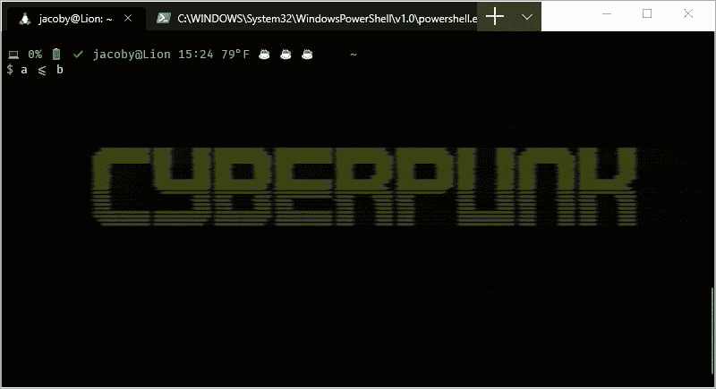
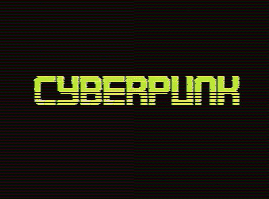
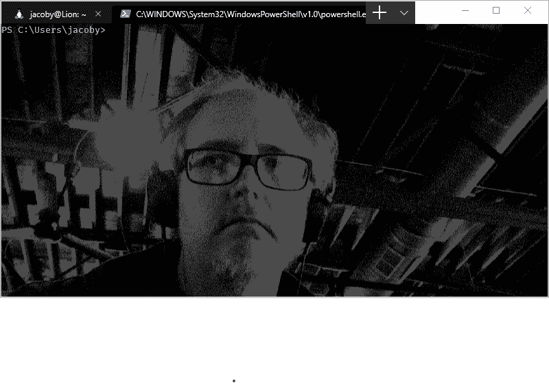

# 使用 Windows 终端

> 原文：<https://dev.to/jacoby/playing-with-windows-terminal-2b8n>

我成为 WSL 用户已经有一段时间了，也有人热衷于破解我的 Bash 提示符，这使我发现 Windows 终端在 Unicode 支持上落后于 Gnome 终端一段时间，这意味着，例如，如果你想让图标告诉你你喝了几杯咖啡，你的笔记本电池电量低，或者你的 Git repo 的状态是微笑的便便，它们就不会在 Windows 上很好地显示。

有些地方还不错。它们与 Cygwin 终端和从它派生的 Git Bash 配合得很好，我记得 PuTTY 处理得很好(但是现在你可以从 PowerShell *和* CMD 提示符进行 SSH，我再也不打开它了)，但是内置终端基本上与 NT 相同，也许比以前更好。

Rich Turner 会知道，因为他写了关于 Windows 终端历史的博客系列，这导致了新的 T2 Windows 终端的发布。你现在可以从 [MS 商店](https://www.microsoft.com/en-us/p/windows-terminal-preview/9n0dx20hk701)下载它，不像其他一些喜欢的玩具，你不必是快速通道 Windows Insider。所以让我带你四处看看吧！

## 漂亮

我从 WSL 提示符开始，因为作为一名 Linux 人员，我在 Bash 提示符定制方面做了更多的工作。到目前为止，就是这样。

[](https://res.cloudinary.com/practicaldev/image/fetch/s--MjqAOr5F--/c_limit%2Cf_auto%2Cfl_progressive%2Cq_auto%2Cw_880/https://jacoby.github.img/wt_wsl.png)

我在这里指出几件事。咖啡杯表情符号(☕)表示我那天喝过的杯子。还有，电脑表情符号(💻)表示我没有要添加的包，并且电池(🔋)，这并不意味着什么，因为这个词在我的桌面上，但会表明电池电量水平。此外，我尝试使用 taskwarrior 和检查(✔)表明我没有未完成的任务。所有这些都显示在新的 Windows 终端中，但这并不总是正确的。

我还要提一下，我使用的是 [Fira 码](https://github.com/tonsky/FiraCode)，一种支持连字的字体，它将`<=`显示为一个字符，而不是两个。

你不能从屏幕截图中看到它，但是赛博朋克图像是一个动画 GIF，在文本后面是动画。

[](https://res.cloudinary.com/practicaldev/image/fetch/s--Yi7IcPig--/c_limit%2Cf_auto%2Cfl_progressive%2Cq_66%2Cw_880/https://jacoby.github.img/cyberpunk.gif)

我认为这是一件大事，因为我写了一个工具来设置你的 Windows 背景图片，它只接受 JPEG 格式。

这种配置特定于您正在讨论的术语，因此如果您想要 PowerShell 终端，它看起来会有所不同。

[](https://res.cloudinary.com/practicaldev/image/fetch/s--5ZwHX2xJ--/c_limit%2Cf_auto%2Cfl_progressive%2Cq_auto%2Cw_880/https://jacoby.github.img/wt_ps.png)

## 配置

缩短后，`C:\Users\you\AppData\Local\Packages\Microsoft.WindowsTerminal_8wekyb3d8bbwe\RoamingState\profiles.json`中的配置文件如下:

```
{
  "globals": {},
  "profiles": [],
  "schemes": []
} 
```

并且在`ctrl-,`或*设置*下可用。

### (颜色)方案

从后往前，*方案*是*配色*，长这样:

```
{
  "background": "#0C0C0C",
  "black": "#0C0C0C",
  "blue": "#0037DA",
  "brightBlack": "#767676",
  "brightBlue": "#3B78FF",
  "brightCyan": "#61D6D6",
  "brightGreen": "#16C60C",
  "brightPurple": "#B4009E",
  "brightRed": "#E74856",
  "brightWhite": "#F2F2F2",
  "brightYellow": "#F9F1A5",
  "cyan": "#3A96DD",
  "foreground": "#CCCCCC",
  "green": "#13A10E",
  "name": "Campbell",
  "purple": "#881798",
  "red": "#C50F1F",
  "white": "#CCCCCC",
  "yellow": "#C19C00"
} 
```

如你所见，它采用了默认颜色的名称，加上前景、背景等。，并为它们命名。

坎贝尔是开箱即用的方案，但你可以改变它，你可以改变这些，在…

### 简介

```
{
  "acrylicOpacity": 0.5,
  "background": "#012456",
  "backgroundImage": "ms-appdata:///roaming/dotty-me.jpg",
  "backgroundImageOpacity": 0.25,
  "closeOnExit": true,
  "colorScheme": "Campbell",
  "commandline": "powershell.exe",
  "cursorColor": "#00FF00",
  "cursorShape": "bar",
  "fontFace": "Consolas",
  "fontSize": 10,
  "guid": "{61c54bbd-c2c6-5271-96e7-009a87ff44bf}",
  "historySize": 9001,
  "icon": "ms-appx:///ProfileIcons/{61c54bbd-c2c6-5271-96e7-009a87ff44bf}.png",
  "name": "Windows PowerShell",
  "padding": "0, 0, 0, 0",
  "snapOnInput": true,
  "startingDirectory": "%USERPROFILE%",
  "useAcrylic": false
} 
```

这是 PowerShell 的配置文件，我已经对它进行了一些定制。`background`是*背景色*，跳转到`backgroundImage`设置图像。

[](https://res.cloudinary.com/practicaldev/image/fetch/s--ctmpf457--/c_limit%2Cf_auto%2Cfl_progressive%2Cq_auto%2Cw_880/https://jacoby.github.img/dotty-me.jpg)

但是，当然，你想看到文本*在你的图像*上面，所以`backgroundImageOpacity`是一个 0 和 1 之间的浮点数，设置有多少，这允许你阅读它上面的文本。

有效的`cursorShape`值是条形、空框、填充框、下划线和年份。[谢谢多诺万·布朗！](http://donovanbrown.com/post/Cursor-shapes-for-new-Windows-Terminal/)。

显然，*丙烯酸*是一种使终端半透明的方法；背景可以透过来看，但不在焦点上。这就是`useAcrylic`和`acrylicOpacity`适合的地方，但是我还没有让它们工作。

这里有很多 Windows 简写的东西。`ms-appdata:///roaming/`的意思是`C:\Users\you\AppData\Local\Packages\Microsoft.WindowsTerminal_8wekyb3d8bbwe\RoamingState`。`%USERPROFILE%`是一种冗长而复杂的写法`~`，它设置的`startingDirectory`字段对开始`wsl`没有太大作用，所以黑客让你的`commandLine`请求`"wsl.exe ~ -d Ubuntu-18.04"`。然后是唯一标识符，或`guid`。这主要是用来表示当你打开 WT 时会出现哪个选项，在…

### Globals

```
 "globals": {
      "alwaysShowTabs": true,
      "defaultProfile": "{7c51c86f-d763-44fc-b952-e04d5922f631}",
      "initialCols": 120,
      "initialRows": 30,
      "keybindings": [{
        "command": "closeTab",
        "keys": [
          "ctrl+w"
        ]
      }, {
        "command": "OTHERS",
        "keys": [
          "plenty"
        ]
      }],
      "requestedTheme": "system",
      "showTabsInTitlebar": true,
      "showTerminalTitleInTitlebar": true
    } 
```

*这些中的大部分*似乎没多大作用，尤其是所有带`Tab`调的东西。`defaultProfile`决定了当你打开一个标签或者创建一个窗口时，你的选择会出现，这是由那个配置文件的`guid`设置的，这些 GUID 看起来对这个项目是唯一的，所以你的`Ubuntu-18.04` GUID 可能就是我的。

## 问题

就个人而言，我希望`keybindings`的大数组处于顶级，而不是卡在全局的中间，但是我不能改变这一点。

在 Linux 上，我用的是设置为 30%左右的透明终端，所以你可以通过终端看到桌面(包括其他窗口)。这通常是一件“太酷了”的事情，但有时它被证明是有帮助的。我喜欢透明/半透明的背景，丙烯酸承诺，但我还没有让他们工作。我通常不太喜欢特定于终端的背景，但是我在等待的时候很喜欢它们。

我希望有某种方法，当打开一个术语时，能够选择`WSL Ubuntu`或`WSL Fedora`或`PowerShell ISE (As Admin)`，而不是一旦打开就为它创建一个标签，据我所知，管理权限部分还没有开始解决。

你会注意到**长的**标签显示了 PowerShell 可执行文件的位置，相反，我的 Ubuntu 标签显示的是`jacoby@Lion: ~`，这是因为我已经驯服了我的`$PS1`，所以它包含了字符串`\[\033]0;\u@\h: \w\007\]`，它告诉计算机每次写入提示时都要将`\u@\h: \w`或`username@hostname: current_working_directory`设置为终端标题，在本例中是标签标题。PowerShell 一定有这样的魔力，但我还没有深入了解这些东西。默认太难看了，我要不得不。

一段时间以来，表情符号和 Unicode 字符的缺乏一直是我对 Windows 的最大困扰，这次发布真正解决了这一问题。我将不得不花一些时间来改变设置和我的工作流程，使这个*真正适合我的使用，但我对新的终端非常满意，几乎不能等待改进。*

#### 如果有什么问题或意见，我很乐意倾听。在[推特](https://twitter.com/jacobydave)或[上问我，在我的博客回购](https://github.com/jacoby/jacoby.github.io)上做文章。