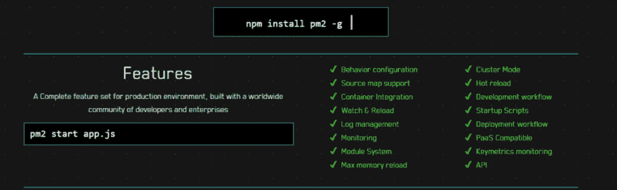
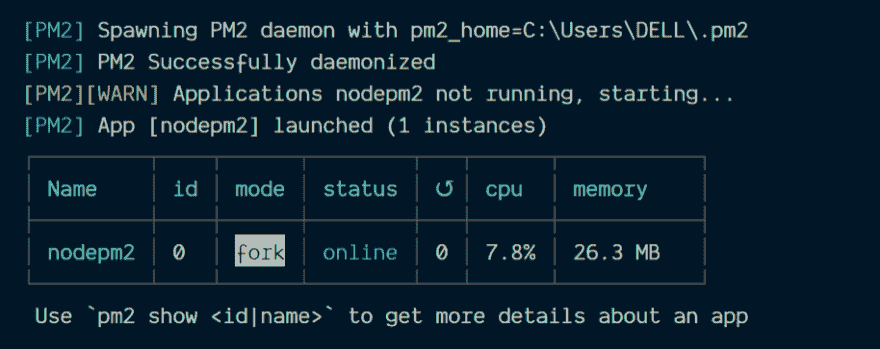
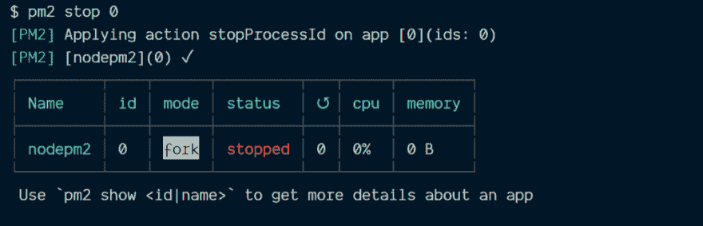
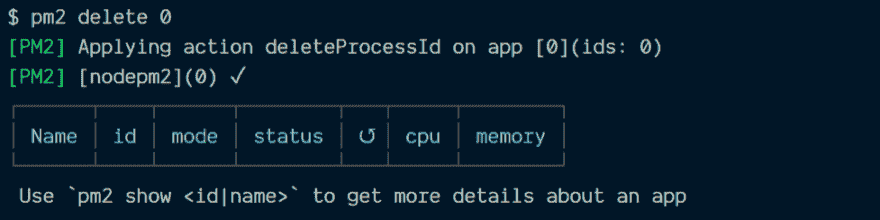
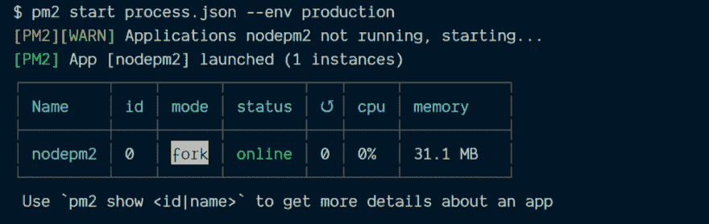
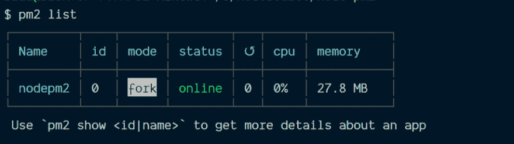

# Node.js 开发人员的 PM2

> 原文：<https://dev.to/ganeshmani/pm2-for-node-js-developers-bjf>

在本文中，我们将了解什么是 pm2，以及在 node.js 应用程序开发中的什么地方使用它。Node.js 开发人员的 PM2

这里是最近关于 Node.js 的文章，

[使用 Node.js 构建 P2P 视频聊天应用](https://cloudnweb.dev/2019/09/building-p2p-video-chat-application-using-webrtc-and-node-js/)

[了解 Node.js 中的 event emitters](https://cloudnweb.dev/2019/08/understanding-eventemitter-in-node-js-with-a-usecase/)

[面向 Node.js 开发者的 Apache Kafka】](https://cloudnweb.dev/2019/08/apache-kafka-for-node-js-developers/)

有没有想过 Node.js 应用是如何在服务器中部署和运行的？。

众所周知，我们使用 Nodemon 进行应用程序开发。但是，我们不能在生产服务器中使用相同的。

实际上，这有一些问题。使用 nodemon 时，如果关闭终端，会停止 node.js app 的进程。那会给生产带来问题。

我们希望应用程序在生产服务器上运行时没有任何中断。

很少有 npm 包可以解决这个问题。其中一个流行的 npm 包是 **pm2** 。

### pm2 是什么？

pm2 是 Node.js 应用程序生产中的流程管理器。它有助于管理 Node.js 应用程序的进程。它提供了许多高级功能，如应用程序集群、负载平衡等。

[](https://res.cloudinary.com/practicaldev/image/fetch/s--YziVyCYh--/c_limit%2Cf_auto%2Cfl_progressive%2Cq_auto%2Cw_880/https://cloudnweb.dev/wp-content/uploads/2019/09/pm2_features-1024x315.png)

### 安装 pm2

首先，应该在全球范围内安装 pm2 来运行几个应用程序。

```
npm install pm2 -g
```

pm2 使用配置文件来维护应用程序，它可以是 JSON 或 js 或 YAML 文件。

这里，我们将使用 **process.json** 文件，该文件将包含我们的应用程序的配置。

### 应用程序设置

使用名为 **app.js** 的文件创建一个简单的 node.js 应用程序

```
npm init --yes
```

在 app.js 中添加以下代码。

```
const express = require('express');

const app = express();

app.get('/',(req,res) => {

    res.send("PM2 is working, Send me Home");

})

const PORT = process.env.PORT;
app.listen(PORT,() => {
    console.log(`server is running on port ${PORT}`);
})
```

之后，创建一个名为 **process.json** 的文件。它包含应用程序数组，该数组包含应用程序配置详细信息。

```
{
    "apps": [{
        "name" : "nodepm2",
        "script" : "./app.js",
        "env" : {
            "PORT" : 4005
        },
        "env_production" : {
            "PORT" : 4000
        }
    }]
}
```

首先， **name** 是 pm2 正在运行的进程的名称。pm2 将运行脚本中提到的文件。在这里，它会像

```
pm2 start app.js
```

**env** 包含应用的环境变量。我们可以指定不同的环境变量，如开发、生产或登台。

这里，我们提到了生产和默认(开发)的环境变量。

### 运行 pm2

因此，要使用 pm2 运行应用程序，我们可以使用 pm2 的配置来启动应用程序。

```
pm2 start process.json
```

[](https://res.cloudinary.com/practicaldev/image/fetch/s--tzQ1VbAX--/c_limit%2Cf_auto%2Cfl_progressive%2Cq_auto%2Cw_880/https://cloudnweb.dev/wp-content/uploads/2019/09/pm2_dev.png)

我们可以通过指定进程 id 来停止节点应用程序进程。

```
pm2 stop 0
```

[](https://res.cloudinary.com/practicaldev/image/fetch/s--6EsSk_y8--/c_limit%2Cf_auto%2Cfl_progressive%2Cq_auto%2Cw_880/https://cloudnweb.dev/wp-content/uploads/2019/09/stop_command.png)

要在进程停止后将其删除，请使用 delete 命令指定进程 id。

[](https://res.cloudinary.com/practicaldev/image/fetch/s--nPvmh8rq--/c_limit%2Cf_auto%2Cfl_progressive%2Cq_auto%2Cw_880/https://cloudnweb.dev/wp-content/uploads/2019/09/delete_command.png)

我们可以通过在 pm2 命令中指定 env 来运行带有不同环境变量的 pm2。

```
pm2 start process.json --env production
```

[](https://res.cloudinary.com/practicaldev/image/fetch/s--hSaBSDCG--/c_limit%2Cf_auto%2Cfl_progressive%2Cq_auto%2Cw_880/https://cloudnweb.dev/wp-content/uploads/2019/09/prod_command-1.png)

为了列出 pm2 运行的所有进程，

[](https://res.cloudinary.com/practicaldev/image/fetch/s--EMEALhQV--/c_limit%2Cf_auto%2Cfl_progressive%2Cq_auto%2Cw_880/https://cloudnweb.dev/wp-content/uploads/2019/09/list_command.png)

### 摘要

pm2 是管理生产服务器中 node.js 应用程序进程的最常用的库之一。

pm2 中有许多高级特性将在接下来的文章中介绍。

在那之前，祝编码愉快