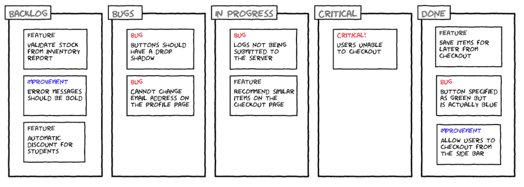

# 零臭虫政策

> 原文：<https://dev.to/rimt07/politica-de-zero-bug-4l44>

# 零虫政治

零错误政策，并不意味着产生无错误的代码；这意味着努力消除所有已知的错误。

从检查您现有的问题开始，并正确地对错误进行分类。将所有错误移动到后台日志的顶部，以便开发团队可以开始工作。

在消除所有错误之前，开发小组不应开始处理储备金中的任何其他项目。例外情况！如果这个规则被破坏了，技术就行不通了。正是这一规则要求对缺陷进行良好的分类。

## 导言:

### 缺陷生命周期或错误生命周期

这是一组特定的状态，从错误的发现到修复。

有缺陷的建议国家数目如下:

> **新:T1】当新缺陷首次记录并公布时。**
> 
> 会为其指定一个新状态。
> 
> **主动:T1】一旦测试人员公布错误，便分配给负责的资源。开发者开始分析并致力于修复缺陷。**
> 
> **解决方法:T1】当开发者进行必要的代码更改并验证更改时，除了添加集成或统一测试作为最佳实践外，还可以使错误状态“修正”。**
> 
> **在测试中:**一旦缺陷得到修复，开发者将一组更改关联起来，以重新测试场景，测试者将其恢复到“测试中”状态
> 
> **已关闭:**当测试仪检查错误修正后，没有重新提交。
> 
> * *重新开放:* *如果继续存在，将重新分配给负责发展的人，以供进一步关注。

## 零臭虫如何工作:

**1 .按业务优先级和功能重要性分类:**

首先让负责产品和/或系统的研发部门使用非常严格的分类来标记问题:

*   批判性的
*   病菌
*   特性曲线
*   少校！少校

常见实现方式:

在* * azure devops * *中 Bug 项目的* * xxx * *字段中设置分类值。

**2 .指定负责人〔t1〕**

*   最初，应由测试程序和检测到错误的人员创建错误和/或将其分配给平台负责人
*   一旦平台负责人对错误进行了适当的分类和审查，就必须将错误分配给相应的调度程序。
*   与功能和技术小组一起确定开发小组的优先次序，以解决这些问题。

## 错误分类

### P1-临界:

分类:

无法使用全部或部分系统。

消费者不再得到他们应得的价值，或以不可接受的速度浪费金钱/时间。

如果不更正此类缺陷，系统将无法释放。它会使测试案例或优先级较高的方案失效。

**分辨率:**

停止正在做的事情，立即解决问题。

响应时间必须小于一天。

### P2 -巴哥:

分类:

该制度未按规定运作，但消费者可以得到他们有权得到的价值；一个主要功能或过程对
t1【解决方案】有显着影响。

由于问题而浪费的金钱/时间比率在短期内是可以接受的。

功能完全不同于在范围上或在
t1【商定的要求】上商定的功能，即系统做的事情与约定的完全不同。

**分辨率:**

完成你正在做的事情，然后解决它。

响应时间必须小于两天。

### P3 -卡拉克特里斯蒂卡:

分类:

系统中尚不存在的新功能。

未标识和/或未分析的流。

当系统可以释放时，如果不修复此类缺陷。

**分辨率:**

按积压优先级顺序处理积压。

创建改进特征或技术债务以满足此情况。

关联报告的错误，并参照新创建的项目修复错误。

应计划响应时间并通知团队。

### P4 -改进:

分类:

现有功能或系统的增强。

即使存在此缺陷，测试仍可以继续。

当系统可以释放时，如果不修复此类缺陷。

**分辨率:**

按照后台日志的优先级顺序处理这些日志。

创建改进特征或技术债务以满足此情况。

关联报告的错误，并参照新创建的项目修复错误。

应计划响应时间并通知团队。

* * *

以下是一些重新分类准则:

**你能忍受实施缺陷吗？**

例如，web 源应嵌入应用程序时正在下载

重新分类错误改进

**规格不正确是给我们造成错误还是潜在损失？**

例如，第三方集成接口中所需的字段未按要求正确发送。

重新分类错误

**缺少规范是否意味着新功能？**

例如，用户无法在社交媒体上编辑和共享其配置文件详细信息

重新分类错误∞新功能

* * *

## 开发周期中的误差跟踪:

为了便于查看分类和错误处理计划，我们还可以在“**Azur voips〖t1〗门户内按工作团队实施以下看板控制板。**

示例:

