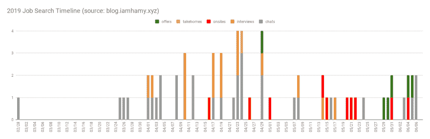
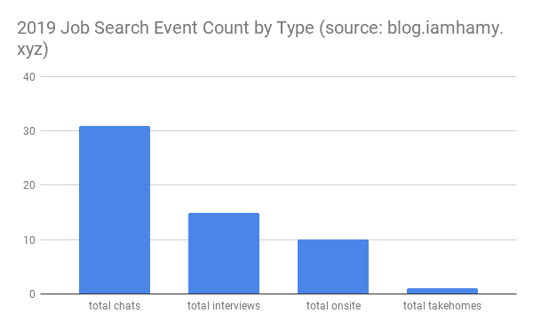
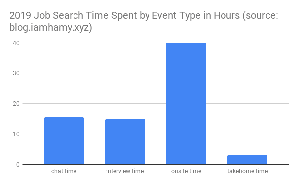

# 事后剖析:我的 2019 求职

> 原文：<https://dev.to/sirhamy/post-mortem-my-2019-job-search-1o83>

上周，我完成了为期 2 个多月的全职求职。这并不容易。但也不是特别难。然而，这确实花费了大量的时间、精力和思考。在这里，我想为子孙后代和乐观的想法走一遍我的过程，它可能会帮助你，读者，在你自己的未来搜索。

我叫汉密尔顿，作为一名软件工程师赚钱。这是我的故事。

*右键单击图表并打开一个新标签可能会让阅读变得更容易一点*

# 列出你的目标

我的搜索包括大约 2 个月的主动搜索和在此之前大约一个月的被动/无规律的思考/行动。这是花在一件事情上的大量时间，这与我从我的同行那里得到的关于他们自己搜索的数据大致一致。

知道了这一点(现在回头看我可以确认)我认为列出我关心的事情/在我职业生涯的下一步中想要关注的事情是一个好主意。这些可以用来比较机会和你真正想要的/重视的，也可以用来比较你当前公司的机会，以检查承担搬迁费用是否值得。我发现有了这些现成的目标有助于集中我的搜索，并提醒我自己为什么要这样做(在频繁的工作日晚上的学习会议上非常有用)。

你自己的目标可能会不同，但这是我留给后代的目标。

*   大学毕业后，我对企业系统如何协同工作以创建一个有凝聚力的整体很感兴趣。到那时为止，我只为类和附带项目开发过相对较小的代码库，并了解了数百个(在许多情况下是数千个！)的服务比我写过的任何东西都要大得多，它们可以协同工作产生有用的东西，这超出了我的能力范围。在这个行业呆了一段时间后，我现在可以说我开始明白了，并且一路走来，我对大规模系统/架构的兴趣越来越大。但是有一个问题一直困扰着我，那就是这些系统如何在极高的负载下保持弹性——就像数百万用户同时对你的平台执行侦察操作一样。这是我在自己的副业项目中很难体验到的(不幸的是[我的](https://labs.iamhamy.xyz/projects/mineforgood/)仍然主要由我开采/撕裂)，因此我觉得我需要在野外找到一些东西。
*   进入一个新的平台/组织，观察它如何运作:任何时候你开始一件新的事情，总会有一个学习曲线。在这段时间里，你可能不会有最大的影响/产出，但也是你经历大量学习的时候。我注意到我的学习已经开始停滞不前，所以我想在我的日常生活中做一个重大的改变，重新开始这个过程，并继续沿着这条路走下去。
*   领导更大的项目，承担更多的责任:随着时间的推移，我逐渐意识到我喜欢做东西，当我亲身体验时，我学得最好。我已经非常习惯于开发应用和服务的小部分，并希望通过构建越来越大的东西来继续发展，无论是范围、影响，还是在某些情况下，纯粹的规模。这些方面中的每一个都带来了不同的挑战，我认为这些是我作为一名软件工程师的职业生涯和作为一个喜欢构建的人的个人发展的基本障碍。

# 寻找机会

因此，我有一些目标，我想在职业生涯的下一步追求，但你会注意到，其中大多数都是围绕问题领域，并没有真正规定一个组织能够提供它们的任何品质。这很好，因为有很多地方可以给我这些机会。这很糟糕，因为有很多地方可以给我这些机会。

所以我开始到处寻找，用一些基本的过滤方法来剔除那些破坏交易的人。对我来说，那些交易破坏者是:1)如果我不能留在纽约，2)如果他们以糟糕的文化/糟糕的技术而闻名。虽然这并没有消除太多的成本，但这是一个开始。

撒下如此大的网的一个好处是，我可以对冲我对机会的押注，并利用我在这些机会上做的所有准备工作，有效地增加平均最坏情况的价值，同时增加平均最好情况的价值。对于我决定追求的每一个额外机会，以边际额外负荷为代价的双赢(因为大多数人都以大致相同的方式面试)。

我用了几种方法来寻找这个机会:

*   我的大脑记下我认为很酷并且我可能想为之工作的公司名单。这很好，因为这些公司对我有某种隐性的吸引力，但也有很多失误，因为我喜欢的许多公司在纽约没有大型工程组织。这仍然让我困惑，但事实就是如此。也就是说，我确实认为情况正在好转，所以可能不会总是这样。
*   问你的朋友他们喜欢什么公司，他们听说谁适合工作，这总是好的。
*   互联网——我在 LinkedIn、 [BuiltInNyc](https://www.builtinnyc.com/) 和 Reddit 等网站上扩大搜索范围，看看其他人认为哪里是很酷的工作场所
*   **开放**——许多网站都以招聘人员为中心，所以我让自己在 LinkedIn 和 StackOverflow 上“寻找”,以防人们寻找具有我这种技能的候选人。是的，我实际上从那里得到了大量的线索。

# 备课

Tbh，如果我们按时间顺序写这篇文章，这一部分应该在发现机会之前出现，但是我们没有。我认为应该在找到机会之前(或至少在接触之前)就开始准备，因为 1)准备工作可能需要很多时间，尤其是当你必须在其他责任/优先事项之上做这件事的时候；2)许多首席合规官会有一个相当快的周转期，这意味着在你的准备可能导致措手不及之前就开始搜索。

我已经写了一篇关于我准备过程的帖子，所以我不会在这里重复。尽管它有所有的缺点，所以如果你好奇的话，去看看我的 SWE 面试指南。

我估计我花了大约 53 天，每天大约 1.5 小时学习。肯定有几天我根本不学习，但其他时候我在学习 6+。所以，总的来说，我要说我花了大约 79.5 个小时来准备面试。

# 面试

面试过程本身就需要花费大量的时间和精力。一般有 3 种面试 1)在线电话/代码挑战，2)现场，3)带回家测试。带回家的测试有点像家庭作业，所以接下来我们将把重点放在 1)和 2)上。除了实际的面试之外，在安排和匹配过程中还有大量的计划，大量的电子邮件和电话聊天。

以下是我的流程按类型划分的明细:

大概花费在这些事情上的时间总量:

所以我花了大约 15.5 个小时聊天，15 个小时面试，40 个小时现场面试，大约 3 个小时带回家。总的来说，这意味着我在面试或安排面试的过程中花了大约 73.5 个小时。

大多数流程会让你首先通过 1)筛选候选人，然后如果你通过了这一部分，进入 2)通常包括 3-5 个不同主题的面试-数据结构和算法，系统架构和行为。每次面试持续约 1 小时，你将利用这段时间解决问题或交谈。所以它非常活跃，真的没有那么多时间来分区。因此，我认为重要的是要知道这些日子不会很容易，并事先做好准备，这样你就能把自己放在最好的位置，做得更好。

对我来说，良好的准备只是坚持我的正常作息。

*   一夜好眠
*   淋浴
*   冥想课
*   一大杯咖啡和丰盛的早餐
*   晚上做一些体力活动来缓解压力

但是 YMMV

也就是说，即使做了充分的准备并保持健康，仍然有可能筋疲力尽。

我的经验是

*   每天只有 1 次现场采访(没有其他采访)
*   每天只有 2-3 次在线电话/代码挑战(没有其他面试)
*   将这些包装天数限制为每周 3 次

肯定有无法坚持这些规则的时候，但我发现它有助于保持我的时间表可控，并防止从一个面试到下一个面试筋疲力尽。

# 决定胜负

这个过程做了几个星期，终于开始有一些 offers 了。这让我进退两难，不知如何选择。一个必须确定的好问题，但不是一个特别容易的问题。

当然，我在这个过程的开始就制定了我的目标，我可以用它来拉开一些距离，但在某些时候，仍然有一些选项选中了所有的框。从那时起，我觉得我必须更深入，以更好地区分。我用几种方法做到了这一点:

*   优先考虑我最初的目标
*   看看我关心的其他指标——文化、人员、技术、职业前景等等
*   反思我的感受——虽然感觉不应该是你做所有决定的方式，但我发现完全忽视它也是一种谬误

上周五，我做了一个决定，从而结束了我的 2019 年求职。

呜，耶！我终于完成了！啊啊啊！我可以在 DS & A 里读其他的书，做其他的事情，停止做梦...

# 我做得好的事和没做好的事

## 嗯

*   我给自己充足的时间学习和参加面试:最初我计划只花一个月的时间寻找，但结果花了两个月。我在第二个月的开始计划了一个很长的假期，所以这实际上把我放在了一个位置上，在第二个月完全休息对我来说是最佳的选择。作为一个副作用，这让我可以在下半年真正专注于我的采访，这也是我大部分时间密集的现场采访。这让我做了更充分的准备，并以适合我的节奏安排这些面试。由于良好的生活习惯和前几个月的精心计划，我很适合这样做，但我真的认为这很有帮助，并会在未来考虑类似的事情。
*   我更加重视模拟面试的准备工作:在[我最后一次寻找工作的时候](https://medium.com/@SIRHAMY/in-review-my-fall-2016-1b4c24d2c6c7)我几乎只研究了技术方面。然而，在我第二次找工作后，我开始意识到技术方面真的只是成功的一半。很多人(包括我在内)在高压(取决于你个人的社交焦虑)的情况下，在一个时间有限的环境中，就一个技术问题进行清晰的沟通和执行。通过模拟帮助我习惯了在较低压力环境下的这个过程，这在真实情况下真的很有帮助。在[我的 SWE 面试指南](https://labs.iamhamy.xyz/posts/my-swe-interview-guide/)中，我列出了一些曾经帮助过我的资源。
*   我广撒网:虽然这在安排和执行采访时产生了额外的开销，但我认为它在很多方面都有帮助。1)这意味着我可以在许多不同的机会中利用我的准备工作，从而看到更多的选择，增加我得到真正合适的东西的可能性。2)这意味着即使我失败了几次，我知道我还有其他的机会，当事情变糟时，这些机会会帮助我走出低谷——事情就是这样，也不可避免地会这样。

## 没了

*   我的时间表过于乐观:我脑子里有一个想法，我可以在一个月内完成整个求职过程。我没有。部分原因是因为拖延准备，部分原因是因为我在中途休假，但是如果我在工作的同时尝试完成整个过程，我想时间会更长，所以会比较平衡。我想下次我会更保守地安排时间表，尽量不要在面试过程中安排那么多非面试的事情。
*   我的简历一开始真的很糟糕:当我第一次开始申请时，我认为只有内容才是最重要的，所以我制作了自己的野兽派简历发出去。对此我没有得到好的回应。我把它发给一些朋友看，他们都说主题看起来很糟糕，内容也很糟糕。所以我回到绘图板，反复修改了几次，直到我用一个更标准的主题和一些好的内容完成了另一面，这些内容终于开始受到欢迎。这里学到的是，你真的应该尽可能多地得到反馈，尤其是在你的简历上。如果我一开始就这么做，这可能会让我的搜索速度加快 1-2 周。

# 鳍

好吧，就这样，结束了我的寻找和有趣的工作(我有点高兴结束了)。这是一个有趣的过程，我学到了很多东西，但我很兴奋(希望)几年内不会经历这一过程。

最后，你无法知道自己是否做出了绝对最佳的决定。但这就是生活。在这个过程中，你能做的是知道你用手头的知识做出了对你来说最好的决定。够了。肯定是，因为没人能做得更好。

总的来说，我在面试过程中花了大约 153 个小时。我做了一些事情，确实让它变得有些臃肿，就像撒了一张大网，然后在中间休假，但我认为这在业内还是相当平均的。作为参考，[我第一次找工作花了大约 157 个小时](https://medium.com/@SIRHAMY/in-review-my-fall-2016-1b4c24d2c6c7)，younger me 计算出这个时间大约相当于你在一个学期上 12 个小时课程的课时数(156 个小时)。我觉得我比年轻的我聪明，但是他大概得到了那些数字~对。

如果你有任何问题/意见，你可以在这里添加，或者在 LinkedIn 上 [ping 我](https://www.linkedin.com/in/hamiltongreene/)或者[用其他方式联系](https://iamhamy.xyz/connect)。如果你只是想知道我在做什么，你可以[现在就阅读](https://blog.iamhamy.xyz/tags/release-notes)或[订阅](https://iamhamy.xyz/subscribe)定期收到包含这些内容的电子邮件。如果没有，那也很酷，感谢你的阅读！

-哈米出去