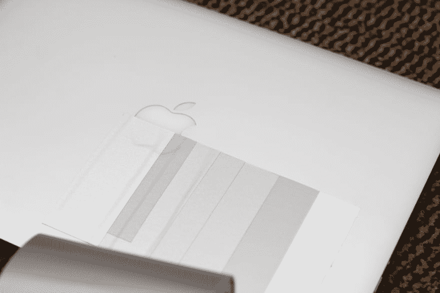
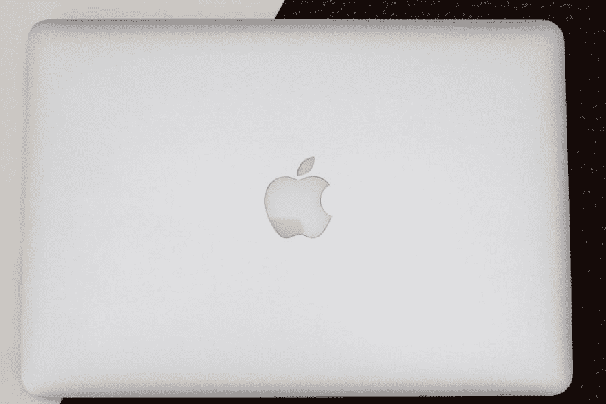
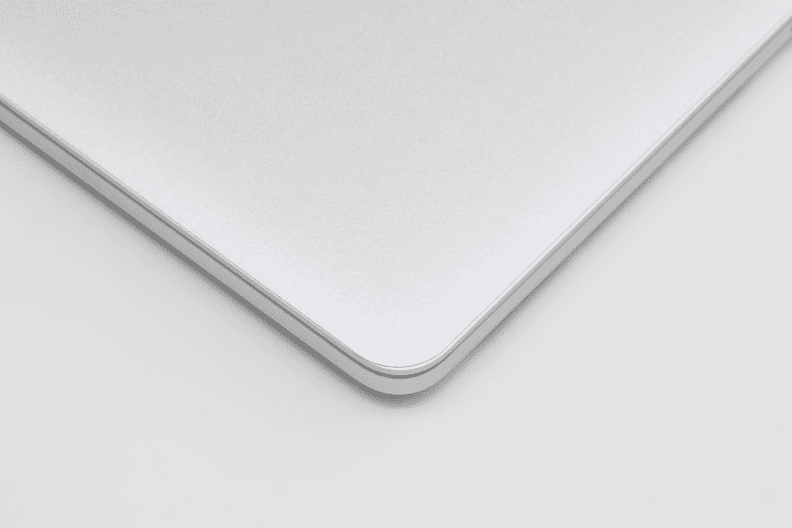
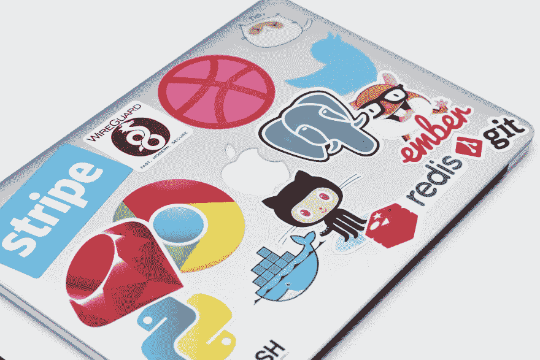
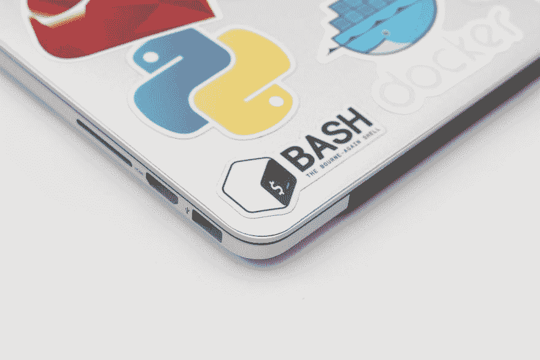
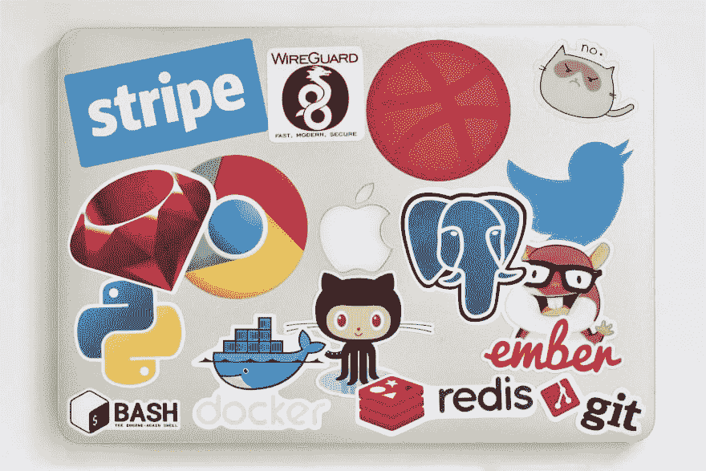
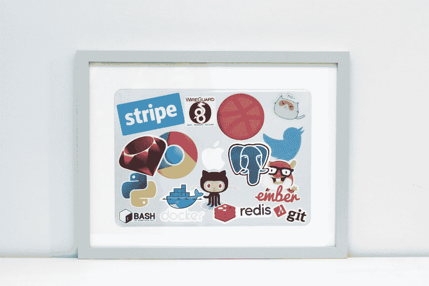

# 在 MacBooks 上保留笔记本贴纸

> 原文：<https://dev.to/graystevens/preserving-laptop-stickers-on-macbooks-2loo>

> 你们中的一些人可能已经在 HN 和推特上看到了这个，但我知道 Dev .有一点“贴纸”跟随，所以我想这可能是有趣的...我得到的反应甚至让我把它变成了一个 Kickstarter 项目，试图让它成为一个真正的产品！

* * *

# 前言

我一直很喜欢在我的 MacBook Pro 上贴贴纸的想法，但出于两个关键原因，我一直避免这样做:

*   **转售**——通过在我的笔记本电脑上贴上标签，我要么在出售它的时候再次尝试移除它们，降低我的转售价格，因为笔记本电脑已经不是接近原始状态了。
*   **损坏** -有人担心一些贴纸可能会留下难以去除的可怕残留物，或者可能会使铝变色。

谁会真的买一台二手高端笔记本电脑，上面贴着别人的贴纸，而这些贴纸对他们来说可能毫无意义？更不用说冒着当你试图移除贴纸或留下永久痕迹时会留下可怕的粘性残留物的风险了。

还有一个事实是，你的一些贴纸可能有一些轻微的情感价值。对一些人来说，这听起来可能很奇怪，但贴纸可以是一种荣誉的徽章——表明你参加过某些会议，或者设法获得了某个流行语言、软件或创业公司的“罕见”贴纸。一个想法诞生了

我开始思考解决这些问题的方法。我想出了一个能满足我需求的小清单:

*   几乎看不见，不仔细检查笔记本电脑
*   易于拆卸
*   即使在使用数月或数年后也不会留下任何痕迹
*   **奖励特性**:可以保留的东西，让那些感伤的贴纸不至于丢失。

首先，我想尝试找到一种透明的乙烯基材料，可以切割成完全适合 retina MacBook Pro 盖子。我立刻想到了老式的 iPhone 屏幕保护器，它是透明的，同时也是上壳的保护层。我对这种方法的问题是:

*   由于它们的光泽，很容易被发现。
*   众所周知，一些品牌在使用数月后会变黄或变橙(剥橙)。
*   寻找原料似乎很困难

最终，我找到了我一直在寻找的…

# 原型

事实证明，还有另一个市场有一套非常相似的要求-车辆包装。他们使用高质量的乙烯基“包装”(乙烯基)，允许人们改变他们的汽车的颜色，而无需昂贵的车身喷涂。同样的技术经常被用于提供一些公司车辆等的整个印刷范围。

我开始搜寻&从各种供应商那里订购尽可能多的样品，这些样品的颜色看起来与 MacBook Pro 的铝银非常相似。我没有太空灰设备来测试，但我确实看到了一些样品，肯定可以做这些工作。

下面是一起应用的所有示例，以了解哪一个提供了最佳匹配。

其中一个样品非常匹配(从各个角度看，都呈现出银铝的金属反射效果)，我订购了一个更大的样品来进行真实拍摄。

因为这些乙烯包装是为车辆设计的，所以它们具有一些非常有用的附加特性:

*   故意不留下任何残留物(如果留下，很容易清除)
*   耐磨，因为他们习惯于与恶劣天气作斗争。
*   超级容易申请，由于微小的“通道”刻在胶粘剂的一面，使气泡不存在。

在这里它被应用...

一旦它被应用，是时候进入下一个阶段了，在贴纸上贴一些贴纸…

这就是它如何呆了几个月，给它一个真正的考验。这款笔记本电脑经受了几次会议、爱沙尼亚的严冬以及作为工作笔记本电脑的一般磨损，都被塞进了一个随身携带的包里。

它保持得非常好，在某些情况下，我觉得它肯定防止了一些可能会发生的划痕。

# 胜负

我对这个结果非常满意——在其中一个弯角开始后，贴纸很好地脱落了。有一次，我把它贴在一张厚厚的白色卡片上，然后把它放在一个相框里。最终结果看起来棒极了。当谈到正面拍摄玻璃时，我的摄影技术就不一样了…下次我会用偏光滤镜来帮忙。

至于 MacBook Pro 的盖子？完美无瑕。只需要在灰尘和残留物聚集的边缘稍微擦拭一下，就能在贴过标签的地方留下一个“轮廓”。除此之外，它就像新的一样。

# 感兴趣？

所以在我的博客上最初的帖子指向一张表格，询问人们的想法，他们愿意为这样的东西支付多少钱，甚至询问如何命名这个东西。

从那以后事情有了一点进展，现在我很高兴地宣布它已经在 Kickstarter 上发布了！设备的初始费用意味着我不能马上就把它作为一个产品推出，所以我期待你的兴趣和支持来尝试把它变成一个“东西”！你可以在这里查看 Kickstarter...