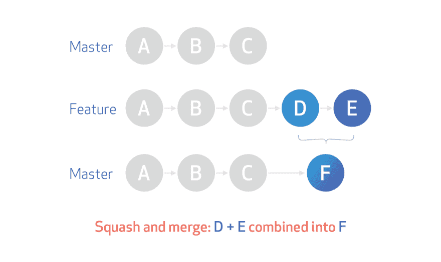

# 尽量不要弄乱你的 git 历史

> 原文：<https://dev.to/oliverjumpertz/preserving-your-commit-context-todo-change-4lc6>

Git 是一个非常棒的工具，可以用来进行版本控制和令人兴奋的项目合作。它的基本命令很容易记住，而且大多数时候，git 不会妨碍我们。我们检查一个新的分支，开始编码，并不时地提交。然后我们推至 origin，以防晚上发生了什么事情，然后回家，或者因为我们想在去喝咖啡的时候使用 CI 管道获得测试反馈。

最有可能的是，我们分支上的`$ git log`(本地和远程，我们推了几次)现在看起来像这样:

```
commit 1e678f20f1c936b1398d685d797317e8e3d18985 (HEAD -> feature/more-hawks, origin/feature/more-hawks)
Author: Oliver Jumpertz <you@me.com>
Date:   Tue Sep 3 10:00:12 2019 +0200

    Fixed code style

commit 36bbc0835bffa35a92312704e7b15793800379a5
Author: Oliver Jumpertz <you@me.com>
Date:   Tue Sep 3 09:53:57 2019 +0200

    Fixed a non-stable test

commit 526f5706d2a993f305cda6653053c4e55f311569
Author: Oliver Jumpertz <you@me.com>
Date:   Mon Sep 2 15:54:59 2019 +0200

    Implemented a new API for hawks

commit 9221365b8db4b7338dbb5dad4d313e70d2bd491a (origin/master, master)
Author: Oliver Jumpertz <you@me.com>
Date:   Mon Sep 2 13:22:10 2019 +0200

    Previous master commit 
```

Enter fullscreen mode Exit fullscreen mode

在某个时候，我们所做的工作都完成了，是时候进行代码审查了。我们打开我们选择的工具并创建一个拉请求(GitHub、Bitbucket、GitLab 等)。)或一个回顾(在像 Crucible 这样的工具中)，然后投入到其他任务中。

一段时间后，我们的评审人员完成了工作，并向我们提供了许多有用的反馈。有一些我们没有测试过的极限情况，所以我们为它们增加了一些测试，并相应地调整了实现。我们还修复了文档中的一些问题和一些小的代码风格问题。完成后，我们提交，给它一些描述性的消息，并再次推送。

## 我们的工作流程到现在为止

我们使用了 git 应该使用的方式。我们很可能正在使用某种特征分支工作流。每当一个任务的工作开始时(无论是一个 bugfix 还是一个特性，或者我们可以称之为别的什么)，我们都会创建一个新的分支。
只是

```
$ git checkout -b feature/my-feature 
```

Enter fullscreen mode Exit fullscreen mode

我们准备好了。

我们不时地

```
$ git add <files-we-changed-and-added>

$ git commit 
```

Enter fullscreen mode Exit fullscreen mode

偶尔我们

```
$ git push 
```

Enter fullscreen mode Exit fullscreen mode

分支是一种将我们自己的开发与他人的开发隔离开来的方法。这样做，我们可以防止其他人对代码库的部分进行更改，从而在我们的开发过程中影响我们。我们这样做也是为了保护我们的分支机构。以一种最佳的方式`master`总是工作，并且可以按需构建和部署。并且其他开发人员可以脱离它，毫无困难地开始他们的工作。

## 合并

然而，当涉及到合并时，我们有机会将我们所有的变更集合在一起，并给它们一些上下文。

### 快速提醒

git 中的提交是对存储库的一组更改。理想情况下，一次提交中的所有更改正好构成一个 bug 修复或特性。如果我们这样理解的话，一个 bug 的修复或者特性应该在一次提交中得到完美的解决。这样，为完成某个目标而做的每件事都与该目标相关联，并用有意义的信息描述，解释**做了什么****何时**做了什么**为什么**。
每当出现为什么代码的某个部分是现在这个样子的问题时，`$ git blame`可以帮助并给出一些上下文来更好地理解我们所看到的。它还帮助我们理解代码的哪一部分最有可能属于一起。
(我已经在这里写了一些关于提交上下文和提交消息的含义[——7 分钟阅读](https://dev.to/oliverjumpertz/you-should-consider-adding-more-detail-to-your-commit-messages-l7g)，如果你感兴趣的话)

### 问题

Git 使得使用它变得如此容易，以至于我们经常倾向于这样做，而没有花费太多的心思在我们工作流的结果上。每次提交都成为我们存储库历史的一部分。

还记得我们的工作流程吗？所有那些单独的提交与保持我们的更改在一起是相反的，因为它们现在被分成了几个提交。
没有超级简单方便的方法来判断两个提交是否有某种关联。当我们`$ git blame`一个文件和两行代码分别属于不同的提交，而这些提交实际上是针对完全相同的任务时，我们很难区分。
但我们的工作流程实际上更适合我们的工作方式。很难记住所有的事情，错误时有发生。有时我们只是忘记做一些事情，或者我们第一次没有把所有事情都做对。我们修复它，我们承诺，我们准备好了。

如果我们现在就合并，所有的提交都会找到它们到`master`分支的路径。在开发过程中接触到的某个文件上，将显示每一行被更改的内容，并且仍然用单独的提交进行注释。
我们会失去轻易分辨什么属于一起的能力。

#### 举个例子

假设我们偶然发现了一些代码，其中有人在一个循环中内联了一个复杂的方法。当我们`$ git blame`这个文件时，我们只得到一个提交的引用，`$ git show <commit-hash>`显示为:

```
commit 573af7670d7bcb19c77fbf323e34fbfb536037ee
Author: Emily Awesome <emily@isawesome.com>
Date:   Mon Jul 15 11:12:13 2019 +0200

    Fixed code style issues. 
```

Enter fullscreen mode Exit fullscreen mode

这条信息并没有告诉我们太多。显然，那段代码被重新格式化为最后一个动作。提交消息是正确的，因为它正确地陈述了所做的事情。但是它没有告诉我们为什么有这么多代码被内联。

我们忽略的是，我们的同事 Emily 实际上参与了一项分析性能下降的任务。她发现我们运行时的 JIT 不能内联我们代码的某些部分，因此她小心地修复了这些部分。她总共提交了四次，只有她的合并携带了最相关的提交消息。该消息实际上说明了为什么有代码内联以及它如何修复了什么问题。

注意:
大多数现代的 ide 和编辑器都提供了跟踪文件的 git 历史的功能，这将使我们能够找到这些行的来源。但这花费了过多的时间。

### 挤压提交& &合并

如果我们真的希望我们的所有更改都可以通过一次提交来识别，以便我们手头有更多的信息，以备不时之需，并且不需要询问两行或两块代码是否实际上因为相同的功能或错误修复而被更改，我们现在可以选择**挤压提交**。

挤压提交基本上会导致我们所做的所有单个提交被合并成一个提交。这一个新的提交然后被合并到我们的基本分支，而我们压缩的提交从我们的 git 历史中消失。

[](https://res.cloudinary.com/practicaldev/image/fetch/s--HdGxQ4IA--/c_limit%2Cf_auto%2Cfl_progressive%2Cq_auto%2Cw_880/https://github.blog/wp-content/uploads/2016/04/eef5aef6-f5b6-11e5-81f5-466b3a4d3a3a.png%3Fresize%3D1223%252C728) 
*这张[图片](https://github.blog/wp-content/uploads/2016/04/eef5aef6-f5b6-11e5-81f5-466b3a4d3a3a.png?resize=1223%2C728)由 [GitHub](https://github.blog/2016-04-01-squash-your-commits/) 演示了挤压+合并是如何工作的。*

#### 优点

*   从现在开始，我们在一个特性或修复的开发过程中接触的所有行都可以通过相同的提交来识别，并具有相同的提交消息
*   没有必要为每次提交写五条或更多非常详细的消息，只是为了提供信息，当我们想要的只是说我们总体上做了什么
*   我们的历史上没有类似的罪行
    *   WIP 提交
    *   "修正了一个不稳定的测试"
    *   "已在审核备注中工作"
    *   等等。
*   不像`$ git commit --amend`，它只处理最后一次提交，挤压提供了更多的控制

#### 弊

*   我们丢失了关于单个提交的信息
    *   我们有时真的想保留这些信息
*   许多 CI 工具，例如 Jenkins，可以由存储库中的变化触发
    *   由提交触发的构建，我们以后不能再追溯到特定的变更。
*   我们使用的其他工具可能对 git 历史很敏感

### 如何壁球

#### GitHub，Bitbucket，GitLab

其中的每一个都允许合并策略的配置。

Github:
[你首先必须允许挤压提交](https://help.github.com/en/articles/configuring-commit-squashing-for-pull-requests)
[然后你就可以实际挤压和合并](https://help.github.com/en/articles/merging-a-pull-request#merging-a-pull-request-on-github)

比特桶:
[你可以这样配置和做](https://confluence.atlassian.com/bitbucketserver/pull-request-merge-strategies-844499235.html)

GitLab:
[看这里](https://docs.gitlab.com/ee/user/project/merge_requests/squash_and_merge.html)

##### 弊端

根据所使用的平台，压缩后的实际提交消息的质量可能会有所不同。

例如，Bitbucket 获取所有单独的提交消息，并将它们附加到 squash 提交消息中。
当我们在一个特性分支`feature/more-hawks`上工作，现在将我们的分支与`squash commit`合并，结果看起来就像我们下面看到的:

```
commit 0e661e25416ff54933a5f8a6f91e800f0a98ed69 (HEAD -> master, origin/master)
Author: Oliver Jumpertz <you@me.com>
Date:   Wed Sep 4 11:21:13 2019 +0200

    Merge pull request #1337 in awesome-comp/awesome-api from feature/more-hawks to master

    PROJ-1234: Implemented a new API for hawks.

    Implemented new RESTful API - /hawks.

    We should quickly establish monitoring of the new metrics, introduced with the API.

    Squashed commit of the following:

    commit c47010de3dd381df99c97a2c5bf4cd396e3e7fe2 (HEAD -> feature/more-hawks, origin/feature/more-hawks)
    Author: Oliver Jumpertz <you@me.com>
    Date:   Tue Sep 3 16:55:19 2019 +0200

        Worked in review remarks

    commit 1e678f20f1c936b1398d685d797317e8e3d18985
    Author: Oliver Jumpertz <you@me.com>
    Date:   Tue Sep 3 10:00:12 2019 +0200

        Fixed code style

    commit 36bbc0835bffa35a92312704e7b15793800379a5
    Author: Oliver Jumpertz <you@me.com>
    Date:   Tue Sep 3 09:53:57 2019 +0200

        Fixed a non-stable test

    commit 526f5706d2a993f305cda6653053c4e55f311569
    Author: Oliver Jumpertz <you@me.com>
    Date:   Mon Sep 2 15:54:59 2019 +0200

        Implemented a new API for hawks 
```

Enter fullscreen mode Exit fullscreen mode

可读性会受到一点影响，但它很有效，可以保持我们的`$ git log`清晰。

#### 手动操作

如果我们不喜欢挤压的结果，或者如果我们想要更多地控制实际结果，我们仍然可以自己挤压。

##### 如何壁球

使我们能够粉碎一组提交并得到我们想要的结果。
`<commit-hash>`是提交的散列，它是我们想要包含在挤压中的第一个提交的直接前身。

当我们再次查看我们的`$ git log`时，它很可能是这样的:

```
commit c47010de3dd381df99c97a2c5bf4cd396e3e7fe2 (HEAD -> feature/more-hawks, origin/feature/more-hawks)
Author: Oliver Jumpertz <you@me.com>
Date:   Tue Sep 3 16:55:19 2019 +0200

    Worked in review remarks

commit 1e678f20f1c936b1398d685d797317e8e3d18985
Author: Oliver Jumpertz <you@me.com>
Date:   Tue Sep 3 10:00:12 2019 +0200

    Fixed code style

commit 36bbc0835bffa35a92312704e7b15793800379a5
Author: Oliver Jumpertz <you@me.com>
Date:   Tue Sep 3 09:53:57 2019 +0200

    Fixed a non-stable test

commit 526f5706d2a993f305cda6653053c4e55f311569 (<<< here is where we want to start the squash)
Author: Oliver Jumpertz <you@me.com>
Date:   Mon Sep 2 15:54:59 2019 +0200

    Implemented a new API for hawks

commit 9221365b8db4b7338dbb5dad4d313e70d2bd491a (origin/master, master) (<<< this is the predecessor we want to find)
Author: Oliver Jumpertz <you@me.com>
Date:   Mon Sep 2 13:22:10 2019 +0200

    Previous master commit 
```

Enter fullscreen mode Exit fullscreen mode

我们也可以尝试使用像`gitg`或`gitk`这样的工具来直观地识别前任，因为有时候用`$ git log`很困难。

无论我们如何找到前任，我们现在都像这样向`$ git rebase`提供提交散列:

```
git rebase -i 9221365b8db4b7338dbb5dad4d313e70d2bd491a 
```

Enter fullscreen mode Exit fullscreen mode

然后 Git 将打开它配置好的编辑器，并为我们提供一个页面，我们可以在其中配置我们的 squash:

```
pick 526f570 Implemented a new API for hawks
pick 36bbc08 Fixed a non-stable test
pick 1e678f2 Fixed code style
pick c47010d Worked in review remarks

# Rebase 9221365..c47010d onto 9221365 (4 commands)
#
# Commands:
# p, pick <commit> = use commit
# r, reword <commit> = use commit, but edit the commit message
# e, edit <commit> = use commit, but stop for amending
# s, squash <commit> = use commit, but meld into previous commit
# f, fixup <commit> = like "squash", but discard this commit's log message
# x, exec <command> = run command (the rest of the line) using shell
# b, break = stop here (continue rebase later with 'git rebase --continue')
# d, drop <commit> = remove commit
# l, label <label> = label current HEAD with a name
# t, reset <label> = reset HEAD to a label
# m, merge [-C <commit> | -c <commit>] <label> [# <oneline>]
# .       create a merge commit using the original merge commit's
# .       message (or the oneline, if no original merge commit was
# .       specified). Use -c <commit> to reword the commit message.
#
# These lines can be re-ordered; they are executed from top to bottom.
#
# If you remove a line here THAT COMMIT WILL BE LOST.
#
# However, if you remove everything, the rebase will be aborted.
#
# Note that empty commits are commented out 
```

Enter fullscreen mode Exit fullscreen mode

我们必须选择一个提交作为挤压的基础，然后定义我们想要挤压的所有其他提交。我们也可以选择不压缩所有的提交，但是这一次，我们想要所有的提交:

```
pick 526f570 Implemented a new API for hawks
squash 36bbc08 Fixed a non-stable test
squash 1e678f2 Fixed code style
squash c47010d Worked in review remarks

[omitted for readability] 
```

Enter fullscreen mode Exit fullscreen mode

我们保存并关闭编辑器，并成功地完成了我们的第一次挤压提交！

我们剩下要做的唯一一件事就是用
做一次力的推动

```
$ git push --force-with-lease 
```

Enter fullscreen mode Exit fullscreen mode

是的，没错。我们在这里会使用`$ git push --force`更友好的变体。

与使用普通的强制手段相比，它有一个巨大的优势:如果我们在远程位置的分支包含的提交比我们刚刚在本地处理的更多(换句话说，我们的分支被其他人占用了)，它将拒绝工作。在另一种情况下，它会成功并推动我们的改变。

常规合并现在就可以完成这项工作，不需要重新配置存储库。我们为所有的变更创建了一个单一的上下文，只是没有按下一个按钮那么舒服。然而，它允许有更多的灵活性。

##### 进一步自动化

如果我们不想每次都手动识别第一个 squash commit 的前置任务，我们可以使用 git 的其他一些命令来帮助我们自动完成这项任务。

用下面的 git 别名(`~/.gitconfig` )

```
[alias]
  find-branching-point = "!bash -c 'diff --old-line-format='' --new-line-format='' <(git rev-list --first-parent "${1:-master}") <(git rev-list --first-parent "${2:-HEAD}") | head -1'" 
```

Enter fullscreen mode Exit fullscreen mode

然后使用

```
$ git find-branching-point 
```

Enter fullscreen mode Exit fullscreen mode

在我们的分支上，我们将得到`9221365b8db4b7338dbb5dad4d313e70d2bd491a`作为我们正在寻找的提交。

如果我们现在在这个别名中把这个和`$ git rebase`结合在一起:

```
[alias]
  qbase = "!sh -c 'git rebase -i $(git find-branching-point)'" 
```

Enter fullscreen mode Exit fullscreen mode

我们得到一个`$ git qbase` (qbase 表示快速重置，但是选择你喜欢的任何东西)命令，它将自动地做我们以前做过的事情。

##### 还好奇？

[@manuelsidler](https://dev.to/manuelsidler) 写了一篇关于如何保持你的 git 历史干净的好文章[在这里](https://dev.to/manuelsidler/keep-your-git-history-clean-101-k7)，所以如果你想了解更多，请访问这篇文章！

### 替代品

有时我们可能会决定(尤其是在团队中)不想做某些事情，比如挤压。这是一个值得尊重的选择，但这并不意味着如果事情是相关的，就没有办法通过 git 及其历史来寻找我们自己。

正如我们之前所探讨的，当处理特性分支时，多次提交通常会导致合并。这个合并提交是我们的上下文。合并希望包含一个表达性的提交消息，该消息准确地描述了拉请求或合并。

找出一个提交是什么合并的一部分有点麻烦，但是仍然可以通过下面两个 git 别名来实现:

```
 find-merge = "!sh -c 'commit=$0 && branch=${1:-HEAD} && (git rev-list $commit..$branch --ancestry-path | cat -n; git rev-list $commit..$branch --first-parent | cat -n) | sort -k2 -s | uniq -f1 -d | sort -n | tail -1 | cut -f2'"
    show-merge = "!sh -c 'merge=$(git find-merge $0 $1) && [ -n \"$merge\" ] && git show $merge'" 
```

Enter fullscreen mode Exit fullscreen mode

`$ git find-merge <commit-hash>`将返回与提交`<commit-hash>`合并到当前分支的提交。
仅此一点就很有价值，因为我们现在可以通过使用`$ git show-merge <commit-hash>`找到更多信息，基本上可以得到一个`$ git show <merge-commit-hash>`作为回报。

(注意:如果我们在另一个分支上，我们可以提供一个分支名称作为第二个参数来标识提交应该合并到的分支)

这些别名的替代方法是 [git-get-merge](https://github.com/jianli/git-get-merge) 。(这里需要 Python)

`$ git get-merge <commit-hash>`现在做的和别名一样。

因为我们现在可以识别某个特定提交是合并提交的一部分，所以我们可以利用这一点。
如果两个提交被同一个合并提交合并，那么它们很可能是在同一个上下文中创建的，因此来自同一个分支。
如果我们想知道提交`A`和提交`B`是否相关，`$ git find-merge`应该为两者输出相同的合并提交散列。

我们将以下内容添加到我们的 git 别名中:

```
same-origin = "!sh -c 'branch=${3:-HEAD} && mergeCommitOne=$(git find-merge $1 $branch) && mergeCommitTwo=$(git find-merge $2 $branch) && (if [[ "$mergeCommitOne" == "$mergeCommitTwo" ]]; then git show ${mergeCommitOne}; else echo "Both commits do not seem to originate from the same branch"; fi)'" 
```

Enter fullscreen mode Exit fullscreen mode

现在用`$ git same-origin <commit-hash-one> <commit-hash-two> (<target-branch>)`我们可以检查两个提交是否来自同一个分支，然后显示合并提交。这比使用我们的编辑器或 ide 的注释特性要多花一点时间，但是它完成了工作。

注意:
我们在这里没有考虑到其他两个开发人员可能使用一个特性分支作为他们的基础，然后在两个单独的分支上开发，这两个分支后来被合并到特性分支中，这反过来又被合并到主分支中，并导致我们发现的合并提交。这里的结果可能并不总是准确的。

## 结论

在合并之前压缩提交是保持 git 历史整洁和尽可能保持更多上下文的好方法。然而，这种情况不会持续太久，因为在从事其他工作时，肯定会有人只接触现有代码的某些部分。但是当我们需要浏览历史时，清晰的历史会有很大的帮助。

我们仍然可以使用 IDEs 编辑器的其他特性，比如文件的历史视图，或者高级 git 命令，如果我们需要的话，当太多的时间已经过去，太多的工作已经完成。但是我们首先通过保持一个变更的上下文来确保的是，我们主动地删除一些 git 历史层，我们可能不得不搜索直到我们找到我们正在寻找的东西。

## 来源

*   git 别名
    *   [寻找分支点](https://stackoverflow.com/a/4991675)
    *   [查找-合并](https://stackoverflow.com/a/30998048)
    *   [显示-合并](https://stackoverflow.com/a/30998048)