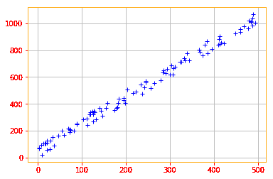
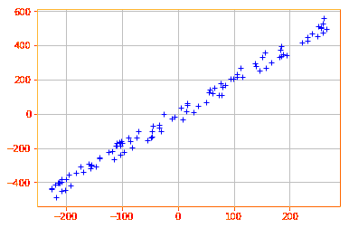
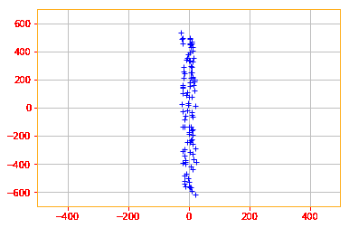

# 用 Tensorflow 2.0 进行主成分分析

> 原文：<https://dev.to/mmithrakumar/principal-components-analysis-with-tensorflow-2-0-21hl>

PCA 是一种复杂性降低技术，它试图将一组变量降低到代表变量中大部分信息的一组更小的分量。这可以被认为是对数据点集合应用有损压缩，这意味着通过牺牲一些精度来以需要更少内存的方式存储这些点。在概念层面上，PCA 通过识别共享方差的变量集，并创建一个组件来表示该方差。

早些时候，当我们进行转置或矩阵求逆时，我们依赖于使用 Tensorflow 的内置函数，但对于 PCA，除了 Tensorflow Extended (tft)中的一个函数之外，没有这样的函数。

有多种方法可以在 Tensorflow 中实现 PCA，但由于这种算法在机器学习领域非常重要，我们将选择更长的路线。

线性代数下有 PCA 的原因是为了说明 PCA 可以用我们在本章中学习的定理来实现。

```
# To start working with PCA, let's start by creating a 2D data set 
x_data = tf.multiply(5, tf.random.uniform([100], minval=0, maxval=100, dtype = tf.float32, seed = 0))
y_data = tf.multiply(2, x_data) + 1 + tf.random.uniform([100], minval=0, maxval=100, dtype = tf.float32, seed = 0)

X = tf.stack([x_data, y_data], axis=1)

plt.rc_context({'axes.edgecolor':'orange', 'xtick.color':'red', 'ytick.color':'red'})
plt.plot(X[:,0], X[:,1], '+', color='b')
plt.grid() 
```

Enter fullscreen mode Exit fullscreen mode

[](https://res.cloudinary.com/practicaldev/image/fetch/s--6gPgiApd--/c_limit%2Cf_auto%2Cfl_progressive%2Cq_auto%2Cw_880/https://raw.githubusercontent.com/adhiraiyan/DeepLearningWithTF2.0/master/notebooks/figures/ch02/output_108_0.png)

我们从标准化数据开始。尽管我们创建的数据使用相同的比例，但从标准化数据开始总是一个好的做法，因为大多数时候您将使用不同比例的数据。

```
def normalize(data):
    # creates a copy of data
    X = tf.identity(data)
    # calculates the mean
    X -=tf.reduce_mean(data, axis=0)
    return X

normalized_data = normalize(X)
plt.plot(normalized_data[:,0], normalized_data[:,1], '+', color='b')
plt.grid() 
```

Enter fullscreen mode Exit fullscreen mode

[](https://res.cloudinary.com/practicaldev/image/fetch/s--Zv1RvRAz--/c_limit%2Cf_auto%2Cfl_progressive%2Cq_auto%2Cw_880/https://raw.githubusercontent.com/adhiraiyan/DeepLearningWithTF2.0/master/notebooks/figures/ch02/output_110_0.png)

回想一下，PCA 可以被认为是对一组 *x* 数据点应用有损压缩。我们可以最小化精度损失的方法是找到某个解码函数 *f(x) ≈ c* ，其中 *c* 将是相应的向量。

PCA 由我们对这个解码函数的选择来定义。具体来说，为了使解码器非常简单，我们选择使用矩阵乘法来映射 *c* ，定义 *g(c) = Dc* 。我们的目标是最小化输入点 *x* 到其重建点之间的距离，为此我们使用 *L^2* 范数。这归结为我们的编码函数 *c = D^T x* 。

最后，为了重构 PCA，我们使用相同的矩阵 *D* 来解码所有点，并且为了解决这个优化问题，我们使用特征分解。

请注意，下面的等式是许多矩阵变换的最终版本。我没有提供导数，因为目标是关注数学实现，而不是推导。但是出于好奇，你可以在第 2 章第 11 节中阅读相关推导。

d^* = argmax_d Tr(d^T X^T Xd)服从 dd^T = 1

为了找到 *d* 我们可以计算特征向量 *X^T X* 。

```
# Finding the Eigne Values and Vectors for the data eigen_values, eigen_vectors = tf.linalg.eigh(tf.tensordot(tf.transpose(normalized_data), normalized_data, axes=1))

print("Eigen Vectors: \n{} \nEigen Values: \n{}".format(eigen_vectors, eigen_values))

Eigen Vectors:
[[-0.8908606  -0.45427683]
[ 0.45427683 -0.8908606 ]]
Eigen Values:
[   16500.715 11025234.   ] 
```

Enter fullscreen mode Exit fullscreen mode

特征向量(主分量)决定了新特征空间的方向，特征值决定了它们的大小。

现在，让我们用这些特征向量来旋转我们的数据。旋转的目标是以一个新的坐标系结束，在这个坐标系中，数据是不相关的，因此基轴收集了所有的方差。从而减小尺寸。

回想一下我们的编码函数 *c = D^T x* ，其中 *D* 是包含我们之前已经计算过的特征向量的矩阵。

```
X_new = tf.tensordot(tf.transpose(eigen_vectors), tf.transpose(normalized_data), axes=1)

plt.plot(X_new[0, :], X_new[1, :], '+', color='b')
plt.xlim(-500, 500)
plt.ylim(-700, 700)
plt.grid() 
```

Enter fullscreen mode Exit fullscreen mode

[](https://res.cloudinary.com/practicaldev/image/fetch/s--L-E-BHEY--/c_limit%2Cf_auto%2Cfl_progressive%2Cq_auto%2Cw_880/https://raw.githubusercontent.com/adhiraiyan/DeepLearningWithTF2.0/master/notebooks/figures/ch02/output_114_0.png)

这是转换后的数据。

* * *

这是《用 Tensorflow 2.0 进行深度学习》一书《用 Tensorflow 2.0 进行线性代数》一章的第十二节。

您可以阅读本节和以下主题:

02.01 —标量、向量、矩阵和张量
02.02 —乘法矩阵和向量
02.03 —单位矩阵和逆矩阵
02.04 —线性相关性和跨度
02.05 —范数
02.06 —特殊类型的矩阵和向量
02.07 —特征分解
02.08 —奇异值分解
02.09 —摩尔-彭罗斯伪逆
02

在[用 TF 2.0 深度学习:02.00-线性代数](https://www.adhiraiyan.org/deeplearning/02.00-Linear-Algebra)。你可以在这里获得这篇文章和本章[其余部分的代码。Google Colab 和 Jupyter Binder 中笔记本的链接在](https://github.com/adhiraiyan/DeepLearningWithTF2.0)[笔记本](https://www.adhiraiyan.org/deeplearning/02.00-Linear-Algebra)的末尾。