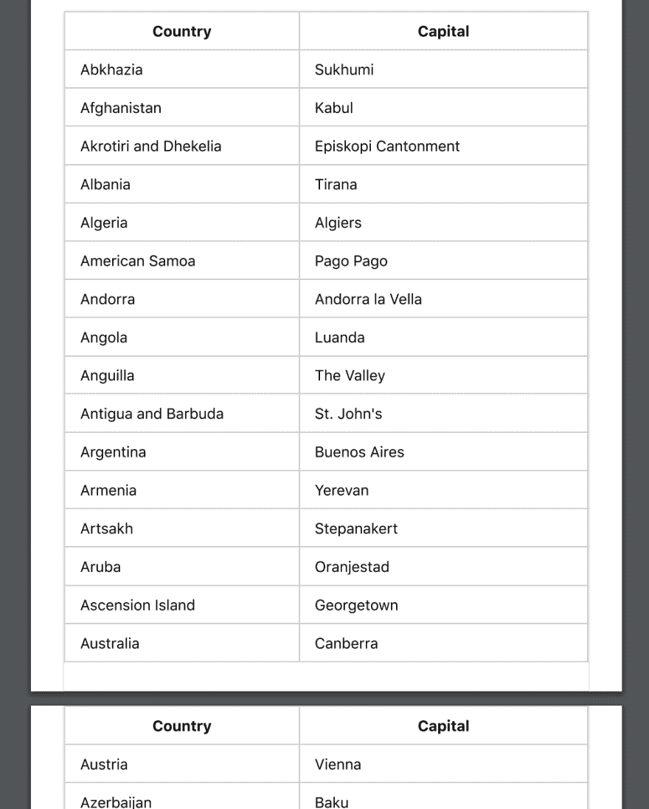
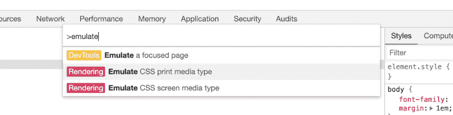
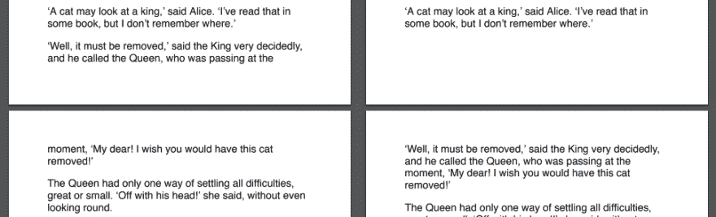

# 10 分钟内打印 CSS 基础知识

> 原文：<https://dev.to/nickpad/print-css-basics-in-10-minutes-41jk>

这篇文章将教你开始为打印页面编写 CSS 所需的一切。

您可能正在为要转换为 PDF 的 web 应用程序构建页面。或者，也许你只是想让你的站点现有的页面在用户打印时看起来更好。

# @媒体法则

如果你做过任何响应式设计，你就会知道`@media`规则。除了不同的屏幕尺寸，`@media`还允许您选择“打印”媒体。这里有一个例子:

```
@media print {
  /* These styles will only be used when the page is printed or saved to PDF. */
  h1 { font-size: 16pt; }
} 
```

使用此规则，您可以将标准 CSS 指定为普通样式，然后添加一些仅在打印时使用的自定义样式。

```
p { margin: 1em 0; }

@media print {
  /* Hide related article links when printing. */
  .related-articles { display: none; }
} 
```

如果你想“清除”所有的标准屏幕样式，从
开始，你可以用另一个`@media`规则来包装你的屏幕样式:

```
@media screen {
  /* standard styles here. */
}

@media print {
  /* print styles here. */
} 
```

# 分页符属性

为了确保内容在页面间顺畅流动，您需要控制内容何时在页面间拆分。例如，如果一个大标题出现在页面的底部，看起来会很尴尬——你希望它在新的一页开始。同样，如果可能的话，您可能希望避免一个表跨越多个页面。

您可以使用`page-break-before`、`page-break-after`和`page-break-inside`来完成此操作。您可以将这些属性的值设置为`always`或`avoid`。

```
h1 {
  /* h1 elements always start on the top of a new page. */
  page-break-before: always;
}

section.city-map {
  /* this section always occupies it's own page or pages. */
  page-break-before: always;
  page-break-after: always;
}

table {
  /* tables don't split across pages if possible. */
  page-break-inside: avoid;
} 
```

# 提示:重复表格标题

如果您的文档中有跨越多页的表格，打印时将很难阅读，除非表格标题在每页的开头重复出现。这很容易实现——只需使用表中的`thead`和`tbody`元素。

```
<table>
  <thead>
    <tr>
      <th>City</th>
      <th>Population</th>
  </thead>
  <tbody>
    <tr>
      <td>Sydney</td>
      <td>4.627 million (2018)</td>
    </tr>
  </tbody>
</table> 
```

打印出来后，您的表格将如下所示:

[](https://res.cloudinary.com/practicaldev/image/fetch/s--eXOJraZD--/c_limit%2Cf_auto%2Cfl_progressive%2Cq_auto%2Cw_880/https://thepracticaldev.s3.amazonaws.com/i/4vea0qxsfl7r6bipxv96.png)

# 提示:添加或删除内容

有时您可能想要添加仅在打印时显示的内容。例如，您可能想要链接要打印的 URL。您可以通过使用`:after`伪元素:
来做到这一点

```
@media print {
  a[href]:after {
    content: " (" attr(href) ")";
  }
} 
```

您可能还希望仅在打印时隐藏或显示某些元素。通过组合`@media`和`display`，这可以很容易地完成。

```
/* hide the watermark on screens. */
.watermark {
  display: none;
}

@media print {
  /* hide the navidation when printing. */
  nav {
    display: hide;
  }
  /* show the watermark when printing */
  .watermark {
    display: initial;
  }
} 
```

# 提示:使用仿真 CSS 媒体进行开发

为了加快开发过程中的反馈循环，您可以将浏览器设置为显示打印样式。要在 Mac 上的 Chrome 中做到这一点，请打开开发者工具，然后使用 command-shift-P 快捷键“运行命令”并搜索“模拟 CSS 打印媒体类型”。

[](https://res.cloudinary.com/practicaldev/image/fetch/s--EcPwdgch--/c_limit%2Cf_auto%2Cfl_progressive%2Cq_auto%2Cw_880/https://thepracticaldev.s3.amazonaws.com/i/id71gkks06xlnuqinwdc.png)

其他浏览器的开发工具中也会有类似的特性。

不幸的是，要看到分页符，你每次都需要手动打印成 PDF 格式。

# 高级提示:孤儿寡妇

`orphans`和`widows`属性控制元素中的文本如何跨页面拆分。有时调整这些值可以提高打印文档的可读性。

```
p {
  /* if there aren't at least three lines before the page
     break, move the element to the start of a new page. */
  orphans: 3;
} 
```

[](https://res.cloudinary.com/practicaldev/image/fetch/s--l2uXshBm--/c_limit%2Cf_auto%2Cfl_progressive%2Cq_auto%2Cw_880/https://thepracticaldev.s3.amazonaws.com/i/h0x2jtmf8e2qezhirv9h.png)

在左下方，`orphans`被设置为 2，所以第二段在分页之前开始
。通过将`orphans`设置为 3，如右图所示，将
段落向下强制到下一页的开始处。

`widows`属性与`orphans`相反——它指定了新页面开始时的最小行数。

# 高级提示:@page 规则

使用`@page`规则，您可以定制特定页面的页边距。

```
@page:first {
  /* No margin on the first page. */
  margin: 0;
}

@page {
  /* Set a margin on all other pages. */
  margin: 2cm;
} 
```

不幸的是，浏览器对此的支持目前有点有限，你
只能使用`:first`、`:last`、`:left`、`:right`和`:blank`
伪选择器来选择页面。

# 总结

您现在已经熟悉了 Chrome、Firefox 和 Safari 等现代浏览器支持的打印布局的重要属性。

不幸的是，现代
浏览器对更高级的打印布局功能的支持通常是有限的。例如，浏览器不提供使用 CSS 添加自定义页眉或页脚内容的标准方式。你可能想看看 [paged.js 项目](https://www.pagedmedia.org/paged-js/)，它为浏览器目前缺少的许多打印布局特性提供了多种填充。