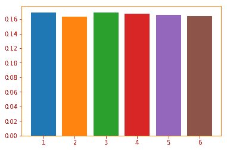
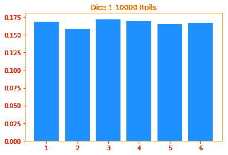
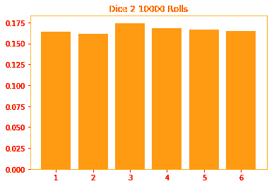
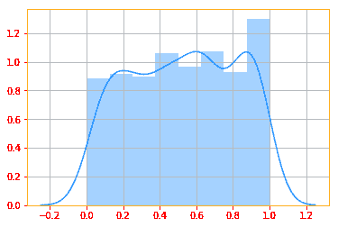
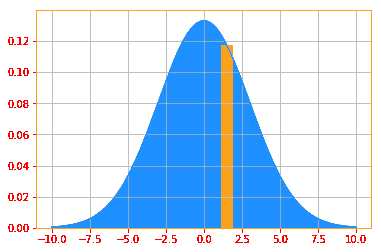

# Tensorflow 2.0 的概率分布

> 原文：<https://dev.to/mmithrakumar/probability-distributions-with-tensorflow-2-0-c7i>

一个**概率分布**是一个随机变量或一组随机变量呈现其每一种可能状态的可能性的描述。我们描述概率分布的方式取决于变量是离散的还是连续的。

#### **3.3.1 离散变量和概率质量函数**

离散变量的概率分布可以用**概率质量函数(PMF)** 来描述。概率质量函数从随机变量的状态映射到该随机变量呈现该状态的概率。

例如，骰子的滚动是随机的，离散变量意味着骰子上只能有 1、2、3、4、5 或 6 个数字，中间没有值。

我们用 **P** 表示概率质量函数，其中我们用 P(X = x)表示一个 **PMF** 方程。这里 *x* 可以是骰子上的一个数字，此时 **X** 是掷骰子的事件。

```
"""
In a fair 6 sided dice, when you roll, each number has a chance of 1/6 = 16.7% of landing and we can show
this by running long enough rolls. So in this example, we do 10000 rolls and we verify that P(X=4) = 16.7%.
In short, the probability from a PMF says what chance x has. Play around with the different x values, number of rolls and sides and see what kind of probability you get and see if it makes sense.
"""

def single_dice(x, sides, rolls):
    """Calculates and prints the probability of rolls.
    Arguments:
        x (int)        : is the number you want to calculate the probability for.
        sides (int)    : Number of sides for the dice.
        rolls (int)    : Number of rolls.
    Returns:
        a printout.
    """

    result = roll(sides, rolls)
    for i in range(1, sides +1):
        plt.bar(i, result[i] / rolls)
    print("P(X = {}) = {}%".format(x, tf.divide(tf.multiply(result[x], 100), rolls)))

def roll(sides, rolls):
    """Returns a dictionary of rolls and the sides of each roll.
    Arguments:
        sides (int)    : Number of sides for the dice.
        rolls (int)    : Number of rolls.
    Returns:
        a dictionary.
    """

    d = defaultdict(int)                    # creating a default dictionary
    for _ in range(rolls):
        d[random.randint(1, sides)] += 1    # The random process
    return d

single_dice(x=6, sides=6, rolls=10000)

P(X = 6) = 16.43% 
```

Enter fullscreen mode Exit fullscreen mode

[](https://res.cloudinary.com/practicaldev/image/fetch/s--QVbZN80G--/c_limit%2Cf_auto%2Cfl_progressive%2Cq_auto%2Cw_880/https://raw.githubusercontent.com/adhiraiyan/DeepLearningWithTF2.0/master/notebooks/figures/ch03/output_14_1.png)

要成为随机变量 x 上的 **PMF** ，函数 **P** 必须满足以下性质:

*   **P** 的定义域必须是 x 的所有可能状态的集合。在我们上面的例子中，x 的可能状态是从 1 到 6，尝试为 x 插入 7，看看会得到什么值。

*   ∀ x ∈，0≤P(x)≤1。一个不可能发生的事件的概率为 0，没有任何状态比这更不可能了。同样，一个确定会发生的事件的概率是 1，没有一个状态有更大的可能性发生。如果你在上面的例子中插入 7，你会看到获得 7 的概率是零，这是不可能的，因为 7 不在我们的集合中。

*   ∑_x∈x P(x)=1。防止获得大于 1 的概率的规范化属性。也就是说，如果你把所有骰子概率的单个值相加，总和应该是 1 或 100%。

概率质量函数可以同时作用于许多变量。许多变量的这种概率分布被称为**联合概率质量函数**。p(x = x；y=y) = P(x)P(y)表示 x=x 和 y=y 同时发生的概率。

```
"""
In this example, we are rolling two dices, there are ways to simplify the code so it's not this long but
I wanted to show that we are rolling two dice 1000 times, and in the example we are calculating the probability
of rolling x=4 and y=1, this can be easily calculated by multiplying the individual probabilities of x and y."""

def multi_dice(x, y, sides, rolls, plot=True):
    """Calculates the joint probability of two dice.
    Arguments:
        x (int)        : is the number you want to calculate the probability for.
        y (int)        : is the number you want to calculate the probability for.
        sides (int)    : Number of sides for the dice.
        rolls (int)    : Number of rolls.
        plot (bool)    : Whether you want to plot the data or not.
    Returns:
        probabilities (float).
    """

    result1 = roll(sides, rolls)                         # first result from the rolls
    result2 = roll(sides, rolls)                         # second result from the rolls
    prob_x = tf.divide(result1[x], rolls)                # calculates the probability of x
    prob_y = tf.divide(result2[y], rolls)                # calculates the probability of y
    joint_prob = tf.multiply(prob_x, prob_y)             # calculates the joint probability of x&y by multiplying 
    if plot:
        for i in range(1, sides +1):
            plt.title("Dice 1 {} Rolls".format(rolls))
            plt.bar(i, result1[i] / rolls, color=color_b)
        plt.show()
        for i in range(1, sides +1):
            plt.title("Dice 2 {} Rolls".format(rolls))
            plt.bar(i, result2[i] / rolls, color=color_o)
        plt.show()

    return prob_x, prob_y, joint_prob

prob_x, prob_y, joint_prob = multi_dice(x=4, y=1, sides=6, rolls=10000, plot=True)
print("P(x = {:.4}%), P(y = {:.4}%), P(x = {}; y = {}) = {:.4}%\n\n".format(tf.multiply(prob_x, 100),
                                                                 tf.multiply(prob_y, 100),
                                                                 4, 1, tf.multiply(joint_prob, 100)))

P(x = 16.9%), P(y = 16.39%), P(x = 4; y = 1) = 2.77% 
```

Enter fullscreen mode Exit fullscreen mode

[](https://res.cloudinary.com/practicaldev/image/fetch/s--GGERTpWI--/c_limit%2Cf_auto%2Cfl_progressive%2Cq_auto%2Cw_880/https://raw.githubusercontent.com/adhiraiyan/DeepLearningWithTF2.0/master/notebooks/figures/ch03/output_17_0.png)

[](https://res.cloudinary.com/practicaldev/image/fetch/s--ecYzA-HT--/c_limit%2Cf_auto%2Cfl_progressive%2Cq_auto%2Cw_880/https://raw.githubusercontent.com/adhiraiyan/DeepLearningWithTF2.0/master/notebooks/figures/ch03/output_17_1.png)

#### **3.3.2 连续变量和概率密度函数**

当处理连续随机变量时，我们使用**概率密度函数(PDF)** 来描述概率分布。

我们来玩个游戏，好吗，如果我让你猜一猜我在想的 1 到 10 之间的整数，不管你选哪个数字，每个选项的概率都是一样的(1/10 ),因为你有 10 个选项，而且概率总和必须是 1。

但是如果我让你猜一个介于 0 和 1 之间的真实数字呢？现在这变得棘手了，我可以想到 0.2，0.5，0.0004，它可以继续下去，可能性是无限的。所以我们会遇到这样的问题，既然有无限个数字，我们如何描述每个选项的概率。这就是 **PDF** 的用武之地，我们不是询问确切的概率，而是寻找一个接近单一数字的概率。

```
"""
In our guessing game example, I told you how difficult it would be for you to guess a real number I am thinking of
between 0 and 1 and below, we plot such a graph with minval of 0 and maxval of 1 and we "guess" the values 500
times and the resulting distribution is plotted.
"""

# Outputs random values from a uniform distribution continuous = tf.random.uniform([1, 500], minval=0, maxval=1, dtype=tf.float32)
g = sns.distplot(continuous, color=color_b)
plt.grid() 
```

Enter fullscreen mode Exit fullscreen mode

[](https://res.cloudinary.com/practicaldev/image/fetch/s--v1_DPU0G--/c_limit%2Cf_auto%2Cfl_progressive%2Cq_auto%2Cw_880/https://raw.githubusercontent.com/adhiraiyan/DeepLearningWithTF2.0/master/notebooks/figures/ch03/output_20_0.png)

为了成为概率密度函数，函数 *p* 必须满足
以下性质:

*   p 的定义域一定是 x 的所有可能状态的集合

*   ∀ x∈x，p(x)≥0。注意，我们不要求 p(x)≤1

*   ∫p(x)dx=1

概率密度函数 p(x)并不直接给出特定状态的概率；相反，落在体积为δx 的无限小区域内的概率由 p(x)δx
给出

```
"""
Below is the same histogram plot of our continuous random variable, note that the values of y axis looks different
between the seaborn distplot and the histogram plot because the sns distplot is also drawing a density plot.
You can turn it off by setting ‘kde=False’ and you will get the same plot as you see below.
The goal of the following plot is to show you that if you want to calculate the p(0.3) then you would need to
calculate the volume of the region delta x
"""

n, bins, patches = plt.hist(continuous, color=color_b)
patches[3].set_fc(color_o)
plt.grid() 
```

Enter fullscreen mode Exit fullscreen mode

[](https://res.cloudinary.com/practicaldev/image/fetch/s--dLubqqXx--/c_limit%2Cf_auto%2Cfl_progressive%2Cq_auto%2Cw_880/https://raw.githubusercontent.com/adhiraiyan/DeepLearningWithTF2.0/master/notebooks/figures/ch03/output_23_0.png)

我们可以对密度函数进行积分，找到一组点的实际概率质量。具体来说， *x* 位于某个集合 **S** 中的概率由 p(x)在该集合上的积分(∫_[a，b]p(x)dx)给出

**张量流概率分布库**

从这里开始，我们将经常使用 [TFP 发行版](https://www.tensorflow.org/probability/api_docs/python/tfp/distributions)模块，我们称它为 tfd (=tfp.distributions)。所以，在开始之前，让我解释一下关于这个模块的一些事情。

TF 概率使用分布子类来表示随机变量。回想一下不确定性的第一个原因，固有的随机性。这意味着即使我们知道变量参数的所有值，它仍然是随机的。我们将在第 9 节看到这些分布的例子。在前面的例子中，我们使用随机变量创建了分布，但是从中提取样本并对其进行操作不会像使用 tfp 分布库时那样直观。我们通常从创建一个分布开始，然后当我们从中抽取样本时，这些样本就变成了可以确定性操作的张量流张量。

tfd 中的一些常用方法:

*   sample(sample_shape=()，seed=None):生成指定的样本大小
*   mean():计算平均值
*   mode():计算模式
*   variance():计算方差
*   stddev():计算标准偏差
*   prob(value):计算概率密度/质量函数
*   log_prob(value):计算对数概率密度/质量函数。
*   熵():nats 中的香农熵。

```
"""
Let's say we want to find the probability of 1.5 (p(1.5)) from a continuous distribution. We can ofcourse
do the integral and find it but in tensorflow probability you have "prob()" which allows you to calculate
both Probability Mass Function and Probability Density Function.
For tfp.distributions.Normal "loc" is the mean and "scale" is the std deviation. Don't worry if you don't
understand those, we will go through distributions in Section 9\. And I recommend you come back and go through
these examples again after you finish section 9.

Also, there's nothing special about these numbers, play around with the scale, p(x) values and the k limits to
get a better understanding.
"""
import tensorflow_probability as tfp
tfd = tfp.distributions

# creating an x axis samples = tf.range(-10, 10, 0.001)

# Create a Normal distribution with mean 0 and std deviation 3 normal_distribution = tfd.Normal(loc=0., scale=3)

# Then we calculate the PDFs of drawing 1.25 pdf_x = normal_distribution.prob(1.5)

# We can't plot tensors so evaluate is a helper function to convert to ndarrays [pdf_x_] = evaluate([pdf_x])

# Finally, we plot both the PDF of the samples and p(1.25) plt.plot(samples, normal_distribution.prob(samples), color=color_b)
plt.fill_between(samples, normal_distribution.prob(samples), color=color_b)
plt.bar(1.5, pdf_x_, color=color_o)
plt.grid()

print("Probability of drawing 1.5 = {:.4}% from the normal distribution".format(pdf_x*100))

Probability of drawing 1.5 = 11.74% from the normal distribution 
```

Enter fullscreen mode Exit fullscreen mode

[](https://res.cloudinary.com/practicaldev/image/fetch/s--R6eJk2DL--/c_limit%2Cf_auto%2Cfl_progressive%2Cq_auto%2Cw_880/https://raw.githubusercontent.com/adhiraiyan/DeepLearningWithTF2.0/master/notebooks/figures/ch03/output_26_1.png)

* * *

这是《用 Tensorflow 2.0 进行深度学习》一书《用 Tensorflow 2.0 进行概率和信息论》一章的第三节。

您可以阅读本节和以下主题:

03.00 -概率与信息论
03.01 -为什么是概率？
03.02 -随机变量
03.03 -概率分布
03.04 -边际概率
03.05 -条件概率
03.06 -条件概率的链式法则
03.07 -独立性和条件独立性
03.08 -期望、方差和协方差
03.09 -常见概率分布
03.10 -常用函数的有用性质
03.11 -贝叶斯' 1

在[用 TF 2.0 深度学习:03.00-概率论与信息论](https://www.adhiraiyan.org/deeplearning/03.00-Probability-and-Information-Theory)。你可以在这里获得这篇文章和本章[其余部分的代码。Google Colab 和 Jupyter Binder 中笔记本的链接在](https://github.com/adhiraiyan/DeepLearningWithTF2.0)[笔记本](https://www.adhiraiyan.org/deeplearning/03.00-Probability-and-Information-Theory)的末尾。