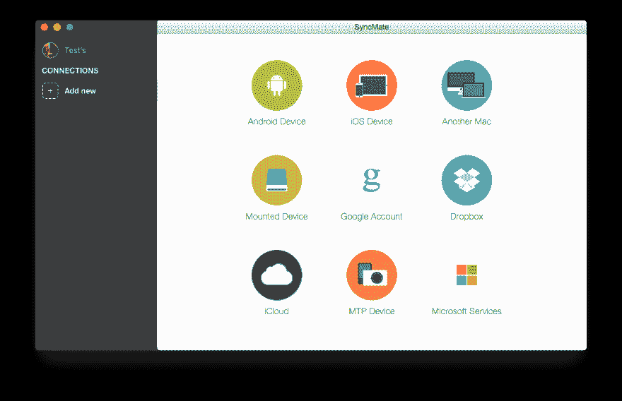

# 可能是在 Mac 上与众多设备同步数据的最佳应用程序

> 原文：<https://dev.to/jacobtucker101/probably-the-best-app-to-sync-data-on-mac-with-numerous-devices-5597>

Mac 用户总是明白，他们的 Mac 电脑可以很容易地与苹果公司的其他产品连接。你可以使用的所有苹果设备和账户都与通风同步。

但除此之外，许多用户在 Mac 上用与苹果没有任何联系的小工具存储信息时也会遇到这种情况。对于许多用户来说，这是最大的痛苦，就像苹果公司不提供存储 Mac 信息的能力一样。

对于很多用户来说，这种表格任务的结论是使用云资源和行业，用户根据这些资源和行业手动将自己的信息与用户账号同步，带来了尴尬，也耗费了大量时间。如果你既想娱乐自己，又想节省手动管理信息和将文件上传到云中的时间，在这种情况下，这份出版物可能对你足够有用。

使用 [SyncMate](https://www.sync-mac.com/) ，这是一个旨在通过几次点击来执行同步问题的附加组件。它真的很舒服，并且将与苹果属无关的其他设备的信息与您的 Mac PC 同步。

SyncMate 这个个人同步部门和这个基础把这个附加组件和它区分开来。(就你所知，苹果早在很久以前就移除了自己的同步服务，因为这总是苹果停止工作的同步服务的附加功能)

SyncMate 旨在与您的 Mac 和 Android 和 iOS 设备、Windows 服务(Outlook、Office 365 Business 和 Office 365 Home 帐户)以及其他 Mac、Google、Dropbox 和 iCloud 帐户配合使用，这些帐户通常都附带有保存小工具和 MTP 设备。

SyncMate 分为 2 个版本-免费和专家。

免费的 SyncMate 在 MAC 和支持的设备/帐户之间同步联系人和日历方面做得非常好。专家版总是在 MAC 和支持的小工具/帐户、Safari 书签之间同步与多媒体(视频、图像、音乐)、任务/提醒和单个文件夹相关的内容。

SyncMate Expert 能够提供 AutoSync 选项，允许机器通过任何支持设备调整各种同步参数。

对于任何适用的小工具或帐户日志，同步参数通常是不同的，这一点非常重要。访问 SyncMate 的官方页面，以便根据您的设备或帐户日志的目的验证组合的参数。

SyncMate 应用程序将使同步来自 Android 和 Mac 的信息成为可能，没有这样的附加功能这是不够的。这种趋势以这种方式积累名声(以及基于 Android 的设备在 Mac 爱好者中的需求总是更重要、更显著。

SyncMate 在设置的同步问题上表现出色，可以轻松同步联系人、文书动作、多媒体数据、完整文件夹、书签等，远远超过任何 Mac 和 Android。

如果您想预订自己的信息，而不包含云和手动传输信息。蚂蚁。自动，在这种情况下，SyncMate 是一个非常好的结论，用于 Mac 和 Android 之间的同步。

SyncMate 是用于同步目的的最舒适且可能是唯一的工具，它出色地提供了这种广泛支持的设备和功能。