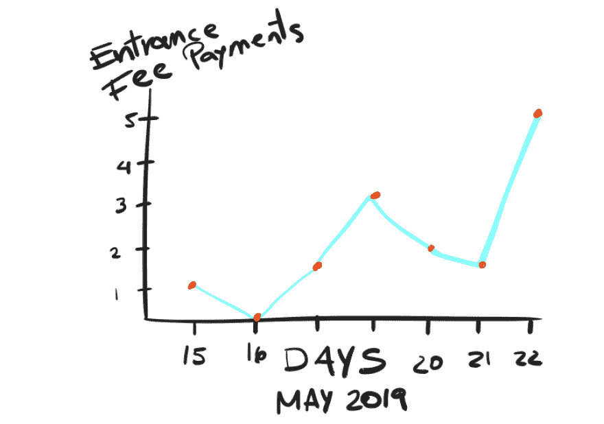
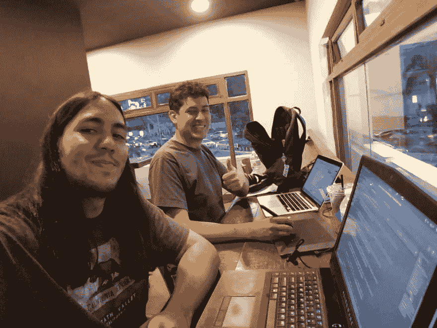

# 处理写在区块链上的黑客马拉松数据

> 原文：<https://dev.to/turupawn/processing-the-hackathon-munon-data-written-on-the-blockchain-gk>

在以太坊的第一轮黑客马拉松之后，我们现在正坐在参与者添加到区块链的原始数据中。所以我们决定参与一项[数字硬币奖励](https://gitcoin.co/issue/gitcoinco/skunkworks/117/2948)来处理有意义的数据并向所有人公开。

相当刺激！

因此，约翰和我在一家咖啡馆会面，讨论这个问题，目前为止，这些数据听起来与我们相关:

#### 对组织者有用的数据

1.  在活动日期前预付的费用百分比

 
*这可能有助于我们理解参与者何时注册并预期到它*

#### 对有兴趣参与的人有用的数据

1.  %的参与者兑现的 Eth 超过了入场费
2.  参与者平均收集了 X 乙醚
3.  参与者平均评审分数 X
4.  最高参与者评审分数 X
5.  收集的顶级参与者乙醚 X

注意:上述数据可以放入*所有时间*类别，也可以按事件分类(到目前为止我们有 2 个事件)。

你们觉得怎么样？有什么意见吗？不然我就开始编码了！

约翰和我在咖啡馆弄清楚了这一点:

