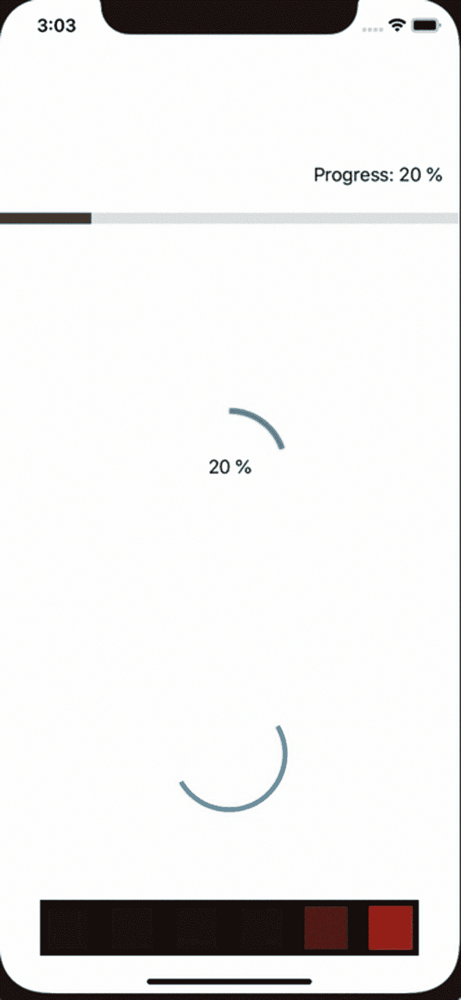

# SwiftUI 中的进度条

> 原文：<https://dev.to/gualtierofr/progress-bar-in-swiftui-24a3>

原帖在此[http://www.gfrigerio.com/progress-bar-in-swiftui/](http://www.gfrigerio.com/progress-bar-in-swiftui/)

进度条和活动指示器是我们在 iOS 应用程序中经常使用的东西，定制它们而不是一直使用标准的 UIActivityIndicatorView 是很好的。我认为 SwiftUI 让构建这种视图变得非常容易，我在我的 GitHub 项目样本中实现了其中的 4 个，你可以在这里找到

[](https://res.cloudinary.com/practicaldev/image/fetch/s--87W9YUNu--/c_limit%2Cf_auto%2Cfl_progressive%2Cq_66%2Cw_880/https://raw.githubusercontent.com/gualtierofrigerio/SwiftUIProgressBar/master/progressbar_simulator.gif)

### [T1】简介](#intro)

我用一个计时器来模拟一个活动的进度，你可以在这里看到实现

```
struct ContentView: View {

    @State var progressBarValue:CGFloat = 0

    var body: some View {
        VStack {
            ProgressBar(value: $progressBarValue)
            CircularProgressBar(value: $progressBarValue)
            CircularActivityIndicatory()
            KnightRider()
        }.onAppear {
            Timer.scheduledTimer(withTimeInterval: 0.5, repeats: true) { timer in
                self.progressBarValue += 0.1
                if (self.progressBarValue >= 0.9) {
                    timer.invalidate()
                }
            }
        }
    }
} 
```

我设置的值从 0 到 1，然后转换成要写在文本标签上的百分比。当我达到 1 时，我可以使计时器无效，这样进度条停止动画，而活动指示器没有值限制，永远继续动画。

### 简单进度条

让我们从一个简单的进度条开始，它是一条从左到右的线，右上角有一个标签显示进度值。这个视图的代码可以在[这里](https://github.com/gualtierofrigerio/SwiftUIProgressBar/blob/master/SwiftUIProgressBar/ProgressBar.swift)
找到

```
struct ProgressBar: View {
    @Binding var value:CGFloat
    ...
} 
```

首先，我使用@Binding，因为我有一个外部管理的 CGFloat 值，而不是由这个视图管理。在我们的例子中，ContentView 增加了值，每个带有@Binding 的视图都会自动更新。

更新:在这种情况下，我可以使用一个简单的 var，因为值被另一个视图更新，SwiftUI 每次有新值时都会重新设计这个视图。@Binding 有必要以两种方式与另一个视图共享一个值，所以如果你还需要更新值

```
func getProgressBarWidth(geometry:GeometryProxy) -> CGFloat {
    let frame = geometry.frame(in: .global)
    return frame.size.width * value
}

func getPercentage(_ value:CGFloat) -> String {
    let intValue = Int(ceil(value * 100))
    return "\(intValue) %"
} 
```

这是几个实用函数，一个计算每次进度值变化时绿线的宽度，另一个打印从 0 到 100%的百分比值。
现在让我们看看视图的主体

```
var body: some View {
    GeometryReader { geometry in
        VStack(alignment: .trailing) {
            Text("Progress: \(self.getPercentage(self.value))")
                .padding()
            ZStack(alignment: .leading) {
                Rectangle()
                    .opacity(0.1)
                Rectangle()
                    .frame(minWidth: 0, idealWidth:self.getProgressBarWidth(geometry: geometry),
                           maxWidth: self.getProgressBarWidth(geometry: geometry))
                    .opacity(0.5)
                    .background(Color.green)
                    .animation(.default)
            }
            .frame(height:10)
        }.frame(height:10)
    }
} 
```

什么是几何阅读器？这是一个提供 GeometryProxy 对象的容器视图，因此我们能够知道视图的大小，就像您之前在 getProgressBarWidth 中看到的那样。您可能会发现一些使用 relativeWidth 的旧示例，但它已被否决，在 beta 5 中不再存在，所以我必须找到一种方法来指定绿色栏的宽度，我必须在 Rectangle 上使用 GeometryReader 和 frame 修饰符。进度条由一个标签和几个矩形组成，一个是灰色背景，另一个是绿色矩形，其大小是根据进度值计算的。
VStack 允许我们将一个视图放在另一个视图的上方(在本例中是矩形上方的文本),而 ZStack 将视图放在 Z 轴上的另一个视图的上方，因此我们可以将第二个矩形放在第一个视图的上方。
第一个矩形只有它的不透明度设置，而第二个有绿色背景和动画，但最重要的是它有帧修改器设置。这是我避免使用 relativeWidth 的变通方法，我将 minWidth 设置为 0，每次值改变时都计算 idealWIdth 和 maxWidth。使用。动画允许我们将帧属性的改变动画化，所以我们将看到进度条从 0 到 10%动画化，然后从 10 到 20 等等。

### 圆形进度条

我的第二个进度条是一个从 0 到 100%顺时针画的圆，中间有一个标签打印当前值。这个例子可以在[这里找到](https://github.com/gualtierofrigerio/SwiftUIProgressBar/blob/master/SwiftUIProgressBar/CircularProgressBar.swift)

```
var body: some View {
    ZStack {
        Circle()
            .trim(from: 0, to: value)
            .stroke(Color.green, lineWidth:5)
            .frame(width:100)
            .rotationEffect(Angle(degrees:-90))
        Text(getPercentage(value))
    }
} 
```

我使用。trim 修改器只画圆的一部分，我不需要转换值，因为 trim 期望一个从 0 到 1 的数字。Stroke 设置线条的颜色和宽度，frame 基本上是圆的直径。我不得不使用 rotationEffect 将圆的第一个点画在最上面。
就是这样，在我看来超级简单好看。

### 圆形活动指示器

活动指示器的工作方式类似于圆形进度条，但我们需要不断旋转圆圈，直到视图从屏幕上移除，所以我们必须改变一些东西，见完整代码[此处](https://github.com/gualtierofrigerio/SwiftUIProgressBar/blob/master/SwiftUIProgressBar/CircularActivityIndicatory.swift)

```
@State var spinCircle = false

var body: some View {
    ZStack {
        Circle()
            .trim(from: 0.5, to: 1)
            .stroke(Color.blue, lineWidth:4)
            .frame(width:100)
            .rotationEffect(.degrees(spinCircle ? 0 : -360), anchor: .center)
            .animation(Animation.linear(duration: 1).repeatForever(autoreverses: false))
    }
    .onAppear {
        self.spinCircle = true
    }
} 
```

因为没有进度值，所以我用了一个布尔值来开始动画。正如你看到的，我这次修剪了半个圆，所以我们只有半个圆在旋转。在 rotationEffect 上，我必须设置一个条件来获得动画，所以我从 0°到-360°，使用–符号来获得顺时针方向的动画是很重要的。请注意，这次动画有 repeatForever 修改器，autoreverses 设置为 false。如果你让它为真，圆将完成一次旋转，然后逆时针返回，然后再顺时针旋转，如此类推。

### 霹雳游侠

你们中的一些人可能不记得 [Knight Rirder](https://www.imdb.com/title/tt0083437/) 或者根本没有看过，但它在我小时候很受欢迎，我喜欢 KITT 和这部车的动画。我试着复制它作为一个活动指示器，只是为了好玩，我对它很满意，看[这里](https://github.com/gualtierofrigerio/SwiftUIProgressBar/blob/master/SwiftUIProgressBar/KnightRider.swift)完整的实现。

```
struct KnightRiderRect: View {

    var index:Int
    var publisher:PassthroughSubject

    @State private var animate = false

    var body: some View {
        Rectangle()
            .foregroundColor(Color.red)
            .opacity(animate ? 1 : 0.2)
            .frame(width:40, height:40)
            .padding(.all, 5)
            .animation(Animation.linear(duration: 0.3))
            .onReceive(publisher) { value in
                switch value {
                case .start(let index):
                    if index == self.index {
                        self.animate = true
                    }
                    else {
                        self.animate = false
                    }
                case .stop(let index):
                    if index == self.index {
                        self.animate = false
                    }
                case .stopAll:
                    self.animate = false
                }

            }
    }
} 
```

首先，我为单个矩形实现了一个结构。每个视图都有自己的索引，所以我可以通过 publisher 以编程的方式启动和停止它，PassthroughSubject 作为参数传递。动画将不透明度从 0.2 变为 1，所以如果我开始动画，我会得到一个红点，否则它会变暗。要打开单个矩形，我可以发布一个新值来启动动画，只有具有指定索引的矩形才会启动动画并变红，否则它会变暗，仍然显示动画。

```
struct KnightRider: View {

    @State private var increment = true
    @State private var currentIndex = 0
    @State private var publisher = PassthroughSubject()

    var body: some View {
        HStack {
            KnightRiderRect(index:0, publisher:publisher)
            KnightRiderRect(index:1, publisher:publisher)
            KnightRiderRect(index:2, publisher:publisher)
            KnightRiderRect(index:3, publisher:publisher)
            KnightRiderRect(index:4, publisher:publisher)
            KnightRiderRect(index:5, publisher:publisher)
        }
        .background(Color.black)
        .onAppear {
            Timer.scheduledTimer(withTimeInterval: 0.15, repeats: true) { timer in
                if self.increment {
                    if self.currentIndex > 5 {
                        self.increment = false
                        self.currentIndex = 5
                        self.publisher.send(.stopAll)
                    }
                    else {
                        self.publisher.send(.start(index: self.currentIndex))
                        self.currentIndex += 1
                    }
                }
                else {
                    if self.currentIndex < 0 {
                        self.increment = true
                        self.currentIndex = 0
                        self.publisher.send(.stopAll)
                    }
                    else {
                        self.publisher.send(.start(index: self.currentIndex))
                        self.currentIndex -= 1
                    }
                }
            }
        }
    }
} 
```

增量变量是必要的，以知道我是否必须从左向右打开点，或者反之亦然。当我到达终点时，我切换增量值，并开始递减或递增 currentIndex 变量。这样我就能从容器视图控制子视图上的动画。你对实现有什么看法？请让我知道，并随时在您的项目中使用这些视图。编码快乐！