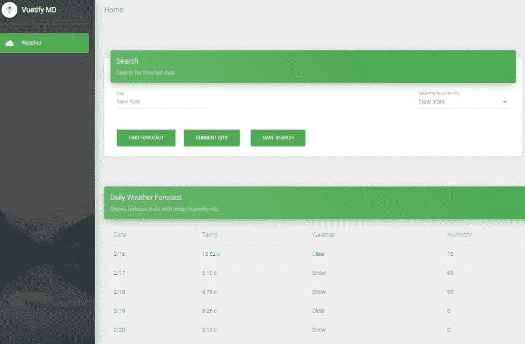

# 使用 Vue.js 的渐进式 Web 应用程序(PWA)快速入门示例项目

> 原文：<https://dev.to/ashrafalam/progressive-web-applications-pwa-quick-start-sample-project-with-vue-js-2nmi>

渐进式 web 应用程序(PWA)正在重新定义 Web 用户体验，就像本地应用程序一样，具有离线、通知支持等功能。

Vue。JS 正在成为推动 web 体验进入 PWA 下一个层次的主要框架之一。

最近一直在尝试，从头开始构建了一个简单的天气应用程序。

对 PWA 感兴趣的人可以查看下面的 github repo，看看用 VueJS 构建 PWA 有多简单。

## PWA 天气应用功能

*   能够查看给定城市每小时和每天的天气预报
*   能够根据当前位置选择城市
*   能够保存喜欢的城市(离线功能)
*   离线查看用户界面和天气数据的能力
*   显示离线状态的能力

## 给个星！⭐️

如果你喜欢或正在使用这个项目来学习或开始你的解决方案，请给它一个[星](https://github.com/AshrafAlam/vue.pwa.weather.app)。谢谢！

[](https://res.cloudinary.com/practicaldev/image/fetch/s--nr8S4ivE--/c_limit%2Cf_auto%2Cfl_progressive%2Cq_auto%2Cw_880/https://thepracticaldev.s3.amazonaws.com/i/2t0exe8wl8cqa7fno72x.PNG)

## 工具&API

### Web 框架&插件

*   Vue.js -渐进式 JavaScript 框架
*   [验证](https://vuetifyjs.com/en/) -材料设计组件框架
*   [虚拟化物料仪表板](https://www.creative-tim.com/product/vuetify-material-dashboard) -基于虚拟化的仪表板样板代码
*   [vista CLI pwa](https://naturaily.com/blog/pwa-vue-cli-3)pwa 插件。
*   [Axios](https://github.com/axios/axios) -基于承诺的 http 客户端。

### Web API/SDK

*   [开放天气 Web Api](https://openweathermap.org/api)——免费的 Web Api，提供 json 格式的天气预报数据。
*   Cors-anywhere -支持 Cors 的全球代理。
*   [此处映射 API](https://developer.here.com/documentation/maps/topics/overview.html) -用于反向地理代码查找的映射 API。
*   Firebase JavaScript SDK-Firebase 的软件开发工具包。

### 推荐工具

*   Vue CLI-Vue . js 开发的标准工具
*   [纱线](https://yarnpkg.com/en/) -包装管理
*   Visual Studio 代码 - IDE
*   基于浏览器的开发工具。

### 储存

*   [Firebase 数据库](https://firebase.google.com/docs/database) -来自谷歌云的实时数据库支持跨设备同步。
*   [HTML5 Web 存储](https://www.w3schools.com/html/html5_webstorage.asp) -浏览器本地存储，用于存储离线数据。

## 入门

### 克隆资源库

从以下位置克隆存储库:

```
https://github.com/AshrafAlam/vue.pwa.weather.app.git 
```

### 安装

打开命令提示符并导航到克隆上述源代码的目录。

运行以下命令安装所需的软件包:

```
yarn install 
```

点击[此处](https://yarnpkg.com/lang/en/docs/getting-started/)开始纱线卷装管理。

### 在本地环境下运行

运行以下命令以在本地开发服务器中运行应用程序

```
yarn serve 
```

在浏览器中打开应用: [http://localhost:8080](http://localhost:8080) 。

### 建立生产输出

运行以下命令来构建要在生产服务器中部署的生产输出

```
yarn build 
```

## 
  
参考文献

*   [渐进式网络应用](https://developers.google.com/web/progressive-web-apps/)
*   [渐进式网络应用清单](https://developers.google.com/web/progressive-web-apps/checklist)

## 保持连接！

将撰写文章提供技术和架构的细节。您可以观看或标记星回购未来的更新。

[https://github.com/AshrafAlam/vue.pwa.weather.app](https://github.com/AshrafAlam/vue.pwa.weather.app)

尽情享受吧！