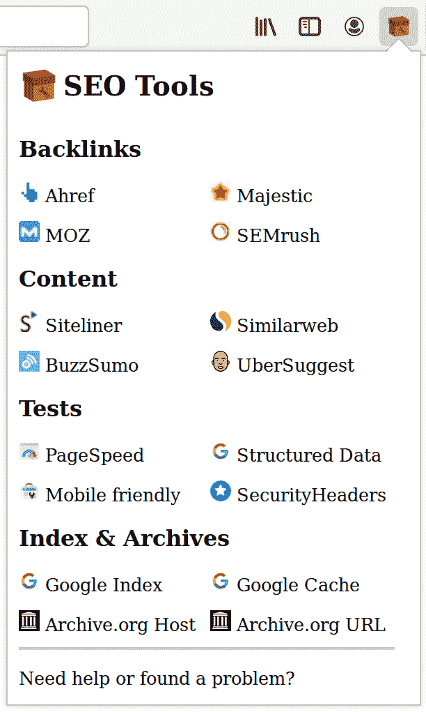

# 项目#4: SEO 工具扩展

> 原文：<https://dev.to/spekulatius1984/project-4-seo-tool-extension-20m7>

作为我从雇佣和承包中永久独立的旅程的一部分，我需要为我的副业项目学习市场营销。我认为那是不可避免的。不久前，我在某处读到过“一个项目 20%是建筑，80%是营销”。事实证明，这是千真万确的。在过去的几个月里，搜索引擎优化和市场营销是我和 [Treesukondh](https://takemeaway.life/category/english/?utm_source=PeterThaleikis.com&utm_source=SEO-Tool-Extension-Article) 的首要话题。

我仍然认为自己是个新手，在各个角落吸收信息。通常，这包括查看(我的)网站，看看其他人在做什么，进行调整，等待并再次检查，等等。许多单调的步骤——通常是自动进行的。我们都有这些常规的点击和键盘动作，我们做得太频繁了。根据你的工作或兴趣，这些步骤可以在一天中总结出来。我的一个就是，把网站的 URL 复制到 SEO 相关的工具里。这些可以是我的网站，也可以是别人的网站。由于这变得令人讨厌，我决定休息一下，并构建了一个浏览器扩展来使这变得更容易。

## 建于一个星期天的早晨

和 RandomElon 一样，项目不需要很长的准备阶段，甚至不需要一个合适的计划。尤其是当你不想从中赚钱的时候。通常为自己建造的小东西比计划中的大项目更整洁。看看有没有人和我一样觉得有用，想拥有它🤔️

现在，只需点击一下鼠标，你就可以直接进入与 SEO 相关的搜索和服务的深层链接😊️

## 目前支持的工具:

目前支持以下工具和服务:

*   反向链接可以使用 Ahref，Majestic，MOZ 和 SemRush 进行分析。

*   可以使用 Siteliner、SimilarWeb、BuzzSumo 和 UberSuggest 查看内容。

*   对于一般测试，支持 Google 的 PageSpeed、SecurityHeaders.io 以及 Google 的“结构化数据”和“移动友好”工具。

*   深层链接到谷歌索引，谷歌缓存以及 Archive.org 的主机和网址是可用的。

如果您认为缺少一个重要的工具，请联系我们🙏️

## 你用什么造的？

扩展本身是用

*   HTML，CSS 和 JavaScript(都是香草)。整个浏览器扩展相当小，不需要任何框架或库。

*   Laravel Mix 是将所有东西捆绑在一起的永不枯竭的帮手🤖️

搜索引擎优化工具扩展的网站是使用

*   [Pug](https://peterthaleikis.com/tags/pug/) 用于 HTML 的生成。这本来可以被排除在外，但我选择让它与 WhichLogin.com 的[网站栈保持一致。这也来自于我对自己的了解:通常我会在以后添加更多的内容页面(帮助、联系等)。).](https://whichlogin.com/?utm_source=PeterThaleikis.com&utm_medium=SEO-Tool-Extension-Article)

*   香草 CSS 布局网站，并使按钮棕色😁️如果你想知道为什么按钮是棕色的，请继续读下去。

*   还没有 JavaScript——但是如果有 JavaScript 将被添加的话，最有可能是 VanillaJS。

> 没有区块链，秘密魔法或特殊酱。只是一些不太好的字节。

## 为什么网站是棕色的？

如你所见，我不是设计师。我的设计技能仅限于使用色轮和其他一些工具。免版税的图片和插图对我来说是一种祝福。对于 SEO 工具扩展，我在 Pixabay 上找到了一个我喜欢的工具包图标。所以我决定用一种不常见的颜色:棕色💩️

## Thanks 🙏️

特别感谢 [Treesukondh](https://takemeaway.life/category/english/?utm_source=PeterThaleikis.com&utm_source=SEO-Tool-Extension-Article) ，他建议我建造它，并为 ProductHunt 的发布准备了图形，等等。

也感谢 Pixabay 上的[be dex Stock](https://pixabay.com/users/BedexpStock-6161331/)，为 SEO 工具扩展提供了图标。

## 想要吗？还是得到了反馈？

前往 Chrome 和 Firefox 的链接:

*   [Chrome 扩展-网络商店 SEO 工具扩展](https://seotoolextension.com/chrome?utm_source=PeterThaleikis.com&utm_source=SEO-Tool-Extension-Article)
*   [Mozilla 插件商店— SEO 工具扩展](https://seotoolextension.com/firefox?utm_source=PeterThaleikis.com&utm_source=SEO-Tool-Extension-Article)

免费得到它。当然，你也可以在 SEOToolExtension.com 网站上得到它，并从那里免费下载。