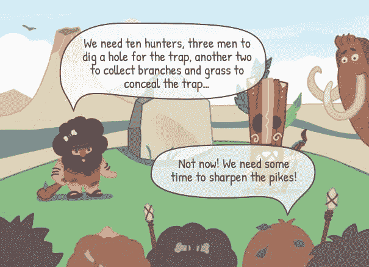
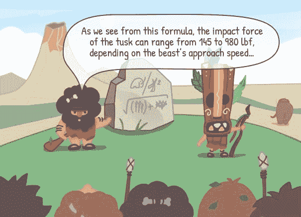
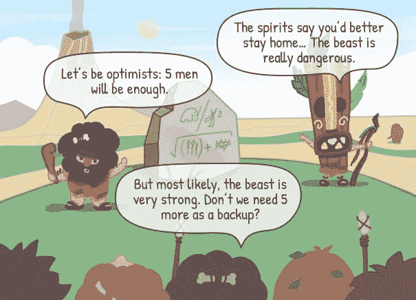

# 史前世界的项目估算方法

> 原文：<https://dev.to/actitime/project-estimation-methods-in-prehistoric-world-4ej>

自从人们开始在社区内协调他们的活动，项目工作的第一个大纲就出现了。计划行动，分配参与者，以及估计这项工作需要多少时间和资源(这是我们在这里最喜欢的部分)对于采购食物，保护社区，以及迁移到更好的地方是必要的。

在史前世界，人们运行的“项目”是不同的，但评估技术基本上是相同的——当然，考虑到艺术水平。古代人是如何估计和计划他们需要完成的事情的？

## 专家判断

这种估算方法基于有经验的专家的专业知识和意见，不一定来自项目团队。这种判断是基于理论方法、现有的实践知识、一套标准或以往经验的总结。

## 比较/类比估计

比较法包括利用以前类似项目的经验来分析工作范围、预测可能的风险和估计交付时间表。无论之前的项目是成功还是失败，它都可以为决策者提供相关的数据进行估计和重要的见解。

## 自上而下的估计

这种类型的评估是一种快速的方法，可以为预期的项目提供大概的估计，并评估它们是否可行。其中，使用了项目步骤的高级分解。稍后，更多的细节可以添加到粗略的估计。

## 自下而上的估算

与前面的方法相反，自底向上的评估意味着对项目任务进行详细的分解，并分别对每个任务进行评估。下一步通常是计算更高层次的总数，并看到全局。这种方法可以让管理者获得比以前更准确的结果。

## 参数模型估计

在这种方法中，可测量的变量用于预测和估计即将到来的工作。参数模型方法是一种更科学的技术，它确保结果的最大准确性。借助特殊工具，可以实现计算和评估过程的自动化。

## 三点估算

在这种方法中，使用了数学方法。它基于产生三个估计值的加权平均值:乐观、最可能和悲观估计值。这种方法允许自动化并且快速，但是它需要大量的数据和细节级别。

