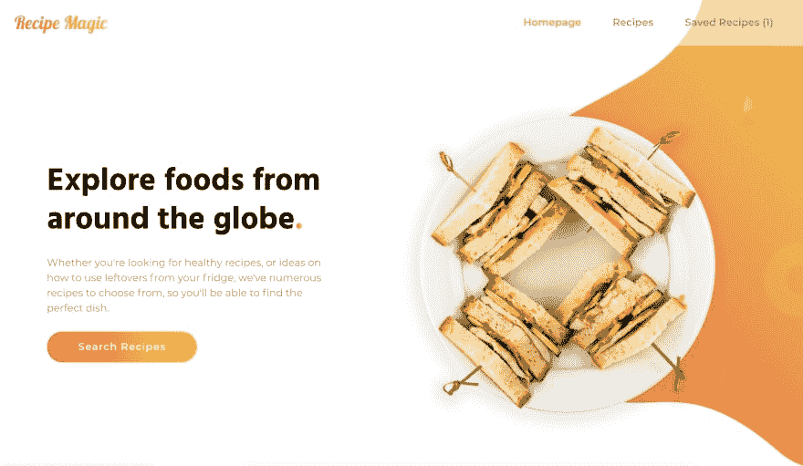
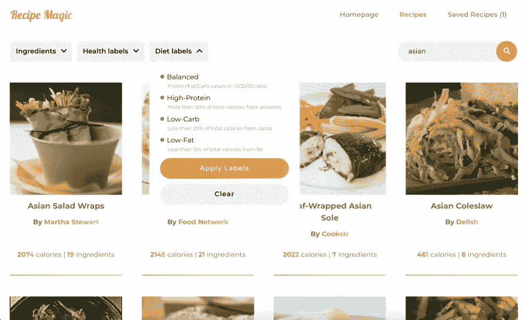
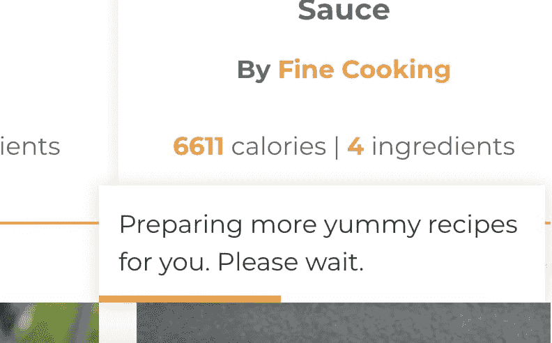

# ShowDEV:提供饮食、健康和营养信息的食物食谱网络应用程序

> 原文：<https://dev.to/adrianbdesigns/project-food-recipe-web-app-with-diet-health-and-nutrition-info-35ah>

[Recipe Magic](https://recipe-magic.netlify.com/) 是一款使用[毛豆 API](https://www.edamam.com/) 的网络应用，允许用户搜索海量食谱数据库，根据各种属性(饮食、健康、配料等)过滤食谱。)并显示营养和健康数据。

网址链接:[配方魔术](https://recipe-magic.netlify.com/)

## 技术信息

*   (用钩子)做出反应
*   以打字打的文件
*   Redux(带挂钩)
*   react-app-rewired(而不是弹出)
*   反应路由器
*   animejs
*   PostCSS(带有 postcss-preset-env)
*   [毛豆 API](https://www.edamam.com/)
*   网络虚拟主机

## 挑战

### 限制性 API

毛豆 API 很棒，但是对免费用户有很大的限制。它只允许免费用户每分钟 5 个请求，所以我需要实现一个机制来限制用户每 12 秒 1 个请求。

### 骨骼装载

大多数数据都是动态加载的(配方列表、配方详情等。)，所以到处都有旋转器似乎是一个快速和肮脏的解决方案。更不用说它提供了可怕的 UX。

因为数据是高度可预测的，所以我决定实现骨架加载或骨架筛选。我在这里写了一篇关于实现它的简短教程:

 [## 在 React 中实现骨架加载

### 阿德里安因为 1919 年 9 月 4 日 4 分钟阅读

#react #webdev #tutorial](/prototyp/implementing-skeleton-loading-in-react-kia)

### 令人愉悦的动画

我还想创建一个令人愉快的 UX，不仅使用 CSS，还使用 JS 动画。我已经使用`animejs`来创建简单的动画，让网站更有个性。

## 工作进行中

虽然这个项目是非常完整的功能，但仍然有一些粗糙的边缘和代码清理，我需要做的。

让我知道你对这个项目的想法，随时让我知道你是否有任何改进应用程序的想法。

* * *

感谢你花时间阅读这篇文章。如果你觉得这很有用，请给它一个❤️或🦄，分享评论。