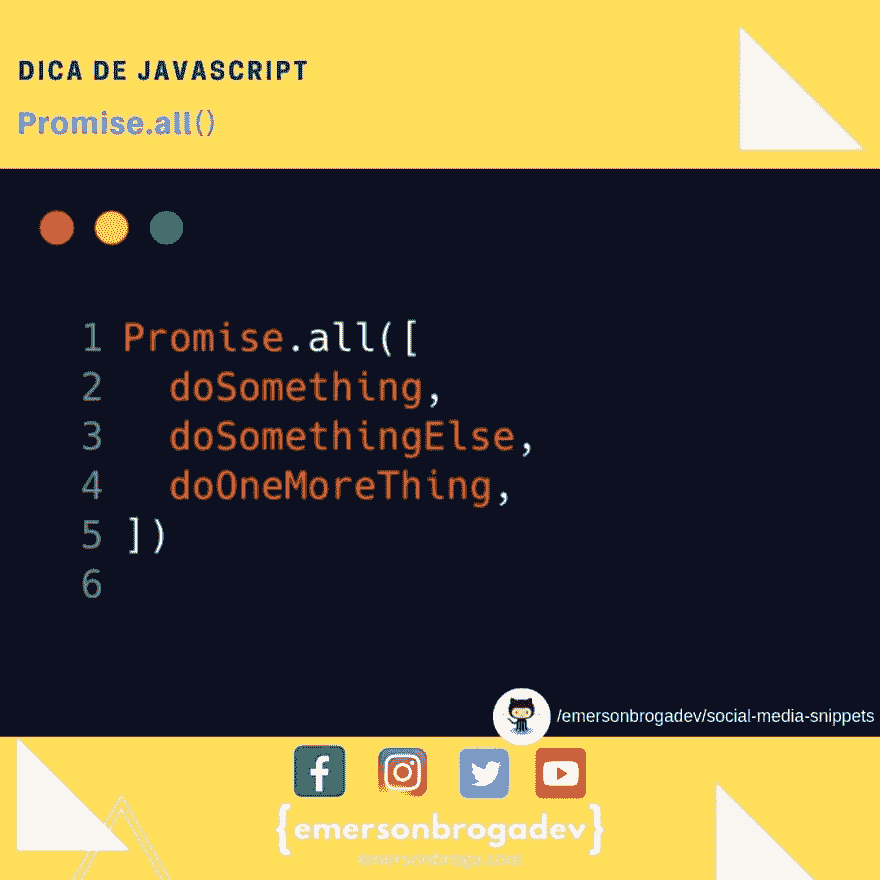

# Promise.all()

> 原文：<https://dev.to/emersonbroga/promise-all-9b1>

使用 Promise.all()可以等待多个承诺执行。
promise . all()之后的 then()会在所有承诺都已解决时接收结果，并且 catch()会在任何承诺发生错误时呼叫。

请务必访问 github 存储库，并查看 emersonbrogadev/social media snippets 中的所有提示。

[参加我们的开发者名单](https://emersonbroga.com/e/participe/)
[【学习 es 6】](https://amzn.to/2J4XnLg)[【查看 Instagram 上的提示](https://www.instagram.com/emersonbrogadev/)

=)