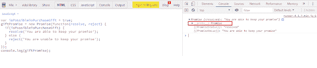
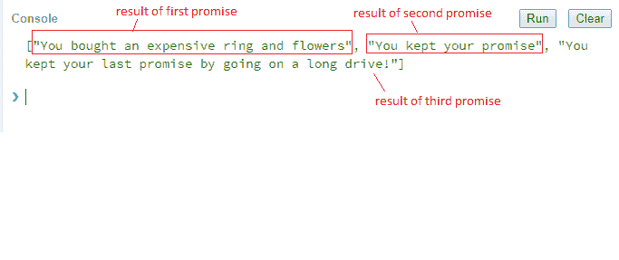
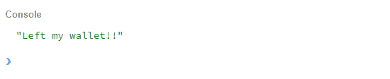
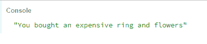
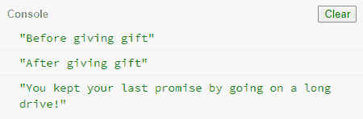

# 用 Javascript 承诺 2019 年的完整指南

> 原文：<https://dev.to/nileshsanyal/promises-in-javascript-a-complete-guide-for-2019-4o99>

*阅读原文[此处](https://www.devhelperworld.in/2019/09/javascript-promises-definitive-guide.html)T3】*

[](https://res.cloudinary.com/practicaldev/image/fetch/s--yT-5ovfE--/c_limit%2Cf_auto%2Cfl_progressive%2Cq_auto%2Cw_880/https://1.bp.blogspot.com/-MxXtWxD9V1k/XXy8rp3oPkI/AAAAAAAABV0/q32iYq0-lH4BS7I3B425HwaabAJzYTCCQCLcBGAsYHQ/s640/promises-in-javascript-cover-image.jpg)

javascript 中的承诺是一个重要的概念，对于 javascript 开发人员来说，理解这个概念是必不可少的。如果这个概念很清楚，开发人员可以在他们的日常生活中以各种方式利用它。

网上有很多关于承诺的文章和教程。但是，很少有人能全面指导如何利用承诺。在这篇文章中，我将尝试深入阐述承诺。所以你不需要通过其他资源。

# 什么是承诺？

根据 MDN 文档:**承诺是一个对象，表示异步操作的最终完成或失败，以及它的结果值**。

# 为什么我们在 JavaScript 中使用承诺？

一般来说，javascript 是一种本质上同步的脚本语言。为了执行异步操作，承诺有很大的帮助。在承诺发明之前，处理多个异步任务时，大量使用[回调](https://dev.to/nileshsanyal/javascript-callback-functions-in-depth-guide-for-2019-gj7)。

但是多个回调函数会导致不可管理的代码，产生所谓的回调地狱。为了解决这个问题，使用了承诺。

*那是一大堆技术术语，对！但是，我认为如果讨论以非技术性的方式进行，你会更好地理解承诺。*

# Javascript 中的承诺实际上是如何工作的？

你可以把 javascript 承诺想象成类似于你在现实生活中做出的承诺。

想象一下，你向你的女朋友承诺，你会给她买一份昂贵的礼物。你不知道你是否能够信守诺言。也许你能信守诺言，也许不能。

因此，如果你承诺了，但仍然没有设法购买礼物，承诺处于待定状态。如果你能够信守承诺，那么你的承诺就实现了。但是，如果出于某种原因，你不能这样做，你的承诺是在拒绝状态。

# Promise 是什么时候引入 Javascript 的？

承诺并不是一个全新的概念。事实上，自 1976 年这个术语首次被引入以来，它们就一直存在。在 2011 年初，jQuery 延迟对象使 it 概念变得流行起来。延迟对象的概念类似于承诺，但它们不遵循 ECMA 脚本 2015 中针对承诺所述的确切技术规范。

最后，承诺被正式添加到 ECMA 脚本 2015 规范中，并在所有最新的浏览器和 Node Js 中实现。

# 不同状态中的一个承诺

同样的概念也适用于承诺。承诺有以下任何一种状态。这些措施如下:

1.  待定:与承诺相关的任务尚未完成或被拒绝。

2.  完成:与承诺相关的任务成功完成。

3.  拒绝:与承诺相关的任务失败。

这里需要注意的重要一点是，创建承诺的函数能够跟踪承诺状态。

# 进一步了解承诺对象

```
var isPossibleToPurchaseGift = true;
var giftPromise = new Promise(function(resolve, reject) {
  if(isPossibleToPurchaseGift) {
     resolve('You are able to keep your promise');
  } else {
     reject('You are unable to keep your promise');
  }
});
console.log(giftPromise); 
```

Enter fullscreen mode Exit fullscreen mode

在上面的代码中，我们创建了一个承诺，如果变量" **isPossibleToPurchaseGift** "的值设置为 true，则承诺被解析。最后，我们在浏览器的控制台窗口中显示该承诺的已解决状态。

如果我们在控制台窗口中仔细观察，我们能够展开 Promise 对象，然后如果我们展开突出显示的部分，如下面的屏幕截图所示，我们能够得到与下面的屏幕截图所示相同的结果。

[](https://res.cloudinary.com/practicaldev/image/fetch/s--YMbrXVce--/c_limit%2Cf_auto%2Cfl_progressive%2Cq_auto%2Cw_880/https://1.bp.blogspot.com/-GZOYWtwYeMk/XXzAjrtQLuI/AAAAAAAABWM/OsBgVWbtqf0EriX5iZaVf92kn7alq20JQCLcBGAsYHQ/s640/javascript-promises-object-in-depth-two.png)

如果我们进一步展开，我们将看到类似如下所示的内容。请注意，图像中突出显示的部分。

[](https://res.cloudinary.com/practicaldev/image/fetch/s---t5fQyyN--/c_limit%2Cf_auto%2Cfl_progressive%2Cq_auto%2Cw_880/https://1.bp.blogspot.com/-qDYHH0SbOJo/XXzBA-EggEI/AAAAAAAABWU/er4iJkiHkLotgMe57uhdwO7b8EJGl07ewCLcBGAsYHQ/s640/javascript-promises-object-in-depth-three.png)

## 许诺对象中的静态方法

*Promise.all(promises)* :等待所有承诺解析，返回承诺所有结果的数组。这里要注意的重要一点是，如果任何一个承诺没有实现，那么这就成为承诺的错误。所有和所有其他结果都被忽略。

*promise . all settled(promises)*:最近增加的方法。它的目的是等待所有的承诺完成，并以对象数组的形式返回结果，这些对象包含状态(可能是“已履行”或“已拒绝”)和值(如果已履行)或原因(如果已拒绝)。

*Promise.race(promises)* :等待第一个承诺解决，其结果或错误成为结果。

*Promise.resolve(value)* :生成一个已解析的带有给定值的承诺。

*Promise.reject(error)* :生成一个给定错误的拒绝承诺。

# 用 Javascript 创建承诺

```
var isPossibleToPurchaseGift = true;

var willGetNewGift = new Promise(function(resolve, reject) {
    if(isPossibleToPurchaseGift) {
      var gift = {
         ring: true,
         flowers: true
      };
       resolve(gift);
    } else {
       var error = new Error('Left my wallet!!');
       reject(error);
    }
}); 
```

Enter fullscreen mode Exit fullscreen mode

在上面的代码中，我们创建了一个名为“ **willGetNewGift** ”的承诺。promise 构造函数有两个参数，第一个是 resolve 函数，第二个是 reject 函数。

## Javascript 中的 Promise Resolve 是什么？

简而言之，resolve 函数表示如果 promise 成功，那么 promise 对象将被解析为一个给定值。因此，在上面的代码片段中，如果“ **willGetNewGift** 变量被设置为 true，那么 promise 将返回一个 Gift 对象。

## Javascript 中什么是 Promise Reject？

reject 函数返回一个被拒绝的 promise 对象，并显示一条错误消息。在上面的代码片段中，如果“ **willGetNewGift** 变量被设置为 false，那么这个 promise 将返回一个错误对象。

# 调用 Javascript 中的承诺

```
var getNewGift = function() {
  willGetNewGift
    .then(function(gift) {
    console.log(gift);

  })
  .catch(function(error) {
    console.log(error.message);
  });
}; 

getNewGift(); 
```

Enter fullscreen mode Exit fullscreen mode

在上面的代码中，我们调用了名为" **willGetNewGift** 的承诺，然后为了获得履行承诺的值，我们使用了 then()函数。我们将变量“**ispossibletopuchesagift**设置为 true。如果值为真，我们就认为承诺已经完成。因此，我们能够在 then()函数中显示礼物对象。它的完整代码如下所示。

```
var isPossibleToPurchaseGift = false;
var willGetNewGift = new Promise(function(resolve, reject) {
  if(isPossibleToPurchaseGift) {
    var gift = {
      ring: true,
      flowers: true
    };
    resolve(gift);
  } else {
    var error = new Error('Left my wallet!!');
    reject(error);
  }
});

var getNewGift = function() {
  willGetNewGift
    .then(function(gift) {
      console.log(gift);
    })
    .catch(function(error) {
      console.log(error.message);
    });
};

getNewGift(); 
```

Enter fullscreen mode Exit fullscreen mode

# Javascript 中的链接承诺

## 非技术观点

让我们假设在答应你的女朋友给她买一份昂贵的礼物后，你也想和她一起吃饭，最后你想和她一起去长途驾车旅行。想象一下，这里的情况，在遵守第一个承诺之后，你还必须遵守第二个和第三个承诺。

为了处理这种情况，你需要将多个承诺串联起来。因此，在这种情况下，承诺就派上了用场。

## 技术观点

1.  promise 对象能够在 javascript 中执行异步任务。每个异步任务将返回一个 promise 对象，每个 promise 对象将有一个 then 函数，该函数可以接受两个参数，一个成功处理程序和一个错误处理程序。

2.  *then* 函数也将返回一个承诺，这样就可以将多个承诺链接起来。

3.  每个处理程序(成功或错误)还可以返回值，该值将作为参数传递给承诺链中的下一个函数。

4.  如果一个处理程序返回一个承诺，那么下一个处理程序只有在请求完成后才会被调用。

让我们用一个例子来证明我们前面所说的。

### 在 Javascript 中实现承诺链

```
var isPossibleToPurchaseGift = true;

var willGetNewGift = new Promise(function(resolve, reject) {
    if(isPossibleToPurchaseGift) {
      var gift = {
         ring: true,
         flowers: true
      };
       resolve(gift);
    } else {
       var error = new Error('Left my wallet!!');
       reject(error);
    }
});

var willAttendDinner = function(expensiveGift) {
  return new Promise(function(resolve, reject) {
    var message = 'You kept your promise by giving her an expensive ring';
    resolve(message);
  });
};

var willGoOnALongDrive = function(dinnerAttended) {
  return new Promise(function(resolve, reject) {
    var message = 'You kept your last promise by going on a long drive!';
    resolve(message);
  });
};

var getNewGift = function() {
  willGetNewGift
    .then(willAttendDinner)
    .then(willGoOnALongDrive)
    .then(function(longDrive) {
    console.log(longDrive);
  });
};

getNewGift(); 
```

Enter fullscreen mode Exit fullscreen mode

在上面的代码片段中，我们定义了 3 个独立的函数，第一个函数" **willGetNewGift** "返回一个 promise 对象，其他函数也返回 promises。

让我解释一下到底发生了什么。首先，调用函数“ **willGetNewGift** ”返回一个承诺，然后将承诺对象传递给下一个函数“**willadtenddinner**”，同样，它也返回一个承诺对象。同样，该对象被传递给“ **willGoOnALongDrive** ”函数。最后，函数的结果显示在控制台上。这就是为什么你将能够看到“你坚持你的最后一个承诺去长途驾驶！”这条消息。

## 什么是 Promise.all()？

简而言之，当我们有多个承诺，并且必须等待每个承诺完成后才能执行下一个承诺时，promise.all()是一个非常有用的方法。

根据 MDN 文档:*Promise . all()方法返回单个承诺，当作为 iterable 传递的所有承诺都已解析或者 iterable 不包含承诺时，该承诺将解析。它以拒绝*的第一个承诺的理由拒绝。

因此，从文档中可以清楚地看出，如果数组中的任何一个 promise 对象被拒绝，整个 Promise.all()方法都会被拒绝。

### promise . all()是如何工作的？

从 MDN 文档中，我们知道 Promise.all()方法接受一个 iterable 对象。对于可迭代对象，这意味着对象可以很容易地迭代。字符串和数组就是这种可迭代对象的例子。

通常，该方法返回一个挂起的 promise 对象，一旦给定 iterable 对象中的承诺被解析或拒绝，该对象就会以异步方式被解析或拒绝。

成功解析 promise 后，各个 promise 的值将按照相同的顺序出现在 promise all 方法中。如果 iterable 中的任何一个承诺被拒绝，那么所有的承诺都会被拒绝。即使成功地解决了其余的承诺，这一事件也会发生。

### [T1】在 Javascript 中实现 Promise.all()](#implementing-promiseall-in-javascript)

```
var isPossibleToPurchaseGift = true;
var willGetNewGift = function() {
   return new Promise(function(resolve, reject) {
    if(isPossibleToPurchaseGift) {
      var gift = {
         ring: true,
         flowers: true
      };
       resolve('You bought an expensive ring and flowers');
    } else {
       var error = new Error('Left my wallet!!');
       reject(error);
    }
  });
};
var willAttendDinner = function(expensiveGift) {
  return new Promise(function(resolve, reject) {
    var message = 'You kept your promise';
    resolve(message);
  });
};
var willGoOnALongDrive = function(dinnerAttended) {
  return new Promise(function(resolve, reject) {
    var message = 'You kept your last promise by going on a long drive!';
    resolve(message);
  });
};
var getNewGift = function() {
  Promise.all([
    willGetNewGift(),
    willAttendDinner(),
    willGoOnALongDrive()
  ]).then(function(result) {
    console.log(result);
  });
};
getNewGift(); 
```

Enter fullscreen mode Exit fullscreen mode

在上面的代码片段中，我们创建了 3 个函数，每个函数返回一个 promise 对象。然后，我们在 Promise.all()函数中调用它们中的每一个，该函数返回数组中承诺的结果。其输出如下所示。

[](https://res.cloudinary.com/practicaldev/image/fetch/s--DpP-INnv--/c_limit%2Cf_auto%2Cfl_progressive%2Cq_auto%2Cw_880/https://1.bp.blogspot.com/-yB3yHC3njEE/XXzvcs4u4EI/AAAAAAAABWs/Edyx9qLK-fc894ngB_8JBmJE-cHlXc8xQCLcBGAsYHQ/s1600/javascript-promises-object-promise-all.png)

如果任何一个承诺未能解决，结果将产生一个错误。代码片段如下所示。

```
var isPossibleToPurchaseGift = false;
var willGetNewGift = function() {
   return new Promise(function(resolve, reject) {
    if(isPossibleToPurchaseGift) {
      var gift = {
         ring: true,
         flowers: true
      };
       resolve('You bought an expensive ring and flowers');
    } else {
       var error = new Error('Left my wallet!!');
       reject(error);
    }
  });
};
var willAttendDinner = function(expensiveGift) {
  return new Promise(function(resolve, reject) {
    var message = 'You kept your promise';
    resolve(message);
  });
};
var willGoOnALongDrive = function(dinnerAttended) {
  return new Promise(function(resolve, reject) {
    var message = 'You kept your last promise by going on a long drive!';
    resolve(message);
  });
};
var getNewGift = function() {
  Promise.all([
    willGetNewGift(),
    willAttendDinner(),
    willGoOnALongDrive()
  ]).then(function(result) {
    console.log(result);
  }).catch(function(error){
    console.log(error.message);
  });
};
getNewGift(); 
```

Enter fullscreen mode Exit fullscreen mode

代码的输出如下所示。

[](https://res.cloudinary.com/practicaldev/image/fetch/s--Z7KN-9U3--/c_limit%2Cf_auto%2Cfl_progressive%2Cq_auto%2Cw_880/https://1.bp.blogspot.com/-XB4TCsCBDs4/XXzwhzejenI/AAAAAAAABW4/pps15OM8SW8-YDeeMPh1DkURFOtYAoDRgCLcBGAsYHQ/s640/javascript-promises-object-promise-all-output.png)

## 什么是无极.竞()？

如果我们需要尽快返回第一个解决的承诺或拒绝的承诺的结果，那么我们应该使用这个函数。

根据 MDN 文档，*promise . race()方法返回一个承诺，该承诺在 iterable 中的一个承诺满足或拒绝时立即满足或拒绝，并带有该承诺的值或原因*。

### 用 Javascript 实现 Promise.race()

```
var isPossibleToPurchaseGift = true;
var willGetNewGift = function() {
   return new Promise(function(resolve, reject) {
    if(isPossibleToPurchaseGift) {
      var gift = {
         ring: true,
         flowers: true
      };
      setTimeout(function(){
       resolve('You bought an expensive ring and flowers'); 
      }, 500);

    } else {
       var error = new Error('Left my wallet!!');
       reject(error);
    }
  });
};
var willAttendDinner = function(expensiveGift) {
  return new Promise(function(resolve, reject) {
    var message = 'You kept your promise';
     setTimeout(function(){
        resolve(message);
     }, 2000);
  });
};
var willGoOnALongDrive = function(dinnerAttended) {
  return new Promise(function(resolve, reject) {
    var message = 'You kept your last promise by going on a long drive!';
    setTimeout(function(){
       resolve(message);
    },3000);
  });
};
var getNewGift = function() {
  Promise.race([
    willGetNewGift(),
    willAttendDinner(),
    willGoOnALongDrive()
  ]).then(function(result) {
    console.log(result);
  }).catch(function(error){
    console.log(error.message);
  });
};
getNewGift(); 
```

Enter fullscreen mode Exit fullscreen mode

在上面的代码片段中，我们可以看到，在成功执行后返回 promise 对象的 3 个函数中，只有 *willGetNewGift()* 函数执行了 500 毫秒。所以这个承诺的结果是在运行这个代码块之后返回的。

[](https://res.cloudinary.com/practicaldev/image/fetch/s--VPXeHCip--/c_limit%2Cf_auto%2Cfl_progressive%2Cq_auto%2Cw_880/https://1.bp.blogspot.com/-O0yHCcm0YWg/XXzyQv1FkPI/AAAAAAAABXQ/tEAPqdtVfeMrJslmjOMkkVBpgUA2_B2HQCLcBGAsYHQ/s640/javascript-promises-object-promise-race-output.png)

# Javascript 承诺是同步还是异步？

首先，您应该知道 javascript 是一种单线程脚本语言。单线程意味着它必须先执行一个代码块，然后才能执行下一个代码块。简单来说，javascript 代码本质上总是阻塞的。

有时我们需要执行一些任务，但我们并不确定该任务将在何时完成，其结果将在何时返回。但是，同时我们需要保证当我们获得成功的结果时，必须执行一些代码块，或者如果失败发生，我们也需要处理这种情况。

为了处理这些情况，我们需要用 javascript 编写异步代码。承诺允许以异步方式编写代码。所以，显然我们可以说承诺是异步的。

让我们用一个例子来证明承诺是异步的。

```
var isPossibleToPurchaseGift = true;

// willGetNewGift promise definition

// willAttendDinner promise definition

// willGoOnALongDrive promise definition

var getNewGift = function() {
  console.log('Before giving gift');
  willGetNewGift
    .then(willAttendDinner)
    .then(willGoOnALongDrive)
    .then(function(longDrive) {
    console.log(longDrive);
  });
   console.log('After giving gift');
};

// call our promise
getNewGift(); 
```

Enter fullscreen mode Exit fullscreen mode

很可能，您期望以下输出。

*   赠送礼物前
*   你坚持了上次的承诺，开了很长时间的车！
*   赠送礼物后

但是，实际输出显示在下面的屏幕截图中。

[](https://res.cloudinary.com/practicaldev/image/fetch/s--OQoKPbW1--/c_limit%2Cf_auto%2Cfl_progressive%2Cq_auto%2Cw_880/https://1.bp.blogspot.com/-c3kKyUFGSa0/XXzz7V1x0OI/AAAAAAAABXc/vbiPhjoBjWkWh_BSS7XM48tD21oaIu1zQCLcBGAsYHQ/s640/asynchronous-javascript-promises-example.png)

# 以更干净的方式实现 Javascript 承诺

本文中的所有例子都使用了 promise wrapper 的语法。我们使用这种语法是为了让你能容易地理解承诺，但实际上我们可以用更好的方式来写承诺。如果我们用这种方法写下承诺，对复杂的任务保持承诺将会容易得多。

让我解释一下我所说的承诺包装是什么意思。在 promise wrapper 中，您可以根据承诺是否成功执行来编写解析或拒绝承诺的代码。

```
return new Promise(function(resolve, reject){
      // codes to execute
}); 
```

Enter fullscreen mode Exit fullscreen mode

上面的代码片段是 promise 包装器的例子。

下面的代码片段解释了如何以更好的方式写承诺。

```
var isPossibleToPurchaseGift = true;
//var isPossibleToPurchaseGift = false;
var willGetNewGift = function() {
    if(isPossibleToPurchaseGift) {
       return Promise.resolve('It is possible to purchase gift');
    } else {
       var error = new Error('Left my wallet!!');
       return Promise.reject(error);
    }
};

var willAttendDinner = function(purchasedGift) {
//   purchasedGift = false;
  if(purchasedGift) {
    return Promise.resolve('It is possible to attend dinner');
  } else {
    return Promise.reject(new Error('Unable to attend dinner!!'));
  }

};

var willGoOnALongDrive = function(attendedDinner) {
//   attendedDinner = false;
  if(attendedDinner) {
    return Promise.resolve('It is possible to go on a long drive');
  } else {
    return Promise.reject(new Error('Unable to go on a long drive!!'));
  }

};

willGetNewGift()
  .then(willAttendDinner)
  .then(willGoOnALongDrive)
  .then(function(response){
  console.log(response);
}).catch(function(error){
  console.log(error.message);
}); 
```

Enter fullscreen mode Exit fullscreen mode

尝试一次取消每个注释语句的注释，然后再次运行代码。我相信你会很容易理解这些不同之处。

# 写 Javascript 承诺用 ES6/ES2015，ES7

ES6 或 ES2015 引入了“let”、“const”和“fat arrow”语法。利用这一点，你可以更好地写承诺。

我们可以用 ES6 以更好的方式重写前面的例子。代码片段如下所示。

```
const isPossibleToPurchaseGift = true;
// const isPossibleToPurchaseGift = false;
var willGetNewGift = ()=> {
    if(isPossibleToPurchaseGift) {
       return Promise.resolve('It is possible to purchase gift');
    } else {
       const error = new Error('Left my wallet!!');
       return Promise.reject(error);
    }
};

var willAttendDinner = (purchasedGift)=> {
//   purchasedGift = false;
  if(purchasedGift) {
    return Promise.resolve('It is possible to attend dinner');
  } else {
    return Promise.reject(new Error('Unable to attend dinner!!'));
  }

};

var willGoOnALongDrive = (attendedDinner) => {
//   attendedDinner = false;
  if(attendedDinner) {
    return Promise.resolve('It is possible to go on a long drive');
  } else {
    return Promise.reject(new Error('Unable to go on a long drive!!'));
  }

};

willGetNewGift()
  .then(willAttendDinner)
  .then(willGoOnALongDrive)
  .then(response =>console.log(response))
  .catch(error =>console.log(error.message)); 
```

Enter fullscreen mode Exit fullscreen mode

如果取消注释行，可以更好地处理代码片段。

ES7 引入了异步和等待语法。将它应用到我们的 ES6 代码之后，我们会更容易理解。同样，我们不需要使用 then 和 catch 函数。对于错误处理，您需要使用 try...javascript 的 catch 语法。

```
const isPossibleToPurchaseGift = true;
// const isPossibleToPurchaseGift = false;
var willGetNewGift = ()=> {
    if(isPossibleToPurchaseGift) {
       return Promise.resolve('It is possible to purchase gift');
    } else {
       const error = new Error('Left my wallet!!');
       return Promise.reject(error);
    }
};

var willAttendDinner = (purchasedGift)=> {
  // purchasedGift = false;
  if(purchasedGift) {
    return Promise.resolve('It is possible to attend dinner');
  } else {
    return Promise.reject(new Error('Unable to attend dinner!!'));
  }

};

var willGoOnALongDrive = (attendedDinner) => {
  // attendedDinner = false;
  if(attendedDinner) {
    return Promise.resolve('It is possible to go on a long drive');
  } else {
    return Promise.reject(new Error('Unable to go on a long drive!!'));
  }

};
async function callFunctions() {
  try {
    willGetGift = await willGetNewGift();
    attendDinner = await willAttendDinner(willGetGift);
    willGoOnALongDrive = await willGoOnALongDrive(attendDinner);
     console.log(willGoOnALongDrive); 

  } catch(error) {
    console.log(error.message);
  }
} 

callFunctions(); 
```

Enter fullscreen mode Exit fullscreen mode

同样，为了更好地理解代码，我建议你一次取消一个注释代码。这样你会更好理解。

# 结论

我希望读完这篇文章后，你能深入理解 javascript 的承诺。如果你觉得这篇文章很有帮助，别忘了分享给其他人。谢谢大家！